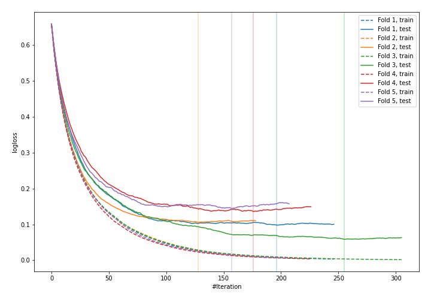
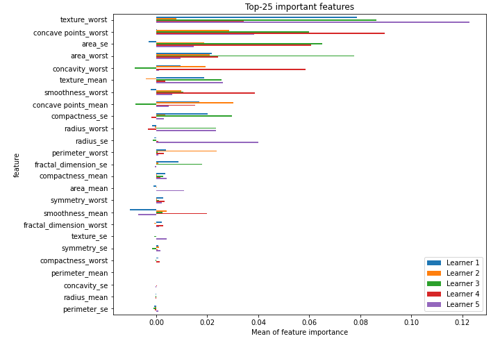

# Summary of 11_LightGBM_RandomFeature

[<< Go back](../README.md)

## LightGBM
- **n_jobs**: -1
- **objective**: binary
- **num_leaves**: 15
- **learning_rate**: 0.05
- **feature_fraction**: 0.8
- **bagging_fraction**: 0.5
- **min_data_in_leaf**: 50
- **metric**: binary_logloss
- **custom_eval_metric_name**: None
- **explain_level**: 1

## Validation
 - **validation_type**: kfold
 - **k_folds**: 5
 - **shuffle**: True
 - **stratify**: True
 - **random_seed**: 1230

## Optimized metric
logloss

## Training time

3.6 seconds

## Metric details
|           |    score |     threshold |
|:----------|---------:|--------------:|
| logloss   | 0.108576 | nan           |
| auc       | 0.992836 | nan           |
| f1        | 0.955083 |   0.501671    |
| accuracy  | 0.955189 |   0.732862    |
| precision | 1        |   0.99825     |
| recall    | 1        |   1.68268e-05 |
| mcc       | 0.911605 |   0.732862    |

## Confusion matrix (at threshold=0.732862)
|                     |   Predicted as negative |   Predicted as positive |
|:--------------------|------------------------:|------------------------:|
| Labeled as negative |                     208 |                       4 |
| Labeled as positive |                      15 |                     197 |

## Learning curves

## Permutation-based Importance

[<< Go back](../README.md)
