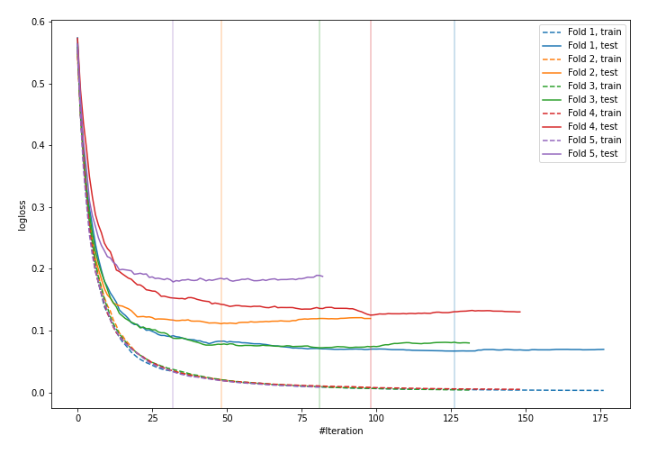
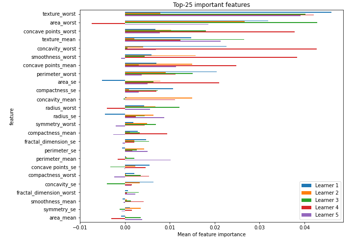

# Summary of 29_CatBoost

[<< Go back](../README.md)

## CatBoost
- **n_jobs**: -1
- **learning_rate**: 0.1
- **depth**: 6
- **rsm**: 1.0
- **loss_function**: Logloss
- **eval_metric**: Logloss
- **explain_level**: 2

## Validation
 - **validation_type**: kfold
 - **k_folds**: 5
 - **shuffle**: True
 - **stratify**: True
 - **random_seed**: 1230

## Optimized metric
logloss

## Training time

10.3 seconds

## Metric details
|           |    score |    threshold |
|:----------|---------:|-------------:|
| logloss   | 0.110694 | nan          |
| auc       | 0.992591 | nan          |
| f1        | 0.957746 |   0.499677   |
| accuracy  | 0.957547 |   0.499677   |
| precision | 1        |   0.989443   |
| recall    | 1        |   0.00027342 |
| mcc       | 0.915747 |   0.6974     |

## Confusion matrix (at threshold=0.499677)
|                     |   Predicted as negative |   Predicted as positive |
|:--------------------|------------------------:|------------------------:|
| Labeled as negative |                     202 |                      10 |
| Labeled as positive |                       8 |                     204 |

## Learning curves

## Permutation-based Importance

[<< Go back](../README.md)
