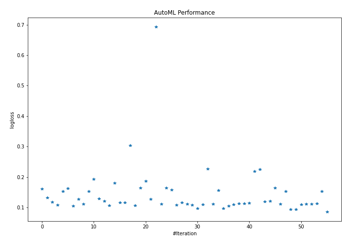
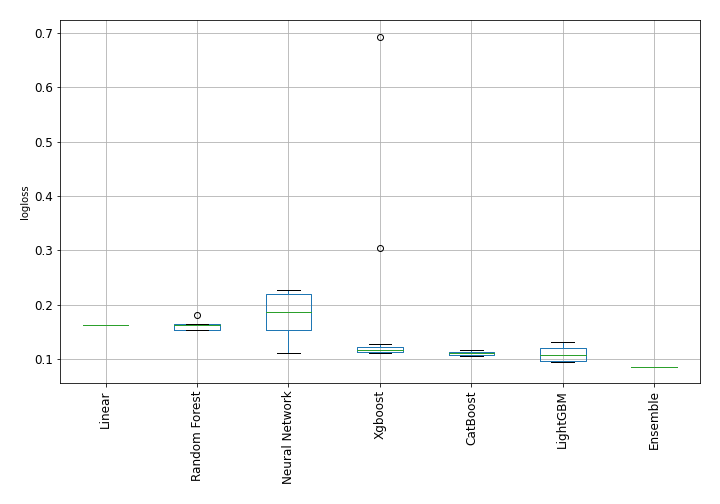

# AutoML Leaderboard

| Best model   | name                                                                               | model_type     | metric_type   |   metric_value |   train_time |   single_prediction_time |
|:-------------|:-----------------------------------------------------------------------------------|:---------------|:--------------|---------------:|-------------:|-------------------------:|
|              | [1_Linear](1_Linear/README.md)                                                     | Linear         | logloss       |      0.161814  |        26.54 |                   0.0457 |
|              | [2_Default_LightGBM](2_Default_LightGBM/README.md)                                 | LightGBM       | logloss       |      0.132263  |        24.06 |                   0.04   |
|              | [3_Default_Xgboost](3_Default_Xgboost/README.md)                                   | Xgboost        | logloss       |      0.11781   |        33.75 |                   0.0474 |
|              | [4_Default_CatBoost](4_Default_CatBoost/README.md)                                 | CatBoost       | logloss       |      0.107593  |        10.32 |                   0.0494 |
|              | [5_Default_NeuralNetwork](5_Default_NeuralNetwork/README.md)                       | Neural Network | logloss       |      0.153853  |         5.07 |                   0.0436 |
|              | [6_Default_RandomForest](6_Default_RandomForest/README.md)                         | Random Forest  | logloss       |      0.162358  |        65.84 |                   0.5621 |
|              | [11_LightGBM](11_LightGBM/README.md)                                               | LightGBM       | logloss       |      0.105003  |        22.03 |                   0.0372 |
|              | [7_Xgboost](7_Xgboost/README.md)                                                   | Xgboost        | logloss       |      0.127331  |        30.31 |                   0.0612 |
|              | [15_CatBoost](15_CatBoost/README.md)                                               | CatBoost       | logloss       |      0.112012  |        27.82 |                   0.0601 |
|              | [19_RandomForest](19_RandomForest/README.md)                                       | Random Forest  | logloss       |      0.153674  |        66.38 |                   0.5594 |
|              | [23_NeuralNetwork](23_NeuralNetwork/README.md)                                     | Neural Network | logloss       |      0.192615  |         4.83 |                   0.0437 |
|              | [12_LightGBM](12_LightGBM/README.md)                                               | LightGBM       | logloss       |      0.129941  |        20.87 |                   0.0391 |
|              | [8_Xgboost](8_Xgboost/README.md)                                                   | Xgboost        | logloss       |      0.121356  |        32.3  |                   0.0451 |
|              | [16_CatBoost](16_CatBoost/README.md)                                               | CatBoost       | logloss       |      0.106462  |        22.08 |                   0.052  |
|              | [20_RandomForest](20_RandomForest/README.md)                                       | Random Forest  | logloss       |      0.180666  |        65.69 |                   0.576  |
|              | [24_NeuralNetwork](24_NeuralNetwork/README.md)                                     | Neural Network | logloss       |      0.116483  |         5.48 |                   0.0436 |
|              | [13_LightGBM](13_LightGBM/README.md)                                               | LightGBM       | logloss       |      0.116855  |        25.21 |                   0.0388 |
|              | [9_Xgboost](9_Xgboost/README.md)                                                   | Xgboost        | logloss       |      0.304066  |        26.2  |                   0.0453 |
|              | [17_CatBoost](17_CatBoost/README.md)                                               | CatBoost       | logloss       |      0.106228  |        13.93 |                   0.0493 |
|              | [21_RandomForest](21_RandomForest/README.md)                                       | Random Forest  | logloss       |      0.16494   |        67.16 |                   0.5577 |
|              | [25_NeuralNetwork](25_NeuralNetwork/README.md)                                     | Neural Network | logloss       |      0.186942  |         5.41 |                   0.0546 |
|              | [14_LightGBM](14_LightGBM/README.md)                                               | LightGBM       | logloss       |      0.127828  |        26.56 |                   0.0382 |
|              | [10_Xgboost](10_Xgboost/README.md)                                                 | Xgboost        | logloss       |      0.693092  |        27    |                   0.0434 |
|              | [18_CatBoost](18_CatBoost/README.md)                                               | CatBoost       | logloss       |      0.112289  |        18.53 |                   0.0467 |
|              | [22_RandomForest](22_RandomForest/README.md)                                       | Random Forest  | logloss       |      0.1642    |        65.09 |                   0.5595 |
|              | [26_NeuralNetwork](26_NeuralNetwork/README.md)                                     | Neural Network | logloss       |      0.158348  |         4.98 |                   0.044  |
|              | [11_LightGBM_GoldenFeatures](11_LightGBM_GoldenFeatures/README.md)                 | LightGBM       | logloss       |      0.108415  |        30.98 |                   0.0778 |
|              | [17_CatBoost_GoldenFeatures](17_CatBoost_GoldenFeatures/README.md)                 | CatBoost       | logloss       |      0.116067  |        18.75 |                   0.0972 |
|              | [16_CatBoost_GoldenFeatures](16_CatBoost_GoldenFeatures/README.md)                 | CatBoost       | logloss       |      0.112308  |        34.68 |                   0.084  |
|              | [11_LightGBM_RandomFeature](11_LightGBM_RandomFeature/README.md)                   | LightGBM       | logloss       |      0.108576  |         4.31 |                   0.0412 |
|              | [11_LightGBM_SelectedFeatures](11_LightGBM_SelectedFeatures/README.md)             | LightGBM       | logloss       |      0.0967506 |        20.63 |                   0.0372 |
|              | [17_CatBoost_SelectedFeatures](17_CatBoost_SelectedFeatures/README.md)             | CatBoost       | logloss       |      0.109915  |         9.14 |                   0.0435 |
|              | [24_NeuralNetwork_SelectedFeatures](24_NeuralNetwork_SelectedFeatures/README.md)   | Neural Network | logloss       |      0.226201  |         4.11 |                   0.0456 |
|              | [3_Default_Xgboost_SelectedFeatures](3_Default_Xgboost_SelectedFeatures/README.md) | Xgboost        | logloss       |      0.111688  |        26.83 |                   0.0429 |
|              | [19_RandomForest_SelectedFeatures](19_RandomForest_SelectedFeatures/README.md)     | Random Forest  | logloss       |      0.156281  |        50.57 |                   0.5601 |
|              | [27_LightGBM_SelectedFeatures](27_LightGBM_SelectedFeatures/README.md)             | LightGBM       | logloss       |      0.0967506 |        25.7  |                   0.0383 |
|              | [28_LightGBM](28_LightGBM/README.md)                                               | LightGBM       | logloss       |      0.105003  |        22.64 |                   0.0426 |
|              | [29_CatBoost](29_CatBoost/README.md)                                               | CatBoost       | logloss       |      0.110694  |        10.98 |                   0.0566 |
|              | [30_CatBoost](30_CatBoost/README.md)                                               | CatBoost       | logloss       |      0.113758  |        40.77 |                   0.0465 |
|              | [31_Xgboost_SelectedFeatures](31_Xgboost_SelectedFeatures/README.md)               | Xgboost        | logloss       |      0.113181  |        28.07 |                   0.0509 |
|              | [32_Xgboost_SelectedFeatures](32_Xgboost_SelectedFeatures/README.md)               | Xgboost        | logloss       |      0.114543  |        23.53 |                   0.043  |
|              | [33_NeuralNetwork](33_NeuralNetwork/README.md)                                     | Neural Network | logloss       |      0.219229  |         5.3  |                   0.0446 |
|              | [34_NeuralNetwork](34_NeuralNetwork/README.md)                                     | Neural Network | logloss       |      0.225194  |         5.55 |                   0.0446 |
|              | [35_Xgboost](35_Xgboost/README.md)                                                 | Xgboost        | logloss       |      0.119771  |        32.06 |                   0.0443 |
|              | [36_Xgboost](36_Xgboost/README.md)                                                 | Xgboost        | logloss       |      0.121356  |        37.71 |                   0.0439 |
|              | [37_RandomForest](37_RandomForest/README.md)                                       | Random Forest  | logloss       |      0.163815  |        65.51 |                   0.5585 |
|              | [38_NeuralNetwork](38_NeuralNetwork/README.md)                                     | Neural Network | logloss       |      0.111876  |         4.98 |                   0.0568 |
|              | [39_RandomForest_SelectedFeatures](39_RandomForest_SelectedFeatures/README.md)     | Random Forest  | logloss       |      0.152963  |        50.89 |                   0.5587 |
|              | [40_LightGBM_SelectedFeatures](40_LightGBM_SelectedFeatures/README.md)             | LightGBM       | logloss       |      0.0944982 |        20.29 |                   0.0411 |
|              | [41_LightGBM_SelectedFeatures](41_LightGBM_SelectedFeatures/README.md)             | LightGBM       | logloss       |      0.0944982 |        20.25 |                   0.046  |
|              | [42_Xgboost_SelectedFeatures](42_Xgboost_SelectedFeatures/README.md)               | Xgboost        | logloss       |      0.110273  |        26.06 |                   0.0421 |
|              | [43_Xgboost_SelectedFeatures](43_Xgboost_SelectedFeatures/README.md)               | Xgboost        | logloss       |      0.111688  |        28.55 |                   0.0415 |
|              | [44_Xgboost_SelectedFeatures](44_Xgboost_SelectedFeatures/README.md)               | Xgboost        | logloss       |      0.111813  |        36.03 |                   0.0439 |
|              | [45_Xgboost_SelectedFeatures](45_Xgboost_SelectedFeatures/README.md)               | Xgboost        | logloss       |      0.113181  |        29.19 |                   0.0422 |
|              | [46_RandomForest_SelectedFeatures](46_RandomForest_SelectedFeatures/README.md)     | Random Forest  | logloss       |      0.15352   |        54.77 |                   0.5555 |
| **the best** | [Ensemble](Ensemble/README.md)                                                     | Ensemble       | logloss       |      0.0858545 |        11.23 |                   0.1306 |

### AutoML Performance

### AutoML Performance Boxplot
