# Summary of 13_DecisionTree

[<< Go back](../README.md)

## Decision Tree
- **n_jobs**: -1
- **criterion**: entropy
- **max_depth**: 3
- **explain_level**: 2

## Validation
 - **validation_type**: kfold
 - **k_folds**: 5
 - **shuffle**: True
 - **stratify**: True
 - **random_seed**: 1230

## Optimized metric
logloss

## Training time

32.0 seconds

## Metric details
|           |    score |   threshold |
|:----------|---------:|------------:|
| logloss   | 0.469324 |  nan        |
| auc       | 0.94314  |  nan        |
| f1        | 0.906475 |    0.500153 |
| accuracy  | 0.908019 |    0.500153 |
| precision | 0.921951 |    0.500153 |
| recall    | 0.995283 |    0        |
| mcc       | 0.816483 |    0.500153 |

## Confusion matrix (at threshold=0.500153)
|                     |   Predicted as negative |   Predicted as positive |
|:--------------------|------------------------:|------------------------:|
| Labeled as negative |                     196 |                      16 |
| Labeled as positive |                      23 |                     189 |

## Learning curves
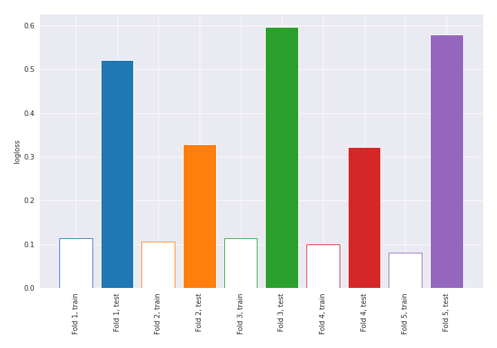

## Decision Tree 

### Tree #1
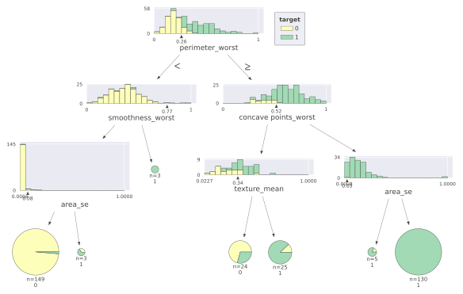

### Rules

if (perimeter_worst <= 0.262) and (smoothness_worst <= 0.771) and (area_se <= 0.075) then class: 0 (proba: 98.66%) | based on 149 samples

if (perimeter_worst > 0.262) and (concave points_worst > 0.518) and (area_se > 0.028) then class: 1 (proba: 100.0%) | based on 130 samples

if (perimeter_worst > 0.262) and (concave points_worst <= 0.518) and (texture_mean > 0.336) then class: 1 (proba: 88.0%) | based on 25 samples

if (perimeter_worst > 0.262) and (concave points_worst <= 0.518) and (texture_mean <= 0.336) then class: 0 (proba: 70.83%) | based on 24 samples

if (perimeter_worst > 0.262) and (concave points_worst > 0.518) and (area_se <= 0.028) then class: 1 (proba: 80.0%) | based on 5 samples

if (perimeter_worst <= 0.262) and (smoothness_worst > 0.771) then class: 1 (proba: 100.0%) | based on 3 samples

if (perimeter_worst <= 0.262) and (smoothness_worst <= 0.771) and (area_se > 0.075) then class: 1 (proba: 66.67%) | based on 3 samples

### Tree #2

### Rules

if (perimeter_worst <= 0.334) and (concave points_worst <= 0.381) and (area_mean <= 0.234) then class: 0 (proba: 99.27%) | based on 137 samples

if (perimeter_worst > 0.334) and (compactness_se > 0.046) then class: 1 (proba: 100.0%) | based on 135 samples

if (perimeter_worst <= 0.334) and (concave points_worst > 0.381) and (texture_worst > 0.366) then class: 1 (proba: 77.78%) | based on 36 samples

if (perimeter_worst <= 0.334) and (concave points_worst > 0.381) and (texture_worst <= 0.366) then class: 0 (proba: 91.67%) | based on 24 samples

if (perimeter_worst <= 0.334) and (concave points_worst <= 0.381) and (area_mean > 0.234) then class: 1 (proba: 66.67%) | based on 6 samples

if (perimeter_worst > 0.334) and (compactness_se <= 0.046) then class: 0 (proba: 100.0%) | based on 1 samples

### Tree #3

### Rules

if (concave points_worst <= 0.495) and (perimeter_worst <= 0.257) and (area_se <= 0.075) then class: 0 (proba: 98.62%) | based on 145 samples

if (concave points_worst > 0.495) and (area_se > 0.034) then class: 1 (proba: 100.0%) | based on 128 samples

if (concave points_worst <= 0.495) and (perimeter_worst > 0.257) and (texture_mean > 0.297) then class: 1 (proba: 75.86%) | based on 29 samples

if (concave points_worst <= 0.495) and (perimeter_worst > 0.257) and (texture_mean <= 0.297) then class: 0 (proba: 85.0%) | based on 20 samples

if (concave points_worst > 0.495) and (area_se <= 0.034) and (fractal_dimension_worst > 0.318) then class: 1 (proba: 100.0%) | based on 11 samples

if (concave points_worst > 0.495) and (area_se <= 0.034) and (fractal_dimension_worst <= 0.318) then class: 0 (proba: 66.67%) | based on 3 samples

if (concave points_worst <= 0.495) and (perimeter_worst <= 0.257) and (area_se > 0.075) then class: 1 (proba: 66.67%) | based on 3 samples

### Tree #4

### Rules

if (perimeter_worst <= 0.257) and (concave points_worst <= 0.621) and (area_se <= 0.05) then class: 0 (proba: 99.3%) | based on 143 samples

if (perimeter_worst > 0.257) and (perimeter_worst > 0.348) then class: 1 (proba: 100.0%) | based on 126 samples

if (perimeter_worst > 0.257) and (perimeter_worst <= 0.348) and (smoothness_worst > 0.446) then class: 1 (proba: 96.55%) | based on 29 samples

if (perimeter_worst > 0.257) and (perimeter_worst <= 0.348) and (smoothness_worst <= 0.446) then class: 0 (proba: 65.52%) | based on 29 samples

if (perimeter_worst <= 0.257) and (concave points_worst <= 0.621) and (area_se > 0.05) then class: 0 (proba: 80.0%) | based on 10 samples

if (perimeter_worst <= 0.257) and (concave points_worst > 0.621) then class: 1 (proba: 100.0%) | based on 2 samples

### Tree #5

### Rules

if (perimeter_worst <= 0.272) and (concave points_worst <= 0.464) and (area_se <= 0.074) then class: 0 (proba: 99.33%) | based on 150 samples

if (perimeter_worst > 0.272) and (texture_worst > 0.177) and (radius_worst > 0.305) then class: 1 (proba: 99.3%) | based on 143 samples

if (perimeter_worst > 0.272) and (texture_worst > 0.177) and (radius_worst <= 0.305) then class: 1 (proba: 70.59%) | based on 17 samples

if (perimeter_worst <= 0.272) and (concave points_worst > 0.464) and (texture_worst > 0.37) then class: 1 (proba: 100.0%) | based on 9 samples

if (perimeter_worst > 0.272) and (texture_worst <= 0.177) and (perimeter_worst <= 0.43) then class: 0 (proba: 100.0%) | based on 8 samples

if (perimeter_worst <= 0.272) and (concave points_worst > 0.464) and (texture_worst <= 0.37) then class: 0 (proba: 83.33%) | based on 6 samples

if (perimeter_worst <= 0.272) and (concave points_worst <= 0.464) and (area_se > 0.074) then class: 0 (proba: 50.0%) | based on 4 samples

if (perimeter_worst > 0.272) and (texture_worst <= 0.177) and (perimeter_worst > 0.43) then class: 1 (proba: 100.0%) | based on 3 samples

## Permutation-based Importance
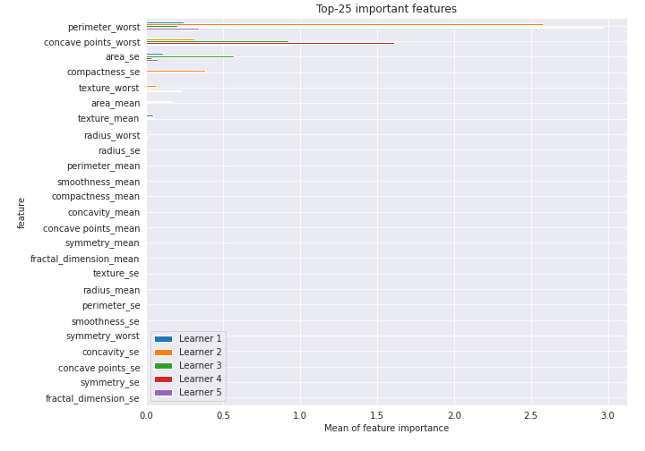

## SHAP Importance
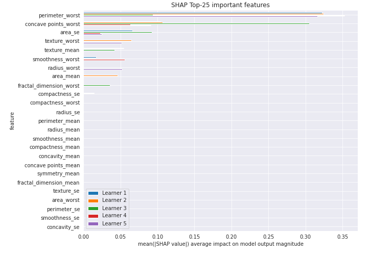

## SHAP Dependence plots

### Dependence (Fold 1)

### Dependence (Fold 2)
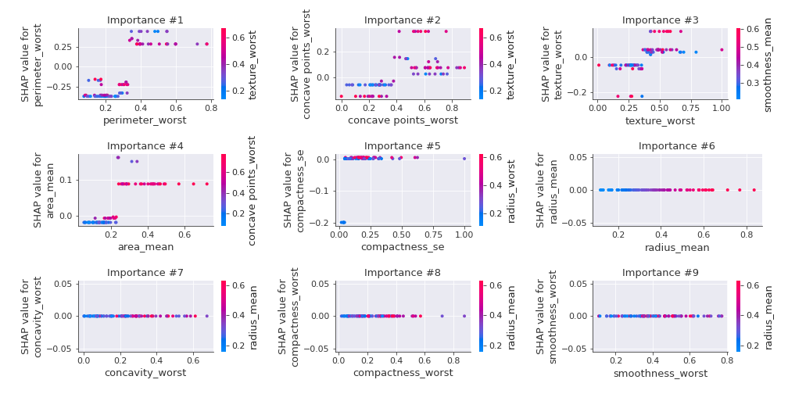
### Dependence (Fold 3)
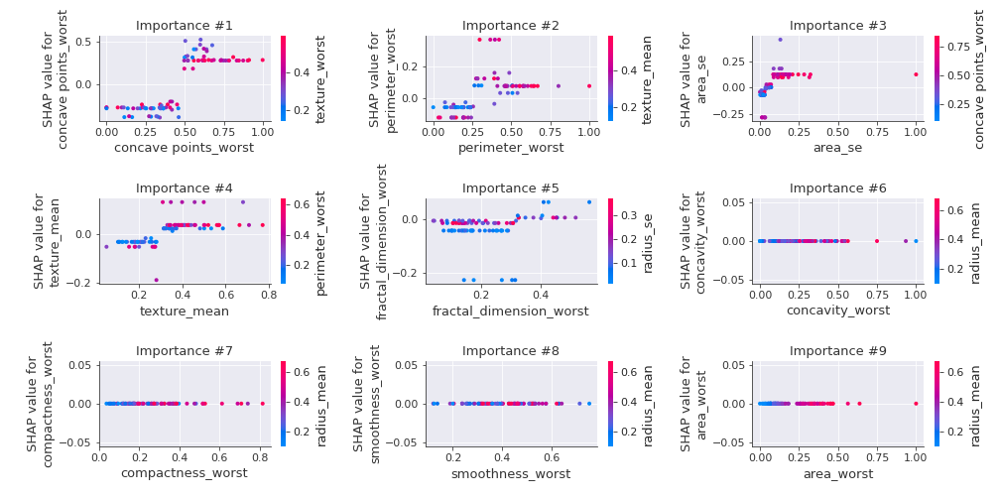
### Dependence (Fold 4)

### Dependence (Fold 5)

## SHAP Decision plots

### Top-10 Worst decisions for class 0 (Fold 1)
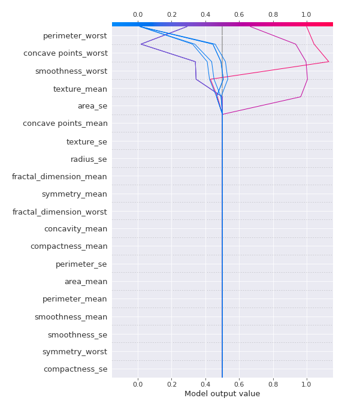
### Top-10 Worst decisions for class 0 (Fold 2)

### Top-10 Worst decisions for class 0 (Fold 3)

### Top-10 Worst decisions for class 0 (Fold 4)
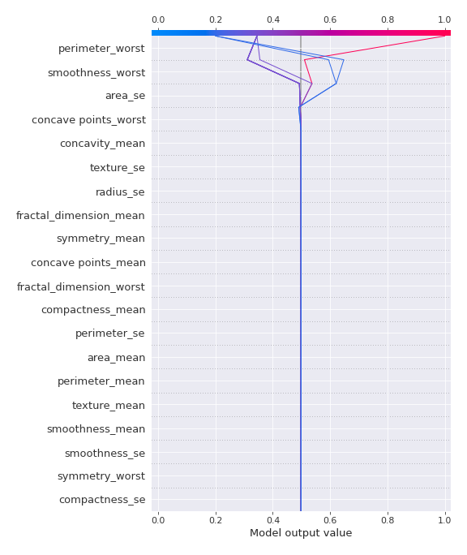
### Top-10 Worst decisions for class 0 (Fold 5)
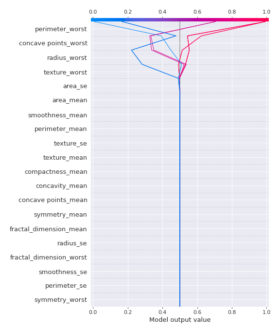
### Top-10 Best decisions for class 0 (Fold 1)
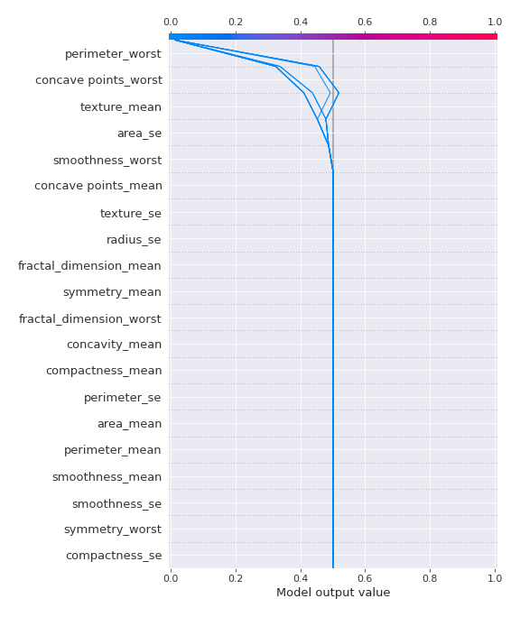
### Top-10 Best decisions for class 0 (Fold 2)

### Top-10 Best decisions for class 0 (Fold 3)
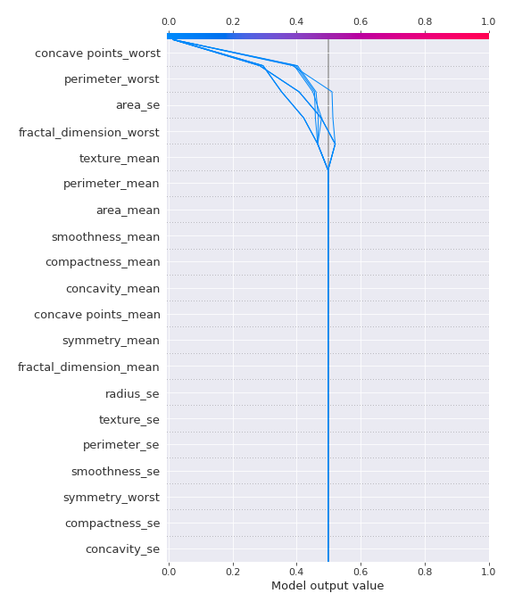
### Top-10 Best decisions for class 0 (Fold 4)
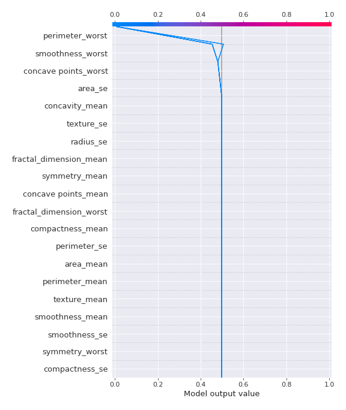
### Top-10 Best decisions for class 0 (Fold 5)

### Top-10 Worst decisions for class 1 (Fold 1)
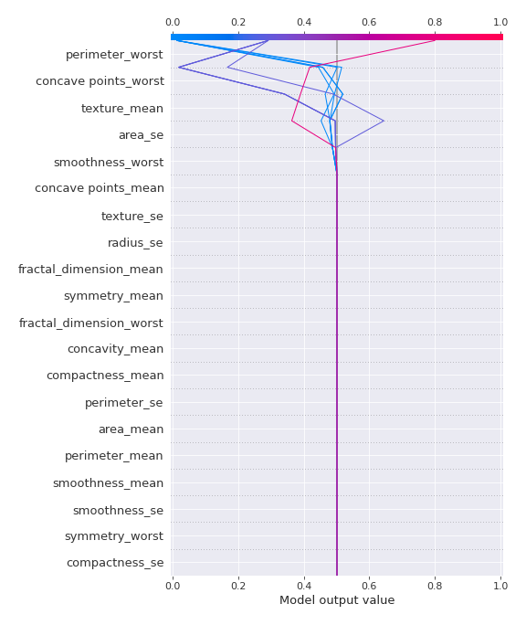
### Top-10 Worst decisions for class 1 (Fold 2)

### Top-10 Worst decisions for class 1 (Fold 3)

### Top-10 Worst decisions for class 1 (Fold 4)
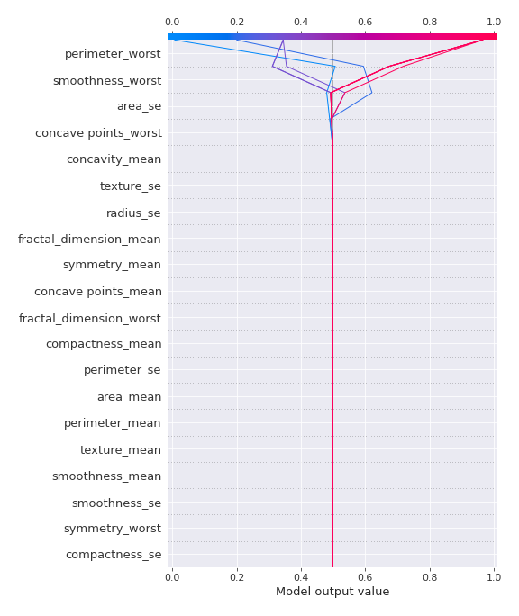
### Top-10 Worst decisions for class 1 (Fold 5)
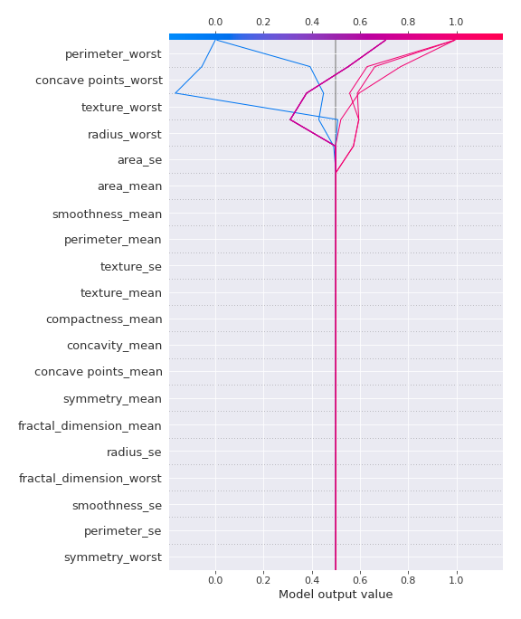
### Top-10 Best decisions for class 1 (Fold 1)
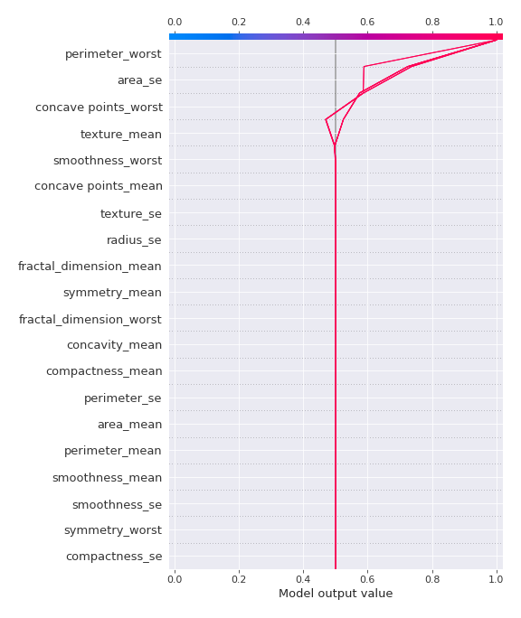
### Top-10 Best decisions for class 1 (Fold 2)

### Top-10 Best decisions for class 1 (Fold 3)
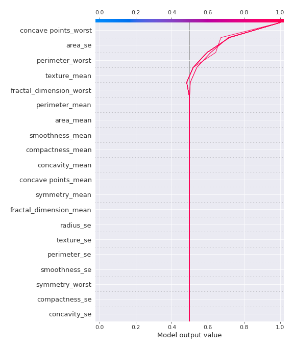
### Top-10 Best decisions for class 1 (Fold 4)
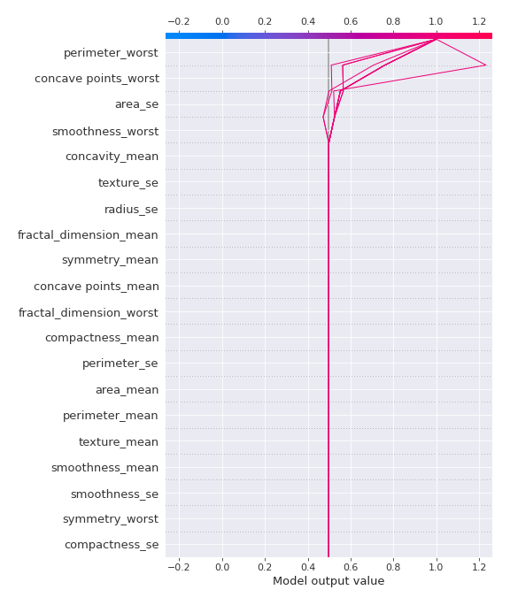
### Top-10 Best decisions for class 1 (Fold 5)
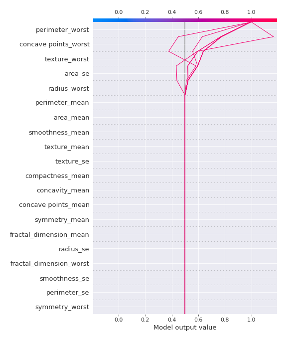

[<< Go back](../README.md)
