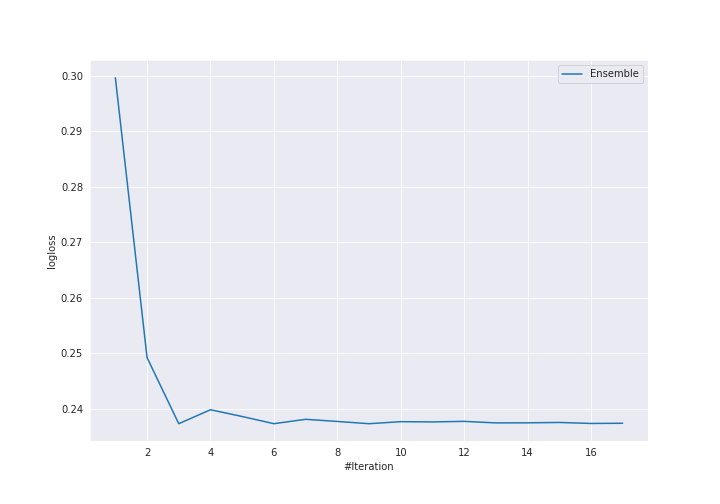

# Summary of Ensemble

[<< Go back](../README.md)

## Ensemble structure
| Model           |   Weight |
|:----------------|---------:|
| 11_DecisionTree |        1 |
| 13_DecisionTree |        1 |
| 2_DecisionTree  |        1 |

## Metric details
|           |    score |    threshold |
|:----------|---------:|-------------:|
| logloss   | 0.237272 | nan          |
| auc       | 0.959016 | nan          |
| f1        | 0.932715 |   0.498333   |
| accuracy  | 0.931604 |   0.498333   |
| precision | 1        |   0.997549   |
| recall    | 1        |   0.00984416 |
| mcc       | 0.863678 |   0.498333   |

## Confusion matrix (at threshold=0.498333)
|                     |   Predicted as negative |   Predicted as positive |
|:--------------------|------------------------:|------------------------:|
| Labeled as negative |                     194 |                      18 |
| Labeled as positive |                      11 |                     201 |

## Learning curves

[<< Go back](../README.md)
