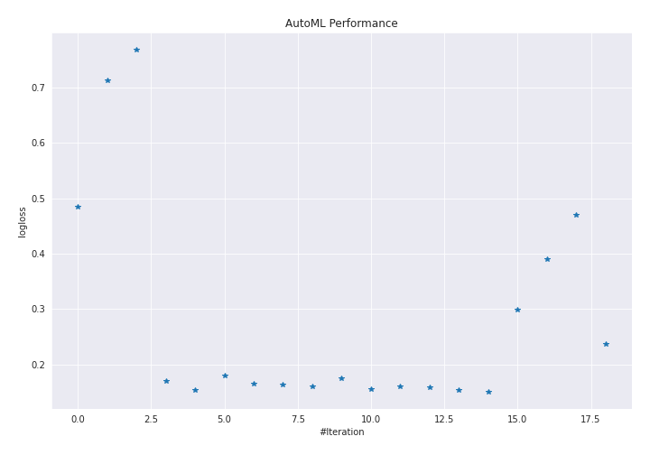
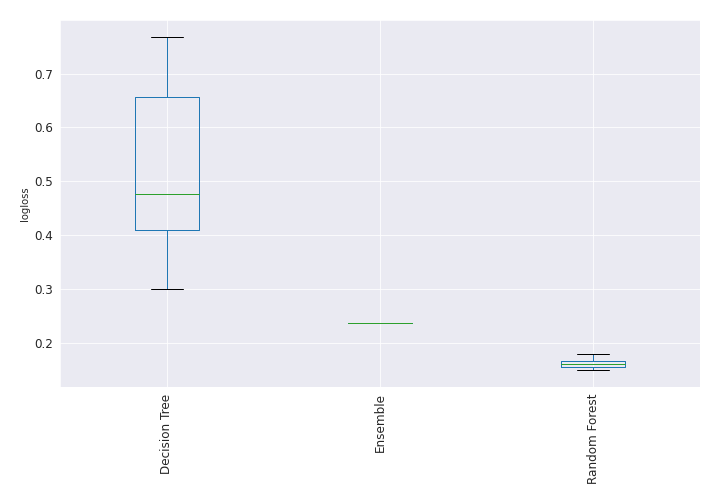

# AutoML Leaderboard

| Best model   | name                                                                         | model_type    | metric_type   |   metric_value |   train_time |   single_prediction_time |
|:-------------|:-----------------------------------------------------------------------------|:--------------|:--------------|---------------:|-------------:|-------------------------:|
|              | [1_DecisionTree](1_DecisionTree/README.md)                                   | Decision Tree | logloss       |       0.484484 |        39.39 |                   0.0505 |
|              | [2_DecisionTree](2_DecisionTree/README.md)                                   | Decision Tree | logloss       |       0.712861 |        36.82 |                   0.0451 |
|              | [3_DecisionTree](3_DecisionTree/README.md)                                   | Decision Tree | logloss       |       0.768366 |        35    |                   0.0454 |
|              | [4_Default_RandomForest](4_Default_RandomForest/README.md)                   | Random Forest | logloss       |       0.170851 |        67.81 |                   0.5619 |
|              | [5_RandomForest](5_RandomForest/README.md)                                   | Random Forest | logloss       |       0.153674 |        66.09 |                   0.5666 |
|              | [6_RandomForest](6_RandomForest/README.md)                                   | Random Forest | logloss       |       0.180666 |        69.43 |                   0.5597 |
|              | [7_RandomForest](7_RandomForest/README.md)                                   | Random Forest | logloss       |       0.16494  |        68.63 |                   0.5626 |
|              | [8_RandomForest](8_RandomForest/README.md)                                   | Random Forest | logloss       |       0.1642   |        69.59 |                   0.561  |
|              | [5_RandomForest_GoldenFeatures](5_RandomForest_GoldenFeatures/README.md)     | Random Forest | logloss       |       0.161051 |        86.04 |                   0.6057 |
|              | [8_RandomForest_GoldenFeatures](8_RandomForest_GoldenFeatures/README.md)     | Random Forest | logloss       |       0.17541  |        80.99 |                   0.6045 |
|              | [7_RandomForest_GoldenFeatures](7_RandomForest_GoldenFeatures/README.md)     | Random Forest | logloss       |       0.155901 |        88.12 |                   0.5927 |
|              | [5_RandomForest_RandomFeature](5_RandomForest_RandomFeature/README.md)       | Random Forest | logloss       |       0.160339 |        54.37 |                   0.5693 |
|              | [5_RandomForest_SelectedFeatures](5_RandomForest_SelectedFeatures/README.md) | Random Forest | logloss       |       0.158703 |        53.7  |                   0.5569 |
|              | [9_RandomForest](9_RandomForest/README.md)                                   | Random Forest | logloss       |       0.153889 |        67.6  |                   0.5626 |
|              | [10_RandomForest_GoldenFeatures](10_RandomForest_GoldenFeatures/README.md)   | Random Forest | logloss       |       0.150499 |        85.69 |                   0.5964 |
|              | [11_DecisionTree](11_DecisionTree/README.md)                                 | Decision Tree | logloss       |       0.299593 |        24.63 |                   0.0452 |
|              | [12_DecisionTree](12_DecisionTree/README.md)                                 | Decision Tree | logloss       |       0.390878 |        24.49 |                   0.0457 |
|              | [13_DecisionTree](13_DecisionTree/README.md)                                 | Decision Tree | logloss       |       0.469324 |        33.18 |                   0.0489 |
| **the best** | [Ensemble](Ensemble/README.md)                                               | Ensemble      | logloss       |       0.237272 |         0.96 |                   0.1456 |

### AutoML Performance

### AutoML Performance Boxplot
