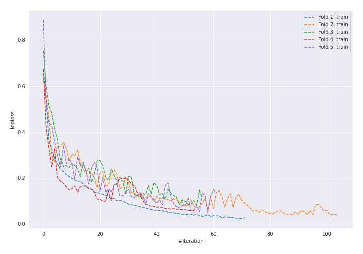
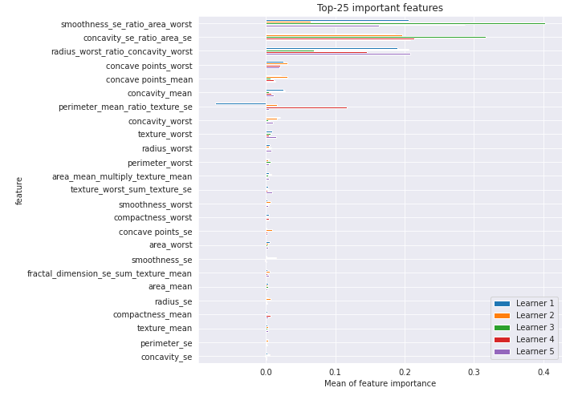

# Summary of 17_NeuralNetwork_GoldenFeatures

[<< Go back](../README.md)

## Neural Network
- **n_jobs**: -1
- **dense_1_size**: 64
- **dense_2_size**: 16
- **learning_rate**: 0.01
- **explain_level**: 2

## Validation
 - **validation_type**: kfold
 - **k_folds**: 5
 - **shuffle**: True
 - **stratify**: True
 - **random_seed**: 1230

## Optimized metric
logloss

## Training time

9.6 seconds

## Metric details
|           |    score |    threshold |
|:----------|---------:|-------------:|
| logloss   | 0.227222 | nan          |
| auc       | 0.973767 | nan          |
| f1        | 0.936585 |   0.616081   |
| accuracy  | 0.938679 |   0.616081   |
| precision | 1        |   0.860122   |
| recall    | 1        |   7.1468e-90 |
| mcc       | 0.879278 |   0.616081   |

## Confusion matrix (at threshold=0.616081)
|                     |   Predicted as negative |   Predicted as positive |
|:--------------------|------------------------:|------------------------:|
| Labeled as negative |                     206 |                       6 |
| Labeled as positive |                      20 |                     192 |

## Learning curves

## Permutation-based Importance

[<< Go back](../README.md)
