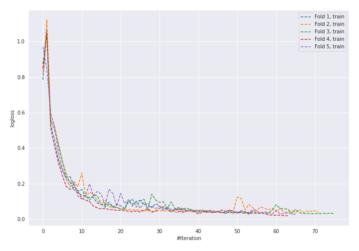
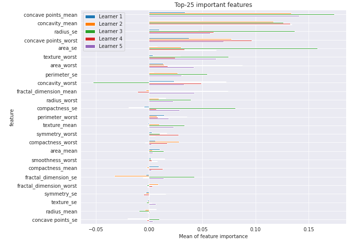

# Summary of 18_NeuralNetwork

[<< Go back](../README.md)

## Neural Network
- **n_jobs**: -1
- **dense_1_size**: 64
- **dense_2_size**: 32
- **learning_rate**: 0.08
- **explain_level**: 2

## Validation
 - **validation_type**: kfold
 - **k_folds**: 5
 - **shuffle**: True
 - **stratify**: True
 - **random_seed**: 1230

## Optimized metric
logloss

## Training time

4.9 seconds

## Metric details
|           |    score |     threshold |
|:----------|---------:|--------------:|
| logloss   | 0.186942 | nan           |
| auc       | 0.981065 | nan           |
| f1        | 0.948598 |   0.459469    |
| accuracy  | 0.948113 |   0.459469    |
| precision | 1        |   0.999999    |
| recall    | 1        |   8.21242e-05 |
| mcc       | 0.896386 |   0.459469    |

## Confusion matrix (at threshold=0.459469)
|                     |   Predicted as negative |   Predicted as positive |
|:--------------------|------------------------:|------------------------:|
| Labeled as negative |                     199 |                      13 |
| Labeled as positive |                       9 |                     203 |

## Learning curves

## Permutation-based Importance

[<< Go back](../README.md)
