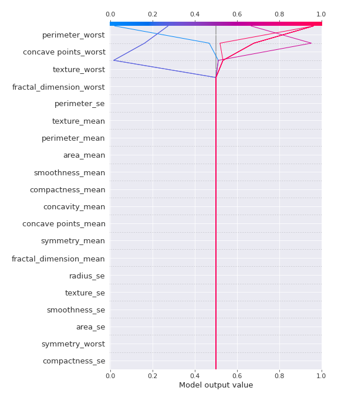

# Summary of 30_DecisionTree

[<< Go back](../README.md)

## Decision Tree
- **n_jobs**: -1
- **criterion**: gini
- **max_depth**: 2
- **explain_level**: 2

## Validation
 - **validation_type**: kfold
 - **k_folds**: 5
 - **shuffle**: True
 - **stratify**: True
 - **random_seed**: 1230

## Optimized metric
logloss

## Training time

30.2 seconds

## Metric details
|           |    score |   threshold |
|:----------|---------:|------------:|
| logloss   | 0.299593 | nan         |
| auc       | 0.927643 | nan         |
| f1        | 0.918182 |   0.494583  |
| accuracy  | 0.915094 |   0.494583  |
| precision | 1        |   0.992647  |
| recall    | 1        |   0.0175325 |
| mcc       | 0.832563 |   0.494583  |

## Confusion matrix (at threshold=0.494583)
|                     |   Predicted as negative |   Predicted as positive |
|:--------------------|------------------------:|------------------------:|
| Labeled as negative |                     186 |                      26 |
| Labeled as positive |                      10 |                     202 |

## Learning curves

## Decision Tree 

### Tree #1

### Rules

if (concave points_mean > 0.256) and (concavity_worst > 0.178) then class: 1 (proba: 95.12%) | based on 164 samples

if (concave points_mean <= 0.256) and (radius_worst <= 0.305) then class: 0 (proba: 98.0%) | based on 150 samples

if (concave points_mean <= 0.256) and (radius_worst > 0.305) then class: 1 (proba: 55.56%) | based on 18 samples

if (concave points_mean > 0.256) and (concavity_worst <= 0.178) then class: 0 (proba: 85.71%) | based on 7 samples

### Tree #2

### Rules

if (perimeter_worst <= 0.257) and (concave points_worst <= 0.621) then class: 0 (proba: 97.33%) | based on 150 samples

if (perimeter_worst > 0.257) and (perimeter_worst > 0.334) then class: 1 (proba: 99.26%) | based on 136 samples

if (perimeter_worst > 0.257) and (perimeter_worst <= 0.334) then class: 1 (proba: 55.1%) | based on 49 samples

if (perimeter_worst <= 0.257) and (concave points_worst > 0.621) then class: 1 (proba: 100.0%) | based on 4 samples

### Tree #3

### Rules

if (concave points_mean <= 0.256) and (radius_worst <= 0.305) then class: 0 (proba: 96.2%) | based on 158 samples

if (concave points_mean > 0.256) and (concavity_worst > 0.172) then class: 1 (proba: 96.79%) | based on 156 samples

if (concave points_mean <= 0.256) and (radius_worst > 0.305) then class: 1 (proba: 57.89%) | based on 19 samples

if (concave points_mean > 0.256) and (concavity_worst <= 0.172) then class: 0 (proba: 83.33%) | based on 6 samples

### Tree #4

### Rules

if (perimeter_worst > 0.257) and (concavity_worst > 0.165) then class: 1 (proba: 94.67%) | based on 169 samples

if (perimeter_worst <= 0.257) and (concave points_worst <= 0.621) then class: 0 (proba: 98.04%) | based on 153 samples

if (perimeter_worst > 0.257) and (concavity_worst <= 0.165) then class: 0 (proba: 73.33%) | based on 15 samples

if (perimeter_worst <= 0.257) and (concave points_worst > 0.621) then class: 1 (proba: 100.0%) | based on 2 samples

### Tree #5

### Rules

if (perimeter_worst > 0.272) and (texture_worst > 0.177) then class: 1 (proba: 96.25%) | based on 160 samples

if (perimeter_worst <= 0.272) and (concave points_worst <= 0.464) then class: 0 (proba: 98.05%) | based on 154 samples

if (perimeter_worst <= 0.272) and (concave points_worst > 0.464) then class: 1 (proba: 66.67%) | based on 15 samples

if (perimeter_worst > 0.272) and (texture_worst <= 0.177) then class: 0 (proba: 72.73%) | based on 11 samples

## Permutation-based Importance

## SHAP Importance

## SHAP Dependence plots

### Dependence (Fold 1)

### Dependence (Fold 2)

### Dependence (Fold 3)

### Dependence (Fold 4)

### Dependence (Fold 5)

## SHAP Decision plots

### Top-10 Worst decisions for class 0 (Fold 1)

### Top-10 Worst decisions for class 0 (Fold 2)

### Top-10 Worst decisions for class 0 (Fold 3)

### Top-10 Worst decisions for class 0 (Fold 4)

### Top-10 Worst decisions for class 0 (Fold 5)

### Top-10 Best decisions for class 0 (Fold 1)

### Top-10 Best decisions for class 0 (Fold 2)

### Top-10 Best decisions for class 0 (Fold 3)

### Top-10 Best decisions for class 0 (Fold 4)

### Top-10 Best decisions for class 0 (Fold 5)

### Top-10 Worst decisions for class 1 (Fold 1)

### Top-10 Worst decisions for class 1 (Fold 2)

### Top-10 Worst decisions for class 1 (Fold 3)

### Top-10 Worst decisions for class 1 (Fold 4)

### Top-10 Worst decisions for class 1 (Fold 5)

### Top-10 Best decisions for class 1 (Fold 1)

### Top-10 Best decisions for class 1 (Fold 2)

### Top-10 Best decisions for class 1 (Fold 3)

### Top-10 Best decisions for class 1 (Fold 4)

### Top-10 Best decisions for class 1 (Fold 5)

[<< Go back](../README.md)
