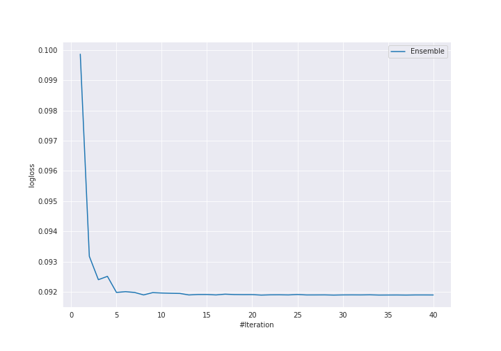

# Summary of Ensemble

[<< Go back](../README.md)

## Ensemble structure
| Model                                      |   Weight |
|:-------------------------------------------|---------:|
| 17_NeuralNetwork                           |        7 |
| 31_Xgboost_GoldenFeatures_SelectedFeatures |       18 |
| 5_Default_NeuralNetwork                    |        4 |

## Metric details
|           |     score |    threshold |
|:----------|----------:|-------------:|
| logloss   | 0.0918982 | nan          |
| auc       | 0.995127  | nan          |
| f1        | 0.96729   |   0.384885   |
| accuracy  | 0.966981  |   0.384885   |
| precision | 1         |   0.99122    |
| recall    | 1         |   7.3045e-05 |
| mcc       | 0.934129  |   0.384885   |

## Confusion matrix (at threshold=0.384885)
|                     |   Predicted as negative |   Predicted as positive |
|:--------------------|------------------------:|------------------------:|
| Labeled as negative |                     203 |                       9 |
| Labeled as positive |                       5 |                     207 |

## Learning curves

[<< Go back](../README.md)
