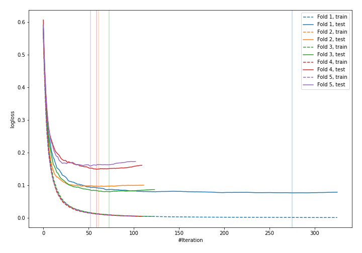
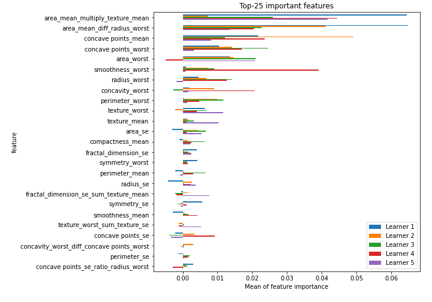

# Summary of 16_CatBoost_GoldenFeatures

[<< Go back](../README.md)

## CatBoost
- **n_jobs**: -1
- **learning_rate**: 0.1
- **depth**: 8
- **rsm**: 1.0
- **loss_function**: Logloss
- **eval_metric**: Logloss
- **explain_level**: 2

## Validation
 - **validation_type**: kfold
 - **k_folds**: 5
 - **shuffle**: True
 - **stratify**: True
 - **random_seed**: 1230

## Optimized metric
logloss

## Training time

34.0 seconds

## Metric details
|           |    score |     threshold |
|:----------|---------:|--------------:|
| logloss   | 0.112308 | nan           |
| auc       | 0.992546 | nan           |
| f1        | 0.96     |   0.517651    |
| accuracy  | 0.959906 |   0.517651    |
| precision | 1        |   0.968354    |
| recall    | 1        |   9.21856e-05 |
| mcc       | 0.919822 |   0.517651    |

## Confusion matrix (at threshold=0.517651)
|                     |   Predicted as negative |   Predicted as positive |
|:--------------------|------------------------:|------------------------:|
| Labeled as negative |                     203 |                       9 |
| Labeled as positive |                       8 |                     204 |

## Learning curves

## Permutation-based Importance

[<< Go back](../README.md)
