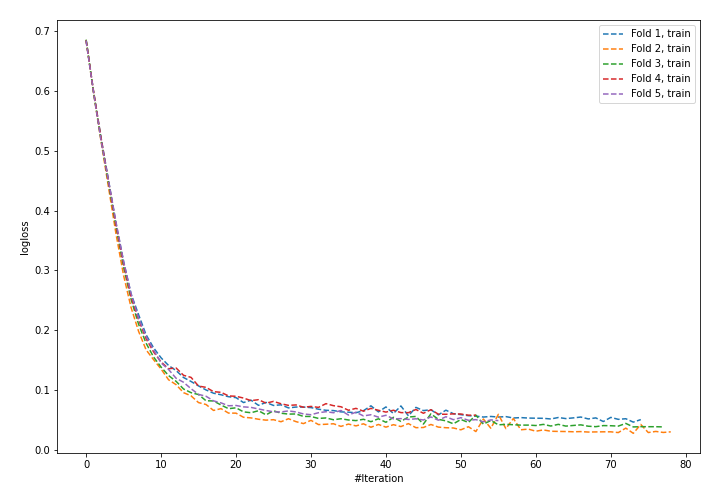
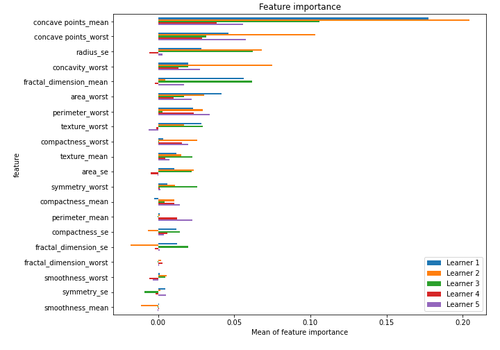

# Summary of 24_NeuralNetwork_SelectedFeatures

[<< Go back](../README.md)

## Neural Network
- **n_jobs**: -1
- **dense_1_size**: 64
- **dense_2_size**: 16
- **learning_rate**: 0.01
- **explain_level**: 2

## Validation
 - **validation_type**: kfold
 - **k_folds**: 5
 - **shuffle**: True
 - **stratify**: True
 - **random_seed**: 1230

## Optimized metric
logloss

## Training time

3.5 seconds

## Metric details
|           |    score |     threshold |
|:----------|---------:|--------------:|
| logloss   | 0.226201 | nan           |
| auc       | 0.983224 | nan           |
| f1        | 0.950119 |   0.529084    |
| accuracy  | 0.950472 |   0.529084    |
| precision | 1        |   0.839392    |
| recall    | 1        |   1.79186e-06 |
| mcc       | 0.901034 |   0.529084    |

## Confusion matrix (at threshold=0.529084)
|                     |   Predicted as negative |   Predicted as positive |
|:--------------------|------------------------:|------------------------:|
| Labeled as negative |                     203 |                       9 |
| Labeled as positive |                      12 |                     200 |

## Learning curves

## Permutation-based Importance

[<< Go back](../README.md)
