# Summary of 12_DecisionTree

[<< Go back](../README.md)

## Decision Tree
- **n_jobs**: -1
- **criterion**: entropy
- **max_depth**: 2
- **explain_level**: 2

## Validation
 - **validation_type**: kfold
 - **k_folds**: 5
 - **shuffle**: True
 - **stratify**: True
 - **random_seed**: 1230

## Optimized metric
logloss

## Training time

23.3 seconds

## Metric details
|           |    score |   threshold |
|:----------|---------:|------------:|
| logloss   | 0.390878 | nan         |
| auc       | 0.936165 | nan         |
| f1        | 0.91236  |   0.034965  |
| accuracy  | 0.908019 |   0.034965  |
| precision | 0.875576 |   0.509804  |
| recall    | 1        |   0.0175325 |
| mcc       | 0.820071 |   0.034965  |

## Confusion matrix (at threshold=0.034965)
|                     |   Predicted as negative |   Predicted as positive |
|:--------------------|------------------------:|------------------------:|
| Labeled as negative |                     182 |                      30 |
| Labeled as positive |                       9 |                     203 |

## Learning curves
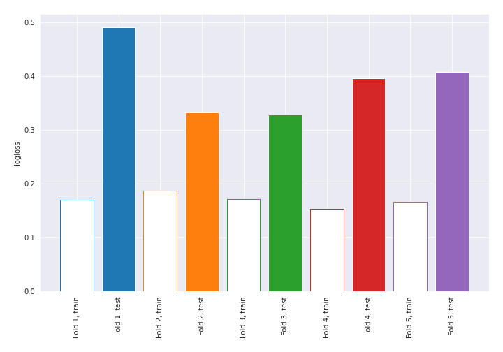

## Decision Tree 

### Tree #1
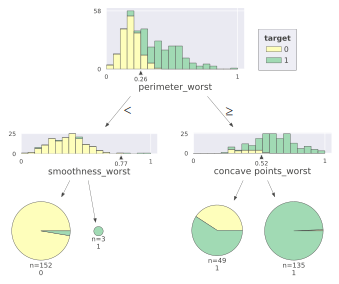

### Rules

if (perimeter_worst <= 0.262) and (smoothness_worst <= 0.771) then class: 0 (proba: 97.37%) | based on 152 samples

if (perimeter_worst > 0.262) and (concave points_worst > 0.518) then class: 1 (proba: 99.26%) | based on 135 samples

if (perimeter_worst > 0.262) and (concave points_worst <= 0.518) then class: 1 (proba: 59.18%) | based on 49 samples

if (perimeter_worst <= 0.262) and (smoothness_worst > 0.771) then class: 1 (proba: 100.0%) | based on 3 samples

### Tree #2
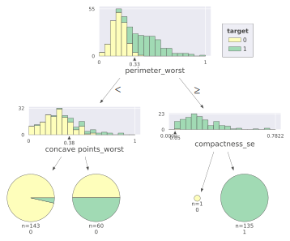

### Rules

if (perimeter_worst <= 0.334) and (concave points_worst <= 0.381) then class: 0 (proba: 96.5%) | based on 143 samples

if (perimeter_worst > 0.334) and (compactness_se > 0.046) then class: 1 (proba: 100.0%) | based on 135 samples

if (perimeter_worst <= 0.334) and (concave points_worst > 0.381) then class: 0 (proba: 50.0%) | based on 60 samples

if (perimeter_worst > 0.334) and (compactness_se <= 0.046) then class: 0 (proba: 100.0%) | based on 1 samples

### Tree #3
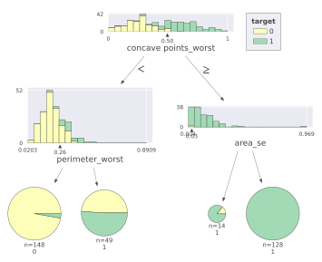

### Rules

if (concave points_worst <= 0.495) and (perimeter_worst <= 0.257) then class: 0 (proba: 97.3%) | based on 148 samples

if (concave points_worst > 0.495) and (area_se > 0.034) then class: 1 (proba: 100.0%) | based on 128 samples

if (concave points_worst <= 0.495) and (perimeter_worst > 0.257) then class: 1 (proba: 51.02%) | based on 49 samples

if (concave points_worst > 0.495) and (area_se <= 0.034) then class: 1 (proba: 85.71%) | based on 14 samples

### Tree #4
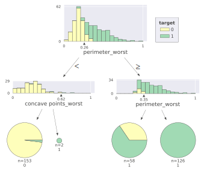

### Rules

if (perimeter_worst <= 0.257) and (concave points_worst <= 0.621) then class: 0 (proba: 98.04%) | based on 153 samples

if (perimeter_worst > 0.257) and (perimeter_worst > 0.348) then class: 1 (proba: 100.0%) | based on 126 samples

if (perimeter_worst > 0.257) and (perimeter_worst <= 0.348) then class: 1 (proba: 65.52%) | based on 58 samples

if (perimeter_worst <= 0.257) and (concave points_worst > 0.621) then class: 1 (proba: 100.0%) | based on 2 samples

### Tree #5
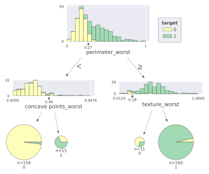

### Rules

if (perimeter_worst > 0.272) and (texture_worst > 0.177) then class: 1 (proba: 96.25%) | based on 160 samples

if (perimeter_worst <= 0.272) and (concave points_worst <= 0.464) then class: 0 (proba: 98.05%) | based on 154 samples

if (perimeter_worst <= 0.272) and (concave points_worst > 0.464) then class: 1 (proba: 66.67%) | based on 15 samples

if (perimeter_worst > 0.272) and (texture_worst <= 0.177) then class: 0 (proba: 72.73%) | based on 11 samples

## Permutation-based Importance
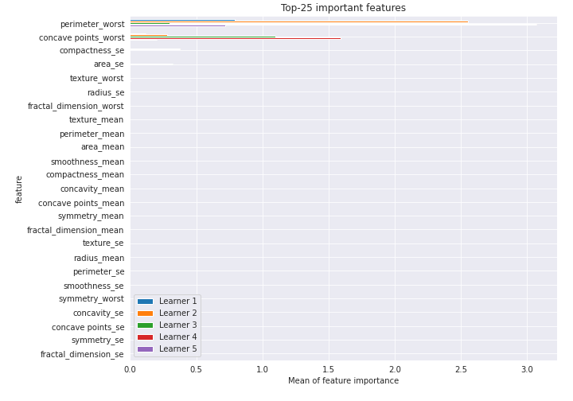

## SHAP Importance
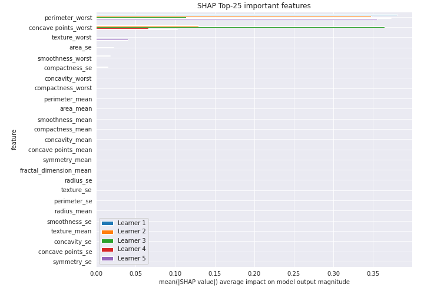

## SHAP Dependence plots

### Dependence (Fold 1)
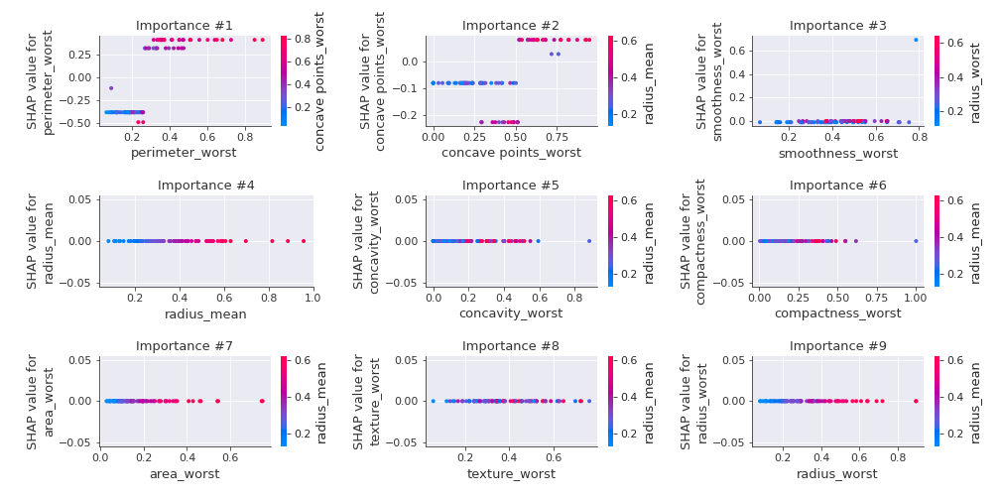
### Dependence (Fold 2)
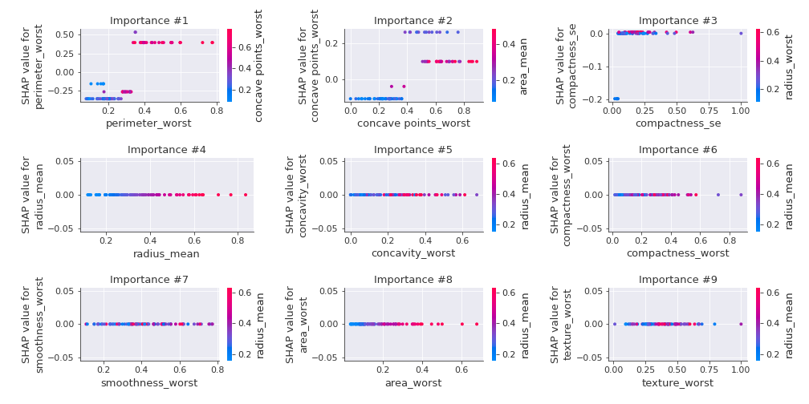
### Dependence (Fold 3)
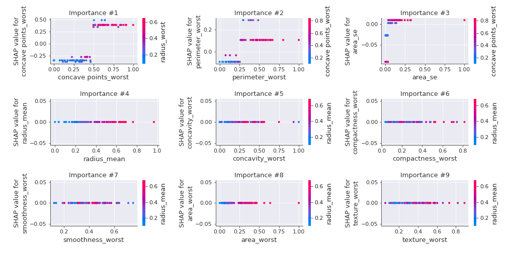
### Dependence (Fold 4)
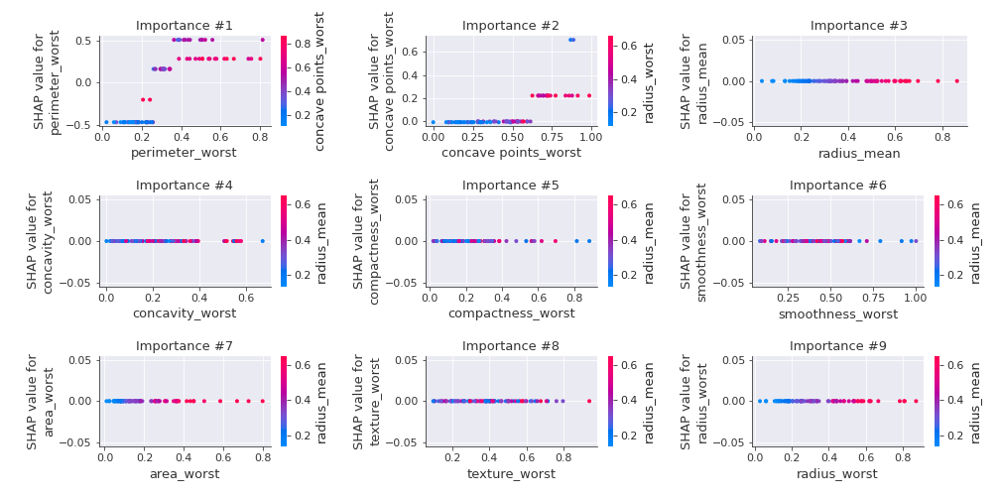
### Dependence (Fold 5)

## SHAP Decision plots

### Top-10 Worst decisions for class 0 (Fold 1)
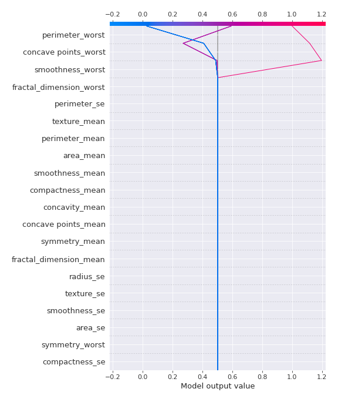
### Top-10 Worst decisions for class 0 (Fold 2)
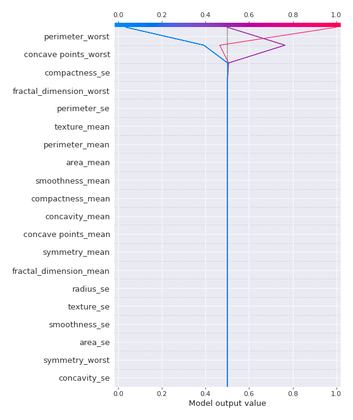
### Top-10 Worst decisions for class 0 (Fold 3)
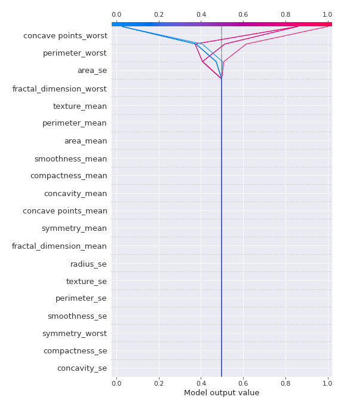
### Top-10 Worst decisions for class 0 (Fold 4)
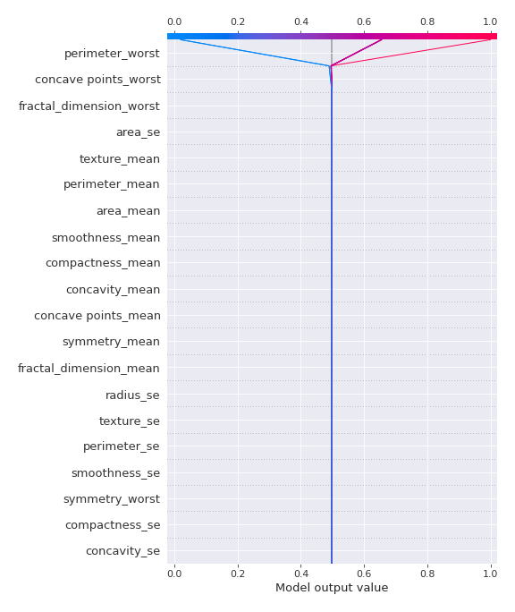
### Top-10 Worst decisions for class 0 (Fold 5)
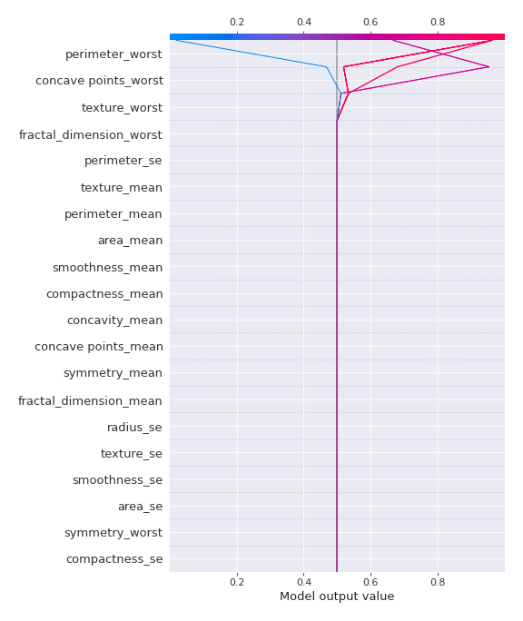
### Top-10 Best decisions for class 0 (Fold 1)
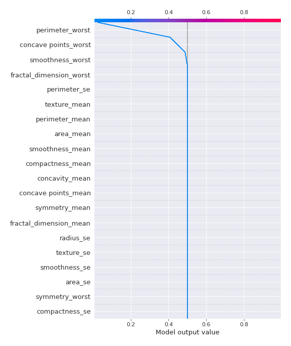
### Top-10 Best decisions for class 0 (Fold 2)
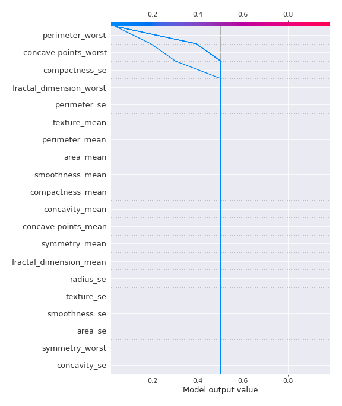
### Top-10 Best decisions for class 0 (Fold 3)
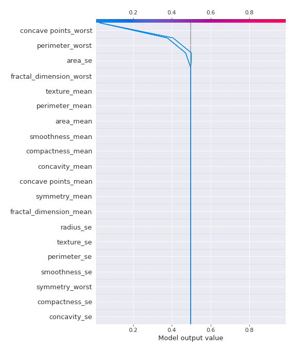
### Top-10 Best decisions for class 0 (Fold 4)
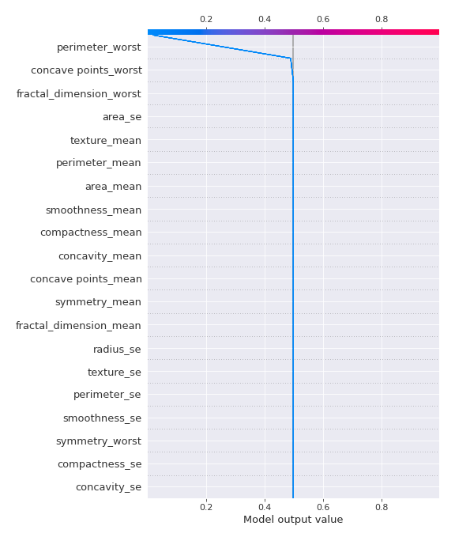
### Top-10 Best decisions for class 0 (Fold 5)
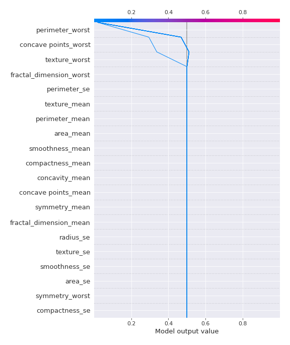
### Top-10 Worst decisions for class 1 (Fold 1)
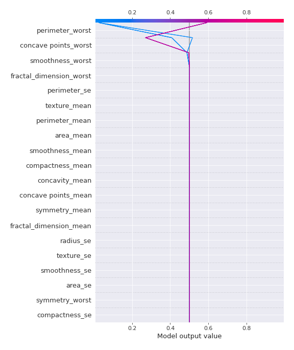
### Top-10 Worst decisions for class 1 (Fold 2)
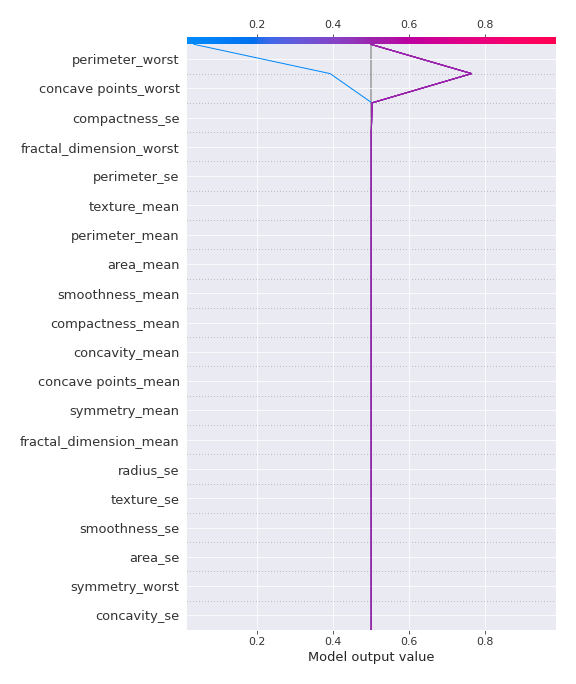
### Top-10 Worst decisions for class 1 (Fold 3)
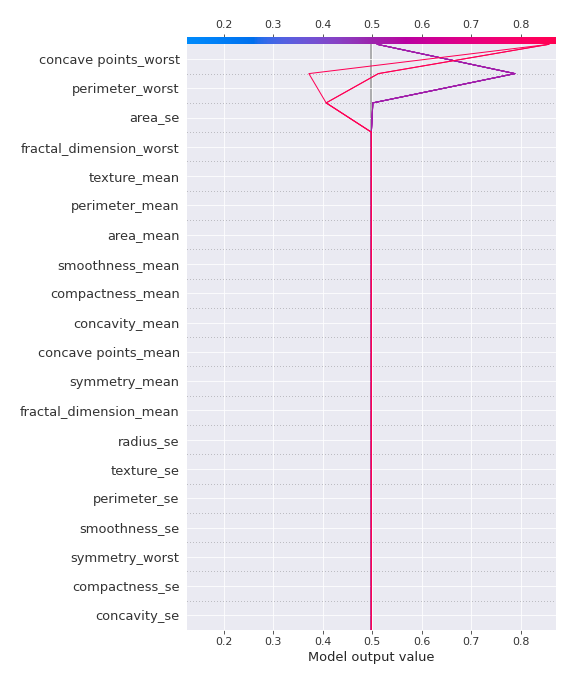
### Top-10 Worst decisions for class 1 (Fold 4)
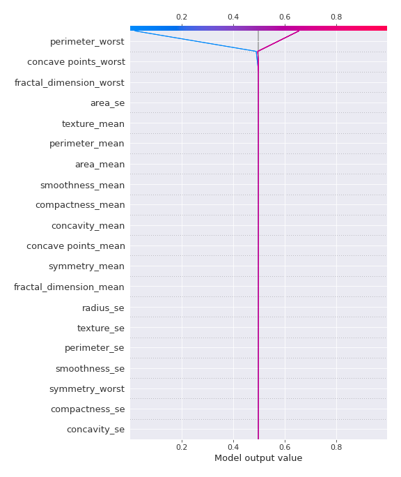
### Top-10 Worst decisions for class 1 (Fold 5)

### Top-10 Best decisions for class 1 (Fold 1)
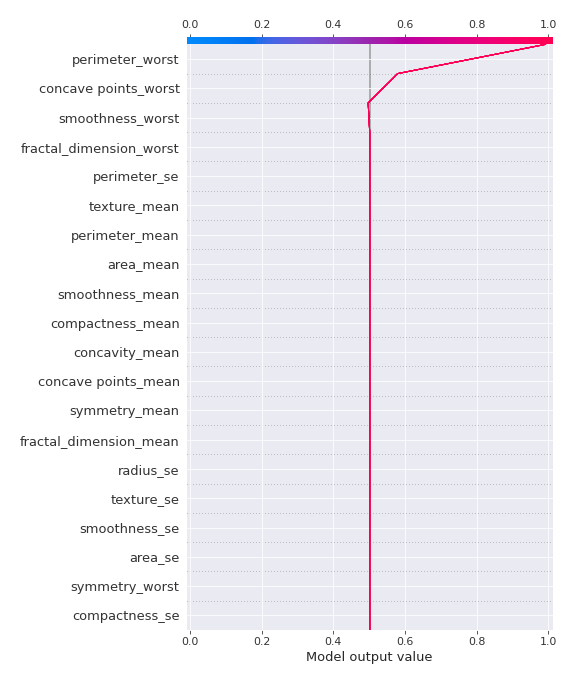
### Top-10 Best decisions for class 1 (Fold 2)
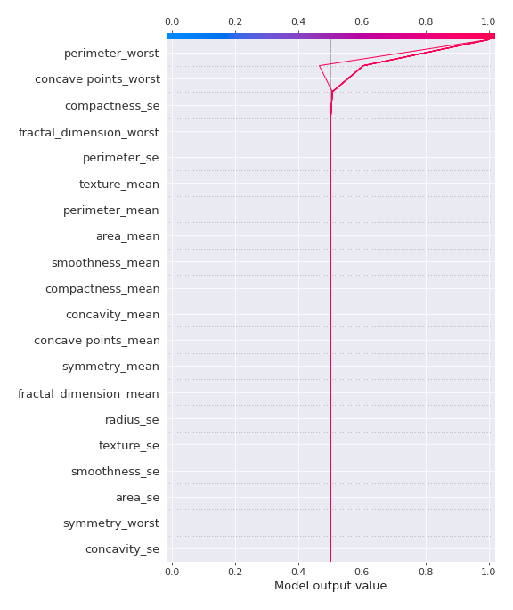
### Top-10 Best decisions for class 1 (Fold 3)
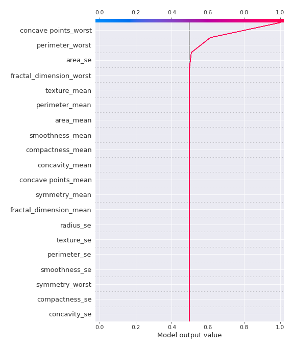
### Top-10 Best decisions for class 1 (Fold 4)

### Top-10 Best decisions for class 1 (Fold 5)
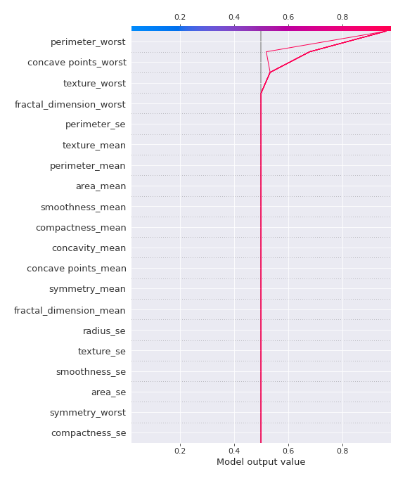

[<< Go back](../README.md)
