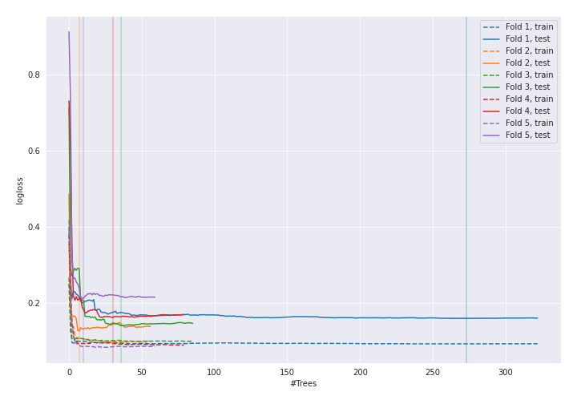
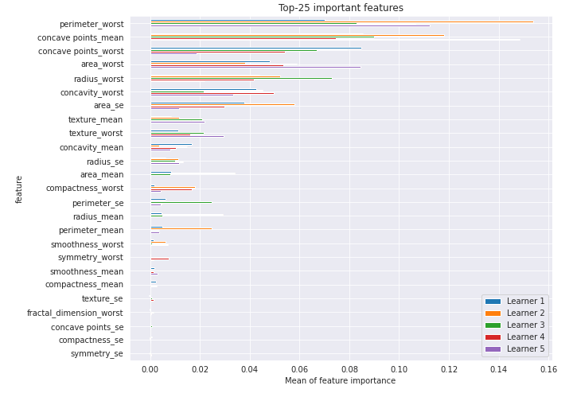

# Summary of 5_RandomForest_RandomFeature

[<< Go back](../README.md)

## Random Forest
- **n_jobs**: -1
- **criterion**: gini
- **max_features**: 0.5
- **min_samples_split**: 20
- **max_depth**: 4
- **eval_metric_name**: logloss
- **explain_level**: 1

## Validation
 - **validation_type**: kfold
 - **k_folds**: 5
 - **shuffle**: True
 - **stratify**: True
 - **random_seed**: 1230

## Optimized metric
logloss

## Training time

53.5 seconds

## Metric details
|           |    score |    threshold |
|:----------|---------:|-------------:|
| logloss   | 0.160339 | nan          |
| auc       | 0.985749 | nan          |
| f1        | 0.926174 |   0.340965   |
| accuracy  | 0.92217  |   0.340965   |
| precision | 1        |   0.892182   |
| recall    | 1        |   0.00263189 |
| mcc       | 0.849353 |   0.340965   |

## Confusion matrix (at threshold=0.340965)
|                     |   Predicted as negative |   Predicted as positive |
|:--------------------|------------------------:|------------------------:|
| Labeled as negative |                     184 |                      28 |
| Labeled as positive |                       5 |                     207 |

## Learning curves

## Permutation-based Importance

[<< Go back](../README.md)
