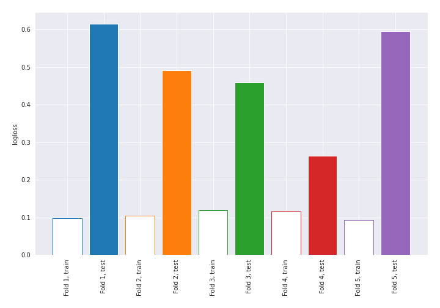

# Summary of 1_DecisionTree

[<< Go back](../README.md)

## Decision Tree
- **n_jobs**: -1
- **criterion**: gini
- **max_depth**: 3
- **explain_level**: 2

## Validation
 - **validation_type**: kfold
 - **k_folds**: 5
 - **shuffle**: True
 - **stratify**: True
 - **random_seed**: 1230

## Optimized metric
logloss

## Training time

45.5 seconds

## Metric details
|           |    score |   threshold |
|:----------|---------:|------------:|
| logloss   | 0.484484 | nan         |
| auc       | 0.912869 | nan         |
| f1        | 0.911964 |   0.0378725 |
| accuracy  | 0.908019 |   0.225601  |
| precision | 0.918919 |   0.993151  |
| recall    | 0.985849 |   0         |
| mcc       | 0.819335 |   0.0378725 |

## Confusion matrix (at threshold=0.225601)
|                     |   Predicted as negative |   Predicted as positive |
|:--------------------|------------------------:|------------------------:|
| Labeled as negative |                     188 |                      24 |
| Labeled as positive |                      15 |                     197 |

## Learning curves

## Decision Tree 

### Tree #1

### Rules

if (concave points_mean > 0.256) and (concavity_worst > 0.178) and (area_se > 0.013) then class: 1 (proba: 96.89%) | based on 161 samples

if (concave points_mean <= 0.256) and (radius_worst <= 0.305) and (area_se <= 0.075) then class: 0 (proba: 99.32%) | based on 148 samples

if (concave points_mean <= 0.256) and (radius_worst > 0.305) and (texture_mean <= 0.342) then class: 0 (proba: 80.0%) | based on 10 samples

if (concave points_mean <= 0.256) and (radius_worst > 0.305) and (texture_mean > 0.342) then class: 1 (proba: 100.0%) | based on 8 samples

if (concave points_mean > 0.256) and (concavity_worst <= 0.178) and (fractal_dimension_se > 0.038) then class: 0 (proba: 100.0%) | based on 6 samples

if (concave points_mean > 0.256) and (concavity_worst > 0.178) and (area_se <= 0.013) then class: 0 (proba: 100.0%) | based on 3 samples

if (concave points_mean <= 0.256) and (radius_worst <= 0.305) and (area_se > 0.075) then class: 1 (proba: 100.0%) | based on 2 samples

if (concave points_mean > 0.256) and (concavity_worst <= 0.178) and (fractal_dimension_se <= 0.038) then class: 1 (proba: 100.0%) | based on 1 samples

### Tree #2

### Rules

if (perimeter_worst <= 0.257) and (concave points_worst <= 0.621) and (symmetry_worst > 0.0) then class: 0 (proba: 97.99%) | based on 149 samples

if (perimeter_worst > 0.257) and (perimeter_worst > 0.334) and (fractal_dimension_se > 0.019) then class: 1 (proba: 100.0%) | based on 135 samples

if (perimeter_worst > 0.257) and (perimeter_worst <= 0.334) and (texture_worst > 0.312) then class: 1 (proba: 78.79%) | based on 33 samples

if (perimeter_worst > 0.257) and (perimeter_worst <= 0.334) and (texture_worst <= 0.312) then class: 0 (proba: 93.75%) | based on 16 samples

if (perimeter_worst <= 0.257) and (concave points_worst > 0.621) then class: 1 (proba: 100.0%) | based on 4 samples

if (perimeter_worst > 0.257) and (perimeter_worst > 0.334) and (fractal_dimension_se <= 0.019) then class: 0 (proba: 100.0%) | based on 1 samples

if (perimeter_worst <= 0.257) and (concave points_worst <= 0.621) and (symmetry_worst <= 0.0) then class: 1 (proba: 100.0%) | based on 1 samples

### Tree #3

### Rules

if (concave points_mean <= 0.256) and (radius_worst <= 0.305) and (area_se <= 0.075) then class: 0 (proba: 97.42%) | based on 155 samples

if (concave points_mean > 0.256) and (concavity_worst > 0.172) and (texture_mean > 0.209) then class: 1 (proba: 99.32%) | based on 146 samples

if (concave points_mean <= 0.256) and (radius_worst > 0.305) and (texture_worst > 0.21) then class: 1 (proba: 78.57%) | based on 14 samples

if (concave points_mean > 0.256) and (concavity_worst > 0.172) and (texture_mean <= 0.209) then class: 1 (proba: 60.0%) | based on 10 samples

if (concave points_mean > 0.256) and (concavity_worst <= 0.172) and (symmetry_worst <= 0.314) then class: 0 (proba: 100.0%) | based on 5 samples

if (concave points_mean <= 0.256) and (radius_worst > 0.305) and (texture_worst <= 0.21) then class: 0 (proba: 100.0%) | based on 5 samples

if (concave points_mean <= 0.256) and (radius_worst <= 0.305) and (area_se > 0.075) then class: 1 (proba: 66.67%) | based on 3 samples

if (concave points_mean > 0.256) and (concavity_worst <= 0.172) and (symmetry_worst > 0.314) then class: 1 (proba: 100.0%) | based on 1 samples

### Tree #4

### Rules

if (perimeter_worst > 0.257) and (concavity_worst > 0.165) and (texture_mean > 0.192) then class: 1 (proba: 97.5%) | based on 160 samples

if (perimeter_worst <= 0.257) and (concave points_worst <= 0.621) and (texture_worst <= 0.714) then class: 0 (proba: 98.68%) | based on 151 samples

if (perimeter_worst > 0.257) and (concavity_worst <= 0.165) and (area_se <= 0.062) then class: 0 (proba: 100.0%) | based on 10 samples

if (perimeter_worst > 0.257) and (concavity_worst > 0.165) and (texture_mean <= 0.192) then class: 0 (proba: 55.56%) | based on 9 samples

if (perimeter_worst > 0.257) and (concavity_worst <= 0.165) and (area_se > 0.062) then class: 1 (proba: 80.0%) | based on 5 samples

if (perimeter_worst <= 0.257) and (concave points_worst > 0.621) then class: 1 (proba: 100.0%) | based on 2 samples

if (perimeter_worst <= 0.257) and (concave points_worst <= 0.621) and (texture_worst > 0.714) then class: 0 (proba: 50.0%) | based on 2 samples

### Tree #5

### Rules

if (perimeter_worst > 0.272) and (texture_worst > 0.177) and (radius_worst > 0.282) then class: 1 (proba: 98.06%) | based on 155 samples

if (perimeter_worst <= 0.272) and (concave points_worst <= 0.464) and (symmetry_worst > 0.0) then class: 0 (proba: 98.69%) | based on 153 samples

if (perimeter_worst <= 0.272) and (concave points_worst > 0.464) and (texture_worst > 0.37) then class: 1 (proba: 100.0%) | based on 9 samples

if (perimeter_worst > 0.272) and (texture_worst <= 0.177) and (perimeter_worst <= 0.43) then class: 0 (proba: 100.0%) | based on 8 samples

if (perimeter_worst <= 0.272) and (concave points_worst > 0.464) and (texture_worst <= 0.37) then class: 0 (proba: 83.33%) | based on 6 samples

if (perimeter_worst > 0.272) and (texture_worst > 0.177) and (radius_worst <= 0.282) then class: 0 (proba: 60.0%) | based on 5 samples

if (perimeter_worst > 0.272) and (texture_worst <= 0.177) and (perimeter_worst > 0.43) then class: 1 (proba: 100.0%) | based on 3 samples

if (perimeter_worst <= 0.272) and (concave points_worst <= 0.464) and (symmetry_worst <= 0.0) then class: 1 (proba: 100.0%) | based on 1 samples

## Permutation-based Importance

## SHAP Importance

## SHAP Dependence plots

### Dependence (Fold 1)

### Dependence (Fold 2)

### Dependence (Fold 3)

### Dependence (Fold 4)

### Dependence (Fold 5)

## SHAP Decision plots

### Top-10 Worst decisions for class 0 (Fold 1)

### Top-10 Worst decisions for class 0 (Fold 2)

### Top-10 Worst decisions for class 0 (Fold 3)

### Top-10 Worst decisions for class 0 (Fold 4)

### Top-10 Worst decisions for class 0 (Fold 5)

### Top-10 Best decisions for class 0 (Fold 1)

### Top-10 Best decisions for class 0 (Fold 2)

### Top-10 Best decisions for class 0 (Fold 3)

### Top-10 Best decisions for class 0 (Fold 4)

### Top-10 Best decisions for class 0 (Fold 5)

### Top-10 Worst decisions for class 1 (Fold 1)

### Top-10 Worst decisions for class 1 (Fold 2)

### Top-10 Worst decisions for class 1 (Fold 3)

### Top-10 Worst decisions for class 1 (Fold 4)

### Top-10 Worst decisions for class 1 (Fold 5)

### Top-10 Best decisions for class 1 (Fold 1)

### Top-10 Best decisions for class 1 (Fold 2)

### Top-10 Best decisions for class 1 (Fold 3)

### Top-10 Best decisions for class 1 (Fold 4)

### Top-10 Best decisions for class 1 (Fold 5)

[<< Go back](../README.md)
