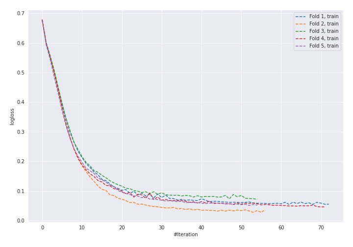
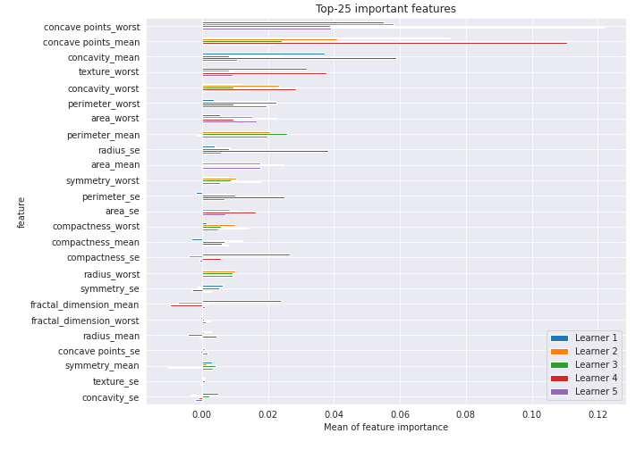

# Summary of 24_NeuralNetwork

[<< Go back](../README.md)

## Neural Network
- **n_jobs**: -1
- **dense_1_size**: 32
- **dense_2_size**: 16
- **learning_rate**: 0.01
- **explain_level**: 2

## Validation
 - **validation_type**: kfold
 - **k_folds**: 5
 - **shuffle**: True
 - **stratify**: True
 - **random_seed**: 1230

## Optimized metric
logloss

## Training time

4.3 seconds

## Metric details
|           |    score |     threshold |
|:----------|---------:|--------------:|
| logloss   | 0.29192  | nan           |
| auc       | 0.97597  | nan           |
| f1        | 0.925234 |   0.534926    |
| accuracy  | 0.926887 |   0.579833    |
| precision | 1        |   0.89008     |
| recall    | 1        |   0.000223538 |
| mcc       | 0.854925 |   0.579833    |

## Confusion matrix (at threshold=0.579833)
|                     |   Predicted as negative |   Predicted as positive |
|:--------------------|------------------------:|------------------------:|
| Labeled as negative |                     202 |                      10 |
| Labeled as positive |                      21 |                     191 |

## Learning curves

## Permutation-based Importance

[<< Go back](../README.md)
