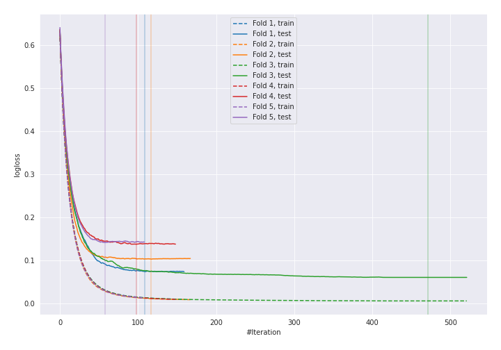
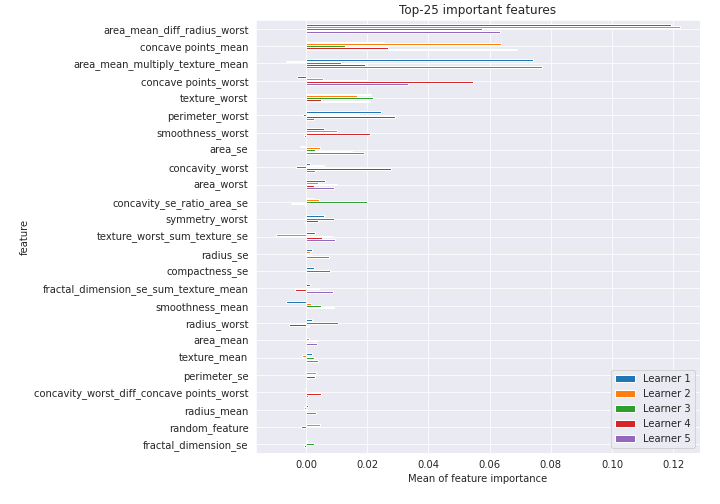

# Summary of 4_Default_Xgboost_GoldenFeatures_RandomFeature

[<< Go back](../README.md)

## Extreme Gradient Boosting (Xgboost)
- **n_jobs**: -1
- **objective**: binary:logistic
- **eta**: 0.075
- **max_depth**: 6
- **min_child_weight**: 1
- **subsample**: 1.0
- **colsample_bytree**: 1.0
- **eval_metric**: logloss
- **explain_level**: 1

## Validation
 - **validation_type**: kfold
 - **k_folds**: 5
 - **shuffle**: True
 - **stratify**: True
 - **random_seed**: 1230

## Optimized metric
logloss

## Training time

16.7 seconds

## Metric details
|           |    score |     threshold |
|:----------|---------:|--------------:|
| logloss   | 0.103574 | nan           |
| auc       | 0.99248  | nan           |
| f1        | 0.961538 |   0.732822    |
| accuracy  | 0.962264 |   0.732822    |
| precision | 1        |   0.982154    |
| recall    | 1        |   0.000133453 |
| mcc       | 0.925187 |   0.732822    |

## Confusion matrix (at threshold=0.732822)
|                     |   Predicted as negative |   Predicted as positive |
|:--------------------|------------------------:|------------------------:|
| Labeled as negative |                     208 |                       4 |
| Labeled as positive |                      12 |                     200 |

## Learning curves

## Permutation-based Importance

[<< Go back](../README.md)
