# Exploratory Data Analysis

[<< Go back](../README.md)
## Feature : target
- **Feature type** : discrete
- **Missing** : 0.0%
- **Unique** : 2
- **Count** :424.0
- **Mean** :0.5
- **Std** :0.5005906676601786
- **Min** :0.0
- **25%th Percentile** : 0.0
- **50%th Percentile** : 0.5
- **75%th Percentile** : 1.0
- **Max** :1.0

## Feature : radius_mean
- **Feature type** : continous
- **Missing** : 0.0%
- **Unique** : 371
- **Count** :424.0
- **Mean** :0.37253100227979635
- **Std** :0.1744440468703602
- **Min** :0.0
- **25%th Percentile** : 0.2488996166406361
- **50%th Percentile** : 0.33077760424061714
- **75%th Percentile** : 0.491575559657343
- **Max** :1.0

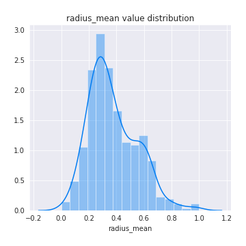
## Feature : texture_mean
- **Feature type** : continous
- **Missing** : 0.0%
- **Unique** : 376
- **Count** :424.0
- **Mean** :0.3415655847014756
- **Std** :0.14256811523613472
- **Min** :0.0226580994250929
- **25%th Percentile** : 0.2414609401420357
- **50%th Percentile** : 0.3273588096043285
- **75%th Percentile** : 0.42010483598241444
- **Max** :1.0

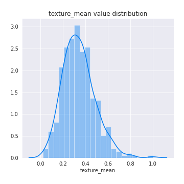
## Feature : perimeter_mean
- **Feature type** : continous
- **Missing** : 0.0%
- **Unique** : 390
- **Count** :424.0
- **Mean** :0.3679538647887839
- **Std** :0.17581275532254062
- **Min** :0.0
- **25%th Percentile** : 0.23799322783498034
- **50%th Percentile** : 0.3265150991638449
- **75%th Percentile** : 0.48690484417110086
- **Max** :1.0

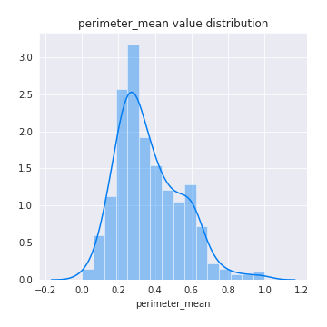
## Feature : area_mean
- **Feature type** : continous
- **Missing** : 0.0%
- **Unique** : 408
- **Count** :424.0
- **Mean** :0.24631735328838114
- **Std** :0.1597065275790838
- **Min** :0.0
- **25%th Percentile** : 0.13417815482502649
- **50%th Percentile** : 0.1947613997879109
- **75%th Percentile** : 0.33648992576882286
- **Max** :1.0

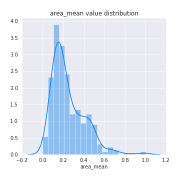
## Feature : smoothness_mean
- **Feature type** : continous
- **Missing** : 0.0%
- **Unique** : 362
- **Count** :424.0
- **Mean** :0.4066849378535505
- **Std** :0.12992722277788915
- **Min** :0.0
- **25%th Percentile** : 0.3155637808070778
- **50%th Percentile** : 0.4045319129728267
- **75%th Percentile** : 0.48767716890854923
- **Max** :1.0

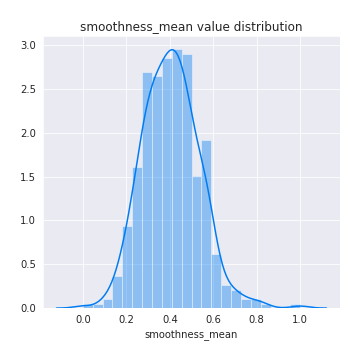
## Feature : compactness_mean
- **Feature type** : continous
- **Missing** : 0.0%
- **Unique** : 403
- **Count** :424.0
- **Mean** :0.2879067206202188
- **Std** :0.1705701240140283
- **Min** :0.0
- **25%th Percentile** : 0.16015121771670449
- **50%th Percentile** : 0.26246856021103
- **75%th Percentile** : 0.38147966382430526
- **Max** :1.0

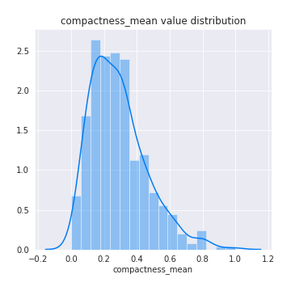
## Feature : concavity_mean
- **Feature type** : continous
- **Missing** : 0.0%
- **Unique** : 404
- **Count** :424.0
- **Mean** :0.24297431577248832
- **Std** :0.19667562885001455
- **Min** :0.0
- **25%th Percentile** : 0.08156630740393618
- **50%th Percentile** : 0.2028467666354264
- **75%th Percentile** : 0.3608833177132146
- **Max** :1.0

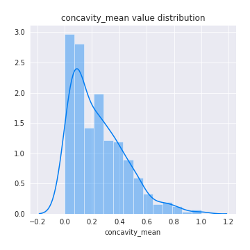
## Feature : concave points_mean
- **Feature type** : continous
- **Missing** : 0.0%
- **Unique** : 403
- **Count** :424.0
- **Mean** :0.28275596421471166
- **Std** :0.20446588930105813
- **Min** :0.0
- **25%th Percentile** : 0.11633946322067588
- **50%th Percentile** : 0.248682902584493
- **75%th Percentile** : 0.42872763419483095
- **Max** :1.0

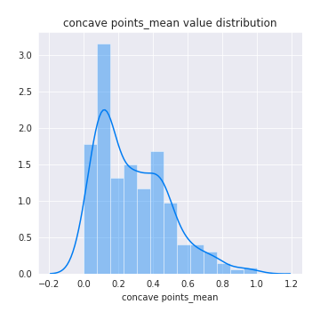
## Feature : symmetry_mean
- **Feature type** : continous
- **Missing** : 0.0%
- **Unique** : 338
- **Count** :424.0
- **Mean** :0.39364994282447124
- **Std** :0.14051629711906158
- **Min** :0.0
- **25%th Percentile** : 0.2978535353535354
- **50%th Percentile** : 0.3785353535353536
- **75%th Percentile** : 0.4612373737373737
- **Max** :1.0

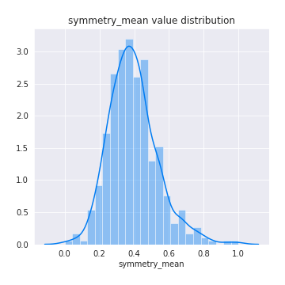
## Feature : fractal_dimension_mean
- **Feature type** : continous
- **Missing** : 0.0%
- **Unique** : 388
- **Count** :424.0
- **Mean** :0.2707629627569106
- **Std** :0.15056932035285348
- **Min** :0.0
- **25%th Percentile** : 0.16085720303285578
- **50%th Percentile** : 0.2464195450716089
- **75%th Percentile** : 0.346145745577085
- **Max** :1.0

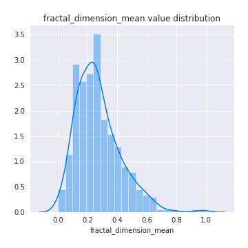
## Feature : radius_se
- **Feature type** : continous
- **Missing** : 0.0%
- **Unique** : 412
- **Count** :424.0
- **Mean** :0.12164131812420777
- **Std** :0.10989773364432907
- **Min** :0.0
- **25%th Percentile** : 0.04849719355422777
- **50%th Percentile** : 0.08897338403041821
- **75%th Percentile** : 0.16037479630635515
- **Max** :1.0

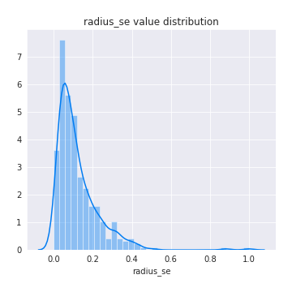
## Feature : texture_se
- **Feature type** : continous
- **Missing** : 0.0%
- **Unique** : 395
- **Count** :424.0
- **Mean** :0.18621796689439835
- **Std** :0.12170721462950457
- **Min** :0.0004199080622347
- **25%th Percentile** : 0.10649089462517676
- **50%th Percentile** : 0.15775282885431396
- **75%th Percentile** : 0.2436682284299858
- **Max** :1.0

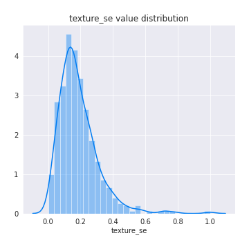
## Feature : perimeter_se
- **Feature type** : continous
- **Missing** : 0.0%
- **Unique** : 405
- **Count** :424.0
- **Mean** :0.11341228010906633
- **Std** :0.1050383866764689
- **Min** :0.0006785091645855
- **25%th Percentile** : 0.04628233520237475
- **50%th Percentile** : 0.08436601799934029
- **75%th Percentile** : 0.14595014842387974
- **Max** :1.0

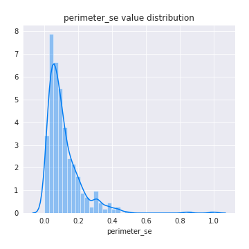
## Feature : area_se
- **Feature type** : continous
- **Missing** : 0.0%
- **Unique** : 402
- **Count** :424.0
- **Mean** :0.07509720153873183
- **Std** :0.09488568010902505
- **Min** :0.0007956697634283
- **25%th Percentile** : 0.023058547099540826
- **50%th Percentile** : 0.04161950548937425
- **75%th Percentile** : 0.09666266964015546
- **Max** :1.0000000000000002

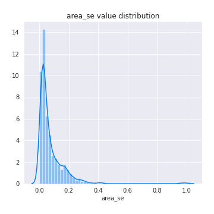
## Feature : smoothness_se
- **Feature type** : continous
- **Missing** : 0.0%
- **Unique** : 416
- **Count** :424.0
- **Mean** :0.17456846926530095
- **Std** :0.09559898479222427
- **Min** :0.0
- **25%th Percentile** : 0.11468708569874561
- **50%th Percentile** : 0.15339769521025254
- **75%th Percentile** : 0.2127341333242682
- **Max** :1.0

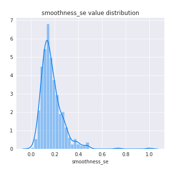
## Feature : compactness_se
- **Feature type** : continous
- **Missing** : 0.0%
- **Unique** : 409
- **Count** :424.0
- **Mean** :0.1850175871820322
- **Std** :0.13768178741832285
- **Min** :0.0
- **25%th Percentile** : 0.08729383843542521
- **50%th Percentile** : 0.15259710998287618
- **75%th Percentile** : 0.2369581217892871
- **Max** :1.0

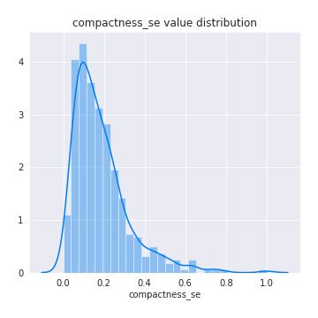
## Feature : concavity_se
- **Feature type** : continous
- **Missing** : 0.0%
- **Unique** : 404
- **Count** :424.0
- **Mean** :0.08525866328378119
- **Std** :0.07005373771405321
- **Min** :0.0
- **25%th Percentile** : 0.042209595959595905
- **50%th Percentile** : 0.07094696969696965
- **75%th Percentile** : 0.11135101010101008
- **Max** :0.7671717171717172

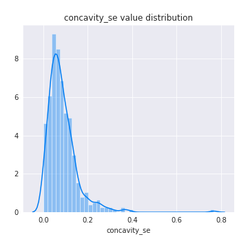
## Feature : concave points_se
- **Feature type** : continous
- **Missing** : 0.0%
- **Unique** : 390
- **Count** :424.0
- **Mean** :0.23294944010979776
- **Std** :0.11565369518307499
- **Min** :0.0
- **25%th Percentile** : 0.15676738018564115
- **50%th Percentile** : 0.21594999052850916
- **75%th Percentile** : 0.2920534192081834
- **Max** :0.7747679484750899

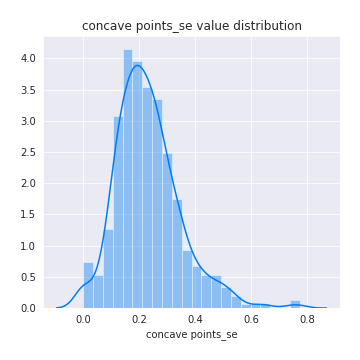
## Feature : symmetry_se
- **Feature type** : continous
- **Missing** : 0.0%
- **Unique** : 386
- **Count** :424.0
- **Mean** :0.1772544976854481
- **Std** :0.12121805629007137
- **Min** :0.0
- **25%th Percentile** : 0.099981707660269
- **50%th Percentile** : 0.1496876231215174
- **75%th Percentile** : 0.21831907468903017
- **Max** :1.0

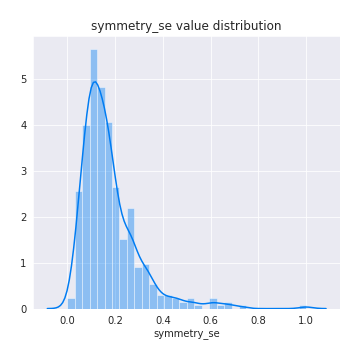
## Feature : fractal_dimension_se
- **Feature type** : continous
- **Missing** : 0.0%
- **Unique** : 414
- **Count** :424.0
- **Mean** :0.10103437328156081
- **Std** :0.08304266644437895
- **Min** :0.0025392811243314
- **25%th Percentile** : 0.04731181681245935
- **50%th Percentile** : 0.0831813219462985
- **75%th Percentile** : 0.12671185550626698
- **Max** :0.7588546632947778

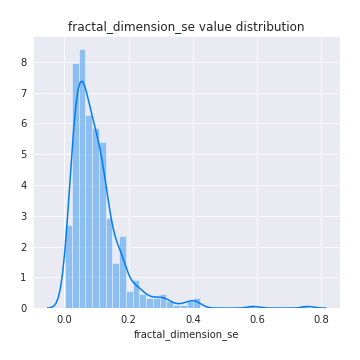
## Feature : radius_worst
- **Feature type** : continous
- **Missing** : 0.0%
- **Unique** : 369
- **Count** :424.0
- **Mean** :0.3338051153487311
- **Std** :0.1804675836639468
- **Min** :0.0
- **25%th Percentile** : 0.20055140519388118
- **50%th Percentile** : 0.29046602632515106
- **75%th Percentile** : 0.45019565990750615
- **Max** :1.0

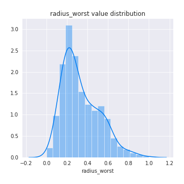
## Feature : texture_worst
- **Feature type** : continous
- **Missing** : 0.0%
- **Unique** : 387
- **Count** :424.0
- **Mean** :0.38415800881039563
- **Std** :0.16236430151813894
- **Min** :0.0125266524520256
- **25%th Percentile** : 0.2665245202558636
- **50%th Percentile** : 0.3736673773987207
- **75%th Percentile** : 0.4927372068230278
- **Max** :1.0

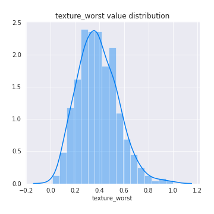
## Feature : perimeter_worst
- **Feature type** : continous
- **Missing** : 0.0%
- **Unique** : 383
- **Count** :424.0
- **Mean** :0.3193531775900288
- **Std** :0.17579431530117706
- **Min** :0.0
- **25%th Percentile** : 0.18340056775735838
- **50%th Percentile** : 0.27835051546391754
- **75%th Percentile** : 0.4359778873449873
- **Max** :1.0

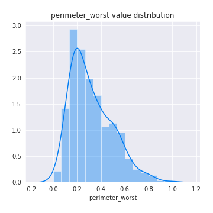
## Feature : area_worst
- **Feature type** : continous
- **Missing** : 0.0%
- **Unique** : 411
- **Count** :424.0
- **Mean** :0.1990099301449038
- **Std** :0.1505154854337121
- **Min** :0.0
- **25%th Percentile** : 0.09245354895792365
- **50%th Percentile** : 0.14773397561934715
- **75%th Percentile** : 0.2746018482107747
- **Max** :1.0

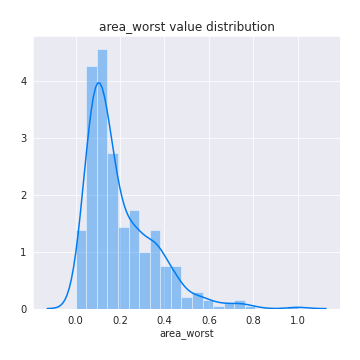
## Feature : smoothness_worst
- **Feature type** : continous
- **Missing** : 0.0%
- **Unique** : 337
- **Count** :424.0
- **Mean** :0.4201114469728208
- **Std** :0.15543498911589743
- **Min** :0.0
- **25%th Percentile** : 0.3176715314006471
- **50%th Percentile** : 0.4165621079046425
- **75%th Percentile** : 0.5194149111800831
- **Max** :1.0

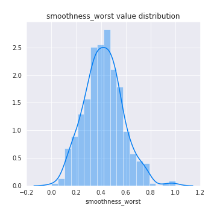
## Feature : compactness_worst
- **Feature type** : continous
- **Missing** : 0.0%
- **Unique** : 399
- **Count** :424.0
- **Mean** :0.24588168569641397
- **Std** :0.16188995642334003
- **Min** :0.0
- **25%th Percentile** : 0.13222438901339853
- **50%th Percentile** : 0.2065663474692202
- **75%th Percentile** : 0.3358946745447313
- **Max** :1.0

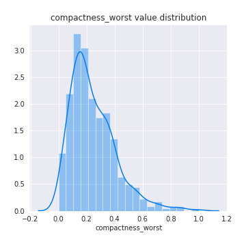
## Feature : concavity_worst
- **Feature type** : continous
- **Missing** : 0.0%
- **Unique** : 404
- **Count** :424.0
- **Mean** :0.24803725925311962
- **Std** :0.17346481229470162
- **Min** :0.0
- **25%th Percentile** : 0.11491613418530347
- **50%th Percentile** : 0.22791533546325876
- **75%th Percentile** : 0.34031549520766774
- **Max** :1.0

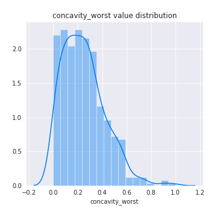
## Feature : concave points_worst
- **Feature type** : continous
- **Missing** : 0.0%
- **Unique** : 381
- **Count** :424.0
- **Mean** :0.44218487810413004
- **Std** :0.2340907203784439
- **Min** :0.0
- **25%th Percentile** : 0.255360824742268
- **50%th Percentile** : 0.42027491408934703
- **75%th Percentile** : 0.6254295532646048
- **Max** :1.0

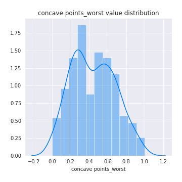
## Feature : symmetry_worst
- **Feature type** : continous
- **Missing** : 0.0%
- **Unique** : 385
- **Count** :424.0
- **Mean** :0.2799862572479536
- **Std** :0.1303945115166377
- **Min** :0.0
- **25%th Percentile** : 0.19909323871476442
- **50%th Percentile** : 0.2590183323477233
- **75%th Percentile** : 0.33101714961561207
- **Max** :1.0

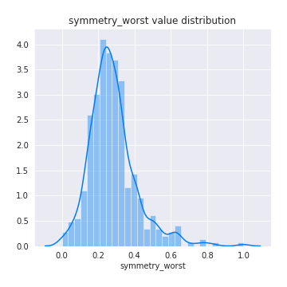
## Feature : fractal_dimension_worst
- **Feature type** : continous
- **Missing** : 0.0%
- **Unique** : 402
- **Count** :424.0
- **Mean** :0.2008175976872373
- **Std** :0.12484067886093198
- **Min** :0.0
- **25%th Percentile** : 0.11317722681359044
- **50%th Percentile** : 0.17299619572346842
- **75%th Percentile** : 0.2666273120818575
- **Max** :1.0

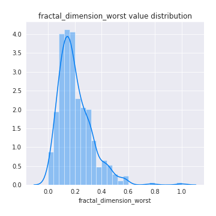

[<< Go back](../README.md)
