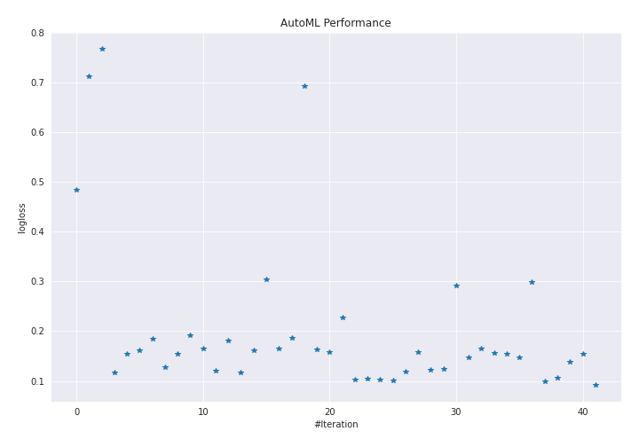
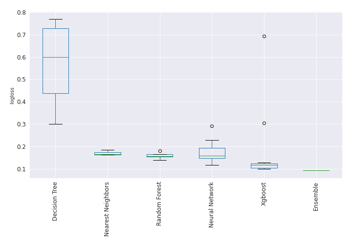

# AutoML Leaderboard

| Best model   | name                                                                                                             | model_type        | metric_type   |   metric_value |   train_time |   single_prediction_time |
|:-------------|:-----------------------------------------------------------------------------------------------------------------|:------------------|:--------------|---------------:|-------------:|-------------------------:|
|              | [1_DecisionTree](1_DecisionTree/README.md)                                                                       | Decision Tree     | logloss       |      0.484484  |        46.59 |                   0.0449 |
|              | [2_DecisionTree](2_DecisionTree/README.md)                                                                       | Decision Tree     | logloss       |      0.712861  |        37    |                   0.0438 |
|              | [3_DecisionTree](3_DecisionTree/README.md)                                                                       | Decision Tree     | logloss       |      0.768366  |        35.11 |                   0.0458 |
|              | [4_Default_Xgboost](4_Default_Xgboost/README.md)                                                                 | Xgboost           | logloss       |      0.11781   |        35.85 |                   0.0453 |
|              | [5_Default_NeuralNetwork](5_Default_NeuralNetwork/README.md)                                                     | Neural Network    | logloss       |      0.153853  |         5.23 |                   0.0476 |
|              | [6_Default_RandomForest](6_Default_RandomForest/README.md)                                                       | Random Forest     | logloss       |      0.162358  |        65.89 |                   0.5597 |
|              | [7_Default_NearestNeighbors](7_Default_NearestNeighbors/README.md)                                               | Nearest Neighbors | logloss       |      0.183977  |        43.3  |                   0.5605 |
|              | [8_Xgboost](8_Xgboost/README.md)                                                                                 | Xgboost           | logloss       |      0.127331  |        35.83 |                   0.0459 |
|              | [12_RandomForest](12_RandomForest/README.md)                                                                     | Random Forest     | logloss       |      0.153674  |        65.5  |                   0.5621 |
|              | [16_NeuralNetwork](16_NeuralNetwork/README.md)                                                                   | Neural Network    | logloss       |      0.192615  |         5.07 |                   0.0518 |
|              | [20_NearestNeighbors](20_NearestNeighbors/README.md)                                                             | Nearest Neighbors | logloss       |      0.164573  |        43.3  |                   0.5605 |
|              | [9_Xgboost](9_Xgboost/README.md)                                                                                 | Xgboost           | logloss       |      0.121356  |        34.89 |                   0.0455 |
|              | [13_RandomForest](13_RandomForest/README.md)                                                                     | Random Forest     | logloss       |      0.180666  |        66.77 |                   0.5712 |
|              | [17_NeuralNetwork](17_NeuralNetwork/README.md)                                                                   | Neural Network    | logloss       |      0.116483  |         5.76 |                   0.0451 |
|              | [21_NearestNeighbors](21_NearestNeighbors/README.md)                                                             | Nearest Neighbors | logloss       |      0.162233  |        43.4  |                   0.5661 |
|              | [10_Xgboost](10_Xgboost/README.md)                                                                               | Xgboost           | logloss       |      0.304066  |        25.91 |                   0.0449 |
|              | [14_RandomForest](14_RandomForest/README.md)                                                                     | Random Forest     | logloss       |      0.16494   |        71.27 |                   0.567  |
|              | [18_NeuralNetwork](18_NeuralNetwork/README.md)                                                                   | Neural Network    | logloss       |      0.186942  |         5.62 |                   0.0455 |
|              | [11_Xgboost](11_Xgboost/README.md)                                                                               | Xgboost           | logloss       |      0.693092  |        22.92 |                   0.0463 |
|              | [15_RandomForest](15_RandomForest/README.md)                                                                     | Random Forest     | logloss       |      0.1642    |        65.98 |                   0.5605 |
|              | [19_NeuralNetwork](19_NeuralNetwork/README.md)                                                                   | Neural Network    | logloss       |      0.158348  |         5.14 |                   0.0447 |
|              | [17_NeuralNetwork_GoldenFeatures](17_NeuralNetwork_GoldenFeatures/README.md)                                     | Neural Network    | logloss       |      0.227222  |        10.37 |                   0.0873 |
|              | [4_Default_Xgboost_GoldenFeatures](4_Default_Xgboost_GoldenFeatures/README.md)                                   | Xgboost           | logloss       |      0.103138  |        40.83 |                   0.0904 |
|              | [9_Xgboost_GoldenFeatures](9_Xgboost_GoldenFeatures/README.md)                                                   | Xgboost           | logloss       |      0.10456   |        35.09 |                   0.0925 |
|              | [4_Default_Xgboost_GoldenFeatures_RandomFeature](4_Default_Xgboost_GoldenFeatures_RandomFeature/README.md)       | Xgboost           | logloss       |      0.103574  |        17.6  |                   0.1065 |
|              | [4_Default_Xgboost_GoldenFeatures_SelectedFeatures](4_Default_Xgboost_GoldenFeatures_SelectedFeatures/README.md) | Xgboost           | logloss       |      0.10103   |        25.85 |                   0.0785 |
|              | [17_NeuralNetwork_SelectedFeatures](17_NeuralNetwork_SelectedFeatures/README.md)                                 | Neural Network    | logloss       |      0.118937  |         3.91 |                   0.0401 |
|              | [12_RandomForest_SelectedFeatures](12_RandomForest_SelectedFeatures/README.md)                                   | Random Forest     | logloss       |      0.158404  |        44.22 |                   0.554  |
|              | [22_Xgboost_GoldenFeatures_SelectedFeatures](22_Xgboost_GoldenFeatures_SelectedFeatures/README.md)               | Xgboost           | logloss       |      0.12165   |        30.36 |                   0.0783 |
|              | [23_Xgboost_GoldenFeatures](23_Xgboost_GoldenFeatures/README.md)                                                 | Xgboost           | logloss       |      0.123798  |        36.06 |                   0.0839 |
|              | [24_NeuralNetwork](24_NeuralNetwork/README.md)                                                                   | Neural Network    | logloss       |      0.29192   |         5.04 |                   0.0456 |
|              | [25_NeuralNetwork_SelectedFeatures](25_NeuralNetwork_SelectedFeatures/README.md)                                 | Neural Network    | logloss       |      0.14786   |         3.58 |                   0.0414 |
|              | [26_RandomForest](26_RandomForest/README.md)                                                                     | Random Forest     | logloss       |      0.165321  |        66.61 |                   0.5593 |
|              | [27_RandomForest](27_RandomForest/README.md)                                                                     | Random Forest     | logloss       |      0.155485  |        65.45 |                   0.5585 |
|              | [28_RandomForest_SelectedFeatures](28_RandomForest_SelectedFeatures/README.md)                                   | Random Forest     | logloss       |      0.154705  |        43.04 |                   0.5545 |
|              | [29_RandomForest_SelectedFeatures](29_RandomForest_SelectedFeatures/README.md)                                   | Random Forest     | logloss       |      0.147845  |        46.72 |                   0.5541 |
|              | [30_DecisionTree](30_DecisionTree/README.md)                                                                     | Decision Tree     | logloss       |      0.299593  |        31.37 |                   0.0505 |
|              | [31_Xgboost_GoldenFeatures_SelectedFeatures](31_Xgboost_GoldenFeatures_SelectedFeatures/README.md)               | Xgboost           | logloss       |      0.0998585 |        29.13 |                   0.0758 |
|              | [32_Xgboost_GoldenFeatures](32_Xgboost_GoldenFeatures/README.md)                                                 | Xgboost           | logloss       |      0.106113  |        32.5  |                   0.0929 |
|              | [33_RandomForest_SelectedFeatures](33_RandomForest_SelectedFeatures/README.md)                                   | Random Forest     | logloss       |      0.138866  |        43.19 |                   0.5541 |
|              | [34_RandomForest](34_RandomForest/README.md)                                                                     | Random Forest     | logloss       |      0.153889  |        67.42 |                   0.582  |
| **the best** | [Ensemble](Ensemble/README.md)                                                                                   | Ensemble          | logloss       |      0.0918982 |         5    |                   0.1931 |

### AutoML Performance

### AutoML Performance Boxplot
