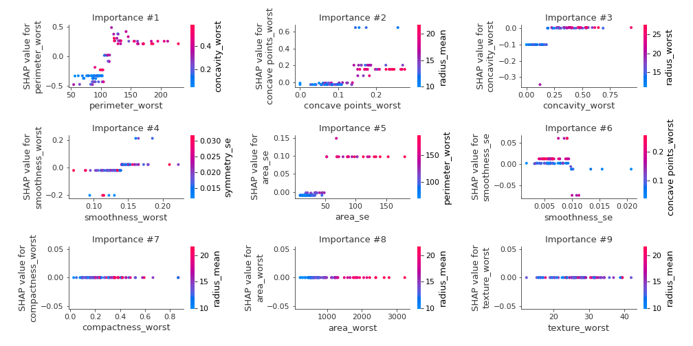
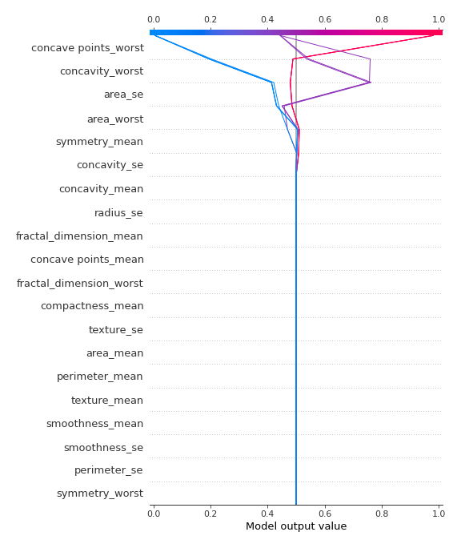

# Summary of 1_DecisionTree

[<< Go back](../README.md)

## Decision Tree
- **n_jobs**: -1
- **criterion**: gini
- **max_depth**: 3
- **explain_level**: 2

## Validation
 - **validation_type**: kfold
 - **k_folds**: 5
 - **shuffle**: True
 - **stratify**: True
 - **random_seed**: 1230

## Optimized metric
logloss

## Training time

33.3 seconds

## Metric details
|           |    score |   threshold |
|:----------|---------:|------------:|
| logloss   | 0.41638  |  nan        |
| auc       | 0.943496 |  nan        |
| f1        | 0.933333 |    0.496579 |
| accuracy  | 0.933962 |    0.496579 |
| precision | 0.949367 |    0.990066 |
| recall    | 0.985849 |    0        |
| mcc       | 0.868079 |    0.496579 |

## Confusion matrix (at threshold=0.496579)
|                     |   Predicted as negative |   Predicted as positive |
|:--------------------|------------------------:|------------------------:|
| Labeled as negative |                     200 |                      12 |
| Labeled as positive |                      16 |                     196 |

## Learning curves

## Decision Tree 

### Tree #1

### Rules

if (perimeter_worst <= 105.95) and (concave points_worst <= 0.134) and (area_se <= 48.975) then class: 0 (proba: 99.34%) | based on 152 samples

if (perimeter_worst > 105.95) and (concave points_mean > 0.049) and (area_se > 16.195) then class: 1 (proba: 98.0%) | based on 150 samples

if (perimeter_worst > 105.95) and (concave points_mean <= 0.049) and (concave points_se <= 0.01) then class: 1 (proba: 83.33%) | based on 12 samples

if (perimeter_worst > 105.95) and (concave points_mean <= 0.049) and (concave points_se > 0.01) then class: 0 (proba: 100.0%) | based on 8 samples

if (perimeter_worst <= 105.95) and (concave points_worst > 0.134) and (symmetry_worst > 0.285) then class: 1 (proba: 100.0%) | based on 8 samples

if (perimeter_worst <= 105.95) and (concave points_worst > 0.134) and (symmetry_worst <= 0.285) then class: 0 (proba: 60.0%) | based on 5 samples

if (perimeter_worst <= 105.95) and (concave points_worst <= 0.134) and (area_se > 48.975) then class: 1 (proba: 66.67%) | based on 3 samples

if (perimeter_worst > 105.95) and (concave points_mean > 0.049) and (area_se <= 16.195) then class: 0 (proba: 100.0%) | based on 1 samples

### Tree #2

### Rules

if (perimeter_worst <= 103.25) and (smoothness_worst <= 0.178) and (perimeter_se <= 4.118) then class: 0 (proba: 98.03%) | based on 152 samples

if (perimeter_worst > 103.25) and (area_worst > 868.2) and (symmetry_se > 0.01) then class: 1 (proba: 98.63%) | based on 146 samples

if (perimeter_worst > 103.25) and (area_worst <= 868.2) and (smoothness_worst <= 0.14) then class: 0 (proba: 83.33%) | based on 18 samples

if (perimeter_worst > 103.25) and (area_worst <= 868.2) and (smoothness_worst > 0.14) then class: 1 (proba: 93.75%) | based on 16 samples

if (perimeter_worst <= 103.25) and (smoothness_worst > 0.178) then class: 1 (proba: 100.0%) | based on 3 samples

if (perimeter_worst <= 103.25) and (smoothness_worst <= 0.178) and (perimeter_se > 4.118) then class: 1 (proba: 66.67%) | based on 3 samples

if (perimeter_worst > 103.25) and (area_worst > 868.2) and (symmetry_se <= 0.01) then class: 0 (proba: 100.0%) | based on 1 samples

### Tree #3

### Rules

if (perimeter_worst <= 104.9) and (concave points_worst <= 0.142) and (area_se <= 48.975) then class: 0 (proba: 98.68%) | based on 152 samples

if (perimeter_worst > 104.9) and (perimeter_worst > 115.35) and (concavity_worst > 0.18) then class: 1 (proba: 100.0%) | based on 136 samples

if (perimeter_worst > 104.9) and (perimeter_worst <= 115.35) and (smoothness_worst <= 0.14) then class: 0 (proba: 80.0%) | based on 20 samples

if (perimeter_worst > 104.9) and (perimeter_worst <= 115.35) and (smoothness_worst > 0.14) then class: 1 (proba: 94.74%) | based on 19 samples

if (perimeter_worst <= 104.9) and (concave points_worst > 0.142) and (smoothness_se <= 0.01) then class: 1 (proba: 100.0%) | based on 6 samples

if (perimeter_worst <= 104.9) and (concave points_worst <= 0.142) and (area_se > 48.975) then class: 1 (proba: 66.67%) | based on 3 samples

if (perimeter_worst > 104.9) and (perimeter_worst > 115.35) and (concavity_worst <= 0.18) then class: 0 (proba: 50.0%) | based on 2 samples

if (perimeter_worst <= 104.9) and (concave points_worst > 0.142) and (smoothness_se > 0.01) then class: 0 (proba: 100.0%) | based on 1 samples

### Tree #4

### Rules

if (perimeter_worst <= 102.4) and (concave points_worst <= 0.133) and (texture_worst <= 33.105) then class: 0 (proba: 100.0%) | based on 142 samples

if (perimeter_worst > 102.4) and (perimeter_worst > 115.45) then class: 1 (proba: 100.0%) | based on 136 samples

if (perimeter_worst > 102.4) and (perimeter_worst <= 115.45) and (smoothness_worst <= 0.137) then class: 0 (proba: 72.73%) | based on 22 samples

if (perimeter_worst > 102.4) and (perimeter_worst <= 115.45) and (smoothness_worst > 0.137) then class: 1 (proba: 95.0%) | based on 20 samples

if (perimeter_worst <= 102.4) and (concave points_worst <= 0.133) and (texture_worst > 33.105) then class: 0 (proba: 88.89%) | based on 9 samples

if (perimeter_worst <= 102.4) and (concave points_worst > 0.133) and (perimeter_mean > 71.815) then class: 1 (proba: 87.5%) | based on 8 samples

if (perimeter_worst <= 102.4) and (concave points_worst > 0.133) and (perimeter_mean <= 71.815) then class: 0 (proba: 100.0%) | based on 2 samples

### Tree #5

### Rules

if (concave points_worst <= 0.136) and (area_worst <= 929.8) and (area_se <= 35.71) then class: 0 (proba: 99.36%) | based on 157 samples

if (concave points_worst > 0.136) and (concavity_se <= 0.136) and (concavity_worst > 0.211) then class: 1 (proba: 98.01%) | based on 151 samples

if (concave points_worst <= 0.136) and (area_worst > 929.8) and (symmetry_mean > 0.151) then class: 1 (proba: 100.0%) | based on 17 samples

if (concave points_worst <= 0.136) and (area_worst <= 929.8) and (area_se > 35.71) then class: 0 (proba: 55.56%) | based on 9 samples

if (concave points_worst > 0.136) and (concavity_se > 0.136) then class: 0 (proba: 100.0%) | based on 2 samples

if (concave points_worst > 0.136) and (concavity_se <= 0.136) and (concavity_worst <= 0.211) then class: 0 (proba: 100.0%) | based on 2 samples

if (concave points_worst <= 0.136) and (area_worst > 929.8) and (symmetry_mean <= 0.151) then class: 0 (proba: 100.0%) | based on 2 samples

## Permutation-based Importance

## SHAP Importance

## SHAP Dependence plots

### Dependence (Fold 1)

### Dependence (Fold 2)

### Dependence (Fold 3)

### Dependence (Fold 4)

### Dependence (Fold 5)

## SHAP Decision plots

### Top-10 Worst decisions for class 0 (Fold 1)

### Top-10 Worst decisions for class 0 (Fold 2)

### Top-10 Worst decisions for class 0 (Fold 3)

### Top-10 Worst decisions for class 0 (Fold 4)

### Top-10 Worst decisions for class 0 (Fold 5)

### Top-10 Best decisions for class 0 (Fold 1)

### Top-10 Best decisions for class 0 (Fold 2)

### Top-10 Best decisions for class 0 (Fold 3)

### Top-10 Best decisions for class 0 (Fold 4)

### Top-10 Best decisions for class 0 (Fold 5)

### Top-10 Worst decisions for class 1 (Fold 1)

### Top-10 Worst decisions for class 1 (Fold 2)

### Top-10 Worst decisions for class 1 (Fold 3)

### Top-10 Worst decisions for class 1 (Fold 4)

### Top-10 Worst decisions for class 1 (Fold 5)

### Top-10 Best decisions for class 1 (Fold 1)

### Top-10 Best decisions for class 1 (Fold 2)

### Top-10 Best decisions for class 1 (Fold 3)

### Top-10 Best decisions for class 1 (Fold 4)

### Top-10 Best decisions for class 1 (Fold 5)

[<< Go back](../README.md)
