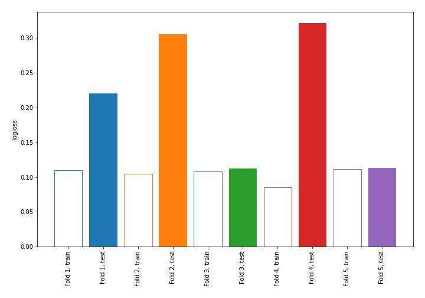
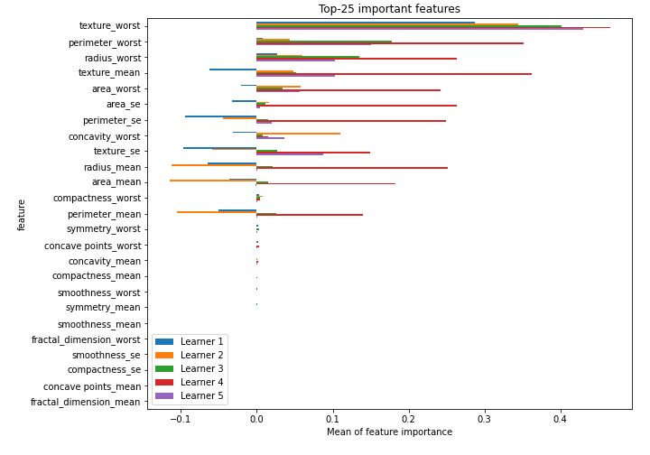

# Summary of 20_NearestNeighbors

[<< Go back](../README.md)

## k-Nearest Neighbors (Nearest Neighbors)
- **n_jobs**: -1
- **n_neighbors**: 7
- **weights**: uniform
- **explain_level**: 2

## Validation
 - **validation_type**: kfold
 - **k_folds**: 5
 - **shuffle**: True
 - **stratify**: True
 - **random_seed**: 1230

## Optimized metric
logloss

## Training time

42.7 seconds

## Metric details
|           |    score |   threshold |
|:----------|---------:|------------:|
| logloss   | 0.214782 |       nan   |
| auc       | 0.981989 |       nan   |
| f1        | 0.942584 |         0.5 |
| accuracy  | 0.943396 |         0.5 |
| precision | 0.956311 |         0.5 |
| recall    | 0.985849 |         0   |
| mcc       | 0.887148 |         0.5 |

## Confusion matrix (at threshold=0.5)
|                     |   Predicted as negative |   Predicted as positive |
|:--------------------|------------------------:|------------------------:|
| Labeled as negative |                     203 |                       9 |
| Labeled as positive |                      15 |                     197 |

## Learning curves

## Permutation-based Importance

[<< Go back](../README.md)
