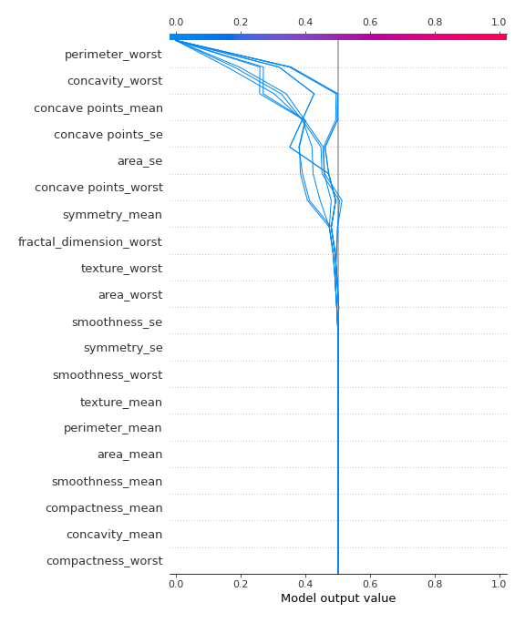
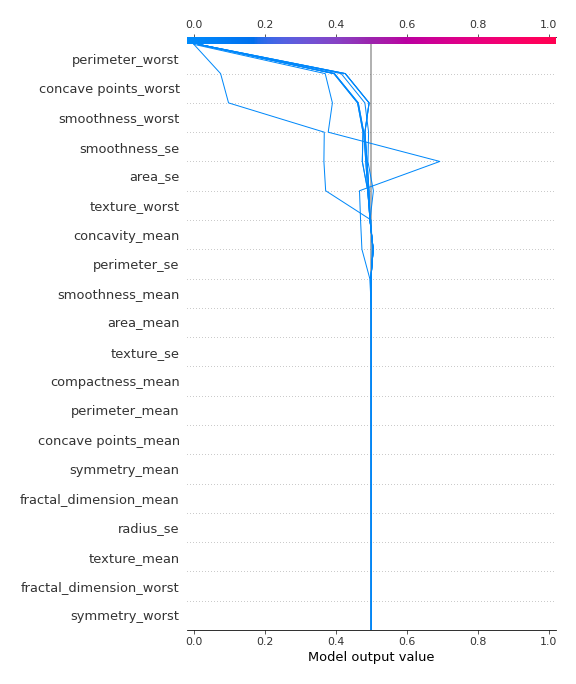
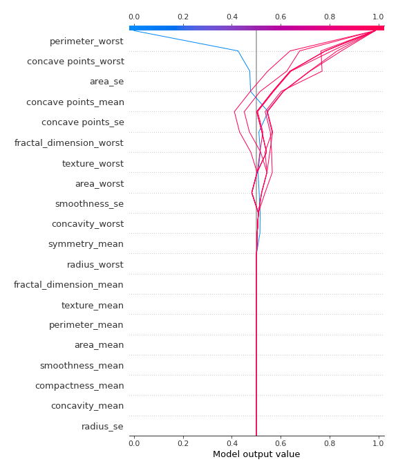

# Summary of 2_DecisionTree

[<< Go back](../README.md)

## Decision Tree
- **n_jobs**: -1
- **criterion**: gini
- **max_depth**: 4
- **explain_level**: 2

## Validation
 - **validation_type**: kfold
 - **k_folds**: 5
 - **shuffle**: True
 - **stratify**: True
 - **random_seed**: 1230

## Optimized metric
logloss

## Training time

33.6 seconds

## Metric details
|           |    score |   threshold |
|:----------|---------:|------------:|
| logloss   | 0.614453 |       nan   |
| auc       | 0.941182 |       nan   |
| f1        | 0.929577 |         0.5 |
| accuracy  | 0.929245 |         0.5 |
| precision | 0.925234 |         0.5 |
| recall    | 0.976415 |         0   |
| mcc       | 0.858529 |         0.5 |

## Confusion matrix (at threshold=0.5)
|                     |   Predicted as negative |   Predicted as positive |
|:--------------------|------------------------:|------------------------:|
| Labeled as negative |                     196 |                      16 |
| Labeled as positive |                      14 |                     198 |

## Learning curves

## Decision Tree 

### Tree #1

### Rules

if (perimeter_worst > 105.95) and (concave points_mean > 0.049) and (area_se > 16.195) and (concavity_worst > 0.189) then class: 1 (proba: 98.66%) | based on 149 samples

if (perimeter_worst <= 105.95) and (concave points_worst <= 0.134) and (area_se <= 48.975) and (area_worst <= 785.75) then class: 0 (proba: 100.0%) | based on 147 samples

if (perimeter_worst > 105.95) and (concave points_mean <= 0.049) and (concave points_se <= 0.01) and (symmetry_mean > 0.151) then class: 1 (proba: 100.0%) | based on 10 samples

if (perimeter_worst > 105.95) and (concave points_mean <= 0.049) and (concave points_se > 0.01) then class: 0 (proba: 100.0%) | based on 8 samples

if (perimeter_worst <= 105.95) and (concave points_worst > 0.134) and (fractal_dimension_worst > 0.096) then class: 1 (proba: 100.0%) | based on 8 samples

if (perimeter_worst <= 105.95) and (concave points_worst <= 0.134) and (area_se <= 48.975) and (area_worst > 785.75) then class: 0 (proba: 80.0%) | based on 5 samples

if (perimeter_worst <= 105.95) and (concave points_worst > 0.134) and (fractal_dimension_worst <= 0.096) and (texture_worst <= 29.29) then class: 0 (proba: 100.0%) | based on 3 samples

if (perimeter_worst > 105.95) and (concave points_mean <= 0.049) and (concave points_se <= 0.01) and (symmetry_mean <= 0.151) then class: 0 (proba: 100.0%) | based on 2 samples

if (perimeter_worst <= 105.95) and (concave points_worst > 0.134) and (fractal_dimension_worst <= 0.096) and (texture_worst > 29.29) then class: 1 (proba: 100.0%) | based on 2 samples

if (perimeter_worst <= 105.95) and (concave points_worst <= 0.134) and (area_se > 48.975) and (smoothness_se <= 0.007) then class: 1 (proba: 100.0%) | based on 2 samples

if (perimeter_worst > 105.95) and (concave points_mean > 0.049) and (area_se > 16.195) and (concavity_worst <= 0.189) then class: 0 (proba: 100.0%) | based on 1 samples

if (perimeter_worst > 105.95) and (concave points_mean > 0.049) and (area_se <= 16.195) then class: 0 (proba: 100.0%) | based on 1 samples

if (perimeter_worst <= 105.95) and (concave points_worst <= 0.134) and (area_se > 48.975) and (smoothness_se > 0.007) then class: 0 (proba: 100.0%) | based on 1 samples

### Tree #2

### Rules

if (perimeter_worst <= 103.25) and (compactness_worst <= 0.439) and (perimeter_se <= 4.118) and (area_worst <= 785.0) then class: 0 (proba: 98.68%) | based on 151 samples

if (perimeter_worst > 103.25) and (area_worst > 868.2) and (symmetry_se > 0.01) and (concavity_worst > 0.182) then class: 1 (proba: 100.0%) | based on 141 samples

if (perimeter_worst > 103.25) and (area_worst <= 868.2) and (smoothness_worst > 0.14) and (area_mean <= 694.85) then class: 1 (proba: 100.0%) | based on 15 samples

if (perimeter_worst > 103.25) and (area_worst <= 868.2) and (smoothness_worst <= 0.14) and (concavity_mean <= 0.107) then class: 0 (proba: 100.0%) | based on 14 samples

if (perimeter_worst > 103.25) and (area_worst > 868.2) and (symmetry_se > 0.01) and (concavity_worst <= 0.182) then class: 1 (proba: 60.0%) | based on 5 samples

if (perimeter_worst > 103.25) and (area_worst <= 868.2) and (smoothness_worst <= 0.14) and (concavity_mean > 0.107) then class: 1 (proba: 75.0%) | based on 4 samples

if (perimeter_worst <= 103.25) and (compactness_worst > 0.439) then class: 1 (proba: 100.0%) | based on 3 samples

if (perimeter_worst <= 103.25) and (compactness_worst <= 0.439) and (perimeter_se > 4.118) and (smoothness_se <= 0.007) then class: 1 (proba: 100.0%) | based on 2 samples

if (perimeter_worst > 103.25) and (area_worst > 868.2) and (symmetry_se <= 0.01) then class: 0 (proba: 100.0%) | based on 1 samples

if (perimeter_worst > 103.25) and (area_worst <= 868.2) and (smoothness_worst > 0.14) and (area_mean > 694.85) then class: 0 (proba: 100.0%) | based on 1 samples

if (perimeter_worst <= 103.25) and (compactness_worst <= 0.439) and (perimeter_se > 4.118) and (smoothness_se > 0.007) then class: 0 (proba: 100.0%) | based on 1 samples

if (perimeter_worst <= 103.25) and (compactness_worst <= 0.439) and (perimeter_se <= 4.118) and (area_worst > 785.0) then class: 1 (proba: 100.0%) | based on 1 samples

### Tree #3

### Rules

if (perimeter_worst <= 104.9) and (concave points_worst <= 0.142) and (area_se <= 48.975) and (smoothness_se > 0.003) then class: 0 (proba: 99.33%) | based on 149 samples

if (perimeter_worst > 104.9) and (perimeter_worst > 115.35) and (concavity_worst > 0.18) then class: 1 (proba: 100.0%) | based on 136 samples

if (perimeter_worst > 104.9) and (perimeter_worst <= 115.35) and (smoothness_worst > 0.14) and (area_se > 14.18) then class: 1 (proba: 100.0%) | based on 18 samples

if (perimeter_worst > 104.9) and (perimeter_worst <= 115.35) and (smoothness_worst <= 0.14) and (fractal_dimension_worst > 0.07) then class: 0 (proba: 94.12%) | based on 17 samples

if (perimeter_worst <= 104.9) and (concave points_worst > 0.142) and (texture_se <= 2.132) then class: 1 (proba: 100.0%) | based on 6 samples

if (perimeter_worst > 104.9) and (perimeter_worst <= 115.35) and (smoothness_worst <= 0.14) and (fractal_dimension_worst <= 0.07) then class: 1 (proba: 100.0%) | based on 3 samples

if (perimeter_worst <= 104.9) and (concave points_worst <= 0.142) and (area_se <= 48.975) and (smoothness_se <= 0.003) then class: 0 (proba: 66.67%) | based on 3 samples

if (perimeter_worst <= 104.9) and (concave points_worst <= 0.142) and (area_se > 48.975) and (smoothness_se <= 0.007) then class: 1 (proba: 100.0%) | based on 2 samples

if (perimeter_worst > 104.9) and (perimeter_worst > 115.35) and (concavity_worst <= 0.18) and (compactness_mean > 0.076) then class: 0 (proba: 100.0%) | based on 1 samples

if (perimeter_worst > 104.9) and (perimeter_worst > 115.35) and (concavity_worst <= 0.18) and (compactness_mean <= 0.076) then class: 1 (proba: 100.0%) | based on 1 samples

if (perimeter_worst > 104.9) and (perimeter_worst <= 115.35) and (smoothness_worst > 0.14) and (area_se <= 14.18) then class: 0 (proba: 100.0%) | based on 1 samples

if (perimeter_worst <= 104.9) and (concave points_worst > 0.142) and (texture_se > 2.132) then class: 0 (proba: 100.0%) | based on 1 samples

if (perimeter_worst <= 104.9) and (concave points_worst <= 0.142) and (area_se > 48.975) and (smoothness_se > 0.007) then class: 0 (proba: 100.0%) | based on 1 samples

### Tree #4

### Rules

if (perimeter_worst <= 102.4) and (concave points_worst <= 0.133) and (texture_worst <= 33.105) then class: 0 (proba: 100.0%) | based on 142 samples

if (perimeter_worst > 102.4) and (perimeter_worst > 115.45) then class: 1 (proba: 100.0%) | based on 136 samples

if (perimeter_worst > 102.4) and (perimeter_worst <= 115.45) and (smoothness_worst > 0.137) and (area_se > 14.18) then class: 1 (proba: 100.0%) | based on 19 samples

if (perimeter_worst > 102.4) and (perimeter_worst <= 115.45) and (smoothness_worst <= 0.137) and (texture_worst <= 27.04) then class: 0 (proba: 100.0%) | based on 14 samples

if (perimeter_worst > 102.4) and (perimeter_worst <= 115.45) and (smoothness_worst <= 0.137) and (texture_worst > 27.04) then class: 1 (proba: 75.0%) | based on 8 samples

if (perimeter_worst <= 102.4) and (concave points_worst <= 0.133) and (texture_worst > 33.105) and (smoothness_worst <= 0.141) then class: 0 (proba: 100.0%) | based on 8 samples

if (perimeter_worst <= 102.4) and (concave points_worst > 0.133) and (texture_worst > 25.94) and (concave points_mean > 0.041) then class: 1 (proba: 100.0%) | based on 7 samples

if (perimeter_worst <= 102.4) and (concave points_worst > 0.133) and (texture_worst <= 25.94) then class: 0 (proba: 100.0%) | based on 2 samples

if (perimeter_worst > 102.4) and (perimeter_worst <= 115.45) and (smoothness_worst > 0.137) and (area_se <= 14.18) then class: 0 (proba: 100.0%) | based on 1 samples

if (perimeter_worst <= 102.4) and (concave points_worst > 0.133) and (texture_worst > 25.94) and (concave points_mean <= 0.041) then class: 0 (proba: 100.0%) | based on 1 samples

if (perimeter_worst <= 102.4) and (concave points_worst <= 0.133) and (texture_worst > 33.105) and (smoothness_worst > 0.141) then class: 1 (proba: 100.0%) | based on 1 samples

### Tree #5

### Rules

if (perimeter_worst <= 110.25) and (concave points_worst <= 0.142) and (area_se <= 45.17) and (concavity_mean <= 0.117) then class: 0 (proba: 98.76%) | based on 161 samples

if (perimeter_worst > 110.25) and (perimeter_worst > 117.45) then class: 1 (proba: 100.0%) | based on 132 samples

if (perimeter_worst <= 110.25) and (concave points_worst > 0.142) and (perimeter_se <= 2.724) then class: 1 (proba: 100.0%) | based on 14 samples

if (perimeter_worst > 110.25) and (perimeter_worst <= 117.45) and (smoothness_worst > 0.135) then class: 1 (proba: 100.0%) | based on 13 samples

if (perimeter_worst > 110.25) and (perimeter_worst <= 117.45) and (smoothness_worst <= 0.135) and (texture_worst <= 26.58) then class: 0 (proba: 100.0%) | based on 6 samples

if (perimeter_worst > 110.25) and (perimeter_worst <= 117.45) and (smoothness_worst <= 0.135) and (texture_worst > 26.58) then class: 1 (proba: 75.0%) | based on 4 samples

if (perimeter_worst <= 110.25) and (concave points_worst > 0.142) and (perimeter_se > 2.724) and (smoothness_mean <= 0.125) then class: 0 (proba: 100.0%) | based on 3 samples

if (perimeter_worst <= 110.25) and (concave points_worst <= 0.142) and (area_se > 45.17) and (smoothness_se <= 0.007) then class: 1 (proba: 100.0%) | based on 3 samples

if (perimeter_worst <= 110.25) and (concave points_worst <= 0.142) and (area_se <= 45.17) and (concavity_mean > 0.117) then class: 1 (proba: 100.0%) | based on 2 samples

if (perimeter_worst <= 110.25) and (concave points_worst > 0.142) and (perimeter_se > 2.724) and (smoothness_mean > 0.125) then class: 1 (proba: 100.0%) | based on 1 samples

if (perimeter_worst <= 110.25) and (concave points_worst <= 0.142) and (area_se > 45.17) and (smoothness_se > 0.007) then class: 0 (proba: 100.0%) | based on 1 samples

## Permutation-based Importance

## SHAP Importance

## SHAP Dependence plots

### Dependence (Fold 1)

### Dependence (Fold 2)

### Dependence (Fold 3)

### Dependence (Fold 4)

### Dependence (Fold 5)

## SHAP Decision plots

### Top-10 Worst decisions for class 0 (Fold 1)

### Top-10 Worst decisions for class 0 (Fold 2)

### Top-10 Worst decisions for class 0 (Fold 3)

### Top-10 Worst decisions for class 0 (Fold 4)

### Top-10 Worst decisions for class 0 (Fold 5)

### Top-10 Best decisions for class 0 (Fold 1)

### Top-10 Best decisions for class 0 (Fold 2)

### Top-10 Best decisions for class 0 (Fold 3)

### Top-10 Best decisions for class 0 (Fold 4)

### Top-10 Best decisions for class 0 (Fold 5)

### Top-10 Worst decisions for class 1 (Fold 1)

### Top-10 Worst decisions for class 1 (Fold 2)

### Top-10 Worst decisions for class 1 (Fold 3)

### Top-10 Worst decisions for class 1 (Fold 4)

### Top-10 Worst decisions for class 1 (Fold 5)

### Top-10 Best decisions for class 1 (Fold 1)

### Top-10 Best decisions for class 1 (Fold 2)

### Top-10 Best decisions for class 1 (Fold 3)

### Top-10 Best decisions for class 1 (Fold 4)

### Top-10 Best decisions for class 1 (Fold 5)

[<< Go back](../README.md)
