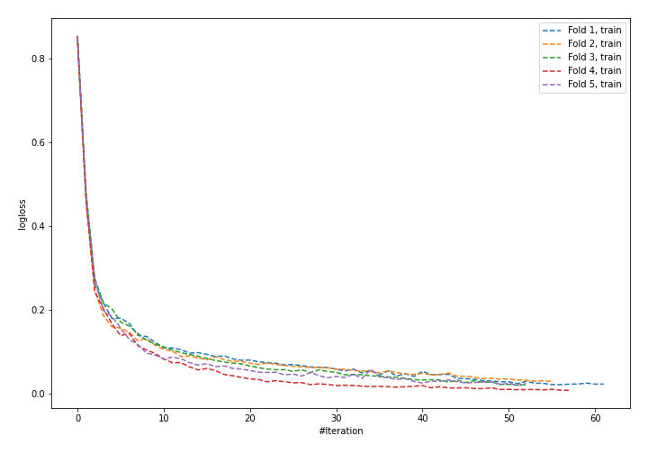
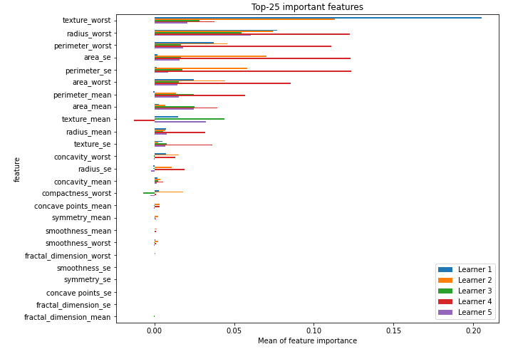

# Summary of 30_NeuralNetwork

[<< Go back](../README.md)

## Neural Network
- **n_jobs**: -1
- **dense_1_size**: 16
- **dense_2_size**: 4
- **learning_rate**: 0.05
- **explain_level**: 2

## Validation
 - **validation_type**: kfold
 - **k_folds**: 5
 - **shuffle**: True
 - **stratify**: True
 - **random_seed**: 1230

## Optimized metric
logloss

## Training time

4.4 seconds

## Metric details
|           |    score |     threshold |
|:----------|---------:|--------------:|
| logloss   | 0.233393 | nan           |
| auc       | 0.971654 | nan           |
| f1        | 0.929245 |   0.457142    |
| accuracy  | 0.929245 |   0.501826    |
| precision | 1        |   0.999349    |
| recall    | 1        |   0.000109419 |
| mcc       | 0.858835 |   0.501826    |

## Confusion matrix (at threshold=0.501826)
|                     |   Predicted as negative |   Predicted as positive |
|:--------------------|------------------------:|------------------------:|
| Labeled as negative |                     200 |                      12 |
| Labeled as positive |                      18 |                     194 |

## Learning curves

## Permutation-based Importance

[<< Go back](../README.md)
