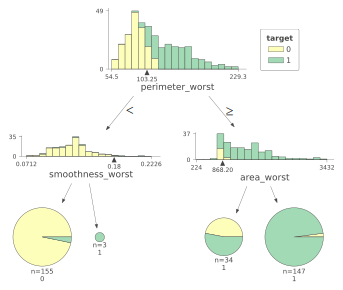
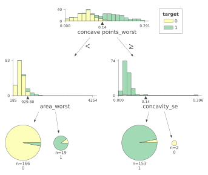
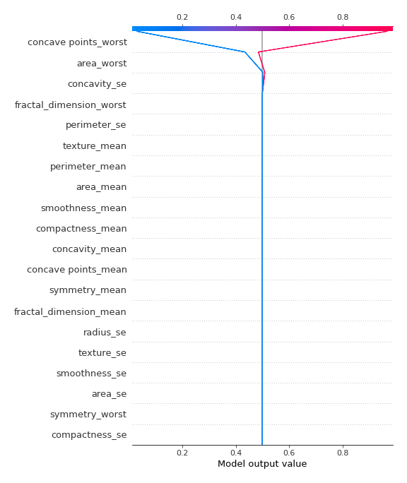
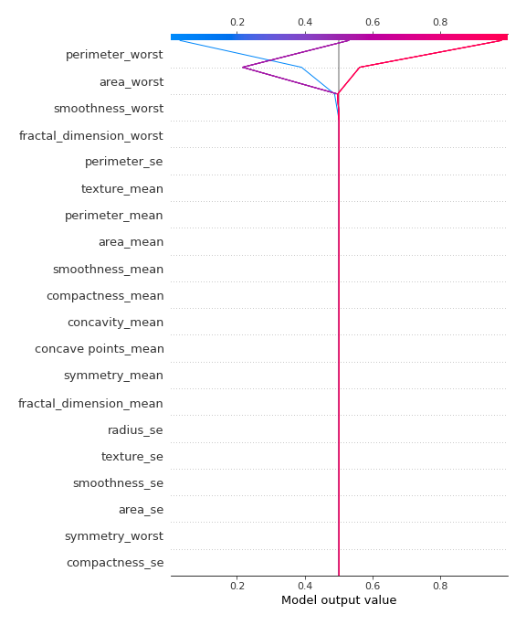
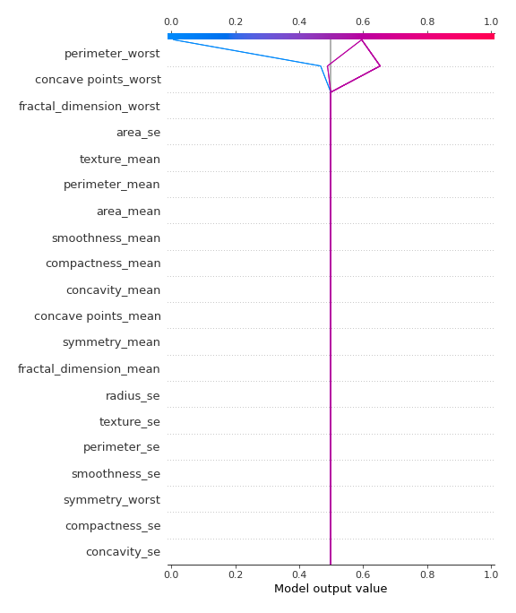
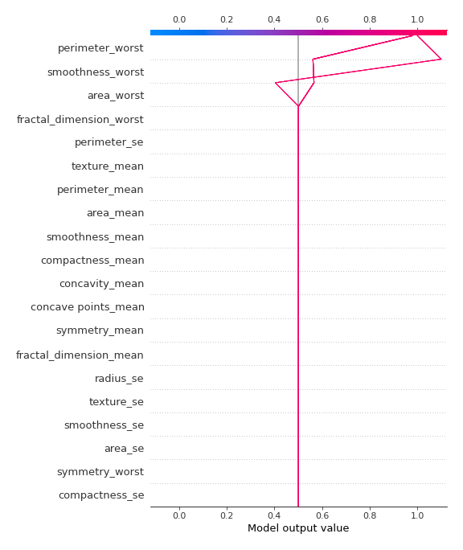

# Summary of 32_DecisionTree

[<< Go back](../README.md)

## Decision Tree
- **n_jobs**: -1
- **criterion**: gini
- **max_depth**: 2
- **explain_level**: 2

## Validation
 - **validation_type**: kfold
 - **k_folds**: 5
 - **shuffle**: True
 - **stratify**: True
 - **random_seed**: 1230

## Optimized metric
logloss

## Training time

24.8 seconds

## Metric details
|           |    score |    threshold |
|:----------|---------:|-------------:|
| logloss   | 0.304089 | nan          |
| auc       | 0.948213 | nan          |
| f1        | 0.920635 |   0.499658   |
| accuracy  | 0.917453 |   0.499658   |
| precision | 0.971429 |   0.98366    |
| recall    | 1        |   0.00596026 |
| mcc       | 0.837603 |   0.499658   |

## Confusion matrix (at threshold=0.499658)
|                     |   Predicted as negative |   Predicted as positive |
|:--------------------|------------------------:|------------------------:|
| Labeled as negative |                     186 |                      26 |
| Labeled as positive |                       9 |                     203 |

## Learning curves

## Decision Tree 

### Tree #1

### Rules

if (perimeter_worst <= 105.95) and (concave points_worst <= 0.134) then class: 0 (proba: 98.06%) | based on 155 samples

if (perimeter_worst > 105.95) and (concave points_mean > 0.049) then class: 1 (proba: 97.35%) | based on 151 samples

if (perimeter_worst > 105.95) and (concave points_mean <= 0.049) then class: 0 (proba: 50.0%) | based on 20 samples

if (perimeter_worst <= 105.95) and (concave points_worst > 0.134) then class: 1 (proba: 76.92%) | based on 13 samples

### Tree #2

### Rules

if (perimeter_worst <= 103.25) and (smoothness_worst <= 0.178) then class: 0 (proba: 96.77%) | based on 155 samples

if (perimeter_worst > 103.25) and (area_worst > 868.2) then class: 1 (proba: 97.96%) | based on 147 samples

if (perimeter_worst > 103.25) and (area_worst <= 868.2) then class: 1 (proba: 52.94%) | based on 34 samples

if (perimeter_worst <= 103.25) and (smoothness_worst > 0.178) then class: 1 (proba: 100.0%) | based on 3 samples

### Tree #3

### Rules

if (perimeter_worst <= 104.9) and (concave points_worst <= 0.142) then class: 0 (proba: 97.42%) | based on 155 samples

if (perimeter_worst > 104.9) and (perimeter_worst > 115.35) then class: 1 (proba: 99.28%) | based on 138 samples

if (perimeter_worst > 104.9) and (perimeter_worst <= 115.35) then class: 1 (proba: 56.41%) | based on 39 samples

if (perimeter_worst <= 104.9) and (concave points_worst > 0.142) then class: 1 (proba: 85.71%) | based on 7 samples

### Tree #4

### Rules

if (perimeter_worst <= 102.4) and (concave points_worst <= 0.133) then class: 0 (proba: 99.34%) | based on 151 samples

if (perimeter_worst > 102.4) and (perimeter_worst > 115.45) then class: 1 (proba: 100.0%) | based on 136 samples

if (perimeter_worst > 102.4) and (perimeter_worst <= 115.45) then class: 1 (proba: 59.52%) | based on 42 samples

if (perimeter_worst <= 102.4) and (concave points_worst > 0.133) then class: 1 (proba: 70.0%) | based on 10 samples

### Tree #5

### Rules

if (concave points_worst <= 0.136) and (area_worst <= 929.8) then class: 0 (proba: 96.99%) | based on 166 samples

if (concave points_worst > 0.136) and (concavity_se <= 0.136) then class: 1 (proba: 96.73%) | based on 153 samples

if (concave points_worst <= 0.136) and (area_worst > 929.8) then class: 1 (proba: 89.47%) | based on 19 samples

if (concave points_worst > 0.136) and (concavity_se > 0.136) then class: 0 (proba: 100.0%) | based on 2 samples

## Permutation-based Importance

## SHAP Importance

## SHAP Dependence plots

### Dependence (Fold 1)

### Dependence (Fold 2)

### Dependence (Fold 3)

### Dependence (Fold 4)

### Dependence (Fold 5)

## SHAP Decision plots

### Top-10 Worst decisions for class 0 (Fold 1)

### Top-10 Worst decisions for class 0 (Fold 2)

### Top-10 Worst decisions for class 0 (Fold 3)

### Top-10 Worst decisions for class 0 (Fold 4)

### Top-10 Worst decisions for class 0 (Fold 5)

### Top-10 Best decisions for class 0 (Fold 1)

### Top-10 Best decisions for class 0 (Fold 2)

### Top-10 Best decisions for class 0 (Fold 3)

### Top-10 Best decisions for class 0 (Fold 4)

### Top-10 Best decisions for class 0 (Fold 5)

### Top-10 Worst decisions for class 1 (Fold 1)

### Top-10 Worst decisions for class 1 (Fold 2)

### Top-10 Worst decisions for class 1 (Fold 3)

### Top-10 Worst decisions for class 1 (Fold 4)

### Top-10 Worst decisions for class 1 (Fold 5)

### Top-10 Best decisions for class 1 (Fold 1)

### Top-10 Best decisions for class 1 (Fold 2)

### Top-10 Best decisions for class 1 (Fold 3)

### Top-10 Best decisions for class 1 (Fold 4)

### Top-10 Best decisions for class 1 (Fold 5)

[<< Go back](../README.md)
