# Summary of 3_DecisionTree

[<< Go back](../README.md)

## Decision Tree
- **n_jobs**: -1
- **criterion**: gini
- **max_depth**: 4
- **explain_level**: 2

## Validation
 - **validation_type**: kfold
 - **k_folds**: 5
 - **shuffle**: True
 - **stratify**: True
 - **random_seed**: 1230

## Optimized metric
logloss

## Training time

33.7 seconds

## Metric details
|           |    score |   threshold |
|:----------|---------:|------------:|
| logloss   | 0.729162 |  nan        |
| auc       | 0.929434 |  nan        |
| f1        | 0.918033 |    0.5      |
| accuracy  | 0.917453 |    0.5      |
| precision | 0.924812 |    0.993333 |
| recall    | 0.962264 |    0        |
| mcc       | 0.834989 |    0.5      |

## Confusion matrix (at threshold=0.5)
|                     |   Predicted as negative |   Predicted as positive |
|:--------------------|------------------------:|------------------------:|
| Labeled as negative |                     193 |                      19 |
| Labeled as positive |                      16 |                     196 |

## Learning curves
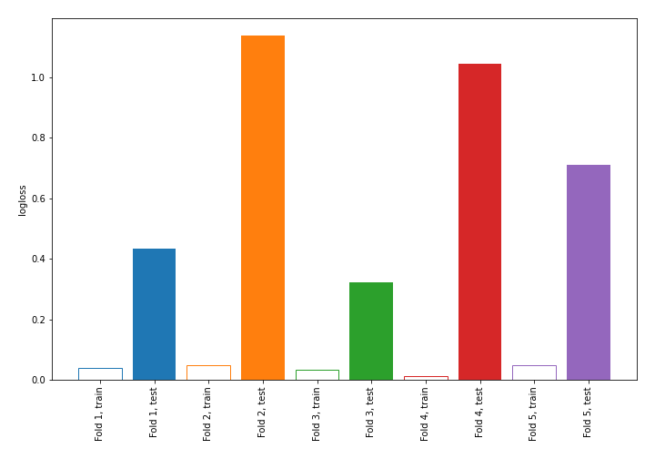

## Decision Tree 

### Tree #1
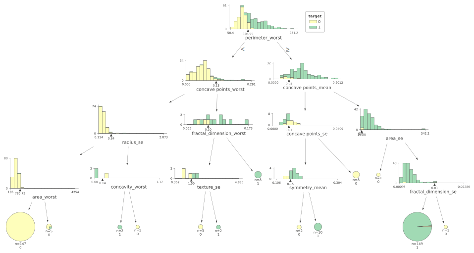

### Rules

if (perimeter_worst > 105.95) and (concave points_mean > 0.049) and (area_se > 16.195) and (fractal_dimension_se <= 0.013) then class: 1 (proba: 98.66%) | based on 149 samples

if (perimeter_worst <= 105.95) and (concave points_worst <= 0.134) and (radius_se <= 0.643) and (area_worst <= 785.75) then class: 0 (proba: 100.0%) | based on 147 samples

if (perimeter_worst > 105.95) and (concave points_mean <= 0.049) and (concave points_se <= 0.01) and (symmetry_mean > 0.151) then class: 1 (proba: 100.0%) | based on 10 samples

if (perimeter_worst > 105.95) and (concave points_mean <= 0.049) and (concave points_se > 0.01) then class: 0 (proba: 100.0%) | based on 8 samples

if (perimeter_worst <= 105.95) and (concave points_worst > 0.134) and (fractal_dimension_worst > 0.096) then class: 1 (proba: 100.0%) | based on 8 samples

if (perimeter_worst <= 105.95) and (concave points_worst <= 0.134) and (radius_se <= 0.643) and (area_worst > 785.75) then class: 0 (proba: 80.0%) | based on 5 samples

if (perimeter_worst <= 105.95) and (concave points_worst > 0.134) and (fractal_dimension_worst <= 0.096) and (texture_se <= 1.502) then class: 0 (proba: 100.0%) | based on 3 samples

if (perimeter_worst > 105.95) and (concave points_mean <= 0.049) and (concave points_se <= 0.01) and (symmetry_mean <= 0.151) then class: 0 (proba: 100.0%) | based on 2 samples

if (perimeter_worst <= 105.95) and (concave points_worst > 0.134) and (fractal_dimension_worst <= 0.096) and (texture_se > 1.502) then class: 1 (proba: 100.0%) | based on 2 samples

if (perimeter_worst <= 105.95) and (concave points_worst <= 0.134) and (radius_se > 0.643) and (concavity_worst <= 0.142) then class: 1 (proba: 100.0%) | based on 2 samples

if (perimeter_worst > 105.95) and (concave points_mean > 0.049) and (area_se > 16.195) and (fractal_dimension_se > 0.013) then class: 0 (proba: 100.0%) | based on 1 samples

if (perimeter_worst > 105.95) and (concave points_mean > 0.049) and (area_se <= 16.195) then class: 0 (proba: 100.0%) | based on 1 samples

if (perimeter_worst <= 105.95) and (concave points_worst <= 0.134) and (radius_se > 0.643) and (concavity_worst > 0.142) then class: 0 (proba: 100.0%) | based on 1 samples

### Tree #2
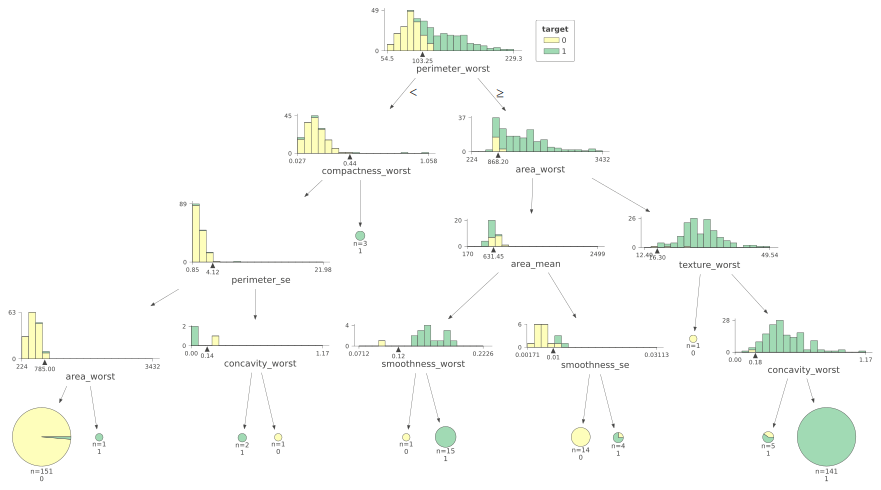

### Rules

if (perimeter_worst <= 103.25) and (compactness_worst <= 0.439) and (perimeter_se <= 4.118) and (area_worst <= 785.0) then class: 0 (proba: 98.68%) | based on 151 samples

if (perimeter_worst > 103.25) and (area_worst > 868.2) and (texture_worst > 16.295) and (concavity_worst > 0.182) then class: 1 (proba: 100.0%) | based on 141 samples

if (perimeter_worst > 103.25) and (area_worst <= 868.2) and (area_mean <= 631.45) and (smoothness_worst > 0.119) then class: 1 (proba: 100.0%) | based on 15 samples

if (perimeter_worst > 103.25) and (area_worst <= 868.2) and (area_mean > 631.45) and (smoothness_se <= 0.008) then class: 0 (proba: 100.0%) | based on 14 samples

if (perimeter_worst > 103.25) and (area_worst > 868.2) and (texture_worst > 16.295) and (concavity_worst <= 0.182) then class: 1 (proba: 60.0%) | based on 5 samples

if (perimeter_worst > 103.25) and (area_worst <= 868.2) and (area_mean > 631.45) and (smoothness_se > 0.008) then class: 1 (proba: 75.0%) | based on 4 samples

if (perimeter_worst <= 103.25) and (compactness_worst > 0.439) then class: 1 (proba: 100.0%) | based on 3 samples

if (perimeter_worst <= 103.25) and (compactness_worst <= 0.439) and (perimeter_se > 4.118) and (concavity_worst <= 0.142) then class: 1 (proba: 100.0%) | based on 2 samples

if (perimeter_worst > 103.25) and (area_worst > 868.2) and (texture_worst <= 16.295) then class: 0 (proba: 100.0%) | based on 1 samples

if (perimeter_worst > 103.25) and (area_worst <= 868.2) and (area_mean <= 631.45) and (smoothness_worst <= 0.119) then class: 0 (proba: 100.0%) | based on 1 samples

if (perimeter_worst <= 103.25) and (compactness_worst <= 0.439) and (perimeter_se > 4.118) and (concavity_worst > 0.142) then class: 0 (proba: 100.0%) | based on 1 samples

if (perimeter_worst <= 103.25) and (compactness_worst <= 0.439) and (perimeter_se <= 4.118) and (area_worst > 785.0) then class: 1 (proba: 100.0%) | based on 1 samples

### Tree #3
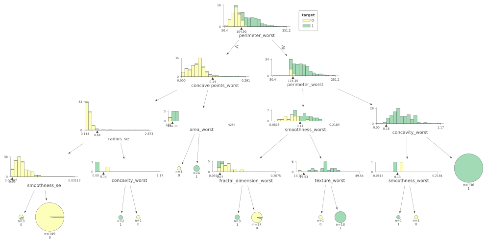

### Rules

if (perimeter_worst <= 104.9) and (concave points_worst <= 0.142) and (radius_se <= 0.643) and (smoothness_se > 0.003) then class: 0 (proba: 99.33%) | based on 149 samples

if (perimeter_worst > 104.9) and (perimeter_worst > 115.35) and (concavity_worst > 0.18) then class: 1 (proba: 100.0%) | based on 136 samples

if (perimeter_worst > 104.9) and (perimeter_worst <= 115.35) and (smoothness_worst > 0.14) and (texture_worst > 17.53) then class: 1 (proba: 100.0%) | based on 18 samples

if (perimeter_worst > 104.9) and (perimeter_worst <= 115.35) and (smoothness_worst <= 0.14) and (fractal_dimension_worst > 0.07) then class: 0 (proba: 94.12%) | based on 17 samples

if (perimeter_worst <= 104.9) and (concave points_worst > 0.142) and (area_worst > 444.3) then class: 1 (proba: 100.0%) | based on 6 samples

if (perimeter_worst > 104.9) and (perimeter_worst <= 115.35) and (smoothness_worst <= 0.14) and (fractal_dimension_worst <= 0.07) then class: 1 (proba: 100.0%) | based on 3 samples

if (perimeter_worst <= 104.9) and (concave points_worst <= 0.142) and (radius_se <= 0.643) and (smoothness_se <= 0.003) then class: 0 (proba: 66.67%) | based on 3 samples

if (perimeter_worst <= 104.9) and (concave points_worst <= 0.142) and (radius_se > 0.643) and (concavity_worst <= 0.142) then class: 1 (proba: 100.0%) | based on 2 samples

if (perimeter_worst > 104.9) and (perimeter_worst > 115.35) and (concavity_worst <= 0.18) and (smoothness_worst > 0.126) then class: 0 (proba: 100.0%) | based on 1 samples

if (perimeter_worst > 104.9) and (perimeter_worst > 115.35) and (concavity_worst <= 0.18) and (smoothness_worst <= 0.126) then class: 1 (proba: 100.0%) | based on 1 samples

if (perimeter_worst > 104.9) and (perimeter_worst <= 115.35) and (smoothness_worst > 0.14) and (texture_worst <= 17.53) then class: 0 (proba: 100.0%) | based on 1 samples

if (perimeter_worst <= 104.9) and (concave points_worst > 0.142) and (area_worst <= 444.3) then class: 0 (proba: 100.0%) | based on 1 samples

if (perimeter_worst <= 104.9) and (concave points_worst <= 0.142) and (radius_se > 0.643) and (concavity_worst > 0.142) then class: 0 (proba: 100.0%) | based on 1 samples

### Tree #4
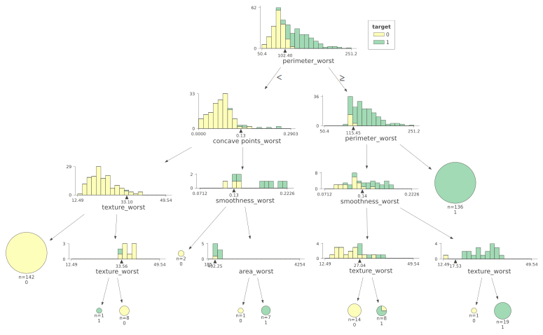

### Rules

if (perimeter_worst <= 102.4) and (concave points_worst <= 0.133) and (texture_worst <= 33.105) then class: 0 (proba: 100.0%) | based on 142 samples

if (perimeter_worst > 102.4) and (perimeter_worst > 115.45) then class: 1 (proba: 100.0%) | based on 136 samples

if (perimeter_worst > 102.4) and (perimeter_worst <= 115.45) and (smoothness_worst > 0.137) and (texture_worst > 17.53) then class: 1 (proba: 100.0%) | based on 19 samples

if (perimeter_worst > 102.4) and (perimeter_worst <= 115.45) and (smoothness_worst <= 0.137) and (texture_worst <= 27.04) then class: 0 (proba: 100.0%) | based on 14 samples

if (perimeter_worst > 102.4) and (perimeter_worst <= 115.45) and (smoothness_worst <= 0.137) and (texture_worst > 27.04) then class: 1 (proba: 75.0%) | based on 8 samples

if (perimeter_worst <= 102.4) and (concave points_worst <= 0.133) and (texture_worst > 33.105) and (texture_worst > 33.56) then class: 0 (proba: 100.0%) | based on 8 samples

if (perimeter_worst <= 102.4) and (concave points_worst > 0.133) and (smoothness_worst > 0.13) and (area_worst > 492.25) then class: 1 (proba: 100.0%) | based on 7 samples

if (perimeter_worst <= 102.4) and (concave points_worst > 0.133) and (smoothness_worst <= 0.13) then class: 0 (proba: 100.0%) | based on 2 samples

if (perimeter_worst > 102.4) and (perimeter_worst <= 115.45) and (smoothness_worst > 0.137) and (texture_worst <= 17.53) then class: 0 (proba: 100.0%) | based on 1 samples

if (perimeter_worst <= 102.4) and (concave points_worst > 0.133) and (smoothness_worst > 0.13) and (area_worst <= 492.25) then class: 0 (proba: 100.0%) | based on 1 samples

if (perimeter_worst <= 102.4) and (concave points_worst <= 0.133) and (texture_worst > 33.105) and (texture_worst <= 33.56) then class: 1 (proba: 100.0%) | based on 1 samples

### Tree #5
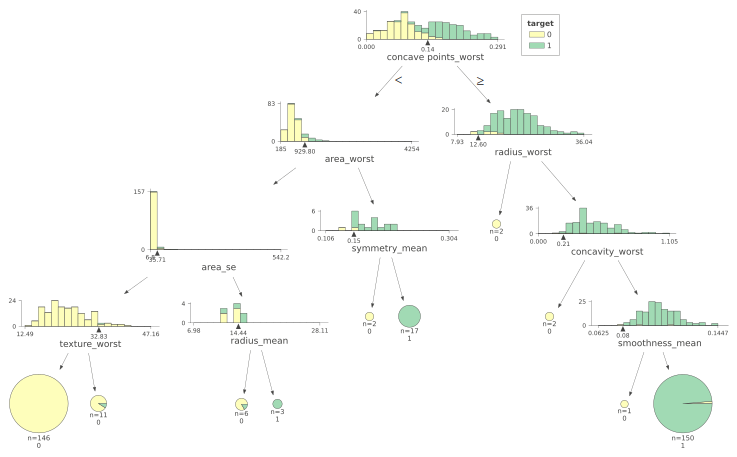

### Rules

if (concave points_worst > 0.136) and (radius_worst > 12.6) and (concavity_worst > 0.211) and (smoothness_mean > 0.079) then class: 1 (proba: 98.67%) | based on 150 samples

if (concave points_worst <= 0.136) and (area_worst <= 929.8) and (area_se <= 35.71) and (texture_worst <= 32.83) then class: 0 (proba: 100.0%) | based on 146 samples

if (concave points_worst <= 0.136) and (area_worst > 929.8) and (symmetry_mean > 0.151) then class: 1 (proba: 100.0%) | based on 17 samples

if (concave points_worst <= 0.136) and (area_worst <= 929.8) and (area_se <= 35.71) and (texture_worst > 32.83) then class: 0 (proba: 90.91%) | based on 11 samples

if (concave points_worst <= 0.136) and (area_worst <= 929.8) and (area_se > 35.71) and (radius_mean <= 14.445) then class: 0 (proba: 83.33%) | based on 6 samples

if (concave points_worst <= 0.136) and (area_worst <= 929.8) and (area_se > 35.71) and (radius_mean > 14.445) then class: 1 (proba: 100.0%) | based on 3 samples

if (concave points_worst > 0.136) and (radius_worst > 12.6) and (concavity_worst <= 0.211) then class: 0 (proba: 100.0%) | based on 2 samples

if (concave points_worst > 0.136) and (radius_worst <= 12.6) then class: 0 (proba: 100.0%) | based on 2 samples

if (concave points_worst <= 0.136) and (area_worst > 929.8) and (symmetry_mean <= 0.151) then class: 0 (proba: 100.0%) | based on 2 samples

if (concave points_worst > 0.136) and (radius_worst > 12.6) and (concavity_worst > 0.211) and (smoothness_mean <= 0.079) then class: 0 (proba: 100.0%) | based on 1 samples

## Permutation-based Importance
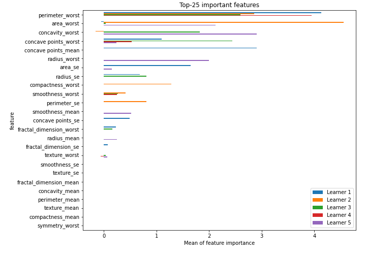

## SHAP Importance
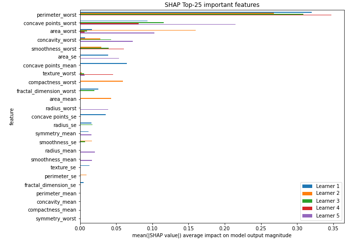

## SHAP Dependence plots

### Dependence (Fold 1)
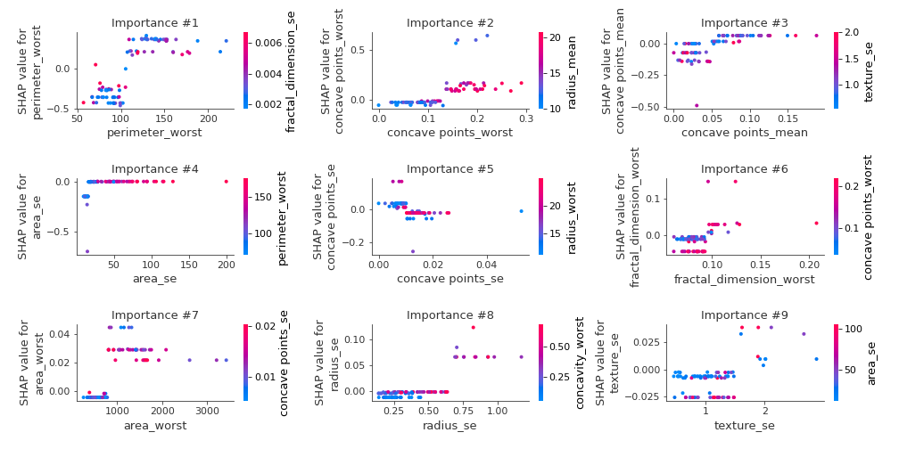
### Dependence (Fold 2)
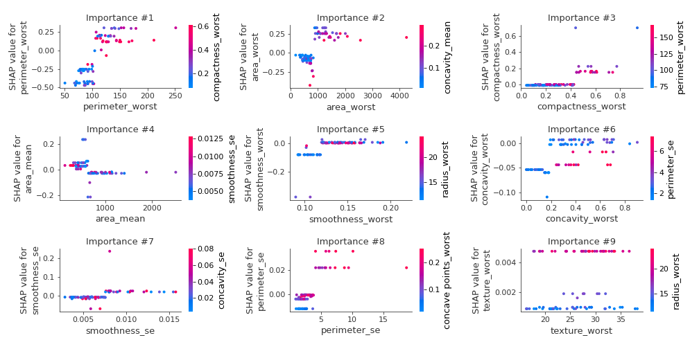
### Dependence (Fold 3)

### Dependence (Fold 4)
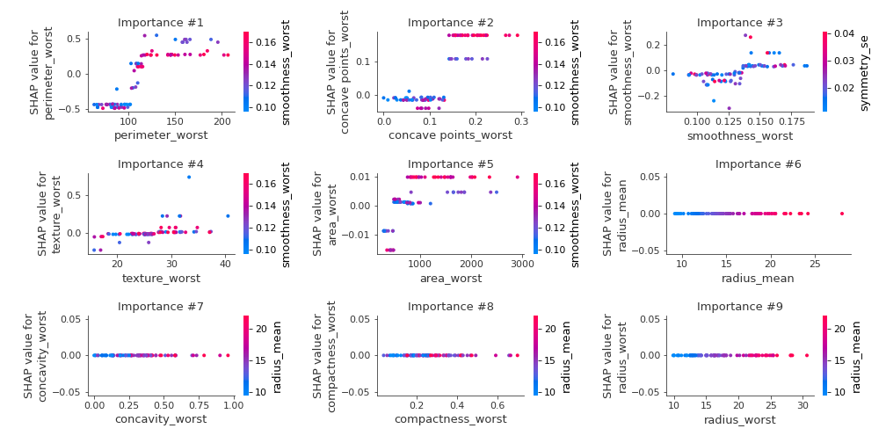
### Dependence (Fold 5)
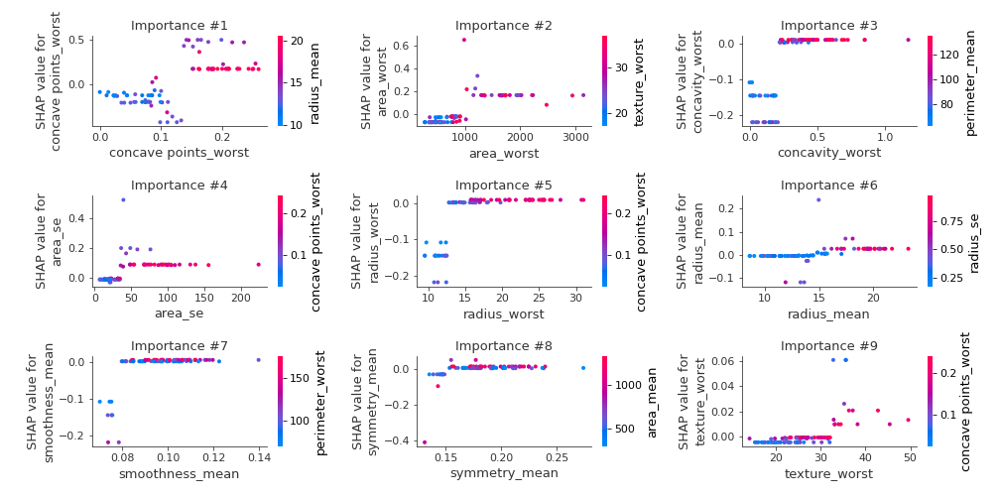

## SHAP Decision plots

### Top-10 Worst decisions for class 0 (Fold 1)
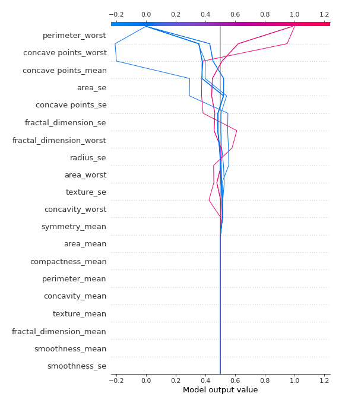
### Top-10 Worst decisions for class 0 (Fold 2)
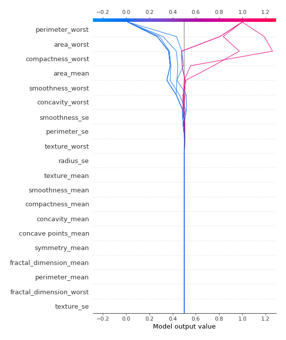
### Top-10 Worst decisions for class 0 (Fold 3)
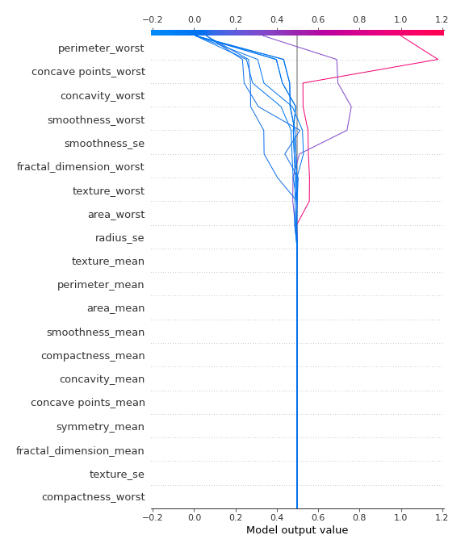
### Top-10 Worst decisions for class 0 (Fold 4)
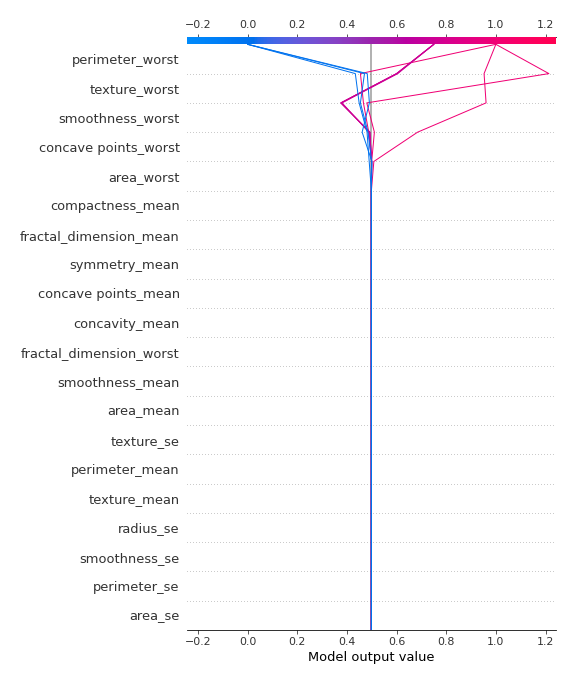
### Top-10 Worst decisions for class 0 (Fold 5)
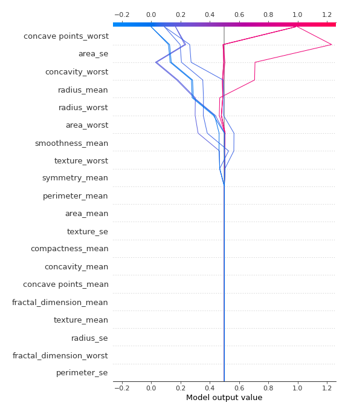
### Top-10 Best decisions for class 0 (Fold 1)
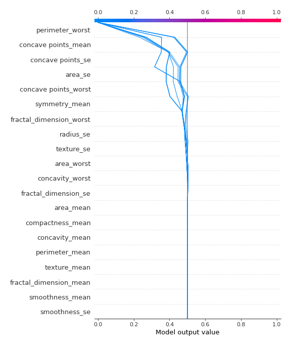
### Top-10 Best decisions for class 0 (Fold 2)
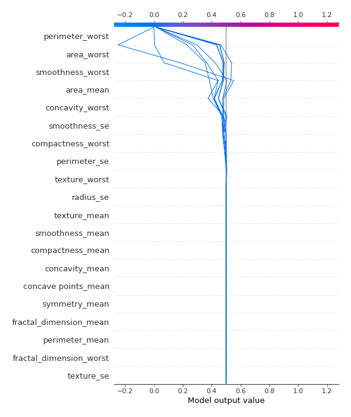
### Top-10 Best decisions for class 0 (Fold 3)
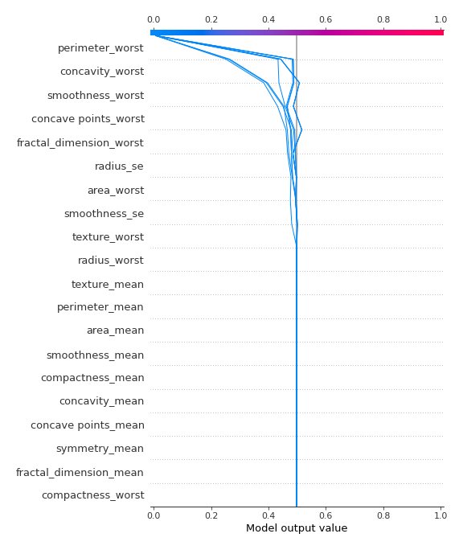
### Top-10 Best decisions for class 0 (Fold 4)
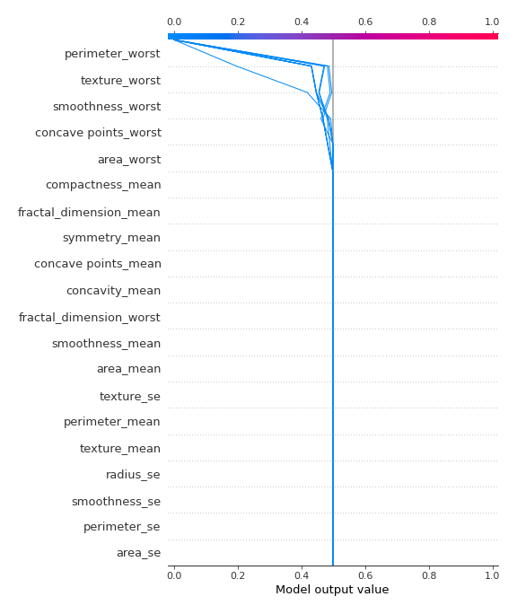
### Top-10 Best decisions for class 0 (Fold 5)
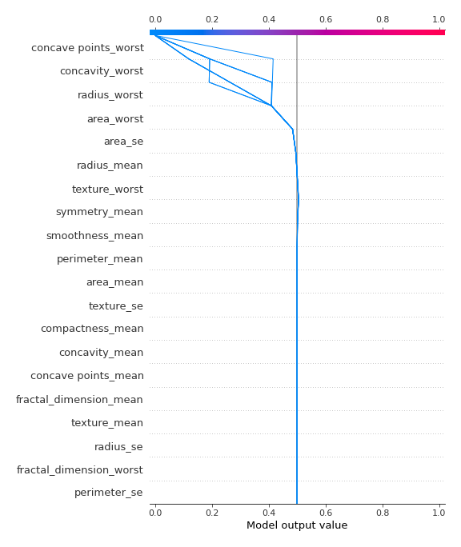
### Top-10 Worst decisions for class 1 (Fold 1)

### Top-10 Worst decisions for class 1 (Fold 2)
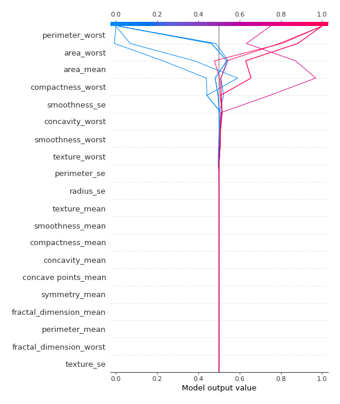
### Top-10 Worst decisions for class 1 (Fold 3)
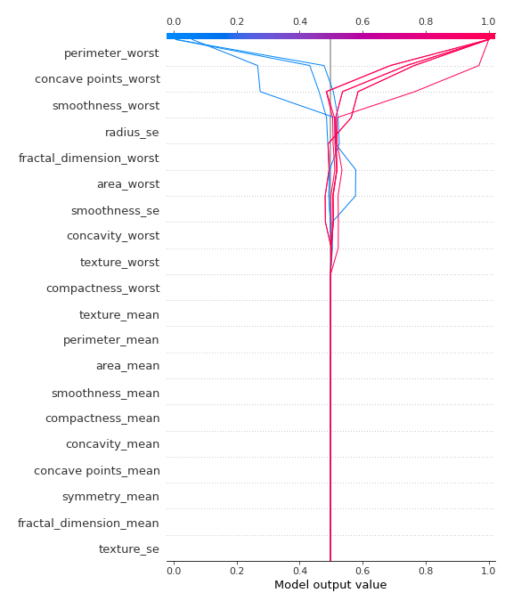
### Top-10 Worst decisions for class 1 (Fold 4)
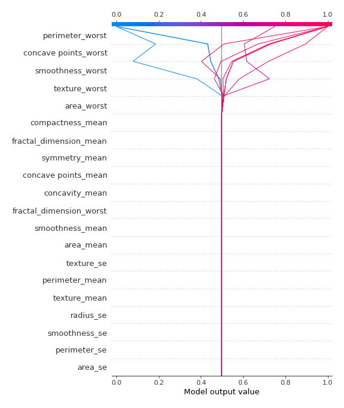
### Top-10 Worst decisions for class 1 (Fold 5)
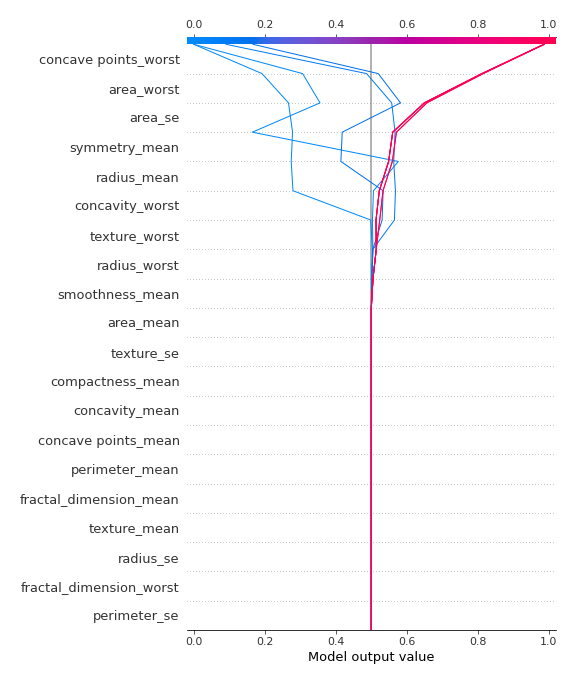
### Top-10 Best decisions for class 1 (Fold 1)
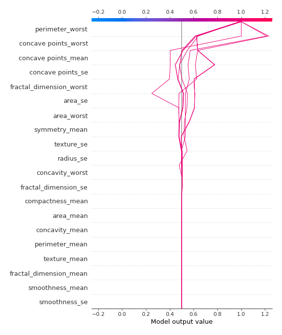
### Top-10 Best decisions for class 1 (Fold 2)

### Top-10 Best decisions for class 1 (Fold 3)
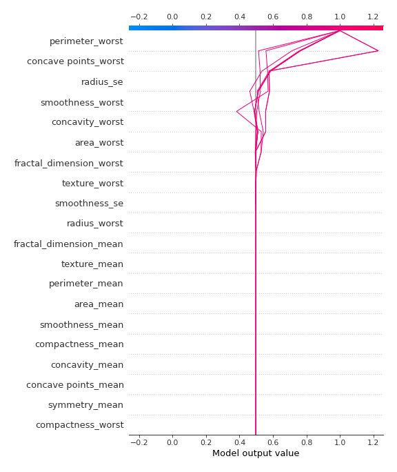
### Top-10 Best decisions for class 1 (Fold 4)
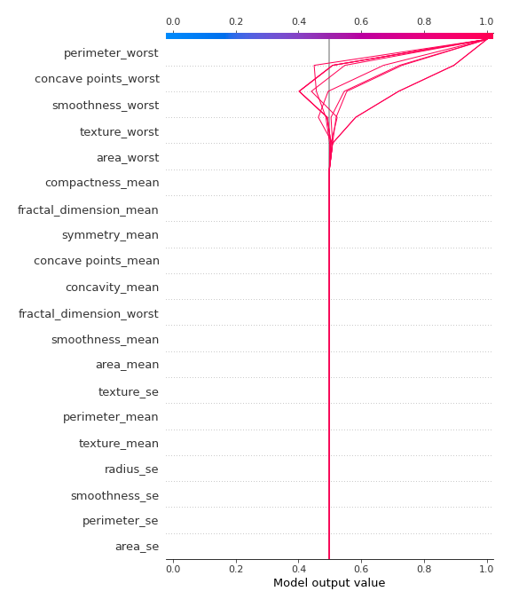
### Top-10 Best decisions for class 1 (Fold 5)
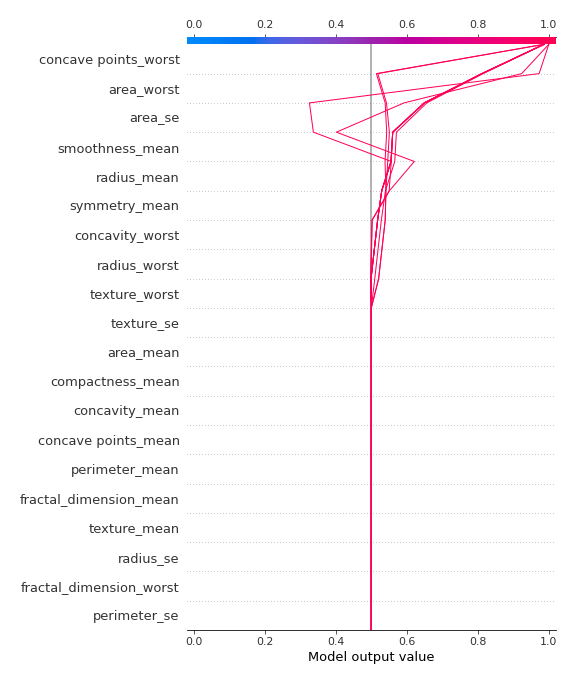

[<< Go back](../README.md)
