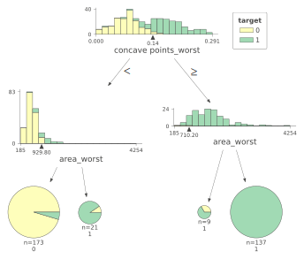
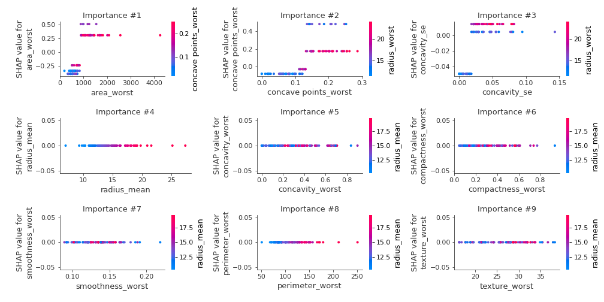
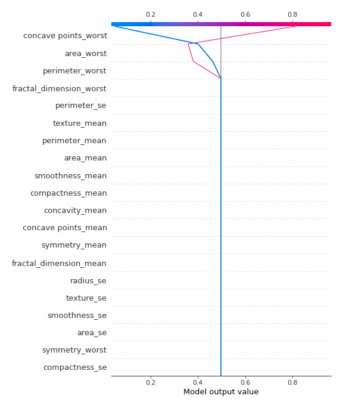
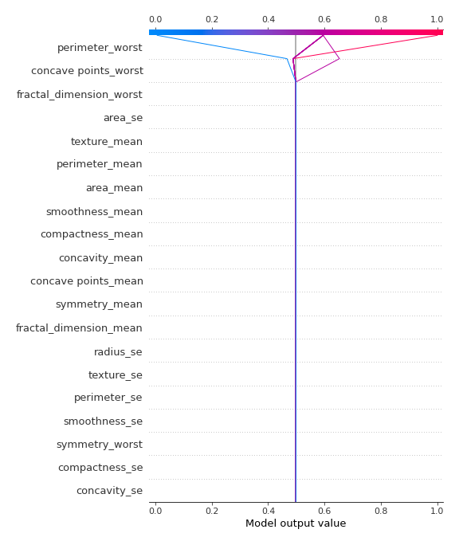

# Summary of 46_DecisionTree

[<< Go back](../README.md)

## Decision Tree
- **n_jobs**: -1
- **criterion**: entropy
- **max_depth**: 2
- **explain_level**: 2

## Validation
 - **validation_type**: kfold
 - **k_folds**: 5
 - **shuffle**: True
 - **stratify**: True
 - **random_seed**: 1230

## Optimized metric
logloss

## Training time

24.4 seconds

## Metric details
|           |    score |    threshold |
|:----------|---------:|-------------:|
| logloss   | 0.344876 | nan          |
| auc       | 0.958293 | nan          |
| f1        | 0.917808 |   0.503311   |
| accuracy  | 0.915094 |   0.503311   |
| precision | 0.970414 |   0.970588   |
| recall    | 1        |   0.00596026 |
| mcc       | 0.832005 |   0.503311   |

## Confusion matrix (at threshold=0.503311)
|                     |   Predicted as negative |   Predicted as positive |
|:--------------------|------------------------:|------------------------:|
| Labeled as negative |                     187 |                      25 |
| Labeled as positive |                      11 |                     201 |

## Learning curves

## Decision Tree 

### Tree #1

### Rules

if (concave points_worst <= 0.109) and (area_mean <= 694.5) then class: 0 (proba: 99.32%) | based on 146 samples

if (concave points_worst > 0.109) and (perimeter_worst > 115.35) then class: 1 (proba: 100.0%) | based on 130 samples

if (concave points_worst > 0.109) and (perimeter_worst <= 115.35) then class: 1 (proba: 61.11%) | based on 54 samples

if (concave points_worst <= 0.109) and (area_mean > 694.5) then class: 1 (proba: 66.67%) | based on 9 samples

### Tree #2

### Rules

if (area_worst <= 868.2) and (concave points_worst <= 0.132) then class: 0 (proba: 96.95%) | based on 164 samples

if (area_worst > 868.2) and (concavity_se > 0.019) then class: 1 (proba: 100.0%) | based on 135 samples

if (area_worst <= 868.2) and (concave points_worst > 0.132) then class: 1 (proba: 75.0%) | based on 28 samples

if (area_worst > 868.2) and (concavity_se <= 0.019) then class: 1 (proba: 75.0%) | based on 12 samples

### Tree #3

### Rules

if (concave points_worst <= 0.142) and (area_worst <= 947.6) then class: 0 (proba: 94.83%) | based on 174 samples

if (concave points_worst > 0.142) and (perimeter_worst > 112.8) then class: 1 (proba: 100.0%) | based on 127 samples

if (concave points_worst > 0.142) and (perimeter_worst <= 112.8) then class: 1 (proba: 80.95%) | based on 21 samples

if (concave points_worst <= 0.142) and (area_worst > 947.6) then class: 1 (proba: 94.12%) | based on 17 samples

### Tree #4

### Rules

if (perimeter_worst <= 102.4) and (concave points_worst <= 0.133) then class: 0 (proba: 99.34%) | based on 151 samples

if (perimeter_worst > 102.4) and (perimeter_worst > 115.45) then class: 1 (proba: 100.0%) | based on 136 samples

if (perimeter_worst > 102.4) and (perimeter_worst <= 115.45) then class: 1 (proba: 59.52%) | based on 42 samples

if (perimeter_worst <= 102.4) and (concave points_worst > 0.133) then class: 1 (proba: 70.0%) | based on 10 samples

### Tree #5

### Rules

if (concave points_worst <= 0.142) and (area_worst <= 929.8) then class: 0 (proba: 95.38%) | based on 173 samples

if (concave points_worst > 0.142) and (area_worst > 710.2) then class: 1 (proba: 100.0%) | based on 137 samples

if (concave points_worst <= 0.142) and (area_worst > 929.8) then class: 1 (proba: 90.48%) | based on 21 samples

if (concave points_worst > 0.142) and (area_worst <= 710.2) then class: 1 (proba: 66.67%) | based on 9 samples

## Permutation-based Importance

## SHAP Importance

## SHAP Dependence plots

### Dependence (Fold 1)

### Dependence (Fold 2)

### Dependence (Fold 3)

### Dependence (Fold 4)

### Dependence (Fold 5)

## SHAP Decision plots

### Top-10 Worst decisions for class 0 (Fold 1)

### Top-10 Worst decisions for class 0 (Fold 2)

### Top-10 Worst decisions for class 0 (Fold 3)

### Top-10 Worst decisions for class 0 (Fold 4)

### Top-10 Worst decisions for class 0 (Fold 5)

### Top-10 Best decisions for class 0 (Fold 1)

### Top-10 Best decisions for class 0 (Fold 2)

### Top-10 Best decisions for class 0 (Fold 3)

### Top-10 Best decisions for class 0 (Fold 4)

### Top-10 Best decisions for class 0 (Fold 5)

### Top-10 Worst decisions for class 1 (Fold 1)

### Top-10 Worst decisions for class 1 (Fold 2)

### Top-10 Worst decisions for class 1 (Fold 3)

### Top-10 Worst decisions for class 1 (Fold 4)

### Top-10 Worst decisions for class 1 (Fold 5)

### Top-10 Best decisions for class 1 (Fold 1)

### Top-10 Best decisions for class 1 (Fold 2)

### Top-10 Best decisions for class 1 (Fold 3)

### Top-10 Best decisions for class 1 (Fold 4)

### Top-10 Best decisions for class 1 (Fold 5)

[<< Go back](../README.md)
