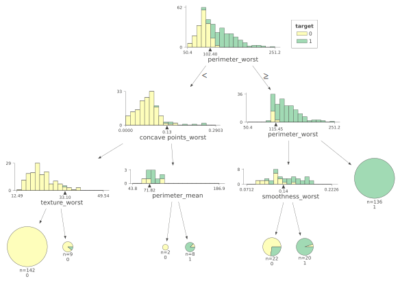
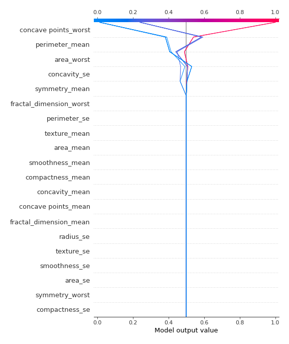
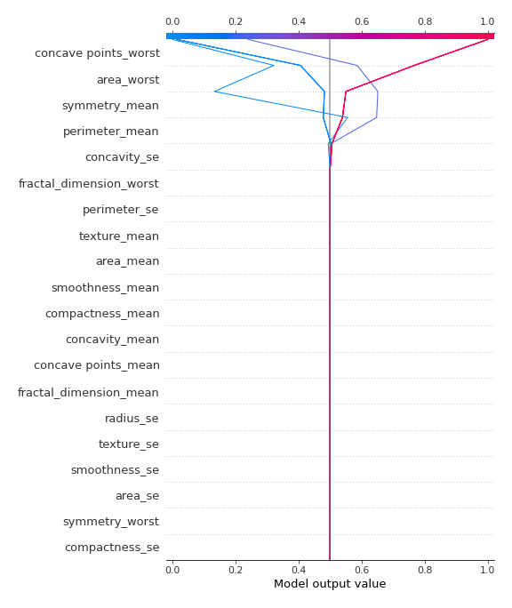

# Summary of 47_DecisionTree

[<< Go back](../README.md)

## Decision Tree
- **n_jobs**: -1
- **criterion**: entropy
- **max_depth**: 3
- **explain_level**: 2

## Validation
 - **validation_type**: kfold
 - **k_folds**: 5
 - **shuffle**: True
 - **stratify**: True
 - **random_seed**: 1230

## Optimized metric
logloss

## Training time

28.0 seconds

## Metric details
|           |    score |   threshold |
|:----------|---------:|------------:|
| logloss   | 0.451095 |       nan   |
| auc       | 0.95698  |       nan   |
| f1        | 0.935252 |         0.5 |
| accuracy  | 0.936321 |         0.5 |
| precision | 0.95122  |         0.5 |
| recall    | 0.981132 |         0   |
| mcc       | 0.873118 |         0.5 |

## Confusion matrix (at threshold=0.5)
|                     |   Predicted as negative |   Predicted as positive |
|:--------------------|------------------------:|------------------------:|
| Labeled as negative |                     202 |                      10 |
| Labeled as positive |                      17 |                     195 |

## Learning curves

## Decision Tree 

### Tree #1

### Rules

if (concave points_worst <= 0.109) and (area_mean <= 694.5) and (area_se <= 48.975) then class: 0 (proba: 100.0%) | based on 144 samples

if (concave points_worst > 0.109) and (perimeter_worst > 115.35) then class: 1 (proba: 100.0%) | based on 130 samples

if (concave points_worst > 0.109) and (perimeter_worst <= 115.35) and (concave points_worst <= 0.161) then class: 0 (proba: 55.26%) | based on 38 samples

if (concave points_worst > 0.109) and (perimeter_worst <= 115.35) and (concave points_worst > 0.161) then class: 1 (proba: 100.0%) | based on 16 samples

if (concave points_worst <= 0.109) and (area_mean > 694.5) and (texture_mean > 18.835) then class: 1 (proba: 100.0%) | based on 6 samples

if (concave points_worst <= 0.109) and (area_mean > 694.5) and (texture_mean <= 18.835) then class: 0 (proba: 100.0%) | based on 3 samples

if (concave points_worst <= 0.109) and (area_mean <= 694.5) and (area_se > 48.975) then class: 0 (proba: 50.0%) | based on 2 samples

### Tree #2

### Rules

if (area_worst <= 868.2) and (concave points_worst <= 0.132) and (area_se <= 37.61) then class: 0 (proba: 98.71%) | based on 155 samples

if (area_worst > 868.2) and (concavity_se > 0.019) then class: 1 (proba: 100.0%) | based on 135 samples

if (area_worst <= 868.2) and (concave points_worst > 0.132) and (texture_worst > 20.355) then class: 1 (proba: 91.3%) | based on 23 samples

if (area_worst > 868.2) and (concavity_se <= 0.019) and (texture_mean > 18.435) then class: 1 (proba: 100.0%) | based on 9 samples

if (area_worst <= 868.2) and (concave points_worst <= 0.132) and (area_se > 37.61) then class: 0 (proba: 66.67%) | based on 9 samples

if (area_worst <= 868.2) and (concave points_worst > 0.132) and (texture_worst <= 20.355) then class: 0 (proba: 100.0%) | based on 5 samples

if (area_worst > 868.2) and (concavity_se <= 0.019) and (texture_mean <= 18.435) then class: 0 (proba: 100.0%) | based on 3 samples

### Tree #3

### Rules

if (concave points_worst <= 0.142) and (area_worst <= 947.6) and (area_worst <= 785.75) then class: 0 (proba: 98.04%) | based on 153 samples

if (concave points_worst > 0.142) and (perimeter_worst > 112.8) then class: 1 (proba: 100.0%) | based on 127 samples

if (concave points_worst <= 0.142) and (area_worst <= 947.6) and (area_worst > 785.75) then class: 0 (proba: 71.43%) | based on 21 samples

if (concave points_worst > 0.142) and (perimeter_worst <= 112.8) and (texture_worst > 24.785) then class: 1 (proba: 100.0%) | based on 16 samples

if (concave points_worst <= 0.142) and (area_worst > 947.6) and (concavity_worst > 0.18) then class: 1 (proba: 100.0%) | based on 15 samples

if (concave points_worst > 0.142) and (perimeter_worst <= 112.8) and (texture_worst <= 24.785) then class: 0 (proba: 80.0%) | based on 5 samples

if (concave points_worst <= 0.142) and (area_worst > 947.6) and (concavity_worst <= 0.18) then class: 0 (proba: 50.0%) | based on 2 samples

### Tree #4

### Rules

if (perimeter_worst <= 102.4) and (concave points_worst <= 0.133) and (texture_worst <= 33.105) then class: 0 (proba: 100.0%) | based on 142 samples

if (perimeter_worst > 102.4) and (perimeter_worst > 115.45) then class: 1 (proba: 100.0%) | based on 136 samples

if (perimeter_worst > 102.4) and (perimeter_worst <= 115.45) and (smoothness_worst <= 0.137) then class: 0 (proba: 72.73%) | based on 22 samples

if (perimeter_worst > 102.4) and (perimeter_worst <= 115.45) and (smoothness_worst > 0.137) then class: 1 (proba: 95.0%) | based on 20 samples

if (perimeter_worst <= 102.4) and (concave points_worst <= 0.133) and (texture_worst > 33.105) then class: 0 (proba: 88.89%) | based on 9 samples

if (perimeter_worst <= 102.4) and (concave points_worst > 0.133) and (perimeter_mean > 71.815) then class: 1 (proba: 87.5%) | based on 8 samples

if (perimeter_worst <= 102.4) and (concave points_worst > 0.133) and (perimeter_mean <= 71.815) then class: 0 (proba: 100.0%) | based on 2 samples

### Tree #5

### Rules

if (concave points_worst <= 0.142) and (area_worst <= 929.8) and (perimeter_mean <= 90.37) then class: 0 (proba: 98.65%) | based on 148 samples

if (concave points_worst > 0.142) and (area_worst > 710.2) then class: 1 (proba: 100.0%) | based on 137 samples

if (concave points_worst <= 0.142) and (area_worst <= 929.8) and (perimeter_mean > 90.37) then class: 0 (proba: 76.0%) | based on 25 samples

if (concave points_worst <= 0.142) and (area_worst > 929.8) and (symmetry_mean > 0.151) then class: 1 (proba: 100.0%) | based on 19 samples

if (concave points_worst > 0.142) and (area_worst <= 710.2) and (concavity_se <= 0.06) then class: 1 (proba: 100.0%) | based on 6 samples

if (concave points_worst > 0.142) and (area_worst <= 710.2) and (concavity_se > 0.06) then class: 0 (proba: 100.0%) | based on 3 samples

if (concave points_worst <= 0.142) and (area_worst > 929.8) and (symmetry_mean <= 0.151) then class: 0 (proba: 100.0%) | based on 2 samples

## Permutation-based Importance

## SHAP Importance

## SHAP Dependence plots

### Dependence (Fold 1)

### Dependence (Fold 2)

### Dependence (Fold 3)

### Dependence (Fold 4)

### Dependence (Fold 5)

## SHAP Decision plots

### Top-10 Worst decisions for class 0 (Fold 1)

### Top-10 Worst decisions for class 0 (Fold 2)

### Top-10 Worst decisions for class 0 (Fold 3)

### Top-10 Worst decisions for class 0 (Fold 4)

### Top-10 Worst decisions for class 0 (Fold 5)

### Top-10 Best decisions for class 0 (Fold 1)

### Top-10 Best decisions for class 0 (Fold 2)

### Top-10 Best decisions for class 0 (Fold 3)

### Top-10 Best decisions for class 0 (Fold 4)

### Top-10 Best decisions for class 0 (Fold 5)

### Top-10 Worst decisions for class 1 (Fold 1)

### Top-10 Worst decisions for class 1 (Fold 2)

### Top-10 Worst decisions for class 1 (Fold 3)

### Top-10 Worst decisions for class 1 (Fold 4)

### Top-10 Worst decisions for class 1 (Fold 5)

### Top-10 Best decisions for class 1 (Fold 1)

### Top-10 Best decisions for class 1 (Fold 2)

### Top-10 Best decisions for class 1 (Fold 3)

### Top-10 Best decisions for class 1 (Fold 4)

### Top-10 Best decisions for class 1 (Fold 5)

[<< Go back](../README.md)
