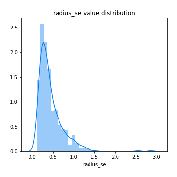

# Exploratory Data Analysis

[<< Go back](../README.md)
## Feature : target
- **Feature type** : discrete
- **Missing** : 0.0%
- **Unique** : 2
- **Count** :424.0
- **Mean** :0.5
- **Std** :0.5005906676601786
- **Min** :0.0
- **25%th Percentile** : 0.0
- **50%th Percentile** : 0.5
- **75%th Percentile** : 1.0
- **Max** :1.0

## Feature : radius_mean
- **Feature type** : continous
- **Missing** : 0.0%
- **Unique** : 367
- **Count** :424.0
- **Mean** :14.819969339622645
- **Std** :3.697091253491909
- **Min** :6.981
- **25%th Percentile** : 12.065000000000001
- **50%th Percentile** : 14.0
- **75%th Percentile** : 17.3125
- **Max** :28.11

## Feature : texture_mean
- **Feature type** : continous
- **Missing** : 0.0%
- **Unique** : 378
- **Count** :424.0
- **Mean** :19.81924528301887
- **Std** :4.2680476927446245
- **Min** :10.38
- **25%th Percentile** : 16.9375
- **50%th Percentile** : 19.595
- **75%th Percentile** : 22.235
- **Max** :39.28

## Feature : perimeter_mean
- **Feature type** : continous
- **Missing** : 0.0%
- **Unique** : 394
- **Count** :424.0
- **Mean** :96.81134433962274
- **Std** :25.54160811297888
- **Min** :43.79
- **25%th Percentile** : 77.9175
- **50%th Percentile** : 91.17
- **75%th Percentile** : 114.2
- **Max** :188.5

## Feature : area_mean
- **Feature type** : continous
- **Missing** : 0.0%
- **Unique** : 408
- **Count** :424.0
- **Mean** :721.665801886792
- **Std** :377.21279467746876
- **Min** :143.5
- **25%th Percentile** : 449.37499999999994
- **50%th Percentile** : 604.7
- **75%th Percentile** : 931.4499999999999
- **Max** :2501.0

## Feature : smoothness_mean
- **Feature type** : continous
- **Missing** : 0.0%
- **Unique** : 359
- **Count** :424.0
- **Mean** :0.0975372641509433
- **Std** :0.01413295737710984
- **Min** :0.06251
- **25%th Percentile** : 0.0868475
- **50%th Percentile** : 0.09733
- **75%th Percentile** : 0.10665
- **Max** :0.1447

## Feature : compactness_mean
- **Feature type** : continous
- **Missing** : 0.0%
- **Unique** : 401
- **Count** :424.0
- **Mean** :0.11198377358490577
- **Std** :0.05549044855433998
- **Min** :0.01938
- **25%th Percentile** : 0.068705
- **50%th Percentile** : 0.10439999999999999
- **75%th Percentile** : 0.139225
- **Max** :0.3454

## Feature : concavity_mean
- **Feature type** : continous
- **Missing** : 0.0%
- **Unique** : 401
- **Count** :424.0
- **Mean** :0.10301630660377356
- **Std** :0.0841578514182066
- **Min** :0.0
- **25%th Percentile** : 0.0350975
- **50%th Percentile** : 0.084675
- **75%th Percentile** : 0.152225
- **Max** :0.4268

## Feature : concave points_mean
- **Feature type** : continous
- **Missing** : 0.0%
- **Unique** : 410
- **Count** :424.0
- **Mean** :0.056876797169811324
- **Std** :0.04118751404276048
- **Min** :0.0
- **25%th Percentile** : 0.0234375
- **50%th Percentile** : 0.050855
- **75%th Percentile** : 0.08626
- **Max** :0.2012

## Feature : symmetry_mean
- **Feature type** : continous
- **Missing** : 0.0%
- **Unique** : 339
- **Count** :424.0
- **Mean** :0.18299811320754727
- **Std** :0.028173971459955694
- **Min** :0.106
- **25%th Percentile** : 0.16335
- **50%th Percentile** : 0.18005
- **75%th Percentile** : 0.19715
- **Max** :0.304

## Feature : fractal_dimension_mean
- **Feature type** : continous
- **Missing** : 0.0%
- **Unique** : 388
- **Count** :424.0
- **Mean** :0.06266389150943397
- **Std** :0.006895699704777031
- **Min** :0.04996
- **25%th Percentile** : 0.057217500000000004
- **50%th Percentile** : 0.061545
- **75%th Percentile** : 0.0662725
- **Max** :0.09744

## Feature : radius_se
- **Feature type** : continous
- **Missing** : 0.0%
- **Unique** : 412
- **Count** :424.0
- **Mean** :0.4467169811320749
- **Std** :0.30386303036723933
- **Min** :0.1144
- **25%th Percentile** : 0.243075
- **50%th Percentile** : 0.35385
- **75%th Percentile** : 0.557325
- **Max** :2.873

## Feature : texture_se
- **Feature type** : continous
- **Missing** : 0.0%
- **Unique** : 396
- **Count** :424.0
- **Mean** :1.2261115566037726
- **Std** :0.5606045498883245
- **Min** :0.3621
- **25%th Percentile** : 0.8561
- **50%th Percentile** : 1.095
- **75%th Percentile** : 1.46625
- **Max** :4.885

## Feature : perimeter_se
- **Feature type** : continous
- **Missing** : 0.0%
- **Unique** : 402
- **Count** :424.0
- **Mean** :3.154302358490568
- **Std** :2.2191294026095782
- **Min** :0.8484
- **25%th Percentile** : 1.7365000000000002
- **50%th Percentile** : 2.5505
- **75%th Percentile** : 3.80125
- **Max** :21.98

## Feature : area_se
- **Feature type** : continous
- **Missing** : 0.0%
- **Unique** : 404
- **Count** :424.0
- **Mean** :46.93947405660376
- **Std** :50.79902155429796
- **Min** :6.802
- **25%th Percentile** : 19.2075
- **50%th Percentile** : 28.565
- **75%th Percentile** : 58.555
- **Max** :542.2

## Feature : smoothness_se
- **Feature type** : continous
- **Missing** : 0.0%
- **Unique** : 414
- **Count** :424.0
- **Mean** :0.006983981132075471
- **Std** :0.0028950107362087146
- **Min** :0.001713
- **25%th Percentile** : 0.005222999999999999
- **50%th Percentile** : 0.0063625
- **75%th Percentile** : 0.00807575
- **Max** :0.03113

## Feature : compactness_se
- **Feature type** : continous
- **Missing** : 0.0%
- **Unique** : 409
- **Count** :424.0
- **Mean** :0.02679104716981128
- **Std** :0.018094840300519808
- **Min** :0.002252
- **25%th Percentile** : 0.013922499999999999
- **50%th Percentile** : 0.023
- **75%th Percentile** : 0.0337725
- **Max** :0.1354

## Feature : concavity_se
- **Feature type** : continous
- **Missing** : 0.0%
- **Unique** : 404
- **Count** :424.0
- **Mean** :0.03392143136792453
- **Std** :0.02913304487822015
- **Min** :0.0
- **25%th Percentile** : 0.017099999999999997
- **50%th Percentile** : 0.028194999999999998
- **75%th Percentile** : 0.04494
- **Max** :0.396

## Feature : concave points_se
- **Feature type** : continous
- **Missing** : 0.0%
- **Unique** : 388
- **Count** :424.0
- **Mean** :0.012492200471698097
- **Std** :0.006276976519539924
- **Min** :0.0
- **25%th Percentile** : 0.008404
- **50%th Percentile** : 0.01164
- **75%th Percentile** : 0.015602499999999998
- **Max** :0.05279

## Feature : symmetry_se
- **Feature type** : continous
- **Missing** : 0.0%
- **Unique** : 381
- **Count** :424.0
- **Mean** :0.020579971698113195
- **Std** :0.0088001371112331
- **Min** :0.007882
- **25%th Percentile** : 0.015017500000000001
- **50%th Percentile** : 0.01855
- **75%th Percentile** : 0.0232675
- **Max** :0.07895

## Feature : fractal_dimension_se
- **Feature type** : continous
- **Missing** : 0.0%
- **Unique** : 407
- **Count** :424.0
- **Mean** :0.0038751780660377377
- **Std** :0.002621128679470061
- **Min** :0.0009502
- **25%th Percentile** : 0.0023292499999999997
- **50%th Percentile** : 0.003348
- **75%th Percentile** : 0.0045855
- **Max** :0.02984

## Feature : radius_worst
- **Feature type** : continous
- **Missing** : 0.0%
- **Unique** : 368
- **Count** :424.0
- **Mean** :17.259745283018866
- **Std** :5.108855123927735
- **Min** :7.93
- **25%th Percentile** : 13.3275
- **50%th Percentile** : 16.01
- **75%th Percentile** : 20.585
- **Max** :36.04

## Feature : texture_worst
- **Feature type** : continous
- **Missing** : 0.0%
- **Unique** : 391
- **Count** :424.0
- **Mean** :26.428702830188673
- **Std** :6.162558107381039
- **Min** :12.49
- **25%th Percentile** : 21.884999999999998
- **50%th Percentile** : 25.994999999999997
- **75%th Percentile** : 30.865
- **Max** :49.54

## Feature : perimeter_worst
- **Feature type** : continous
- **Missing** : 0.0%
- **Unique** : 387
- **Count** :424.0
- **Mean** :114.2037971698113
- **Std** :35.523578783867045
- **Min** :50.41
- **25%th Percentile** : 86.69250000000001
- **50%th Percentile** : 106.1
- **75%th Percentile** : 137.95000000000002
- **Max** :251.2

## Feature : area_worst
- **Feature type** : continous
- **Missing** : 0.0%
- **Unique** : 409
- **Count** :424.0
- **Mean** :990.7742924528304
- **Std** :614.5910351574877
- **Min** :185.2
- **25%th Percentile** : 544.975
- **50%th Percentile** : 782.85
- **75%th Percentile** : 1302.5
- **Max** :4254.0

## Feature : smoothness_worst
- **Feature type** : continous
- **Missing** : 0.0%
- **Unique** : 343
- **Count** :424.0
- **Mean** :0.13461806603773588
- **Std** :0.023275376898632745
- **Min** :0.07117
- **25%th Percentile** : 0.11915
- **50%th Percentile** : 0.1343
- **75%th Percentile** : 0.14955000000000002
- **Max** :0.2226

## Feature : compactness_worst
- **Feature type** : continous
- **Missing** : 0.0%
- **Unique** : 403
- **Count** :424.0
- **Mean** :0.2764909669811323
- **Std** :0.16693589435009773
- **Min** :0.02729
- **25%th Percentile** : 0.15792499999999998
- **50%th Percentile** : 0.2383
- **75%th Percentile** : 0.3604
- **Max** :1.058

## Feature : concavity_worst
- **Feature type** : continous
- **Missing** : 0.0%
- **Unique** : 408
- **Count** :424.0
- **Mean** :0.3055108844339623
- **Std** :0.21226780466861975
- **Min** :0.0
- **25%th Percentile** : 0.138
- **50%th Percentile** : 0.27905
- **75%th Percentile** : 0.41915
- **Max** :1.17

## Feature : concave points_worst
- **Feature type** : continous
- **Missing** : 0.0%
- **Unique** : 382
- **Count** :424.0
- **Mean** :0.1280012240566038
- **Std** :0.06796473444544941
- **Min** :0.0
- **25%th Percentile** : 0.074475
- **50%th Percentile** : 0.1217
- **75%th Percentile** : 0.182
- **Max** :0.291

## Feature : symmetry_worst
- **Feature type** : continous
- **Missing** : 0.0%
- **Unique** : 385
- **Count** :424.0
- **Mean** :0.2953754716981131
- **Std** :0.06623599588650579
- **Min** :0.1565
- **25%th Percentile** : 0.253875
- **50%th Percentile** : 0.28445
- **75%th Percentile** : 0.321525
- **Max** :0.6638

## Feature : fractal_dimension_worst
- **Feature type** : continous
- **Missing** : 0.0%
- **Unique** : 404
- **Count** :424.0
- **Mean** :0.08524698113207554
- **Std** :0.018793242116711163
- **Min** :0.05504
- **25%th Percentile** : 0.07190250000000001
- **50%th Percentile** : 0.08166
- **75%th Percentile** : 0.09364750000000001
- **Max** :0.2075

[<< Go back](../README.md)
