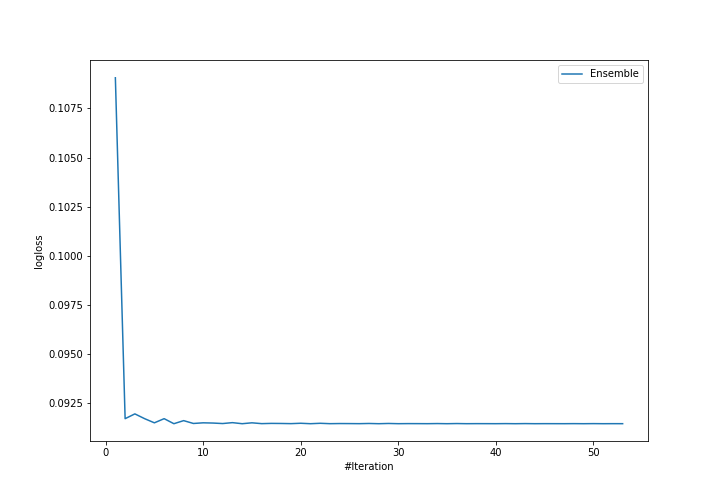

# Summary of Ensemble

[<< Go back](../README.md)

## Ensemble structure
| Model                    |   Weight |
|:-------------------------|---------:|
| 19_NeuralNetwork         |       12 |
| 9_Xgboost_GoldenFeatures |        9 |

## Metric details
|           |     score |     threshold |
|:----------|----------:|--------------:|
| logloss   | 0.0914474 | nan           |
| auc       | 0.994972  | nan           |
| f1        | 0.972093  |   0.337591    |
| accuracy  | 0.971698  |   0.337591    |
| precision | 1         |   0.986541    |
| recall    | 1         |   0.000204335 |
| mcc       | 0.943774  |   0.337591    |

## Confusion matrix (at threshold=0.337591)
|                     |   Predicted as negative |   Predicted as positive |
|:--------------------|------------------------:|------------------------:|
| Labeled as negative |                     203 |                       9 |
| Labeled as positive |                       3 |                     209 |

## Learning curves

[<< Go back](../README.md)
