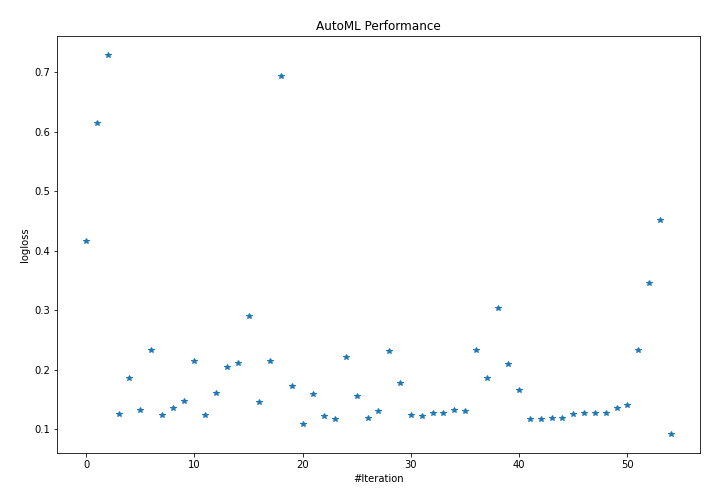
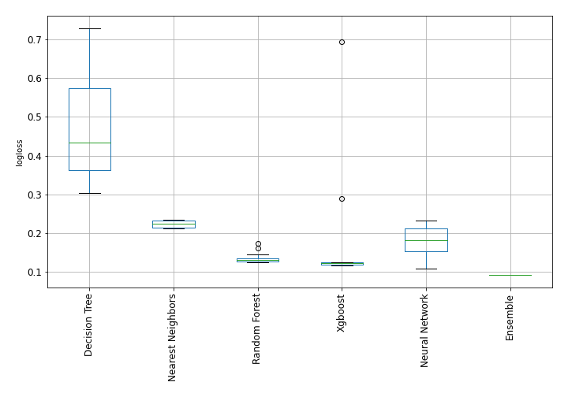

# AutoML Leaderboard

| Best model   | name                                                                                               | model_type        | metric_type   |   metric_value |   train_time |   single_prediction_time |
|:-------------|:---------------------------------------------------------------------------------------------------|:------------------|:--------------|---------------:|-------------:|-------------------------:|
|              | [1_DecisionTree](1_DecisionTree/README.md)                                                         | Decision Tree     | logloss       |      0.41638   |        34.4  |                   0.0483 |
|              | [2_DecisionTree](2_DecisionTree/README.md)                                                         | Decision Tree     | logloss       |      0.614453  |        34.66 |                   0.0486 |
|              | [3_DecisionTree](3_DecisionTree/README.md)                                                         | Decision Tree     | logloss       |      0.729162  |        34.81 |                   0.0494 |
|              | [4_Default_Xgboost](4_Default_Xgboost/README.md)                                                   | Xgboost           | logloss       |      0.124788  |        31.94 |                   0.0497 |
|              | [5_Default_NeuralNetwork](5_Default_NeuralNetwork/README.md)                                       | Neural Network    | logloss       |      0.185951  |         5.6  |                   0.0731 |
|              | [6_Default_RandomForest](6_Default_RandomForest/README.md)                                         | Random Forest     | logloss       |      0.132283  |        69.08 |                   0.5601 |
|              | [7_Default_NearestNeighbors](7_Default_NearestNeighbors/README.md)                                 | Nearest Neighbors | logloss       |      0.233487  |        43.18 |                   0.5902 |
|              | [8_Xgboost](8_Xgboost/README.md)                                                                   | Xgboost           | logloss       |      0.123128  |        35.22 |                   0.063  |
|              | [12_RandomForest](12_RandomForest/README.md)                                                       | Random Forest     | logloss       |      0.135496  |        67.15 |                   0.5629 |
|              | [16_NeuralNetwork](16_NeuralNetwork/README.md)                                                     | Neural Network    | logloss       |      0.147736  |         5.37 |                   0.0756 |
|              | [20_NearestNeighbors](20_NearestNeighbors/README.md)                                               | Nearest Neighbors | logloss       |      0.214782  |        43.32 |                   0.5927 |
|              | [9_Xgboost](9_Xgboost/README.md)                                                                   | Xgboost           | logloss       |      0.12387   |        37.34 |                   0.0543 |
|              | [13_RandomForest](13_RandomForest/README.md)                                                       | Random Forest     | logloss       |      0.160332  |        67.7  |                   0.5686 |
|              | [17_NeuralNetwork](17_NeuralNetwork/README.md)                                                     | Neural Network    | logloss       |      0.203472  |         6.07 |                   0.0718 |
|              | [21_NearestNeighbors](21_NearestNeighbors/README.md)                                               | Nearest Neighbors | logloss       |      0.211538  |        43.03 |                   0.6006 |
|              | [10_Xgboost](10_Xgboost/README.md)                                                                 | Xgboost           | logloss       |      0.290199  |        27.59 |                   0.0528 |
|              | [14_RandomForest](14_RandomForest/README.md)                                                       | Random Forest     | logloss       |      0.145316  |        72.69 |                   0.5649 |
|              | [18_NeuralNetwork](18_NeuralNetwork/README.md)                                                     | Neural Network    | logloss       |      0.214338  |         6.54 |                   0.076  |
|              | [11_Xgboost](11_Xgboost/README.md)                                                                 | Xgboost           | logloss       |      0.693094  |        25.85 |                   0.0527 |
|              | [15_RandomForest](15_RandomForest/README.md)                                                       | Random Forest     | logloss       |      0.172682  |        69.03 |                   0.5618 |
|              | [19_NeuralNetwork](19_NeuralNetwork/README.md)                                                     | Neural Network    | logloss       |      0.109064  |         5.52 |                   0.0792 |
|              | [19_NeuralNetwork_GoldenFeatures](19_NeuralNetwork_GoldenFeatures/README.md)                       | Neural Network    | logloss       |      0.158605  |        10.18 |                   0.1172 |
|              | [8_Xgboost_GoldenFeatures](8_Xgboost_GoldenFeatures/README.md)                                     | Xgboost           | logloss       |      0.122531  |        42.05 |                   0.1036 |
|              | [9_Xgboost_GoldenFeatures](9_Xgboost_GoldenFeatures/README.md)                                     | Xgboost           | logloss       |      0.116177  |        38.59 |                   0.1022 |
|              | [19_NeuralNetwork_RandomFeature](19_NeuralNetwork_RandomFeature/README.md)                         | Neural Network    | logloss       |      0.221051  |         5.7  |                   0.0746 |
|              | [19_NeuralNetwork_SelectedFeatures](19_NeuralNetwork_SelectedFeatures/README.md)                   | Neural Network    | logloss       |      0.154675  |         4.65 |                   0.0697 |
|              | [9_Xgboost_GoldenFeatures_SelectedFeatures](9_Xgboost_GoldenFeatures_SelectedFeatures/README.md)   | Xgboost           | logloss       |      0.118845  |        34.64 |                   0.0934 |
|              | [6_Default_RandomForest_SelectedFeatures](6_Default_RandomForest_SelectedFeatures/README.md)       | Random Forest     | logloss       |      0.129829  |        55.99 |                   0.5661 |
|              | [22_NeuralNetwork](22_NeuralNetwork/README.md)                                                     | Neural Network    | logloss       |      0.231089  |         5.5  |                   0.0729 |
|              | [23_NeuralNetwork](23_NeuralNetwork/README.md)                                                     | Neural Network    | logloss       |      0.176569  |         6.69 |                   0.0856 |
|              | [24_Xgboost_GoldenFeatures](24_Xgboost_GoldenFeatures/README.md)                                   | Xgboost           | logloss       |      0.122771  |        41.58 |                   0.1005 |
|              | [25_Xgboost_GoldenFeatures_SelectedFeatures](25_Xgboost_GoldenFeatures_SelectedFeatures/README.md) | Xgboost           | logloss       |      0.121925  |        30.92 |                   0.1011 |
|              | [26_RandomForest_SelectedFeatures](26_RandomForest_SelectedFeatures/README.md)                     | Random Forest     | logloss       |      0.127152  |        55.97 |                   0.5639 |
|              | [27_RandomForest_SelectedFeatures](27_RandomForest_SelectedFeatures/README.md)                     | Random Forest     | logloss       |      0.127536  |        57.48 |                   0.5687 |
|              | [28_RandomForest](28_RandomForest/README.md)                                                       | Random Forest     | logloss       |      0.132518  |        68.17 |                   0.5696 |
|              | [29_RandomForest](29_RandomForest/README.md)                                                       | Random Forest     | logloss       |      0.130746  |        77.11 |                   0.5698 |
|              | [30_NeuralNetwork](30_NeuralNetwork/README.md)                                                     | Neural Network    | logloss       |      0.233393  |         5.08 |                   0.0731 |
|              | [31_NeuralNetwork](31_NeuralNetwork/README.md)                                                     | Neural Network    | logloss       |      0.186222  |         5.96 |                   0.074  |
|              | [32_DecisionTree](32_DecisionTree/README.md)                                                       | Decision Tree     | logloss       |      0.304089  |        25.84 |                   0.0535 |
|              | [33_NeuralNetwork](33_NeuralNetwork/README.md)                                                     | Neural Network    | logloss       |      0.209955  |         5.45 |                   0.0869 |
|              | [34_NeuralNetwork](34_NeuralNetwork/README.md)                                                     | Neural Network    | logloss       |      0.166263  |         5.67 |                   0.0742 |
|              | [35_Xgboost_GoldenFeatures](35_Xgboost_GoldenFeatures/README.md)                                   | Xgboost           | logloss       |      0.116177  |        35.64 |                   0.096  |
|              | [36_Xgboost_GoldenFeatures](36_Xgboost_GoldenFeatures/README.md)                                   | Xgboost           | logloss       |      0.116177  |        36.8  |                   0.0954 |
|              | [37_Xgboost_GoldenFeatures_SelectedFeatures](37_Xgboost_GoldenFeatures_SelectedFeatures/README.md) | Xgboost           | logloss       |      0.118845  |        32.57 |                   0.0874 |
|              | [38_Xgboost_GoldenFeatures_SelectedFeatures](38_Xgboost_GoldenFeatures_SelectedFeatures/README.md) | Xgboost           | logloss       |      0.118845  |        44.48 |                   0.0912 |
|              | [39_RandomForest_SelectedFeatures](39_RandomForest_SelectedFeatures/README.md)                     | Random Forest     | logloss       |      0.12534   |        57.27 |                   0.5637 |
|              | [40_RandomForest_SelectedFeatures](40_RandomForest_SelectedFeatures/README.md)                     | Random Forest     | logloss       |      0.127146  |        55.76 |                   0.5621 |
|              | [41_RandomForest_SelectedFeatures](41_RandomForest_SelectedFeatures/README.md)                     | Random Forest     | logloss       |      0.126615  |        55.4  |                   0.5617 |
|              | [42_RandomForest_SelectedFeatures](42_RandomForest_SelectedFeatures/README.md)                     | Random Forest     | logloss       |      0.127429  |        57.89 |                   0.5648 |
|              | [43_NeuralNetwork](43_NeuralNetwork/README.md)                                                     | Neural Network    | logloss       |      0.135289  |         5.48 |                   0.0741 |
|              | [44_NeuralNetwork](44_NeuralNetwork/README.md)                                                     | Neural Network    | logloss       |      0.140114  |         5.47 |                   0.0753 |
|              | [45_NearestNeighbors](45_NearestNeighbors/README.md)                                               | Nearest Neighbors | logloss       |      0.232341  |        43.36 |                   0.5968 |
|              | [46_DecisionTree](46_DecisionTree/README.md)                                                       | Decision Tree     | logloss       |      0.344876  |        25.54 |                   0.0528 |
|              | [47_DecisionTree](47_DecisionTree/README.md)                                                       | Decision Tree     | logloss       |      0.451095  |        29.06 |                   0.0587 |
| **the best** | [Ensemble](Ensemble/README.md)                                                                     | Ensemble          | logloss       |      0.0914474 |        10.41 |                   0.1909 |

### AutoML Performance

### AutoML Performance Boxplot
