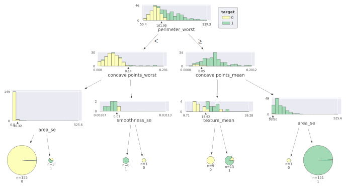
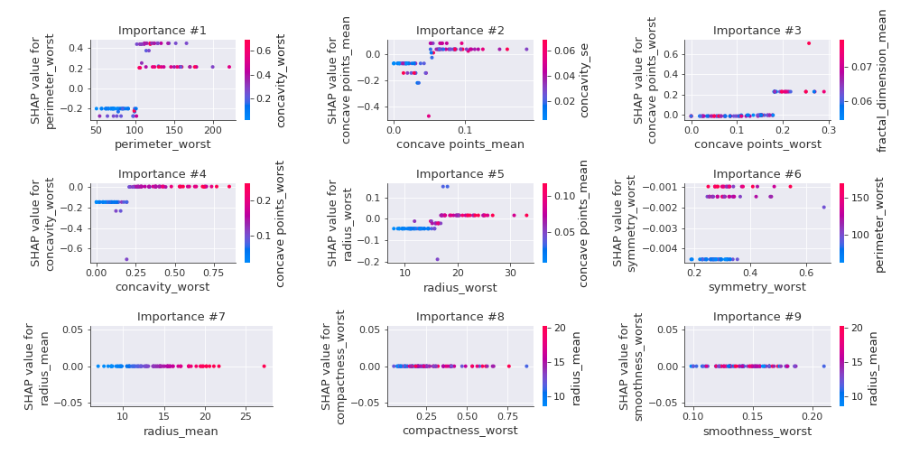
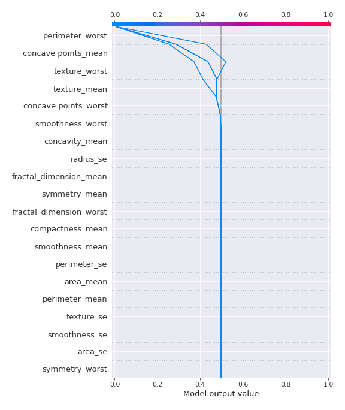

# Summary of 1_DecisionTree

[<< Go back](../README.md)

## Decision Tree
- **n_jobs**: -1
- **criterion**: gini
- **max_depth**: 3
- **explain_level**: 2

## Validation
 - **validation_type**: kfold
 - **k_folds**: 5
 - **shuffle**: True
 - **stratify**: True
 - **random_seed**: 1230

## Optimized metric
logloss

## Training time

41.0 seconds

## Metric details
|           |    score |   threshold |
|:----------|---------:|------------:|
| logloss   | 0.486044 |  nan        |
| auc       | 0.93048  |  nan        |
| f1        | 0.932084 |    0.169892 |
| accuracy  | 0.931604 |    0.5      |
| precision | 0.951807 |    0.996689 |
| recall    | 0.976415 |    0        |
| mcc       | 0.863294 |    0.169892 |

## Confusion matrix (at threshold=0.5)
|                     |   Predicted as negative |   Predicted as positive |
|:--------------------|------------------------:|------------------------:|
| Labeled as negative |                     197 |                      15 |
| Labeled as positive |                      14 |                     198 |

## Learning curves

## Decision Tree 

### Tree #1

### Rules

if (perimeter_worst > 101.95) and (texture_mean > 14.895) and (concave points_worst > 0.085) then class: 1 (proba: 98.18%) | based on 165 samples

if (perimeter_worst <= 101.95) and (compactness_worst <= 0.455) and (symmetry_worst > 0.157) then class: 0 (proba: 99.36%) | based on 157 samples

if (perimeter_worst > 101.95) and (texture_mean <= 14.895) and (concave points_mean <= 0.083) then class: 0 (proba: 100.0%) | based on 7 samples

if (perimeter_worst > 101.95) and (texture_mean > 14.895) and (concave points_worst <= 0.085) then class: 0 (proba: 66.67%) | based on 3 samples

if (perimeter_worst <= 101.95) and (compactness_worst > 0.455) and (smoothness_se > 0.007) then class: 1 (proba: 100.0%) | based on 3 samples

if (perimeter_worst > 101.95) and (texture_mean <= 14.895) and (concave points_mean > 0.083) then class: 1 (proba: 100.0%) | based on 2 samples

if (perimeter_worst <= 101.95) and (compactness_worst > 0.455) and (smoothness_se <= 0.007) then class: 0 (proba: 100.0%) | based on 1 samples

if (perimeter_worst <= 101.95) and (compactness_worst <= 0.455) and (symmetry_worst <= 0.157) then class: 1 (proba: 100.0%) | based on 1 samples

### Tree #2

### Rules

if (perimeter_worst <= 101.95) and (concave points_worst <= 0.135) and (area_se <= 46.315) then class: 0 (proba: 99.35%) | based on 155 samples

if (perimeter_worst > 101.95) and (concave points_mean > 0.049) and (area_se > 16.195) then class: 1 (proba: 99.34%) | based on 151 samples

if (perimeter_worst > 101.95) and (concave points_mean <= 0.049) and (texture_mean > 18.92) then class: 1 (proba: 84.62%) | based on 13 samples

if (perimeter_worst > 101.95) and (concave points_mean <= 0.049) and (texture_mean <= 18.92) then class: 0 (proba: 100.0%) | based on 9 samples

if (perimeter_worst <= 101.95) and (concave points_worst > 0.135) and (smoothness_se <= 0.01) then class: 1 (proba: 100.0%) | based on 6 samples

if (perimeter_worst <= 101.95) and (concave points_worst <= 0.135) and (area_se > 46.315) then class: 1 (proba: 66.67%) | based on 3 samples

if (perimeter_worst > 101.95) and (concave points_mean > 0.049) and (area_se <= 16.195) then class: 0 (proba: 100.0%) | based on 1 samples

if (perimeter_worst <= 101.95) and (concave points_worst > 0.135) and (smoothness_se > 0.01) then class: 0 (proba: 100.0%) | based on 1 samples

### Tree #3

### Rules

if (perimeter_worst <= 102.1) and (concave points_worst <= 0.181) and (symmetry_worst > 0.157) then class: 0 (proba: 98.1%) | based on 158 samples

if (perimeter_worst > 102.1) and (concave points_mean > 0.05) and (concavity_worst > 0.196) then class: 1 (proba: 100.0%) | based on 149 samples

if (perimeter_worst > 102.1) and (concave points_mean <= 0.05) and (radius_worst > 16.83) then class: 1 (proba: 80.0%) | based on 15 samples

if (perimeter_worst > 102.1) and (concave points_mean <= 0.05) and (radius_worst <= 16.83) then class: 0 (proba: 91.67%) | based on 12 samples

if (perimeter_worst <= 102.1) and (concave points_worst > 0.181) then class: 1 (proba: 100.0%) | based on 3 samples

if (perimeter_worst > 102.1) and (concave points_mean > 0.05) and (concavity_worst <= 0.196) then class: 0 (proba: 100.0%) | based on 1 samples

if (perimeter_worst <= 102.1) and (concave points_worst <= 0.181) and (symmetry_worst <= 0.157) then class: 1 (proba: 100.0%) | based on 1 samples

### Tree #4

### Rules

if (perimeter_worst <= 101.45) and (concave points_worst <= 0.181) and (smoothness_worst <= 0.191) then class: 0 (proba: 99.35%) | based on 155 samples

if (perimeter_worst > 101.45) and (concave points_mean > 0.049) and (texture_mean > 15.345) then class: 1 (proba: 100.0%) | based on 148 samples

if (perimeter_worst > 101.45) and (concave points_mean <= 0.049) and (texture_worst > 26.015) then class: 1 (proba: 83.33%) | based on 12 samples

if (perimeter_worst > 101.45) and (concave points_mean <= 0.049) and (texture_worst <= 26.015) then class: 0 (proba: 91.67%) | based on 12 samples

if (perimeter_worst > 101.45) and (concave points_mean > 0.049) and (texture_mean <= 15.345) then class: 1 (proba: 57.14%) | based on 7 samples

if (perimeter_worst <= 101.45) and (concave points_worst > 0.181) then class: 1 (proba: 100.0%) | based on 4 samples

if (perimeter_worst <= 101.45) and (concave points_worst <= 0.181) and (smoothness_worst > 0.191) then class: 1 (proba: 100.0%) | based on 1 samples

### Tree #5

### Rules

if (concave points_mean <= 0.049) and (area_worst <= 893.65) and (area_se <= 48.7) then class: 0 (proba: 98.15%) | based on 162 samples

if (concave points_mean > 0.049) and (concavity_worst > 0.223) and (area_se > 13.93) then class: 1 (proba: 99.36%) | based on 156 samples

if (concave points_mean <= 0.049) and (area_worst > 893.65) and (symmetry_worst > 0.242) then class: 1 (proba: 100.0%) | based on 9 samples

if (concave points_mean > 0.049) and (concavity_worst <= 0.223) and (symmetry_worst <= 0.316) then class: 0 (proba: 100.0%) | based on 6 samples

if (concave points_mean <= 0.049) and (area_worst > 893.65) and (symmetry_worst <= 0.242) then class: 0 (proba: 100.0%) | based on 3 samples

if (concave points_mean <= 0.049) and (area_worst <= 893.65) and (area_se > 48.7) then class: 1 (proba: 100.0%) | based on 2 samples

if (concave points_mean > 0.049) and (concavity_worst > 0.223) and (area_se <= 13.93) then class: 0 (proba: 100.0%) | based on 1 samples

if (concave points_mean > 0.049) and (concavity_worst <= 0.223) and (symmetry_worst > 0.316) then class: 1 (proba: 100.0%) | based on 1 samples

## Permutation-based Importance

## SHAP Importance

## SHAP Dependence plots

### Dependence (Fold 1)

### Dependence (Fold 2)

### Dependence (Fold 3)

### Dependence (Fold 4)

### Dependence (Fold 5)

## SHAP Decision plots

### Top-10 Worst decisions for class 0 (Fold 1)

### Top-10 Worst decisions for class 0 (Fold 2)

### Top-10 Worst decisions for class 0 (Fold 3)

### Top-10 Worst decisions for class 0 (Fold 4)

### Top-10 Worst decisions for class 0 (Fold 5)

### Top-10 Best decisions for class 0 (Fold 1)

### Top-10 Best decisions for class 0 (Fold 2)

### Top-10 Best decisions for class 0 (Fold 3)

### Top-10 Best decisions for class 0 (Fold 4)

### Top-10 Best decisions for class 0 (Fold 5)

### Top-10 Worst decisions for class 1 (Fold 1)

### Top-10 Worst decisions for class 1 (Fold 2)

### Top-10 Worst decisions for class 1 (Fold 3)

### Top-10 Worst decisions for class 1 (Fold 4)

### Top-10 Worst decisions for class 1 (Fold 5)

### Top-10 Best decisions for class 1 (Fold 1)

### Top-10 Best decisions for class 1 (Fold 2)

### Top-10 Best decisions for class 1 (Fold 3)

### Top-10 Best decisions for class 1 (Fold 4)

### Top-10 Best decisions for class 1 (Fold 5)

[<< Go back](../README.md)
