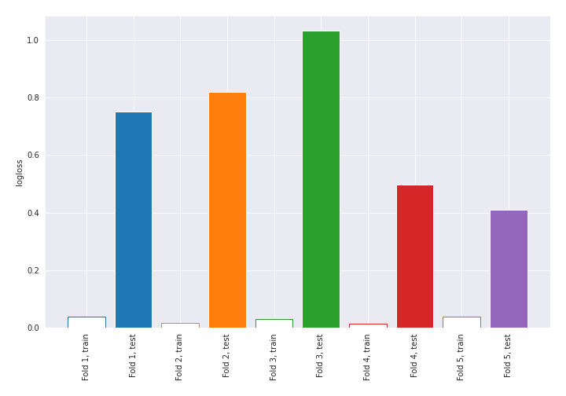
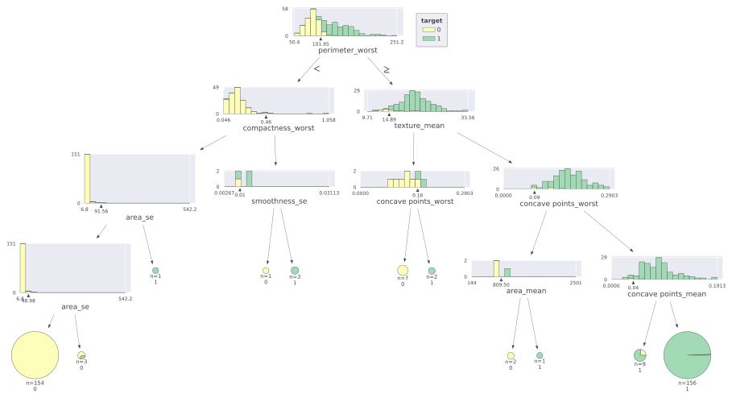

# Summary of 2_DecisionTree

[<< Go back](../README.md)

## Decision Tree
- **n_jobs**: -1
- **criterion**: gini
- **max_depth**: 4
- **explain_level**: 2

## Validation
 - **validation_type**: kfold
 - **k_folds**: 5
 - **shuffle**: True
 - **stratify**: True
 - **random_seed**: 1230

## Optimized metric
logloss

## Training time

38.2 seconds

## Metric details
|           |    score |   threshold |
|:----------|---------:|------------:|
| logloss   | 0.702636 |         nan |
| auc       | 0.935687 |         nan |
| f1        | 0.785992 |           0 |
| accuracy  | 0.740566 |           0 |
| precision | 0.668874 |           0 |
| recall    | 0.95283  |           0 |
| mcc       | 0.531394 |           0 |

## Confusion matrix (at threshold=0.0)
|                     |   Predicted as negative |   Predicted as positive |
|:--------------------|------------------------:|------------------------:|
| Labeled as negative |                     112 |                     100 |
| Labeled as positive |                      10 |                     202 |

## Learning curves

## Decision Tree 

### Tree #1

### Rules

if (perimeter_worst > 101.95) and (texture_mean > 14.895) and (concave points_worst > 0.085) and (concave points_mean > 0.04) then class: 1 (proba: 99.36%) | based on 156 samples

if (perimeter_worst <= 101.95) and (compactness_worst <= 0.455) and (area_se <= 91.555) and (area_se <= 48.975) then class: 0 (proba: 100.0%) | based on 154 samples

if (perimeter_worst > 101.95) and (texture_mean > 14.895) and (concave points_worst > 0.085) and (concave points_mean <= 0.04) then class: 1 (proba: 77.78%) | based on 9 samples

if (perimeter_worst > 101.95) and (texture_mean <= 14.895) and (concave points_worst <= 0.159) then class: 0 (proba: 100.0%) | based on 7 samples

if (perimeter_worst <= 101.95) and (compactness_worst > 0.455) and (smoothness_se > 0.007) then class: 1 (proba: 100.0%) | based on 3 samples

if (perimeter_worst <= 101.95) and (compactness_worst <= 0.455) and (area_se <= 91.555) and (area_se > 48.975) then class: 0 (proba: 66.67%) | based on 3 samples

if (perimeter_worst > 101.95) and (texture_mean > 14.895) and (concave points_worst <= 0.085) and (area_mean <= 809.5) then class: 0 (proba: 100.0%) | based on 2 samples

if (perimeter_worst > 101.95) and (texture_mean <= 14.895) and (concave points_worst > 0.159) then class: 1 (proba: 100.0%) | based on 2 samples

if (perimeter_worst > 101.95) and (texture_mean > 14.895) and (concave points_worst <= 0.085) and (area_mean > 809.5) then class: 1 (proba: 100.0%) | based on 1 samples

if (perimeter_worst <= 101.95) and (compactness_worst > 0.455) and (smoothness_se <= 0.007) then class: 0 (proba: 100.0%) | based on 1 samples

if (perimeter_worst <= 101.95) and (compactness_worst <= 0.455) and (area_se > 91.555) then class: 1 (proba: 100.0%) | based on 1 samples

### Tree #2

### Rules

if (perimeter_worst > 101.95) and (concave points_mean > 0.049) and (area_se > 16.195) and (radius_se > 0.241) then class: 1 (proba: 100.0%) | based on 146 samples

if (perimeter_worst <= 101.95) and (concave points_worst <= 0.135) and (area_se <= 46.315) and (texture_worst <= 33.105) then class: 0 (proba: 100.0%) | based on 145 samples

if (perimeter_worst > 101.95) and (concave points_mean <= 0.049) and (concave points_se <= 0.01) and (texture_mean > 16.15) then class: 1 (proba: 100.0%) | based on 11 samples

if (perimeter_worst <= 101.95) and (concave points_worst <= 0.135) and (area_se <= 46.315) and (texture_worst > 33.105) then class: 0 (proba: 90.0%) | based on 10 samples

if (perimeter_worst > 101.95) and (concave points_mean <= 0.049) and (concave points_se > 0.01) then class: 0 (proba: 100.0%) | based on 9 samples

if (perimeter_worst <= 101.95) and (concave points_worst > 0.135) and (texture_se <= 2.237) then class: 1 (proba: 100.0%) | based on 6 samples

if (perimeter_worst > 101.95) and (concave points_mean > 0.049) and (area_se > 16.195) and (radius_se <= 0.241) then class: 1 (proba: 80.0%) | based on 5 samples

if (perimeter_worst > 101.95) and (concave points_mean <= 0.049) and (concave points_se <= 0.01) and (texture_mean <= 16.15) then class: 0 (proba: 100.0%) | based on 2 samples

if (perimeter_worst <= 101.95) and (concave points_worst <= 0.135) and (area_se > 46.315) and (smoothness_se <= 0.007) then class: 1 (proba: 100.0%) | based on 2 samples

if (perimeter_worst > 101.95) and (concave points_mean > 0.049) and (area_se <= 16.195) then class: 0 (proba: 100.0%) | based on 1 samples

if (perimeter_worst <= 101.95) and (concave points_worst > 0.135) and (texture_se > 2.237) then class: 0 (proba: 100.0%) | based on 1 samples

if (perimeter_worst <= 101.95) and (concave points_worst <= 0.135) and (area_se > 46.315) and (smoothness_se > 0.007) then class: 0 (proba: 100.0%) | based on 1 samples

### Tree #3

### Rules

if (perimeter_worst <= 102.1) and (concave points_worst <= 0.181) and (area_se <= 91.555) and (smoothness_worst <= 0.191) then class: 0 (proba: 98.73%) | based on 157 samples

if (perimeter_worst > 102.1) and (concave points_mean > 0.05) and (concavity_mean > 0.072) then class: 1 (proba: 100.0%) | based on 149 samples

if (perimeter_worst > 102.1) and (concave points_mean <= 0.05) and (radius_worst > 16.83) and (symmetry_mean > 0.151) then class: 1 (proba: 100.0%) | based on 12 samples

if (perimeter_worst > 102.1) and (concave points_mean <= 0.05) and (radius_worst <= 16.83) and (fractal_dimension_se > 0.001) then class: 0 (proba: 100.0%) | based on 11 samples

if (perimeter_worst > 102.1) and (concave points_mean <= 0.05) and (radius_worst > 16.83) and (symmetry_mean <= 0.151) then class: 0 (proba: 100.0%) | based on 3 samples

if (perimeter_worst <= 102.1) and (concave points_worst > 0.181) then class: 1 (proba: 100.0%) | based on 3 samples

if (perimeter_worst > 102.1) and (concave points_mean > 0.05) and (concavity_mean <= 0.072) then class: 0 (proba: 100.0%) | based on 1 samples

if (perimeter_worst > 102.1) and (concave points_mean <= 0.05) and (radius_worst <= 16.83) and (fractal_dimension_se <= 0.001) then class: 1 (proba: 100.0%) | based on 1 samples

if (perimeter_worst <= 102.1) and (concave points_worst <= 0.181) and (area_se > 91.555) then class: 1 (proba: 100.0%) | based on 1 samples

if (perimeter_worst <= 102.1) and (concave points_worst <= 0.181) and (area_se <= 91.555) and (smoothness_worst > 0.191) then class: 1 (proba: 100.0%) | based on 1 samples

### Tree #4

### Rules

if (perimeter_worst > 101.45) and (concave points_mean > 0.049) and (texture_mean > 15.345) then class: 1 (proba: 100.0%) | based on 148 samples

if (perimeter_worst <= 101.45) and (concave points_worst <= 0.181) and (smoothness_worst <= 0.191) and (texture_worst <= 33.27) then class: 0 (proba: 100.0%) | based on 145 samples

if (perimeter_worst > 101.45) and (concave points_mean <= 0.049) and (texture_mean <= 18.92) and (smoothness_worst <= 0.141) then class: 0 (proba: 100.0%) | based on 11 samples

if (perimeter_worst <= 101.45) and (concave points_worst <= 0.181) and (smoothness_worst <= 0.191) and (texture_worst > 33.27) then class: 0 (proba: 90.0%) | based on 10 samples

if (perimeter_worst > 101.45) and (concave points_mean <= 0.049) and (texture_mean > 18.92) and (concave points_se <= 0.011) then class: 1 (proba: 100.0%) | based on 9 samples

if (perimeter_worst > 101.45) and (concave points_mean > 0.049) and (texture_mean <= 15.345) and (area_se > 36.29) then class: 1 (proba: 100.0%) | based on 4 samples

if (perimeter_worst <= 101.45) and (concave points_worst > 0.181) then class: 1 (proba: 100.0%) | based on 4 samples

if (perimeter_worst > 101.45) and (concave points_mean > 0.049) and (texture_mean <= 15.345) and (area_se <= 36.29) then class: 0 (proba: 100.0%) | based on 3 samples

if (perimeter_worst > 101.45) and (concave points_mean <= 0.049) and (texture_mean > 18.92) and (concave points_se > 0.011) then class: 0 (proba: 66.67%) | based on 3 samples

if (perimeter_worst > 101.45) and (concave points_mean <= 0.049) and (texture_mean <= 18.92) and (smoothness_worst > 0.141) then class: 1 (proba: 100.0%) | based on 1 samples

if (perimeter_worst <= 101.45) and (concave points_worst <= 0.181) and (smoothness_worst > 0.191) then class: 1 (proba: 100.0%) | based on 1 samples

### Tree #5

### Rules

if (concave points_mean <= 0.049) and (area_worst <= 893.65) and (area_se <= 48.7) and (texture_worst <= 39.075) then class: 0 (proba: 98.76%) | based on 161 samples

if (concave points_mean > 0.049) and (concavity_worst > 0.223) and (area_se > 13.93) and (texture_mean > 15.345) then class: 1 (proba: 100.0%) | based on 150 samples

if (concave points_mean <= 0.049) and (area_worst > 893.65) and (symmetry_mean > 0.151) then class: 1 (proba: 100.0%) | based on 9 samples

if (concave points_mean > 0.049) and (concavity_worst > 0.223) and (area_se > 13.93) and (texture_mean <= 15.345) then class: 1 (proba: 83.33%) | based on 6 samples

if (concave points_mean > 0.049) and (concavity_worst <= 0.223) and (area_worst <= 1066.4) then class: 0 (proba: 100.0%) | based on 6 samples

if (concave points_mean <= 0.049) and (area_worst > 893.65) and (symmetry_mean <= 0.151) then class: 0 (proba: 100.0%) | based on 3 samples

if (concave points_mean <= 0.049) and (area_worst <= 893.65) and (area_se > 48.7) then class: 1 (proba: 100.0%) | based on 2 samples

if (concave points_mean > 0.049) and (concavity_worst > 0.223) and (area_se <= 13.93) then class: 0 (proba: 100.0%) | based on 1 samples

if (concave points_mean > 0.049) and (concavity_worst <= 0.223) and (area_worst > 1066.4) then class: 1 (proba: 100.0%) | based on 1 samples

if (concave points_mean <= 0.049) and (area_worst <= 893.65) and (area_se <= 48.7) and (texture_worst > 39.075) then class: 1 (proba: 100.0%) | based on 1 samples

## Permutation-based Importance

## SHAP Importance

## SHAP Dependence plots

### Dependence (Fold 1)

### Dependence (Fold 2)

### Dependence (Fold 3)

### Dependence (Fold 4)

### Dependence (Fold 5)

## SHAP Decision plots

### Top-10 Worst decisions for class 0 (Fold 1)

### Top-10 Worst decisions for class 0 (Fold 2)

### Top-10 Worst decisions for class 0 (Fold 3)

### Top-10 Worst decisions for class 0 (Fold 4)

### Top-10 Worst decisions for class 0 (Fold 5)

### Top-10 Best decisions for class 0 (Fold 1)

### Top-10 Best decisions for class 0 (Fold 2)

### Top-10 Best decisions for class 0 (Fold 3)

### Top-10 Best decisions for class 0 (Fold 4)

### Top-10 Best decisions for class 0 (Fold 5)

### Top-10 Worst decisions for class 1 (Fold 1)

### Top-10 Worst decisions for class 1 (Fold 2)

### Top-10 Worst decisions for class 1 (Fold 3)

### Top-10 Worst decisions for class 1 (Fold 4)

### Top-10 Worst decisions for class 1 (Fold 5)

### Top-10 Best decisions for class 1 (Fold 1)

### Top-10 Best decisions for class 1 (Fold 2)

### Top-10 Best decisions for class 1 (Fold 3)

### Top-10 Best decisions for class 1 (Fold 4)

### Top-10 Best decisions for class 1 (Fold 5)

[<< Go back](../README.md)
