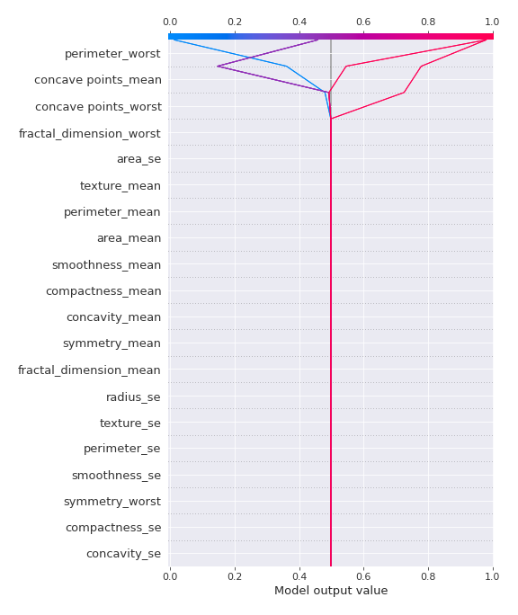
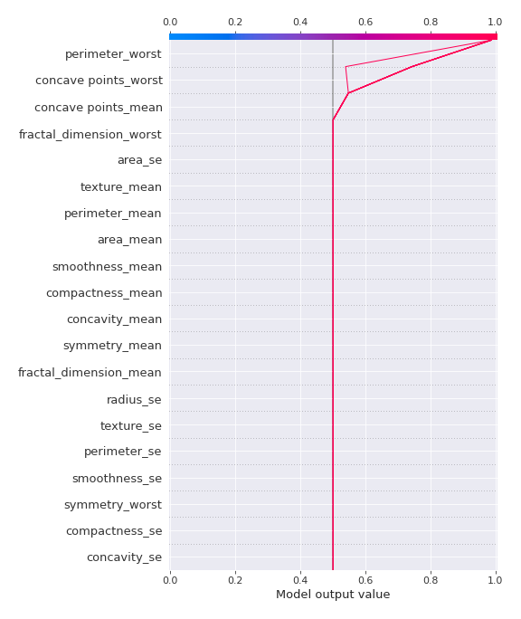
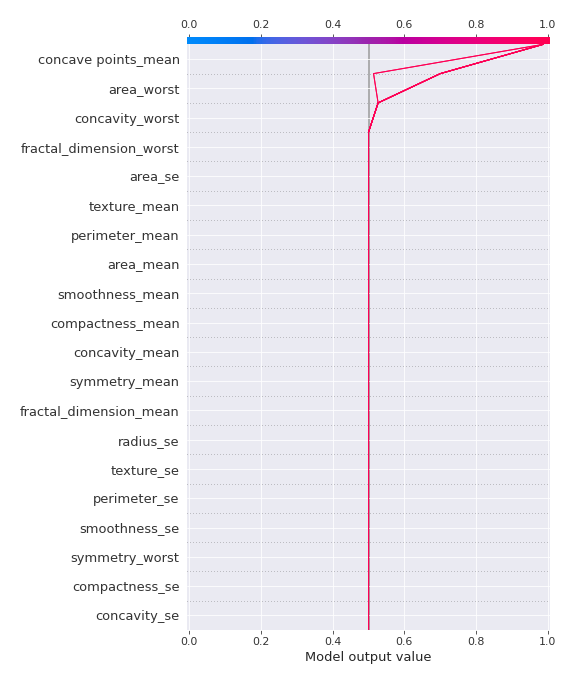

# Summary of 30_DecisionTree

[<< Go back](../README.md)

## Decision Tree
- **n_jobs**: -1
- **criterion**: gini
- **max_depth**: 2
- **explain_level**: 2

## Validation
 - **validation_type**: kfold
 - **k_folds**: 5
 - **shuffle**: True
 - **stratify**: True
 - **random_seed**: 1230

## Optimized metric
logloss

## Training time

27.1 seconds

## Metric details
|           |    score |   threshold |
|:----------|---------:|------------:|
| logloss   | 0.241646 | nan         |
| auc       | 0.95036  | nan         |
| f1        | 0.931818 |   0.0304878 |
| accuracy  | 0.929245 |   0.0304878 |
| precision | 1        |   0.993333  |
| recall    | 1        |   0.0113924 |
| mcc       | 0.860946 |   0.0304878 |

## Confusion matrix (at threshold=0.030488)
|                     |   Predicted as negative |   Predicted as positive |
|:--------------------|------------------------:|------------------------:|
| Labeled as negative |                     189 |                      23 |
| Labeled as positive |                       7 |                     205 |

## Learning curves

## Decision Tree 

### Tree #1

### Rules

if (perimeter_worst > 101.95) and (texture_mean > 14.895) then class: 1 (proba: 97.02%) | based on 168 samples

if (perimeter_worst <= 101.95) and (compactness_worst <= 0.455) then class: 0 (proba: 98.73%) | based on 158 samples

if (perimeter_worst > 101.95) and (texture_mean <= 14.895) then class: 0 (proba: 77.78%) | based on 9 samples

if (perimeter_worst <= 101.95) and (compactness_worst > 0.455) then class: 1 (proba: 75.0%) | based on 4 samples

### Tree #2

### Rules

if (perimeter_worst <= 101.95) and (concave points_worst <= 0.135) then class: 0 (proba: 98.1%) | based on 158 samples

if (perimeter_worst > 101.95) and (concave points_mean > 0.049) then class: 1 (proba: 98.68%) | based on 152 samples

if (perimeter_worst > 101.95) and (concave points_mean <= 0.049) then class: 0 (proba: 50.0%) | based on 22 samples

if (perimeter_worst <= 101.95) and (concave points_worst > 0.135) then class: 1 (proba: 85.71%) | based on 7 samples

### Tree #3

### Rules

if (perimeter_worst <= 102.1) and (concave points_worst <= 0.181) then class: 0 (proba: 97.48%) | based on 159 samples

if (perimeter_worst > 102.1) and (concave points_mean > 0.05) then class: 1 (proba: 99.33%) | based on 150 samples

if (perimeter_worst > 102.1) and (concave points_mean <= 0.05) then class: 0 (proba: 51.85%) | based on 27 samples

if (perimeter_worst <= 102.1) and (concave points_worst > 0.181) then class: 1 (proba: 100.0%) | based on 3 samples

### Tree #4

### Rules

if (perimeter_worst <= 101.45) and (concave points_worst <= 0.181) then class: 0 (proba: 98.72%) | based on 156 samples

if (perimeter_worst > 101.45) and (concave points_mean > 0.049) then class: 1 (proba: 98.06%) | based on 155 samples

if (perimeter_worst > 101.45) and (concave points_mean <= 0.049) then class: 0 (proba: 54.17%) | based on 24 samples

if (perimeter_worst <= 101.45) and (concave points_worst > 0.181) then class: 1 (proba: 100.0%) | based on 4 samples

### Tree #5

### Rules

if (concave points_mean <= 0.049) and (area_worst <= 893.65) then class: 0 (proba: 96.95%) | based on 164 samples

if (concave points_mean > 0.049) and (concavity_worst > 0.223) then class: 1 (proba: 98.73%) | based on 157 samples

if (concave points_mean <= 0.049) and (area_worst > 893.65) then class: 1 (proba: 75.0%) | based on 12 samples

if (concave points_mean > 0.049) and (concavity_worst <= 0.223) then class: 0 (proba: 85.71%) | based on 7 samples

## Permutation-based Importance

## SHAP Importance

## SHAP Dependence plots

### Dependence (Fold 1)

### Dependence (Fold 2)

### Dependence (Fold 3)

### Dependence (Fold 4)

### Dependence (Fold 5)

## SHAP Decision plots

### Top-10 Worst decisions for class 0 (Fold 1)

### Top-10 Worst decisions for class 0 (Fold 2)

### Top-10 Worst decisions for class 0 (Fold 3)

### Top-10 Worst decisions for class 0 (Fold 4)

### Top-10 Worst decisions for class 0 (Fold 5)

### Top-10 Best decisions for class 0 (Fold 1)

### Top-10 Best decisions for class 0 (Fold 2)

### Top-10 Best decisions for class 0 (Fold 3)

### Top-10 Best decisions for class 0 (Fold 4)

### Top-10 Best decisions for class 0 (Fold 5)

### Top-10 Worst decisions for class 1 (Fold 1)

### Top-10 Worst decisions for class 1 (Fold 2)

### Top-10 Worst decisions for class 1 (Fold 3)

### Top-10 Worst decisions for class 1 (Fold 4)

### Top-10 Worst decisions for class 1 (Fold 5)

### Top-10 Best decisions for class 1 (Fold 1)

### Top-10 Best decisions for class 1 (Fold 2)

### Top-10 Best decisions for class 1 (Fold 3)

### Top-10 Best decisions for class 1 (Fold 4)

### Top-10 Best decisions for class 1 (Fold 5)

[<< Go back](../README.md)
