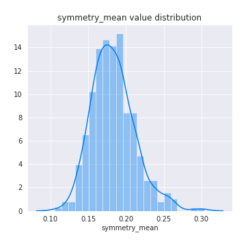
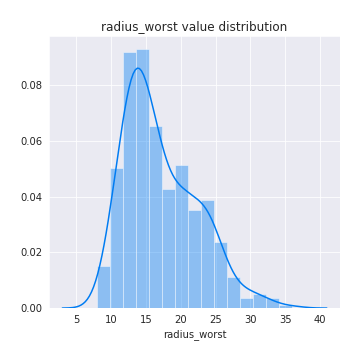

# Exploratory Data Analysis

[<< Go back](../README.md)
## Feature : target
- **Feature type** : discrete
- **Missing** : 0.0%
- **Unique** : 2
- **Count** :424.0
- **Mean** :0.5
- **Std** :0.5005906676601786
- **Min** :0.0
- **25%th Percentile** : 0.0
- **50%th Percentile** : 0.5
- **75%th Percentile** : 1.0
- **Max** :1.0

## Feature : radius_mean
- **Feature type** : continous
- **Missing** : 0.0%
- **Unique** : 362
- **Count** :424.0
- **Mean** :14.680459905660394
- **Std** :3.8101088402137764
- **Min** :6.981
- **25%th Percentile** : 11.8325
- **50%th Percentile** : 13.815000000000001
- **75%th Percentile** : 17.3675
- **Max** :28.11

## Feature : texture_mean
- **Feature type** : continous
- **Missing** : 0.0%
- **Unique** : 381
- **Count** :424.0
- **Mean** :19.7729245283019
- **Std** :4.310405128586077
- **Min** :9.71
- **25%th Percentile** : 16.79
- **50%th Percentile** : 19.575
- **75%th Percentile** : 22.3
- **Max** :39.28

## Feature : perimeter_mean
- **Feature type** : continous
- **Missing** : 0.0%
- **Unique** : 392
- **Count** :424.0
- **Mean** :95.8541273584906
- **Std** :26.2804367763612
- **Min** :43.79
- **25%th Percentile** : 76.355
- **50%th Percentile** : 89.765
- **75%th Percentile** : 114.25
- **Max** :188.5

## Feature : area_mean
- **Feature type** : continous
- **Missing** : 0.0%
- **Unique** : 406
- **Count** :424.0
- **Mean** :711.5544811320755
- **Std** :384.61901646768825
- **Min** :143.5
- **25%th Percentile** : 431.775
- **50%th Percentile** : 588.8
- **75%th Percentile** : 936.7750000000001
- **Max** :2501.0

## Feature : smoothness_mean
- **Feature type** : continous
- **Missing** : 0.0%
- **Unique** : 358
- **Count** :424.0
- **Mean** :0.09790771226415088
- **Std** :0.014077493017135859
- **Min** :0.05263
- **25%th Percentile** : 0.0878175
- **50%th Percentile** : 0.09752
- **75%th Percentile** : 0.10642499999999999
- **Max** :0.1634

## Feature : compactness_mean
- **Feature type** : continous
- **Missing** : 0.0%
- **Unique** : 407
- **Count** :424.0
- **Mean** :0.11115971698113213
- **Std** :0.05567406285782472
- **Min** :0.01938
- **25%th Percentile** : 0.06740750000000001
- **50%th Percentile** : 0.10214999999999999
- **75%th Percentile** : 0.139225
- **Max** :0.3454

## Feature : concavity_mean
- **Feature type** : continous
- **Missing** : 0.0%
- **Unique** : 408
- **Count** :424.0
- **Mean** :0.1010533231132075
- **Std** :0.0855878347108874
- **Min** :0.0
- **25%th Percentile** : 0.0329825
- **50%th Percentile** : 0.07866000000000001
- **75%th Percentile** : 0.15255000000000002
- **Max** :0.4268

## Feature : concave points_mean
- **Feature type** : continous
- **Missing** : 0.0%
- **Unique** : 410
- **Count** :424.0
- **Mean** :0.055806094339622685
- **Std** :0.041533952420969904
- **Min** :0.0
- **25%th Percentile** : 0.0225925
- **50%th Percentile** : 0.04514
- **75%th Percentile** : 0.08626
- **Max** :0.2012

## Feature : symmetry_mean
- **Feature type** : continous
- **Missing** : 0.0%
- **Unique** : 349
- **Count** :424.0
- **Mean** :0.1831117924528301
- **Std** :0.028622552278005836
- **Min** :0.106
- **25%th Percentile** : 0.16317500000000001
- **50%th Percentile** : 0.18
- **75%th Percentile** : 0.19805
- **Max** :0.304

## Feature : fractal_dimension_mean
- **Feature type** : continous
- **Missing** : 0.0%
- **Unique** : 392
- **Count** :424.0
- **Mean** :0.06279780660377351
- **Std** :0.007213875463060892
- **Min** :0.04996
- **25%th Percentile** : 0.0574275
- **50%th Percentile** : 0.0614
- **75%th Percentile** : 0.06626
- **Max** :0.09744

## Feature : radius_se
- **Feature type** : continous
- **Missing** : 0.0%
- **Unique** : 413
- **Count** :424.0
- **Mean** :0.4445709905660377
- **Std** :0.3052771109979471
- **Min** :0.1144
- **25%th Percentile** : 0.24015
- **50%th Percentile** : 0.35225
- **75%th Percentile** : 0.554375
- **Max** :2.873

## Feature : texture_se
- **Feature type** : continous
- **Missing** : 0.0%
- **Unique** : 392
- **Count** :424.0
- **Mean** :1.2083601415094338
- **Std** :0.5226469582521194
- **Min** :0.3602
- **25%th Percentile** : 0.8398500000000001
- **50%th Percentile** : 1.1284999999999998
- **75%th Percentile** : 1.46275
- **Max** :3.896

## Feature : perimeter_se
- **Feature type** : continous
- **Missing** : 0.0%
- **Unique** : 405
- **Count** :424.0
- **Mean** :3.129727358490566
- **Std** :2.2329127495384062
- **Min** :0.8439
- **25%th Percentile** : 1.68675
- **50%th Percentile** : 2.4705000000000004
- **75%th Percentile** : 3.7760000000000002
- **Max** :21.98

## Feature : area_se
- **Feature type** : continous
- **Missing** : 0.0%
- **Unique** : 405
- **Count** :424.0
- **Mean** :46.557040094339655
- **Std** :51.01305201377015
- **Min** :6.802
- **25%th Percentile** : 18.465
- **50%th Percentile** : 28.384999999999998
- **75%th Percentile** : 58.555
- **Max** :542.2

## Feature : smoothness_se
- **Feature type** : continous
- **Missing** : 0.0%
- **Unique** : 412
- **Count** :424.0
- **Mean** :0.007113658018867926
- **Std** :0.0030269456487995636
- **Min** :0.002667
- **25%th Percentile** : 0.0052675
- **50%th Percentile** : 0.006399
- **75%th Percentile** : 0.008174
- **Max** :0.03113

## Feature : compactness_se
- **Feature type** : continous
- **Missing** : 0.0%
- **Unique** : 410
- **Count** :424.0
- **Mean** :0.026390415094339606
- **Std** :0.018341741659630185
- **Min** :0.002252
- **25%th Percentile** : 0.013707500000000001
- **50%th Percentile** : 0.022010000000000002
- **75%th Percentile** : 0.0334575
- **Max** :0.1354

## Feature : concavity_se
- **Feature type** : continous
- **Missing** : 0.0%
- **Unique** : 405
- **Count** :424.0
- **Mean** :0.033347806367924504
- **Std** :0.0317880336526412
- **Min** :0.0
- **25%th Percentile** : 0.015939999999999996
- **50%th Percentile** : 0.027135
- **75%th Percentile** : 0.0426825
- **Max** :0.396

## Feature : concave points_se
- **Feature type** : continous
- **Missing** : 0.0%
- **Unique** : 394
- **Count** :424.0
- **Mean** :0.012332724056603775
- **Std** :0.006350011047199977
- **Min** :0.0
- **25%th Percentile** : 0.0081835
- **50%th Percentile** : 0.011415
- **75%th Percentile** : 0.015395
- **Max** :0.05279

## Feature : symmetry_se
- **Feature type** : continous
- **Missing** : 0.0%
- **Unique** : 384
- **Count** :424.0
- **Mean** :0.020776316037735845
- **Std** :0.008853940945094566
- **Min** :0.007882
- **25%th Percentile** : 0.014987499999999999
- **50%th Percentile** : 0.0187
- **75%th Percentile** : 0.02383
- **Max** :0.07895

## Feature : fractal_dimension_se
- **Feature type** : continous
- **Missing** : 0.0%
- **Unique** : 406
- **Count** :424.0
- **Mean** :0.003805154481132074
- **Std** :0.002624078673759452
- **Min** :0.0009502
- **25%th Percentile** : 0.0022710000000000004
- **50%th Percentile** : 0.003224
- **75%th Percentile** : 0.00456
- **Max** :0.02984

## Feature : radius_worst
- **Feature type** : continous
- **Missing** : 0.0%
- **Unique** : 372
- **Count** :424.0
- **Mean** :17.123806603773588
- **Std** :5.227036176180124
- **Min** :7.93
- **25%th Percentile** : 13.0825
- **50%th Percentile** : 15.78
- **75%th Percentile** : 20.585
- **Max** :36.04

## Feature : texture_worst
- **Feature type** : continous
- **Missing** : 0.0%
- **Unique** : 391
- **Count** :424.0
- **Mean** :26.385377358490558
- **Std** :6.238059144506471
- **Min** :12.02
- **25%th Percentile** : 21.8
- **50%th Percentile** : 26.115000000000002
- **75%th Percentile** : 30.865
- **Max** :49.54

## Feature : perimeter_worst
- **Feature type** : continous
- **Missing** : 0.0%
- **Unique** : 393
- **Count** :424.0
- **Mean** :113.19021226415103
- **Std** :36.349939268516174
- **Min** :50.41
- **25%th Percentile** : 84.94749999999999
- **50%th Percentile** : 105.15
- **75%th Percentile** : 137.95000000000002
- **Max** :251.2

## Feature : area_worst
- **Feature type** : continous
- **Missing** : 0.0%
- **Unique** : 412
- **Count** :424.0
- **Mean** :980.0481132075477
- **Std** :622.9331527237806
- **Min** :185.2
- **25%th Percentile** : 521.45
- **50%th Percentile** : 764.65
- **75%th Percentile** : 1302.5
- **Max** :4254.0

## Feature : smoothness_worst
- **Feature type** : continous
- **Missing** : 0.0%
- **Unique** : 327
- **Count** :424.0
- **Mean** :0.13573509433962253
- **Std** :0.02265918166966913
- **Min** :0.08125
- **25%th Percentile** : 0.12152500000000001
- **50%th Percentile** : 0.13545000000000001
- **75%th Percentile** : 0.14955000000000002
- **Max** :0.2226

## Feature : compactness_worst
- **Feature type** : continous
- **Missing** : 0.0%
- **Unique** : 402
- **Count** :424.0
- **Mean** :0.27417625000000023
- **Std** :0.16802712138911047
- **Min** :0.03432
- **25%th Percentile** : 0.15715
- **50%th Percentile** : 0.2283
- **75%th Percentile** : 0.36255
- **Max** :1.058

## Feature : concavity_worst
- **Feature type** : continous
- **Missing** : 0.0%
- **Unique** : 406
- **Count** :424.0
- **Mean** :0.30133600943396227
- **Std** :0.22098961843441228
- **Min** :0.0
- **25%th Percentile** : 0.1229
- **50%th Percentile** : 0.26595
- **75%th Percentile** : 0.41655
- **Max** :1.252

## Feature : concave points_worst
- **Feature type** : continous
- **Missing** : 0.0%
- **Unique** : 379
- **Count** :424.0
- **Mean** :0.1264989363207548
- **Std** :0.06888284450359244
- **Min** :0.0
- **25%th Percentile** : 0.06665750000000001
- **50%th Percentile** : 0.11525
- **75%th Percentile** : 0.182
- **Max** :0.291

## Feature : symmetry_worst
- **Feature type** : continous
- **Missing** : 0.0%
- **Unique** : 385
- **Count** :424.0
- **Mean** :0.29755471698113223
- **Std** :0.06637740170873614
- **Min** :0.1565
- **25%th Percentile** : 0.256625
- **50%th Percentile** : 0.2875
- **75%th Percentile** : 0.323575
- **Max** :0.6638

## Feature : fractal_dimension_worst
- **Feature type** : continous
- **Missing** : 0.0%
- **Unique** : 402
- **Count** :424.0
- **Mean** :0.0852059433962264
- **Std** :0.019032597272016616
- **Min** :0.05504
- **25%th Percentile** : 0.072045
- **50%th Percentile** : 0.08125
- **75%th Percentile** : 0.09396
- **Max** :0.2075

[<< Go back](../README.md)
