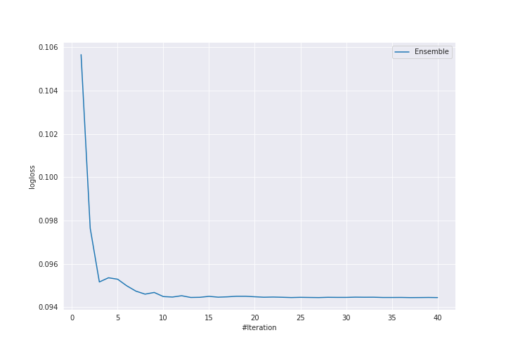

# Summary of Ensemble

[<< Go back](../README.md)

## Ensemble structure
| Model                             |   Weight |
|:----------------------------------|---------:|
| 16_NeuralNetwork_SelectedFeatures |        3 |
| 27_NeuralNetwork                  |       11 |
| 9_Xgboost                         |       21 |
| 9_Xgboost_SelectedFeatures        |        2 |

## Metric details
|           |     score |     threshold |
|:----------|----------:|--------------:|
| logloss   | 0.0944453 | nan           |
| auc       | 0.993681  | nan           |
| f1        | 0.969121  |   0.633184    |
| accuracy  | 0.96934   |   0.633184    |
| precision | 1         |   0.999665    |
| recall    | 1         |   0.000177771 |
| mcc       | 0.938773  |   0.633184    |

## Confusion matrix (at threshold=0.633184)
|                     |   Predicted as negative |   Predicted as positive |
|:--------------------|------------------------:|------------------------:|
| Labeled as negative |                     207 |                       5 |
| Labeled as positive |                       8 |                     204 |

## Learning curves

[<< Go back](../README.md)
