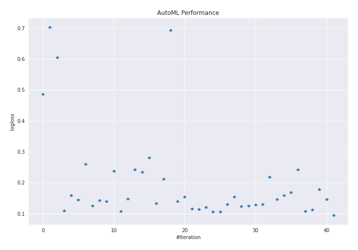
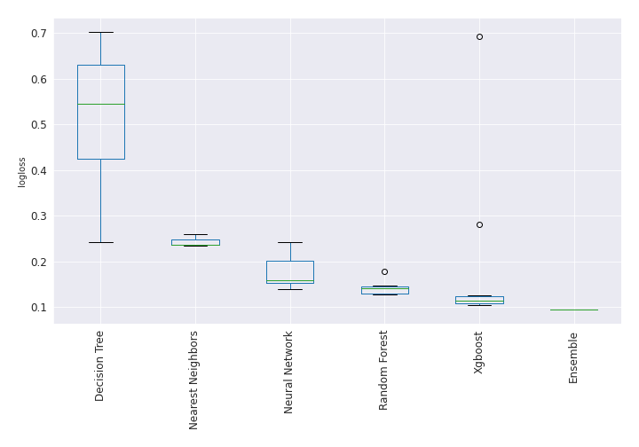

# AutoML Leaderboard

| Best model   | name                                                                             | model_type        | metric_type   |   metric_value |   train_time |   single_prediction_time |
|:-------------|:---------------------------------------------------------------------------------|:------------------|:--------------|---------------:|-------------:|-------------------------:|
|              | [1_DecisionTree](1_DecisionTree/README.md)                                       | Decision Tree     | logloss       |      0.486044  |        42.25 |                   0.0617 |
|              | [2_DecisionTree](2_DecisionTree/README.md)                                       | Decision Tree     | logloss       |      0.702636  |        39.42 |                   0.0552 |
|              | [3_DecisionTree](3_DecisionTree/README.md)                                       | Decision Tree     | logloss       |      0.605411  |        38.03 |                   0.0554 |
|              | [4_Default_Xgboost](4_Default_Xgboost/README.md)                                 | Xgboost           | logloss       |      0.108257  |        39.7  |                   0.0549 |
|              | [5_Default_NeuralNetwork](5_Default_NeuralNetwork/README.md)                     | Neural Network    | logloss       |      0.158331  |         6.08 |                   0.0795 |
|              | [6_Default_RandomForest](6_Default_RandomForest/README.md)                       | Random Forest     | logloss       |      0.143514  |        70.45 |                   0.5679 |
|              | [7_Default_NearestNeighbors](7_Default_NearestNeighbors/README.md)               | Nearest Neighbors | logloss       |      0.259616  |        43.57 |                   0.6004 |
|              | [8_Xgboost](8_Xgboost/README.md)                                                 | Xgboost           | logloss       |      0.125546  |        32.64 |                   0.0515 |
|              | [12_RandomForest](12_RandomForest/README.md)                                     | Random Forest     | logloss       |      0.141912  |        71.78 |                   0.5703 |
|              | [16_NeuralNetwork](16_NeuralNetwork/README.md)                                   | Neural Network    | logloss       |      0.13997   |         5.93 |                   0.0946 |
|              | [20_NearestNeighbors](20_NearestNeighbors/README.md)                             | Nearest Neighbors | logloss       |      0.237086  |        43.89 |                   0.5899 |
|              | [9_Xgboost](9_Xgboost/README.md)                                                 | Xgboost           | logloss       |      0.107058  |        30.89 |                   0.0523 |
|              | [13_RandomForest](13_RandomForest/README.md)                                     | Random Forest     | logloss       |      0.146898  |        80.3  |                   0.5703 |
|              | [17_NeuralNetwork](17_NeuralNetwork/README.md)                                   | Neural Network    | logloss       |      0.242745  |         6.46 |                   0.0979 |
|              | [21_NearestNeighbors](21_NearestNeighbors/README.md)                             | Nearest Neighbors | logloss       |      0.234855  |        44.48 |                   0.5941 |
|              | [10_Xgboost](10_Xgboost/README.md)                                               | Xgboost           | logloss       |      0.280766  |        31.27 |                   0.0586 |
|              | [14_RandomForest](14_RandomForest/README.md)                                     | Random Forest     | logloss       |      0.133714  |        68.93 |                   0.5673 |
|              | [18_NeuralNetwork](18_NeuralNetwork/README.md)                                   | Neural Network    | logloss       |      0.211573  |         6.39 |                   0.0743 |
|              | [11_Xgboost](11_Xgboost/README.md)                                               | Xgboost           | logloss       |      0.693092  |        33.27 |                   0.062  |
|              | [15_RandomForest](15_RandomForest/README.md)                                     | Random Forest     | logloss       |      0.14022   |        71.65 |                   0.5786 |
|              | [19_NeuralNetwork](19_NeuralNetwork/README.md)                                   | Neural Network    | logloss       |      0.153696  |         6.12 |                   0.0792 |
|              | [9_Xgboost_GoldenFeatures](9_Xgboost_GoldenFeatures/README.md)                   | Xgboost           | logloss       |      0.115524  |        47.43 |                   0.0929 |
|              | [4_Default_Xgboost_GoldenFeatures](4_Default_Xgboost_GoldenFeatures/README.md)   | Xgboost           | logloss       |      0.114253  |        36.19 |                   0.125  |
|              | [8_Xgboost_GoldenFeatures](8_Xgboost_GoldenFeatures/README.md)                   | Xgboost           | logloss       |      0.119803  |        42.43 |                   0.0942 |
|              | [9_Xgboost_RandomFeature](9_Xgboost_RandomFeature/README.md)                     | Xgboost           | logloss       |      0.106492  |        14.4  |                   0.0606 |
|              | [9_Xgboost_SelectedFeatures](9_Xgboost_SelectedFeatures/README.md)               | Xgboost           | logloss       |      0.105655  |        27.73 |                   0.0544 |
|              | [14_RandomForest_SelectedFeatures](14_RandomForest_SelectedFeatures/README.md)   | Random Forest     | logloss       |      0.129259  |        55.53 |                   0.5764 |
|              | [16_NeuralNetwork_SelectedFeatures](16_NeuralNetwork_SelectedFeatures/README.md) | Neural Network    | logloss       |      0.154502  |         4.73 |                   0.087  |
|              | [22_Xgboost_SelectedFeatures](22_Xgboost_SelectedFeatures/README.md)             | Xgboost           | logloss       |      0.123351  |        28.35 |                   0.0533 |
|              | [23_Xgboost](23_Xgboost/README.md)                                               | Xgboost           | logloss       |      0.124989  |        34.03 |                   0.0552 |
|              | [24_RandomForest_SelectedFeatures](24_RandomForest_SelectedFeatures/README.md)   | Random Forest     | logloss       |      0.128422  |        61.93 |                   0.569  |
|              | [25_RandomForest](25_RandomForest/README.md)                                     | Random Forest     | logloss       |      0.129845  |        69.31 |                   0.5662 |
|              | [26_NeuralNetwork](26_NeuralNetwork/README.md)                                   | Neural Network    | logloss       |      0.218076  |         5.45 |                   0.0865 |
|              | [27_NeuralNetwork](27_NeuralNetwork/README.md)                                   | Neural Network    | logloss       |      0.145736  |         6.66 |                   0.0837 |
|              | [28_NeuralNetwork](28_NeuralNetwork/README.md)                                   | Neural Network    | logloss       |      0.158653  |         5.92 |                   0.0766 |
|              | [29_NeuralNetwork](29_NeuralNetwork/README.md)                                   | Neural Network    | logloss       |      0.168869  |         6.89 |                   0.0748 |
|              | [30_DecisionTree](30_DecisionTree/README.md)                                     | Decision Tree     | logloss       |      0.241646  |        28.42 |                   0.0505 |
|              | [31_Xgboost_SelectedFeatures](31_Xgboost_SelectedFeatures/README.md)             | Xgboost           | logloss       |      0.107573  |        27.03 |                   0.0504 |
|              | [32_Xgboost](32_Xgboost/README.md)                                               | Xgboost           | logloss       |      0.112879  |        33.01 |                   0.0559 |
|              | [33_RandomForest_SelectedFeatures](33_RandomForest_SelectedFeatures/README.md)   | Random Forest     | logloss       |      0.177677  |        62.92 |                   0.5627 |
|              | [34_RandomForest_SelectedFeatures](34_RandomForest_SelectedFeatures/README.md)   | Random Forest     | logloss       |      0.146602  |        53.83 |                   0.564  |
| **the best** | [Ensemble](Ensemble/README.md)                                                   | Ensemble          | logloss       |      0.0944453 |         6.56 |                   0.255  |

### AutoML Performance

### AutoML Performance Boxplot
