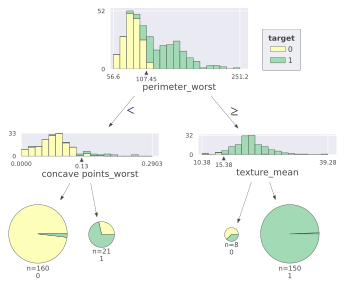
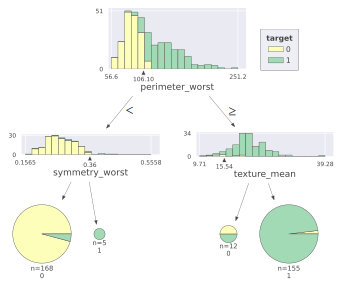
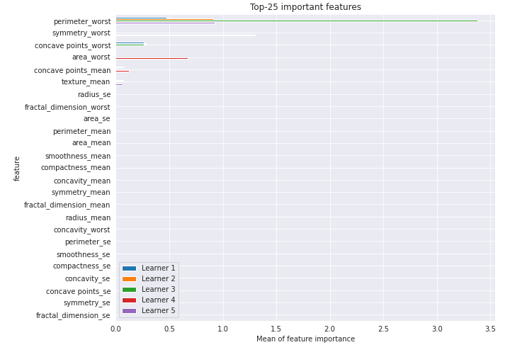
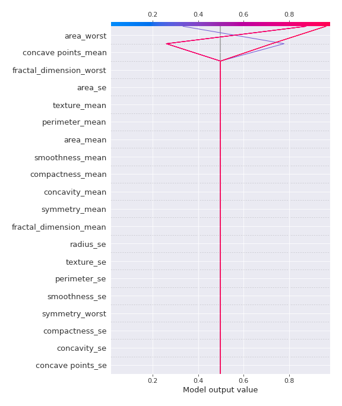

# Summary of 31_DecisionTree

[<< Go back](../README.md)

## Decision Tree
- **n_jobs**: -1
- **criterion**: gini
- **max_depth**: 2
- **explain_level**: 2

## Validation
 - **validation_type**: kfold
 - **k_folds**: 5
 - **shuffle**: True
 - **stratify**: True
 - **random_seed**: 1230

## Optimized metric
logloss

## Training time

26.2 seconds

## Metric details
|           |    score |    threshold |
|:----------|---------:|-------------:|
| logloss   | 0.305727 | nan          |
| auc       | 0.945866 | nan          |
| f1        | 0.930233 |   0.493871   |
| accuracy  | 0.929245 |   0.493871   |
| precision | 0.947368 |   0.996667   |
| recall    | 1        |   0.00584416 |
| mcc       | 0.858835 |   0.493871   |

## Confusion matrix (at threshold=0.493871)
|                     |   Predicted as negative |   Predicted as positive |
|:--------------------|------------------------:|------------------------:|
| Labeled as negative |                     194 |                      18 |
| Labeled as positive |                      12 |                     200 |

## Learning curves

## Decision Tree 

### Tree #1

### Rules

if (perimeter_worst <= 105.95) and (concave points_worst <= 0.142) then class: 0 (proba: 97.53%) | based on 162 samples

if (perimeter_worst > 105.95) and (concave points_mean > 0.047) then class: 1 (proba: 98.67%) | based on 150 samples

if (perimeter_worst > 105.95) and (concave points_mean <= 0.047) then class: 1 (proba: 60.0%) | based on 15 samples

if (perimeter_worst <= 105.95) and (concave points_worst > 0.142) then class: 1 (proba: 75.0%) | based on 12 samples

### Tree #2

### Rules

if (perimeter_worst <= 107.45) and (concave points_worst <= 0.134) then class: 0 (proba: 98.12%) | based on 160 samples

if (perimeter_worst > 107.45) and (texture_mean > 15.375) then class: 1 (proba: 99.33%) | based on 150 samples

if (perimeter_worst <= 107.45) and (concave points_worst > 0.134) then class: 1 (proba: 71.43%) | based on 21 samples

if (perimeter_worst > 107.45) and (texture_mean <= 15.375) then class: 0 (proba: 62.5%) | based on 8 samples

### Tree #3

### Rules

if (perimeter_worst <= 106.1) and (concave points_worst <= 0.135) then class: 0 (proba: 99.35%) | based on 154 samples

if (perimeter_worst > 106.1) and (perimeter_worst > 114.45) then class: 1 (proba: 100.0%) | based on 139 samples

if (perimeter_worst > 106.1) and (perimeter_worst <= 114.45) then class: 1 (proba: 60.71%) | based on 28 samples

if (perimeter_worst <= 106.1) and (concave points_worst > 0.135) then class: 1 (proba: 66.67%) | based on 18 samples

### Tree #4

### Rules

if (concave points_mean > 0.045) and (area_worst > 710.2) then class: 1 (proba: 96.23%) | based on 159 samples

if (concave points_mean <= 0.045) and (area_worst <= 839.85) then class: 0 (proba: 97.45%) | based on 157 samples

if (concave points_mean > 0.045) and (area_worst <= 710.2) then class: 0 (proba: 66.67%) | based on 15 samples

if (concave points_mean <= 0.045) and (area_worst > 839.85) then class: 1 (proba: 87.5%) | based on 8 samples

### Tree #5

### Rules

if (perimeter_worst <= 106.1) and (symmetry_worst <= 0.362) then class: 0 (proba: 95.83%) | based on 168 samples

if (perimeter_worst > 106.1) and (texture_mean > 15.535) then class: 1 (proba: 98.06%) | based on 155 samples

if (perimeter_worst > 106.1) and (texture_mean <= 15.535) then class: 0 (proba: 50.0%) | based on 12 samples

if (perimeter_worst <= 106.1) and (symmetry_worst > 0.362) then class: 1 (proba: 100.0%) | based on 5 samples

## Permutation-based Importance

## SHAP Importance

## SHAP Dependence plots

### Dependence (Fold 1)

### Dependence (Fold 2)

### Dependence (Fold 3)

### Dependence (Fold 4)

### Dependence (Fold 5)

## SHAP Decision plots

### Top-10 Worst decisions for class 0 (Fold 1)

### Top-10 Worst decisions for class 0 (Fold 2)

### Top-10 Worst decisions for class 0 (Fold 3)

### Top-10 Worst decisions for class 0 (Fold 4)

### Top-10 Worst decisions for class 0 (Fold 5)

### Top-10 Best decisions for class 0 (Fold 1)

### Top-10 Best decisions for class 0 (Fold 2)

### Top-10 Best decisions for class 0 (Fold 3)

### Top-10 Best decisions for class 0 (Fold 4)

### Top-10 Best decisions for class 0 (Fold 5)

### Top-10 Worst decisions for class 1 (Fold 1)

### Top-10 Worst decisions for class 1 (Fold 2)

### Top-10 Worst decisions for class 1 (Fold 3)

### Top-10 Worst decisions for class 1 (Fold 4)

### Top-10 Worst decisions for class 1 (Fold 5)

### Top-10 Best decisions for class 1 (Fold 1)

### Top-10 Best decisions for class 1 (Fold 2)

### Top-10 Best decisions for class 1 (Fold 3)

### Top-10 Best decisions for class 1 (Fold 4)

### Top-10 Best decisions for class 1 (Fold 5)

[<< Go back](../README.md)
