# Summary of 3_DecisionTree

[<< Go back](../README.md)

## Decision Tree
- **n_jobs**: -1
- **criterion**: gini
- **max_depth**: 4
- **explain_level**: 2

## Validation
 - **validation_type**: kfold
 - **k_folds**: 5
 - **shuffle**: True
 - **stratify**: True
 - **random_seed**: 1230

## Optimized metric
logloss

## Training time

38.6 seconds

## Metric details
|           |    score |   threshold |
|:----------|---------:|------------:|
| logloss   | 0.947043 |  nan        |
| auc       | 0.907496 |  nan        |
| f1        | 0.909524 |    0.500087 |
| accuracy  | 0.910377 |    0.500087 |
| precision | 0.918269 |    0.500087 |
| recall    | 0.929245 |    0        |
| mcc       | 0.820901 |    0.500087 |

## Confusion matrix (at threshold=0.500087)
|                     |   Predicted as negative |   Predicted as positive |
|:--------------------|------------------------:|------------------------:|
| Labeled as negative |                     195 |                      17 |
| Labeled as positive |                      21 |                     191 |

## Learning curves
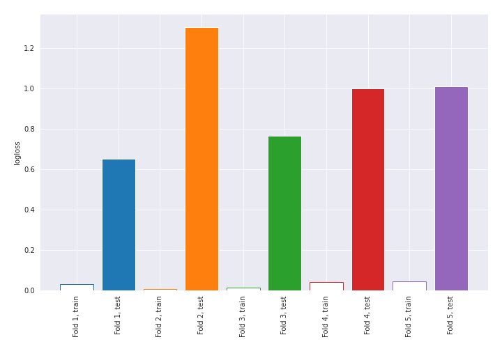

## Decision Tree 

### Tree #1
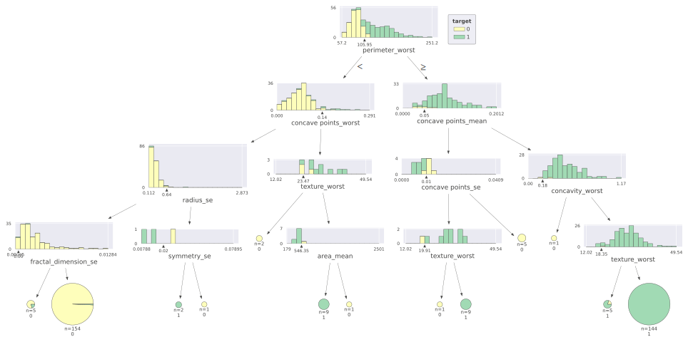

### Rules

if (perimeter_worst <= 105.95) and (concave points_worst <= 0.142) and (radius_se <= 0.643) and (fractal_dimension_se > 0.001) then class: 0 (proba: 99.35%) | based on 154 samples

if (perimeter_worst > 105.95) and (concave points_mean > 0.047) and (concavity_worst > 0.182) and (texture_worst > 18.355) then class: 1 (proba: 100.0%) | based on 144 samples

if (perimeter_worst > 105.95) and (concave points_mean <= 0.047) and (concave points_se <= 0.011) and (texture_worst > 19.91) then class: 1 (proba: 100.0%) | based on 9 samples

if (perimeter_worst <= 105.95) and (concave points_worst > 0.142) and (texture_worst > 23.47) and (area_mean <= 546.35) then class: 1 (proba: 100.0%) | based on 9 samples

if (perimeter_worst > 105.95) and (concave points_mean > 0.047) and (concavity_worst > 0.182) and (texture_worst <= 18.355) then class: 1 (proba: 80.0%) | based on 5 samples

if (perimeter_worst > 105.95) and (concave points_mean <= 0.047) and (concave points_se > 0.011) then class: 0 (proba: 100.0%) | based on 5 samples

if (perimeter_worst <= 105.95) and (concave points_worst <= 0.142) and (radius_se <= 0.643) and (fractal_dimension_se <= 0.001) then class: 0 (proba: 80.0%) | based on 5 samples

if (perimeter_worst <= 105.95) and (concave points_worst > 0.142) and (texture_worst <= 23.47) then class: 0 (proba: 100.0%) | based on 2 samples

if (perimeter_worst <= 105.95) and (concave points_worst <= 0.142) and (radius_se > 0.643) and (symmetry_se <= 0.025) then class: 1 (proba: 100.0%) | based on 2 samples

if (perimeter_worst > 105.95) and (concave points_mean > 0.047) and (concavity_worst <= 0.182) then class: 0 (proba: 100.0%) | based on 1 samples

if (perimeter_worst > 105.95) and (concave points_mean <= 0.047) and (concave points_se <= 0.011) and (texture_worst <= 19.91) then class: 0 (proba: 100.0%) | based on 1 samples

if (perimeter_worst <= 105.95) and (concave points_worst > 0.142) and (texture_worst > 23.47) and (area_mean > 546.35) then class: 0 (proba: 100.0%) | based on 1 samples

if (perimeter_worst <= 105.95) and (concave points_worst <= 0.142) and (radius_se > 0.643) and (symmetry_se > 0.025) then class: 0 (proba: 100.0%) | based on 1 samples

### Tree #2
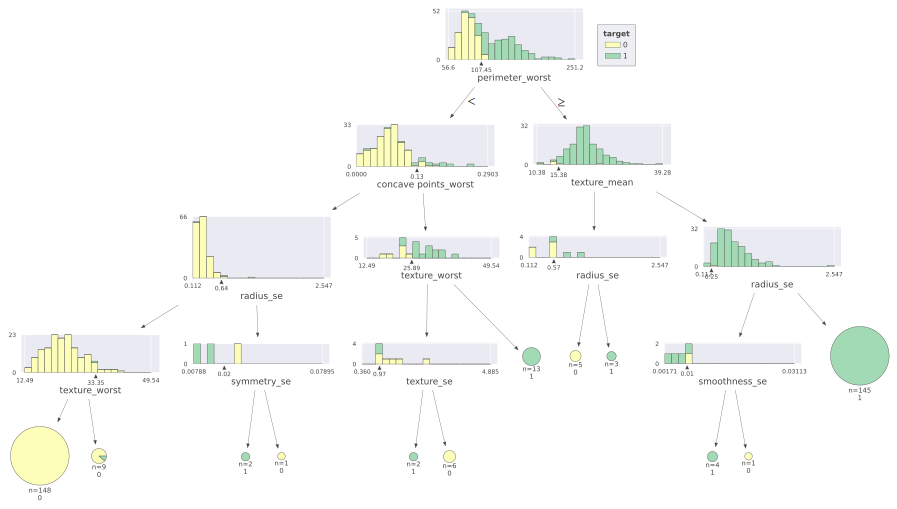

### Rules

if (perimeter_worst <= 107.45) and (concave points_worst <= 0.134) and (radius_se <= 0.643) and (texture_worst <= 33.35) then class: 0 (proba: 100.0%) | based on 148 samples

if (perimeter_worst > 107.45) and (texture_mean > 15.375) and (radius_se > 0.254) then class: 1 (proba: 100.0%) | based on 145 samples

if (perimeter_worst <= 107.45) and (concave points_worst > 0.134) and (texture_worst > 25.89) then class: 1 (proba: 100.0%) | based on 13 samples

if (perimeter_worst <= 107.45) and (concave points_worst <= 0.134) and (radius_se <= 0.643) and (texture_worst > 33.35) then class: 0 (proba: 88.89%) | based on 9 samples

if (perimeter_worst <= 107.45) and (concave points_worst > 0.134) and (texture_worst <= 25.89) and (texture_se > 0.97) then class: 0 (proba: 100.0%) | based on 6 samples

if (perimeter_worst > 107.45) and (texture_mean <= 15.375) and (radius_se <= 0.573) then class: 0 (proba: 100.0%) | based on 5 samples

if (perimeter_worst > 107.45) and (texture_mean > 15.375) and (radius_se <= 0.254) and (smoothness_se <= 0.007) then class: 1 (proba: 100.0%) | based on 4 samples

if (perimeter_worst > 107.45) and (texture_mean <= 15.375) and (radius_se > 0.573) then class: 1 (proba: 100.0%) | based on 3 samples

if (perimeter_worst <= 107.45) and (concave points_worst > 0.134) and (texture_worst <= 25.89) and (texture_se <= 0.97) then class: 1 (proba: 100.0%) | based on 2 samples

if (perimeter_worst <= 107.45) and (concave points_worst <= 0.134) and (radius_se > 0.643) and (symmetry_se <= 0.025) then class: 1 (proba: 100.0%) | based on 2 samples

if (perimeter_worst > 107.45) and (texture_mean > 15.375) and (radius_se <= 0.254) and (smoothness_se > 0.007) then class: 0 (proba: 100.0%) | based on 1 samples

if (perimeter_worst <= 107.45) and (concave points_worst <= 0.134) and (radius_se > 0.643) and (symmetry_se > 0.025) then class: 0 (proba: 100.0%) | based on 1 samples

### Tree #3
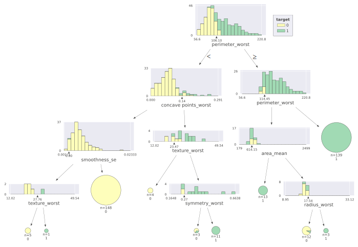

### Rules

if (perimeter_worst <= 106.1) and (concave points_worst <= 0.135) and (smoothness_se > 0.003) then class: 0 (proba: 100.0%) | based on 148 samples

if (perimeter_worst > 106.1) and (perimeter_worst > 114.45) then class: 1 (proba: 100.0%) | based on 139 samples

if (perimeter_worst > 106.1) and (perimeter_worst <= 114.45) and (area_mean <= 614.15) then class: 1 (proba: 100.0%) | based on 13 samples

if (perimeter_worst > 106.1) and (perimeter_worst <= 114.45) and (area_mean > 614.15) and (radius_worst <= 17.54) then class: 0 (proba: 91.67%) | based on 12 samples

if (perimeter_worst <= 106.1) and (concave points_worst > 0.135) and (texture_worst > 23.47) and (symmetry_worst > 0.268) then class: 1 (proba: 100.0%) | based on 11 samples

if (perimeter_worst <= 106.1) and (concave points_worst <= 0.135) and (smoothness_se <= 0.003) and (texture_worst <= 27.755) then class: 0 (proba: 100.0%) | based on 5 samples

if (perimeter_worst <= 106.1) and (concave points_worst > 0.135) and (texture_worst <= 23.47) then class: 0 (proba: 100.0%) | based on 4 samples

if (perimeter_worst > 106.1) and (perimeter_worst <= 114.45) and (area_mean > 614.15) and (radius_worst > 17.54) then class: 1 (proba: 100.0%) | based on 3 samples

if (perimeter_worst <= 106.1) and (concave points_worst > 0.135) and (texture_worst > 23.47) and (symmetry_worst <= 0.268) then class: 0 (proba: 66.67%) | based on 3 samples

if (perimeter_worst <= 106.1) and (concave points_worst <= 0.135) and (smoothness_se <= 0.003) and (texture_worst > 27.755) then class: 1 (proba: 100.0%) | based on 1 samples

### Tree #4
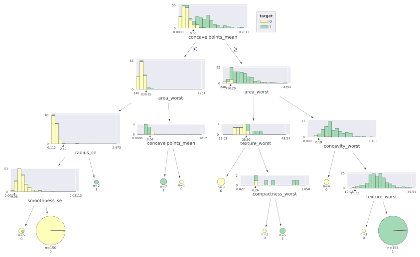

### Rules

if (concave points_mean > 0.045) and (area_worst > 710.2) and (concavity_worst > 0.189) and (texture_worst > 15.62) then class: 1 (proba: 99.35%) | based on 154 samples

if (concave points_mean <= 0.045) and (area_worst <= 839.85) and (radius_se <= 0.603) and (smoothness_se > 0.003) then class: 0 (proba: 99.33%) | based on 150 samples

if (concave points_mean > 0.045) and (area_worst <= 710.2) and (texture_worst <= 25.925) then class: 0 (proba: 100.0%) | based on 9 samples

if (concave points_mean <= 0.045) and (area_worst > 839.85) and (concave points_mean <= 0.04) then class: 1 (proba: 100.0%) | based on 7 samples

if (concave points_mean > 0.045) and (area_worst <= 710.2) and (texture_worst > 25.925) and (compactness_worst > 0.263) then class: 1 (proba: 100.0%) | based on 5 samples

if (concave points_mean <= 0.045) and (area_worst <= 839.85) and (radius_se <= 0.603) and (smoothness_se <= 0.003) then class: 0 (proba: 80.0%) | based on 5 samples

if (concave points_mean > 0.045) and (area_worst > 710.2) and (concavity_worst <= 0.189) then class: 0 (proba: 100.0%) | based on 4 samples

if (concave points_mean <= 0.045) and (area_worst <= 839.85) and (radius_se > 0.603) then class: 1 (proba: 100.0%) | based on 2 samples

if (concave points_mean > 0.045) and (area_worst > 710.2) and (concavity_worst > 0.189) and (texture_worst <= 15.62) then class: 0 (proba: 100.0%) | based on 1 samples

if (concave points_mean > 0.045) and (area_worst <= 710.2) and (texture_worst > 25.925) and (compactness_worst <= 0.263) then class: 0 (proba: 100.0%) | based on 1 samples

if (concave points_mean <= 0.045) and (area_worst > 839.85) and (concave points_mean > 0.04) then class: 0 (proba: 100.0%) | based on 1 samples

### Tree #5

### Rules

if (perimeter_worst <= 106.1) and (symmetry_worst <= 0.362) and (concave points_worst <= 0.135) and (radius_se <= 0.643) then class: 0 (proba: 98.73%) | based on 157 samples

if (perimeter_worst > 106.1) and (texture_mean > 15.535) and (smoothness_worst > 0.1) and (concave points_mean > 0.031) then class: 1 (proba: 100.0%) | based on 147 samples

if (perimeter_worst > 106.1) and (texture_mean <= 15.535) and (concave points_mean > 0.075) then class: 1 (proba: 100.0%) | based on 6 samples

if (perimeter_worst > 106.1) and (texture_mean <= 15.535) and (concave points_mean <= 0.075) then class: 0 (proba: 100.0%) | based on 6 samples

if (perimeter_worst > 106.1) and (texture_mean > 15.535) and (smoothness_worst > 0.1) and (concave points_mean <= 0.031) then class: 1 (proba: 80.0%) | based on 5 samples

if (perimeter_worst <= 106.1) and (symmetry_worst > 0.362) then class: 1 (proba: 100.0%) | based on 5 samples

if (perimeter_worst <= 106.1) and (symmetry_worst <= 0.362) and (concave points_worst > 0.135) and (smoothness_mean > 0.105) then class: 0 (proba: 100.0%) | based on 5 samples

if (perimeter_worst <= 106.1) and (symmetry_worst <= 0.362) and (concave points_worst > 0.135) and (smoothness_mean <= 0.105) then class: 1 (proba: 100.0%) | based on 3 samples

if (perimeter_worst <= 106.1) and (symmetry_worst <= 0.362) and (concave points_worst <= 0.135) and (radius_se > 0.643) then class: 1 (proba: 66.67%) | based on 3 samples

if (perimeter_worst > 106.1) and (texture_mean > 15.535) and (smoothness_worst <= 0.1) and (fractal_dimension_worst > 0.079) then class: 0 (proba: 100.0%) | based on 2 samples

if (perimeter_worst > 106.1) and (texture_mean > 15.535) and (smoothness_worst <= 0.1) and (fractal_dimension_worst <= 0.079) then class: 1 (proba: 100.0%) | based on 1 samples

## Permutation-based Importance
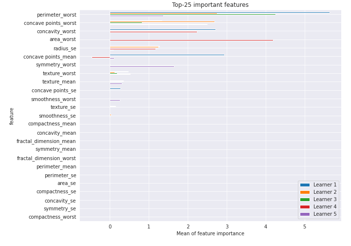

## SHAP Importance
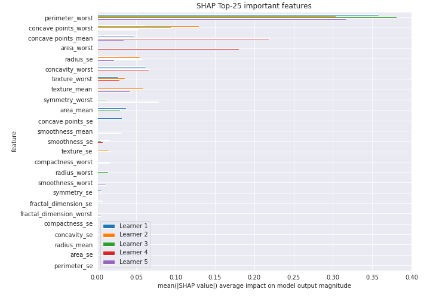

## SHAP Dependence plots

### Dependence (Fold 1)
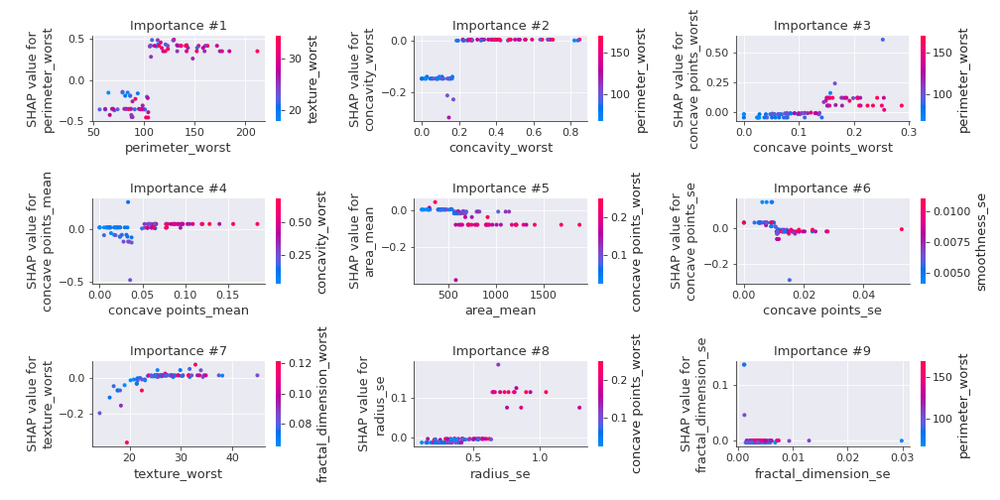
### Dependence (Fold 2)
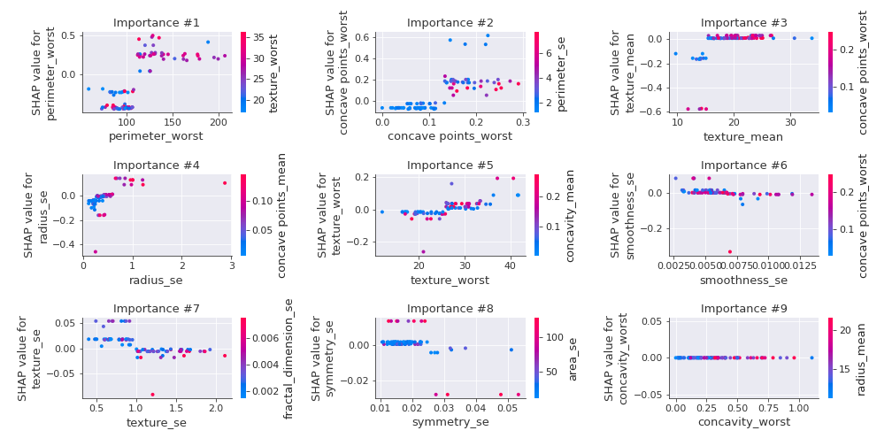
### Dependence (Fold 3)
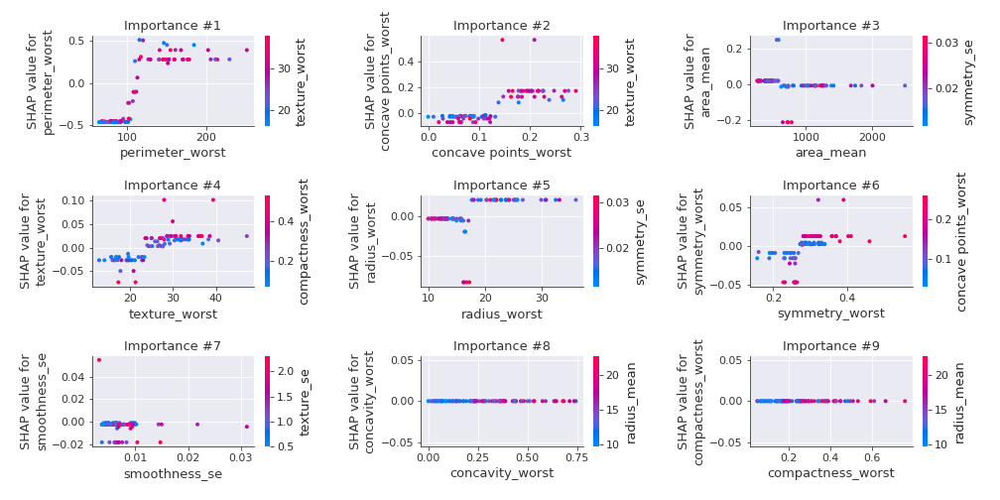
### Dependence (Fold 4)
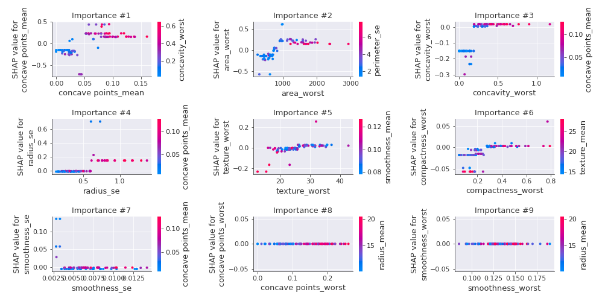
### Dependence (Fold 5)
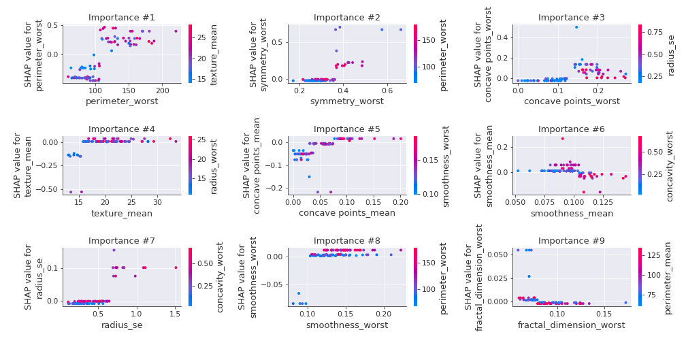

## SHAP Decision plots

### Top-10 Worst decisions for class 0 (Fold 1)
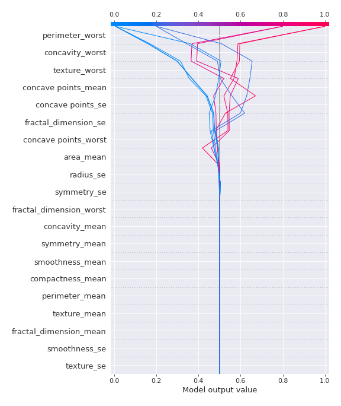
### Top-10 Worst decisions for class 0 (Fold 2)
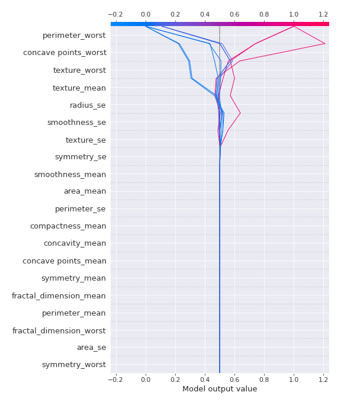
### Top-10 Worst decisions for class 0 (Fold 3)
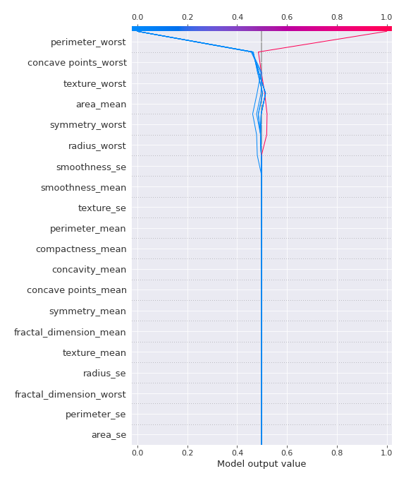
### Top-10 Worst decisions for class 0 (Fold 4)

### Top-10 Worst decisions for class 0 (Fold 5)
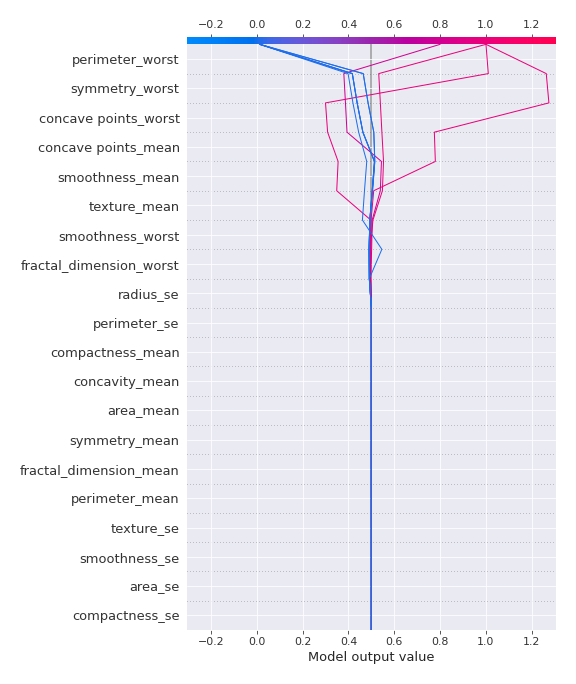
### Top-10 Best decisions for class 0 (Fold 1)
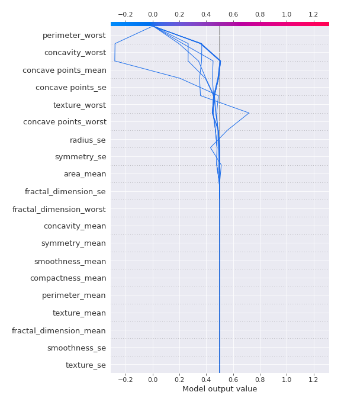
### Top-10 Best decisions for class 0 (Fold 2)
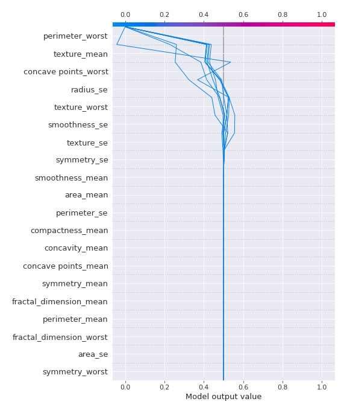
### Top-10 Best decisions for class 0 (Fold 3)
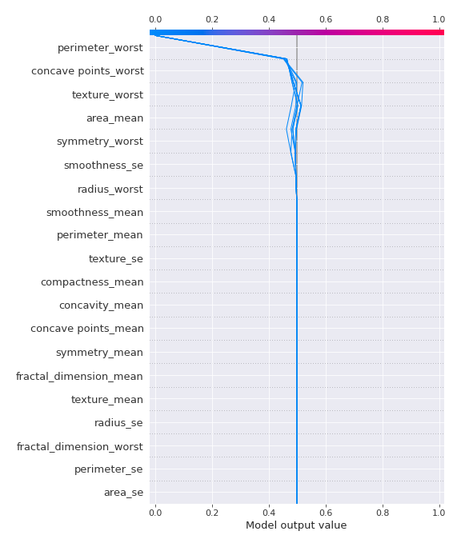
### Top-10 Best decisions for class 0 (Fold 4)
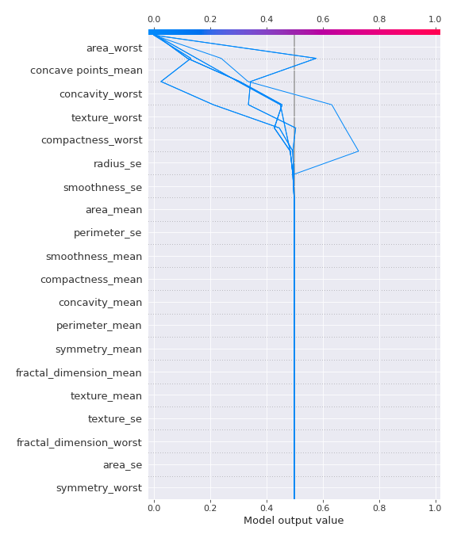
### Top-10 Best decisions for class 0 (Fold 5)
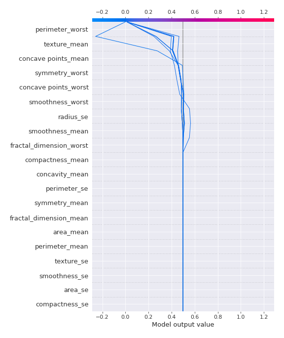
### Top-10 Worst decisions for class 1 (Fold 1)
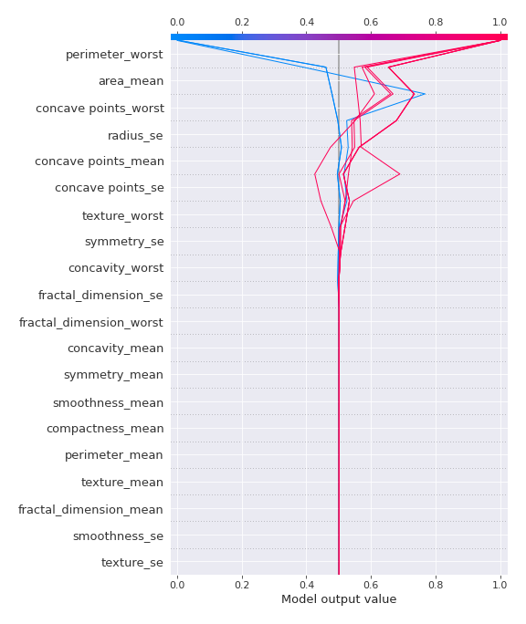
### Top-10 Worst decisions for class 1 (Fold 2)
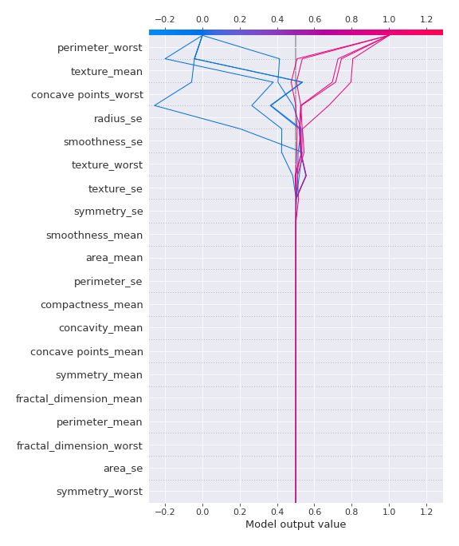
### Top-10 Worst decisions for class 1 (Fold 3)
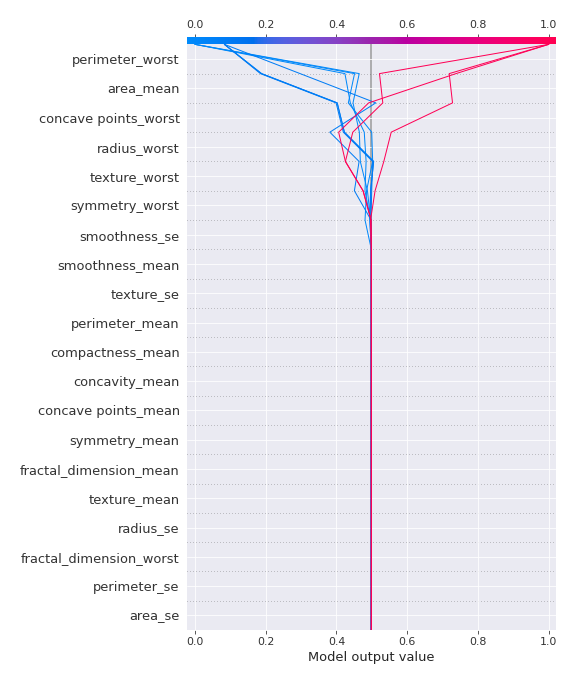
### Top-10 Worst decisions for class 1 (Fold 4)
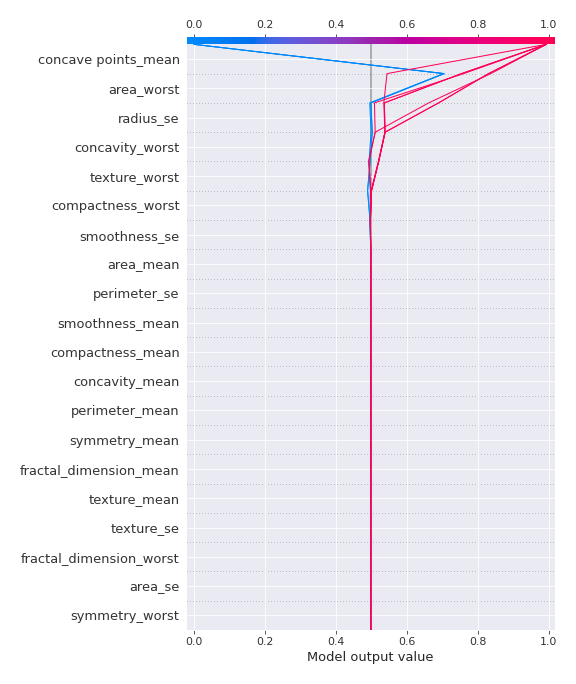
### Top-10 Worst decisions for class 1 (Fold 5)
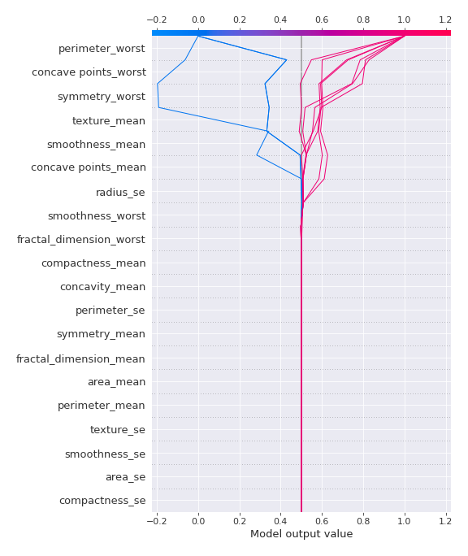
### Top-10 Best decisions for class 1 (Fold 1)

### Top-10 Best decisions for class 1 (Fold 2)
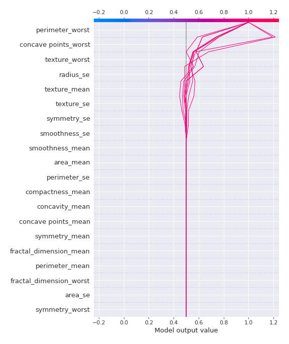
### Top-10 Best decisions for class 1 (Fold 3)
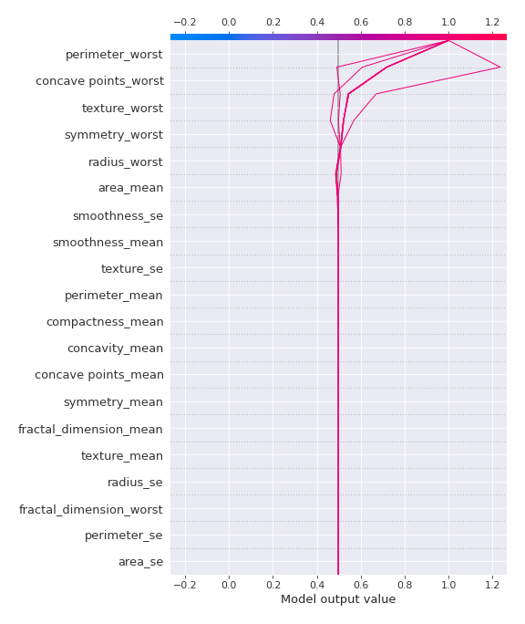
### Top-10 Best decisions for class 1 (Fold 4)
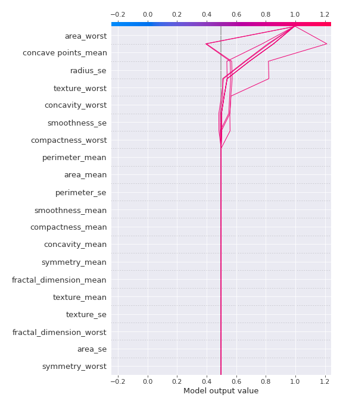
### Top-10 Best decisions for class 1 (Fold 5)
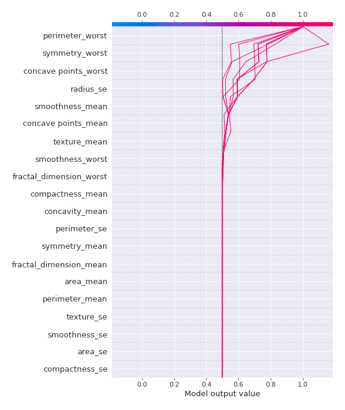

[<< Go back](../README.md)
