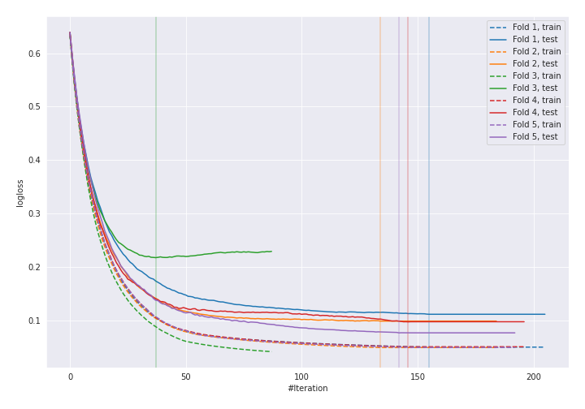
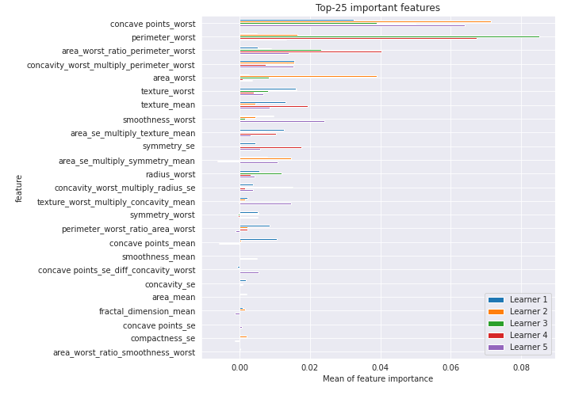

# Summary of 8_Xgboost_GoldenFeatures_RandomFeature

[<< Go back](../README.md)

## Extreme Gradient Boosting (Xgboost)
- **n_jobs**: -1
- **objective**: binary:logistic
- **eta**: 0.075
- **max_depth**: 8
- **min_child_weight**: 5
- **subsample**: 1.0
- **colsample_bytree**: 1.0
- **eval_metric**: logloss
- **explain_level**: 1

## Validation
 - **validation_type**: kfold
 - **k_folds**: 5
 - **shuffle**: True
 - **stratify**: True
 - **random_seed**: 1230

## Optimized metric
logloss

## Training time

18.1 seconds

## Metric details
|           |    score |    threshold |
|:----------|---------:|-------------:|
| logloss   | 0.120553 | nan          |
| auc       | 0.991133 | nan          |
| f1        | 0.95283  |   0.558784   |
| accuracy  | 0.95283  |   0.78101    |
| precision | 1        |   0.996413   |
| recall    | 1        |   0.00184001 |
| mcc       | 0.908943 |   0.78101    |

## Confusion matrix (at threshold=0.78101)
|                     |   Predicted as negative |   Predicted as positive |
|:--------------------|------------------------:|------------------------:|
| Labeled as negative |                     211 |                       1 |
| Labeled as positive |                      19 |                     193 |

## Learning curves

## Permutation-based Importance

[<< Go back](../README.md)
