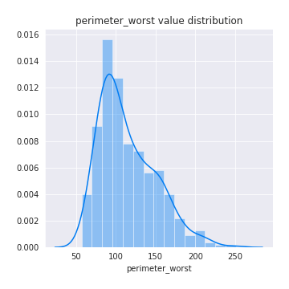

# Exploratory Data Analysis

[<< Go back](../README.md)
## Feature : target
- **Feature type** : discrete
- **Missing** : 0.0%
- **Unique** : 2
- **Count** :424.0
- **Mean** :0.5
- **Std** :0.5005906676601786
- **Min** :0.0
- **25%th Percentile** : 0.0
- **50%th Percentile** : 0.5
- **75%th Percentile** : 1.0
- **Max** :1.0

## Feature : radius_mean
- **Feature type** : continous
- **Missing** : 0.0%
- **Unique** : 362
- **Count** :424.0
- **Mean** :14.815375
- **Std** :3.6829203630290066
- **Min** :7.729
- **25%th Percentile** : 12.057500000000001
- **50%th Percentile** : 13.95
- **75%th Percentile** : 17.3125
- **Max** :28.11

## Feature : texture_mean
- **Feature type** : continous
- **Missing** : 0.0%
- **Unique** : 367
- **Count** :424.0
- **Mean** :19.813419811320742
- **Std** :4.357059471369814
- **Min** :9.71
- **25%th Percentile** : 16.785
- **50%th Percentile** : 19.595
- **75%th Percentile** : 22.235
- **Max** :39.28

## Feature : perimeter_mean
- **Feature type** : continous
- **Missing** : 0.0%
- **Unique** : 394
- **Count** :424.0
- **Mean** :96.77521226415098
- **Std** :25.44848016570803
- **Min** :47.92
- **25%th Percentile** : 77.8775
- **50%th Percentile** : 90.79499999999999
- **75%th Percentile** : 114.2
- **Max** :188.5

## Feature : area_mean
- **Feature type** : continous
- **Missing** : 0.0%
- **Unique** : 410
- **Count** :424.0
- **Mean** :720.9950471698114
- **Std** :376.5797136175447
- **Min** :178.8
- **25%th Percentile** : 449.37499999999994
- **50%th Percentile** : 599.95
- **75%th Percentile** : 931.4499999999999
- **Max** :2501.0

## Feature : smoothness_mean
- **Feature type** : continous
- **Missing** : 0.0%
- **Unique** : 368
- **Count** :424.0
- **Mean** :0.09738155660377362
- **Std** :0.014508701275485683
- **Min** :0.05263
- **25%th Percentile** : 0.086835
- **50%th Percentile** : 0.09687499999999999
- **75%th Percentile** : 0.10642499999999999
- **Max** :0.1634

## Feature : compactness_mean
- **Feature type** : continous
- **Missing** : 0.0%
- **Unique** : 407
- **Count** :424.0
- **Mean** :0.11166224056603774
- **Std** :0.05651709633538443
- **Min** :0.01938
- **25%th Percentile** : 0.06721
- **50%th Percentile** : 0.1028
- **75%th Percentile** : 0.14375
- **Max** :0.3454

## Feature : concavity_mean
- **Feature type** : continous
- **Missing** : 0.0%
- **Unique** : 404
- **Count** :424.0
- **Mean** :0.10251852759433965
- **Std** :0.08520185850219494
- **Min** :0.0
- **25%th Percentile** : 0.032895
- **50%th Percentile** : 0.08422
- **75%th Percentile** : 0.153
- **Max** :0.4268

## Feature : concave points_mean
- **Feature type** : continous
- **Missing** : 0.0%
- **Unique** : 406
- **Count** :424.0
- **Mean** :0.05661523820754716
- **Std** :0.04149092328181717
- **Min** :0.0
- **25%th Percentile** : 0.02269
- **50%th Percentile** : 0.051855
- **75%th Percentile** : 0.08626
- **Max** :0.2012

## Feature : symmetry_mean
- **Feature type** : continous
- **Missing** : 0.0%
- **Unique** : 344
- **Count** :424.0
- **Mean** :0.18396603773584908
- **Std** :0.027384205855979084
- **Min** :0.1167
- **25%th Percentile** : 0.16402499999999998
- **50%th Percentile** : 0.18209999999999998
- **75%th Percentile** : 0.19815
- **Max** :0.304

## Feature : fractal_dimension_mean
- **Feature type** : continous
- **Missing** : 0.0%
- **Unique** : 381
- **Count** :424.0
- **Mean** :0.06259311320754717
- **Std** :0.007139849295905427
- **Min** :0.04996
- **25%th Percentile** : 0.0574275
- **50%th Percentile** : 0.061295
- **75%th Percentile** : 0.06609749999999999
- **Max** :0.09744

## Feature : radius_se
- **Feature type** : continous
- **Missing** : 0.0%
- **Unique** : 411
- **Count** :424.0
- **Mean** :0.44753702830188685
- **Std** :0.3032464149051894
- **Min** :0.1115
- **25%th Percentile** : 0.24715
- **50%th Percentile** : 0.3572
- **75%th Percentile** : 0.557325
- **Max** :2.873

## Feature : texture_se
- **Feature type** : continous
- **Missing** : 0.0%
- **Unique** : 392
- **Count** :424.0
- **Mean** :1.2223422169811327
- **Std** :0.539213179583185
- **Min** :0.3602
- **25%th Percentile** : 0.8569499999999999
- **50%th Percentile** : 1.1444999999999999
- **75%th Percentile** : 1.4652500000000002
- **Max** :4.885

## Feature : perimeter_se
- **Feature type** : continous
- **Missing** : 0.0%
- **Unique** : 404
- **Count** :424.0
- **Mean** :3.176693867924529
- **Std** :2.2204615693595096
- **Min** :0.757
- **25%th Percentile** : 1.778
- **50%th Percentile** : 2.5635000000000003
- **75%th Percentile** : 3.859
- **Max** :21.98

## Feature : area_se
- **Feature type** : continous
- **Missing** : 0.0%
- **Unique** : 408
- **Count** :424.0
- **Mean** :46.98622169811321
- **Std** :50.77041296504333
- **Min** :6.802
- **25%th Percentile** : 19.405
- **50%th Percentile** : 29.39
- **75%th Percentile** : 58.417500000000004
- **Max** :542.2

## Feature : smoothness_se
- **Feature type** : continous
- **Missing** : 0.0%
- **Unique** : 410
- **Count** :424.0
- **Mean** :0.0068544268867924505
- **Std** :0.002880653932249436
- **Min** :0.001713
- **25%th Percentile** : 0.00515175
- **50%th Percentile** : 0.006192
- **75%th Percentile** : 0.007971
- **Max** :0.03113

## Feature : compactness_se
- **Feature type** : continous
- **Missing** : 0.0%
- **Unique** : 414
- **Count** :424.0
- **Mean** :0.02647271698113205
- **Std** :0.017592230129698152
- **Min** :0.002252
- **25%th Percentile** : 0.013869999999999999
- **50%th Percentile** : 0.022305
- **75%th Percentile** : 0.0338025
- **Max** :0.1354

## Feature : concavity_se
- **Feature type** : continous
- **Missing** : 0.0%
- **Unique** : 404
- **Count** :424.0
- **Mean** :0.03332604882075472
- **Std** :0.029451626011266614
- **Min** :0.0
- **25%th Percentile** : 0.016067500000000002
- **50%th Percentile** : 0.02815
- **75%th Percentile** : 0.043555
- **Max** :0.396

## Feature : concave points_se
- **Feature type** : continous
- **Missing** : 0.0%
- **Unique** : 390
- **Count** :424.0
- **Mean** :0.012350216981132063
- **Std** :0.006304174097352849
- **Min** :0.0
- **25%th Percentile** : 0.00827575
- **50%th Percentile** : 0.011564999999999999
- **75%th Percentile** : 0.015625
- **Max** :0.05279

## Feature : symmetry_se
- **Feature type** : continous
- **Missing** : 0.0%
- **Unique** : 381
- **Count** :424.0
- **Mean** :0.020382757075471693
- **Std** :0.008646413660944478
- **Min** :0.007882
- **25%th Percentile** : 0.014892500000000001
- **50%th Percentile** : 0.01852
- **75%th Percentile** : 0.022885000000000003
- **Max** :0.07895

## Feature : fractal_dimension_se
- **Feature type** : continous
- **Missing** : 0.0%
- **Unique** : 410
- **Count** :424.0
- **Mean** :0.0037973974056603787
- **Std** :0.0024532505367654226
- **Min** :0.0009502
- **25%th Percentile** : 0.00227675
- **50%th Percentile** : 0.003308
- **75%th Percentile** : 0.00457025
- **Max** :0.02984

## Feature : radius_worst
- **Feature type** : continous
- **Missing** : 0.0%
- **Unique** : 362
- **Count** :424.0
- **Mean** :17.27470990566038
- **Std** :5.08405379740784
- **Min** :8.952
- **25%th Percentile** : 13.3475
- **50%th Percentile** : 15.97
- **75%th Percentile** : 20.585
- **Max** :36.04

## Feature : texture_worst
- **Feature type** : continous
- **Missing** : 0.0%
- **Unique** : 391
- **Count** :424.0
- **Mean** :26.52212264150944
- **Std** :6.208619054708042
- **Min** :12.02
- **25%th Percentile** : 22.055
- **50%th Percentile** : 26.265
- **75%th Percentile** : 30.7375
- **Max** :49.54

## Feature : perimeter_worst
- **Feature type** : continous
- **Missing** : 0.0%
- **Unique** : 386
- **Count** :424.0
- **Mean** :114.28761792452838
- **Std** :35.33929666973236
- **Min** :56.65
- **25%th Percentile** : 87.20499999999998
- **50%th Percentile** : 105.65
- **75%th Percentile** : 137.95000000000002
- **Max** :251.2

## Feature : area_worst
- **Feature type** : continous
- **Missing** : 0.0%
- **Unique** : 414
- **Count** :424.0
- **Mean** :991.2049528301893
- **Std** :613.3886876416221
- **Min** :240.1
- **25%th Percentile** : 547.525
- **50%th Percentile** : 775.45
- **75%th Percentile** : 1302.5
- **Max** :4254.0

## Feature : smoothness_worst
- **Feature type** : continous
- **Missing** : 0.0%
- **Unique** : 331
- **Count** :424.0
- **Mean** :0.13395948113207537
- **Std** :0.023545083965158357
- **Min** :0.07117
- **25%th Percentile** : 0.118875
- **50%th Percentile** : 0.13295
- **75%th Percentile** : 0.1485
- **Max** :0.2226

## Feature : compactness_worst
- **Feature type** : continous
- **Missing** : 0.0%
- **Unique** : 406
- **Count** :424.0
- **Mean** :0.27574686320754704
- **Std** :0.16767041591008577
- **Min** :0.02729
- **25%th Percentile** : 0.15407500000000002
- **50%th Percentile** : 0.2346
- **75%th Percentile** : 0.366775
- **Max** :1.058

## Feature : concavity_worst
- **Feature type** : continous
- **Missing** : 0.0%
- **Unique** : 406
- **Count** :424.0
- **Mean** :0.3028434433962263
- **Std** :0.2154421673390147
- **Min** :0.0
- **25%th Percentile** : 0.135675
- **50%th Percentile** : 0.26765
- **75%th Percentile** : 0.42167499999999997
- **Max** :1.17

## Feature : concave points_worst
- **Feature type** : continous
- **Missing** : 0.0%
- **Unique** : 383
- **Count** :424.0
- **Mean** :0.1272999976415094
- **Std** :0.06862226555728927
- **Min** :0.0
- **25%th Percentile** : 0.07274
- **50%th Percentile** : 0.11935
- **75%th Percentile** : 0.182
- **Max** :0.291

## Feature : symmetry_worst
- **Feature type** : continous
- **Missing** : 0.0%
- **Unique** : 389
- **Count** :424.0
- **Mean** :0.296280424528302
- **Std** :0.06591453753855066
- **Min** :0.1565
- **25%th Percentile** : 0.255325
- **50%th Percentile** : 0.2867
- **75%th Percentile** : 0.32242499999999996
- **Max** :0.6638

## Feature : fractal_dimension_worst
- **Feature type** : continous
- **Missing** : 0.0%
- **Unique** : 407
- **Count** :424.0
- **Mean** :0.08502733490566035
- **Std** :0.01897304323181249
- **Min** :0.05504
- **25%th Percentile** : 0.07203
- **50%th Percentile** : 0.08071
- **75%th Percentile** : 0.093545
- **Max** :0.2075

[<< Go back](../README.md)
