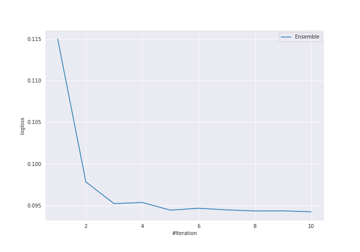

# Summary of Ensemble

[<< Go back](../README.md)

## Ensemble structure
| Model                             |   Weight |
|:----------------------------------|---------:|
| 18_NeuralNetwork_SelectedFeatures |        2 |
| 36_NeuralNetwork                  |        4 |
| 4_Default_Xgboost                 |        1 |
| 4_Default_Xgboost_GoldenFeatures  |        1 |
| 8_Xgboost_GoldenFeatures          |        1 |
| 9_Xgboost                         |        1 |

## Metric details
|           |     score |     threshold |
|:----------|----------:|--------------:|
| logloss   | 0.0942539 | nan           |
| auc       | 0.994593  | nan           |
| f1        | 0.967136  |   0.407033    |
| accuracy  | 0.966981  |   0.407033    |
| precision | 1         |   0.995911    |
| recall    | 1         |   0.000334857 |
| mcc       | 0.934004  |   0.407033    |

## Confusion matrix (at threshold=0.407033)
|                     |   Predicted as negative |   Predicted as positive |
|:--------------------|------------------------:|------------------------:|
| Labeled as negative |                     204 |                       8 |
| Labeled as positive |                       6 |                     206 |

## Learning curves

[<< Go back](../README.md)
