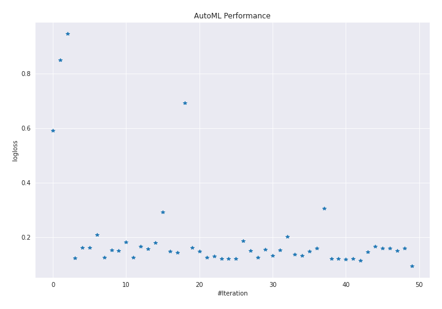
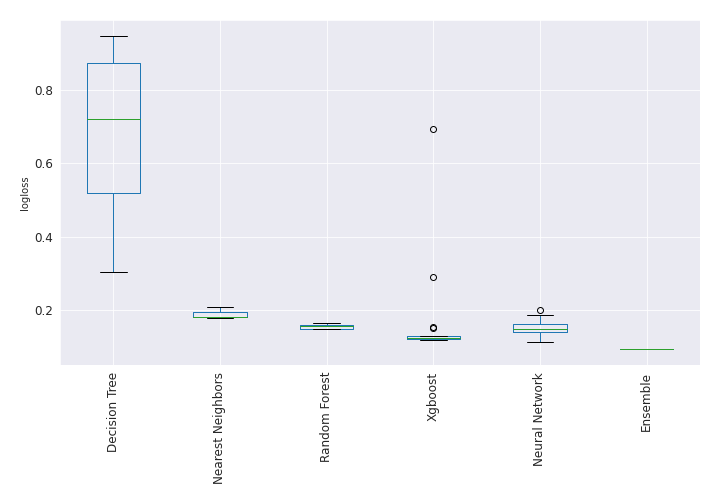

# AutoML Leaderboard

| Best model   | name                                                                                               | model_type        | metric_type   |   metric_value |   train_time |   single_prediction_time |
|:-------------|:---------------------------------------------------------------------------------------------------|:------------------|:--------------|---------------:|-------------:|-------------------------:|
|              | [1_DecisionTree](1_DecisionTree/README.md)                                                         | Decision Tree     | logloss       |      0.591461  |        59.37 |                   0.0508 |
|              | [2_DecisionTree](2_DecisionTree/README.md)                                                         | Decision Tree     | logloss       |      0.849292  |        40.22 |                   0.0524 |
|              | [3_DecisionTree](3_DecisionTree/README.md)                                                         | Decision Tree     | logloss       |      0.947043  |        39.96 |                   0.063  |
|              | [4_Default_Xgboost](4_Default_Xgboost/README.md)                                                   | Xgboost           | logloss       |      0.123851  |        43.14 |                   0.0753 |
|              | [5_Default_NeuralNetwork](5_Default_NeuralNetwork/README.md)                                       | Neural Network    | logloss       |      0.161679  |         6.2  |                   0.0911 |
|              | [6_Default_RandomForest](6_Default_RandomForest/README.md)                                         | Random Forest     | logloss       |      0.161012  |        71.77 |                   0.5712 |
|              | [7_Default_NearestNeighbors](7_Default_NearestNeighbors/README.md)                                 | Nearest Neighbors | logloss       |      0.208922  |        46.41 |                   0.5999 |
|              | [8_Xgboost](8_Xgboost/README.md)                                                                   | Xgboost           | logloss       |      0.12602   |        37.61 |                   0.0574 |
|              | [12_RandomForest](12_RandomForest/README.md)                                                       | Random Forest     | logloss       |      0.152671  |        73.67 |                   0.5683 |
|              | [16_NeuralNetwork](16_NeuralNetwork/README.md)                                                     | Neural Network    | logloss       |      0.151237  |         9.22 |                   0.0738 |
|              | [20_NearestNeighbors](20_NearestNeighbors/README.md)                                               | Nearest Neighbors | logloss       |      0.182846  |        43.5  |                   0.5958 |
|              | [9_Xgboost](9_Xgboost/README.md)                                                                   | Xgboost           | logloss       |      0.125413  |        36.66 |                   0.0564 |
|              | [13_RandomForest](13_RandomForest/README.md)                                                       | Random Forest     | logloss       |      0.16646   |        70.3  |                   0.5687 |
|              | [17_NeuralNetwork](17_NeuralNetwork/README.md)                                                     | Neural Network    | logloss       |      0.158296  |         6.54 |                   0.0852 |
|              | [21_NearestNeighbors](21_NearestNeighbors/README.md)                                               | Nearest Neighbors | logloss       |      0.180338  |        43.71 |                   0.5941 |
|              | [10_Xgboost](10_Xgboost/README.md)                                                                 | Xgboost           | logloss       |      0.291739  |        37.17 |                   0.0606 |
|              | [14_RandomForest](14_RandomForest/README.md)                                                       | Random Forest     | logloss       |      0.149262  |        68.6  |                   0.5702 |
|              | [18_NeuralNetwork](18_NeuralNetwork/README.md)                                                     | Neural Network    | logloss       |      0.143663  |         6.87 |                   0.0934 |
|              | [11_Xgboost](11_Xgboost/README.md)                                                                 | Xgboost           | logloss       |      0.693092  |        27.4  |                   0.0588 |
|              | [15_RandomForest](15_RandomForest/README.md)                                                       | Random Forest     | logloss       |      0.160851  |        74.48 |                   0.5697 |
|              | [19_NeuralNetwork](19_NeuralNetwork/README.md)                                                     | Neural Network    | logloss       |      0.14853   |         6.11 |                   0.0758 |
|              | [4_Default_Xgboost_GoldenFeatures](4_Default_Xgboost_GoldenFeatures/README.md)                     | Xgboost           | logloss       |      0.126913  |        51.15 |                   0.1023 |
|              | [9_Xgboost_GoldenFeatures](9_Xgboost_GoldenFeatures/README.md)                                     | Xgboost           | logloss       |      0.13064   |        40.57 |                   0.0968 |
|              | [8_Xgboost_GoldenFeatures](8_Xgboost_GoldenFeatures/README.md)                                     | Xgboost           | logloss       |      0.120553  |        37.78 |                   0.108  |
|              | [8_Xgboost_GoldenFeatures_RandomFeature](8_Xgboost_GoldenFeatures_RandomFeature/README.md)         | Xgboost           | logloss       |      0.120553  |        19.02 |                   0.0992 |
|              | [8_Xgboost_GoldenFeatures_SelectedFeatures](8_Xgboost_GoldenFeatures_SelectedFeatures/README.md)   | Xgboost           | logloss       |      0.121005  |        32.66 |                   0.0862 |
|              | [18_NeuralNetwork_SelectedFeatures](18_NeuralNetwork_SelectedFeatures/README.md)                   | Neural Network    | logloss       |      0.187581  |         4.93 |                   0.0683 |
|              | [14_RandomForest_SelectedFeatures](14_RandomForest_SelectedFeatures/README.md)                     | Random Forest     | logloss       |      0.149797  |        37.67 |                   0.5681 |
|              | [22_Xgboost_GoldenFeatures](22_Xgboost_GoldenFeatures/README.md)                                   | Xgboost           | logloss       |      0.126913  |        41.6  |                   0.1015 |
|              | [23_Xgboost_GoldenFeatures](23_Xgboost_GoldenFeatures/README.md)                                   | Xgboost           | logloss       |      0.154631  |        38.26 |                   0.0969 |
|              | [24_Xgboost_GoldenFeatures_SelectedFeatures](24_Xgboost_GoldenFeatures_SelectedFeatures/README.md) | Xgboost           | logloss       |      0.131613  |        28.78 |                   0.0987 |
|              | [25_Xgboost_GoldenFeatures_SelectedFeatures](25_Xgboost_GoldenFeatures_SelectedFeatures/README.md) | Xgboost           | logloss       |      0.152201  |        35.4  |                   0.0878 |
|              | [26_NeuralNetwork](26_NeuralNetwork/README.md)                                                     | Neural Network    | logloss       |      0.202014  |         5.8  |                   0.0945 |
|              | [27_NeuralNetwork](27_NeuralNetwork/README.md)                                                     | Neural Network    | logloss       |      0.138116  |         5.78 |                   0.0726 |
|              | [28_NeuralNetwork](28_NeuralNetwork/README.md)                                                     | Neural Network    | logloss       |      0.132935  |         6.37 |                   0.0828 |
|              | [29_RandomForest](29_RandomForest/README.md)                                                       | Random Forest     | logloss       |      0.148964  |        68.33 |                   0.5715 |
|              | [30_RandomForest_SelectedFeatures](30_RandomForest_SelectedFeatures/README.md)                     | Random Forest     | logloss       |      0.159431  |        37.55 |                   0.5704 |
|              | [31_DecisionTree](31_DecisionTree/README.md)                                                       | Decision Tree     | logloss       |      0.305727  |        27.58 |                   0.0632 |
|              | [32_Xgboost_GoldenFeatures](32_Xgboost_GoldenFeatures/README.md)                                   | Xgboost           | logloss       |      0.121903  |        40.97 |                   0.0945 |
|              | [33_Xgboost_GoldenFeatures](33_Xgboost_GoldenFeatures/README.md)                                   | Xgboost           | logloss       |      0.122331  |        36.49 |                   0.0986 |
|              | [34_Xgboost_GoldenFeatures_SelectedFeatures](34_Xgboost_GoldenFeatures_SelectedFeatures/README.md) | Xgboost           | logloss       |      0.119768  |        38.18 |                   0.0868 |
|              | [35_Xgboost_GoldenFeatures_SelectedFeatures](35_Xgboost_GoldenFeatures_SelectedFeatures/README.md) | Xgboost           | logloss       |      0.121771  |        26.19 |                   0.0839 |
|              | [36_NeuralNetwork](36_NeuralNetwork/README.md)                                                     | Neural Network    | logloss       |      0.114987  |         6.62 |                   0.0878 |
|              | [37_NeuralNetwork](37_NeuralNetwork/README.md)                                                     | Neural Network    | logloss       |      0.146743  |         5.95 |                   0.0781 |
|              | [38_NeuralNetwork](38_NeuralNetwork/README.md)                                                     | Neural Network    | logloss       |      0.165301  |         5.77 |                   0.0811 |
|              | [39_RandomForest](39_RandomForest/README.md)                                                       | Random Forest     | logloss       |      0.159557  |        69.68 |                   0.573  |
|              | [40_RandomForest](40_RandomForest/README.md)                                                       | Random Forest     | logloss       |      0.158581  |        70.81 |                   0.5785 |
|              | [41_RandomForest](41_RandomForest/README.md)                                                       | Random Forest     | logloss       |      0.149785  |        71.46 |                   0.5643 |
|              | [42_RandomForest](42_RandomForest/README.md)                                                       | Random Forest     | logloss       |      0.160166  |        69.47 |                   0.5639 |
| **the best** | [Ensemble](Ensemble/README.md)                                                                     | Ensemble          | logloss       |      0.0942539 |         2.35 |                   0.4488 |

### AutoML Performance

### AutoML Performance Boxplot
