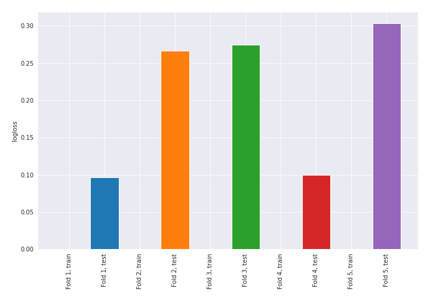
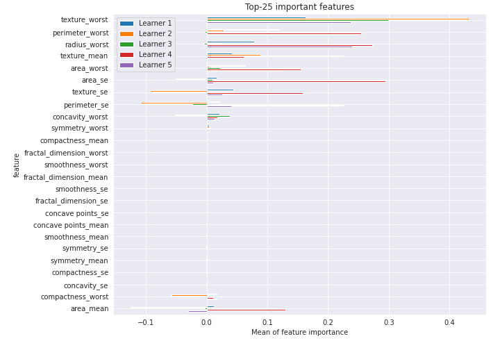

# Summary of 21_NearestNeighbors

[<< Go back](../README.md)

## k-Nearest Neighbors (Nearest Neighbors)
- **n_jobs**: -1
- **n_neighbors**: 7
- **weights**: distance
- **explain_level**: 2

## Validation
 - **validation_type**: kfold
 - **k_folds**: 5
 - **shuffle**: True
 - **stratify**: True
 - **random_seed**: 1230

## Optimized metric
logloss

## Training time

43.0 seconds

## Metric details
|           |    score |   threshold |
|:----------|---------:|------------:|
| logloss   | 0.208041 |  nan        |
| auc       | 0.984236 |  nan        |
| f1        | 0.945882 |    0.340073 |
| accuracy  | 0.945755 |    0.340073 |
| precision | 0.98895  |    0.781865 |
| recall    | 0.990566 |    0        |
| mcc       | 0.891996 |    0.5      |

## Confusion matrix (at threshold=0.340073)
|                     |   Predicted as negative |   Predicted as positive |
|:--------------------|------------------------:|------------------------:|
| Labeled as negative |                     200 |                      12 |
| Labeled as positive |                      11 |                     201 |

## Learning curves

## Permutation-based Importance

[<< Go back](../README.md)
