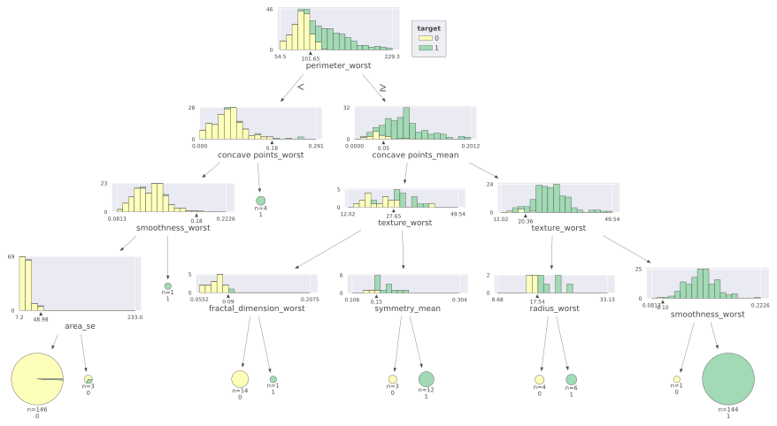
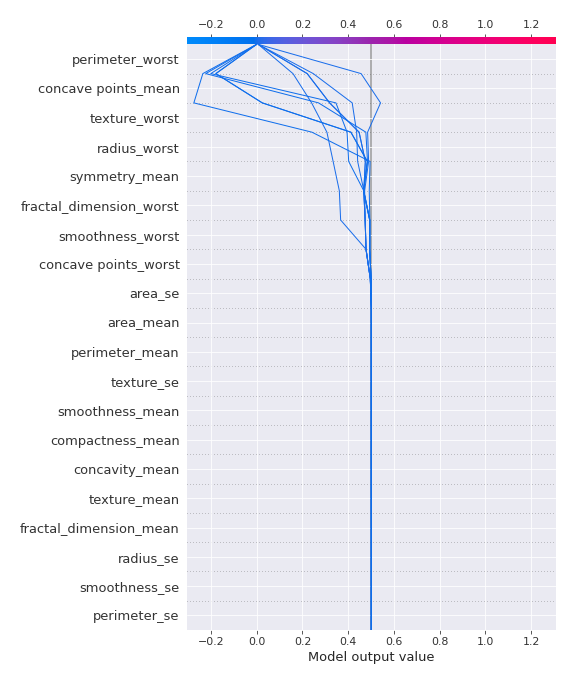

# Summary of 2_DecisionTree

[<< Go back](../README.md)

## Decision Tree
- **n_jobs**: -1
- **criterion**: gini
- **max_depth**: 4
- **explain_level**: 2

## Validation
 - **validation_type**: kfold
 - **k_folds**: 5
 - **shuffle**: True
 - **stratify**: True
 - **random_seed**: 1230

## Optimized metric
logloss

## Training time

39.1 seconds

## Metric details
|           |    score |   threshold |
|:----------|---------:|------------:|
| logloss   | 0.683334 |  nan        |
| auc       | 0.928467 |  nan        |
| f1        | 0.929577 |    0.5      |
| accuracy  | 0.929245 |    0.5      |
| precision | 0.940887 |    0.884615 |
| recall    | 0.962264 |    0        |
| mcc       | 0.858529 |    0.5      |

## Confusion matrix (at threshold=0.5)
|                     |   Predicted as negative |   Predicted as positive |
|:--------------------|------------------------:|------------------------:|
| Labeled as negative |                     196 |                      16 |
| Labeled as positive |                      14 |                     198 |

## Learning curves

## Decision Tree 

### Tree #1

### Rules

if (perimeter_worst <= 106.05) and (concave points_worst <= 0.159) and (smoothness_worst <= 0.178) and (area_se <= 79.825) then class: 0 (proba: 97.45%) | based on 157 samples

if (perimeter_worst > 106.05) and (texture_mean > 15.37) and (smoothness_worst > 0.1) and (perimeter_worst > 111.5) then class: 1 (proba: 100.0%) | based on 139 samples

if (perimeter_worst > 106.05) and (texture_mean > 15.37) and (smoothness_worst > 0.1) and (perimeter_worst <= 111.5) then class: 1 (proba: 73.33%) | based on 15 samples

if (perimeter_worst <= 106.05) and (concave points_worst > 0.159) and (texture_worst > 23.47) then class: 1 (proba: 100.0%) | based on 8 samples

if (perimeter_worst > 106.05) and (texture_mean <= 15.37) and (fractal_dimension_se <= 0.003) then class: 0 (proba: 100.0%) | based on 7 samples

if (perimeter_worst > 106.05) and (texture_mean > 15.37) and (smoothness_worst <= 0.1) and (area_se <= 61.485) then class: 0 (proba: 100.0%) | based on 3 samples

if (perimeter_worst > 106.05) and (texture_mean <= 15.37) and (fractal_dimension_se > 0.003) then class: 1 (proba: 100.0%) | based on 3 samples

if (perimeter_worst <= 106.05) and (concave points_worst > 0.159) and (texture_worst <= 23.47) then class: 0 (proba: 100.0%) | based on 2 samples

if (perimeter_worst <= 106.05) and (concave points_worst <= 0.159) and (smoothness_worst > 0.178) and (smoothness_se <= 0.012) then class: 1 (proba: 100.0%) | based on 2 samples

if (perimeter_worst > 106.05) and (texture_mean > 15.37) and (smoothness_worst <= 0.1) and (area_se > 61.485) then class: 1 (proba: 100.0%) | based on 1 samples

if (perimeter_worst <= 106.05) and (concave points_worst <= 0.159) and (smoothness_worst > 0.178) and (smoothness_se > 0.012) then class: 0 (proba: 100.0%) | based on 1 samples

if (perimeter_worst <= 106.05) and (concave points_worst <= 0.159) and (smoothness_worst <= 0.178) and (area_se > 79.825) then class: 1 (proba: 100.0%) | based on 1 samples

### Tree #2

### Rules

if (perimeter_worst <= 105.05) and (smoothness_worst <= 0.178) and (area_se <= 79.825) and (concave points_worst <= 0.181) then class: 0 (proba: 96.89%) | based on 161 samples

if (perimeter_worst > 105.05) and (concave points_mean > 0.049) and (area_se > 14.18) and (concavity_worst > 0.189) then class: 1 (proba: 98.68%) | based on 151 samples

if (perimeter_worst > 105.05) and (concave points_mean <= 0.049) and (area_worst <= 949.85) and (area_mean > 611.95) then class: 0 (proba: 100.0%) | based on 8 samples

if (perimeter_worst > 105.05) and (concave points_mean <= 0.049) and (area_worst > 949.85) and (fractal_dimension_worst > 0.062) then class: 1 (proba: 100.0%) | based on 7 samples

if (perimeter_worst <= 105.05) and (smoothness_worst > 0.178) and (smoothness_se <= 0.012) then class: 1 (proba: 100.0%) | based on 5 samples

if (perimeter_worst > 105.05) and (concave points_mean > 0.049) and (area_se > 14.18) and (concavity_worst <= 0.189) then class: 0 (proba: 100.0%) | based on 1 samples

if (perimeter_worst > 105.05) and (concave points_mean > 0.049) and (area_se <= 14.18) then class: 0 (proba: 100.0%) | based on 1 samples

if (perimeter_worst > 105.05) and (concave points_mean <= 0.049) and (area_worst > 949.85) and (fractal_dimension_worst <= 0.062) then class: 0 (proba: 100.0%) | based on 1 samples

if (perimeter_worst > 105.05) and (concave points_mean <= 0.049) and (area_worst <= 949.85) and (area_mean <= 611.95) then class: 1 (proba: 100.0%) | based on 1 samples

if (perimeter_worst <= 105.05) and (smoothness_worst > 0.178) and (smoothness_se > 0.012) then class: 0 (proba: 100.0%) | based on 1 samples

if (perimeter_worst <= 105.05) and (smoothness_worst <= 0.178) and (area_se > 79.825) then class: 1 (proba: 100.0%) | based on 1 samples

if (perimeter_worst <= 105.05) and (smoothness_worst <= 0.178) and (area_se <= 79.825) and (concave points_worst > 0.181) then class: 1 (proba: 100.0%) | based on 1 samples

### Tree #3

### Rules

if (concave points_worst > 0.116) and (area_worst > 710.2) and (concavity_worst > 0.208) and (concavity_mean > 0.086) then class: 1 (proba: 100.0%) | based on 145 samples

if (concave points_worst <= 0.116) and (area_mean <= 694.15) and (area_se <= 48.975) and (concave points_worst <= 0.111) then class: 0 (proba: 100.0%) | based on 145 samples

if (concave points_worst > 0.116) and (area_worst > 710.2) and (concavity_worst > 0.208) and (concavity_mean <= 0.086) then class: 1 (proba: 76.92%) | based on 13 samples

if (concave points_worst > 0.116) and (area_worst <= 710.2) and (fractal_dimension_worst <= 0.122) then class: 0 (proba: 100.0%) | based on 9 samples

if (concave points_worst <= 0.116) and (area_mean > 694.15) and (texture_mean > 19.83) then class: 1 (proba: 100.0%) | based on 8 samples

if (concave points_worst <= 0.116) and (area_mean > 694.15) and (texture_mean <= 19.83) and (smoothness_worst <= 0.123) then class: 0 (proba: 100.0%) | based on 5 samples

if (concave points_worst <= 0.116) and (area_mean <= 694.15) and (area_se <= 48.975) and (concave points_worst > 0.111) then class: 0 (proba: 80.0%) | based on 5 samples

if (concave points_worst > 0.116) and (area_worst <= 710.2) and (fractal_dimension_worst > 0.122) then class: 1 (proba: 100.0%) | based on 4 samples

if (concave points_worst > 0.116) and (area_worst > 710.2) and (concavity_worst <= 0.208) then class: 0 (proba: 100.0%) | based on 2 samples

if (concave points_worst <= 0.116) and (area_mean > 694.15) and (texture_mean <= 19.83) and (smoothness_worst > 0.123) then class: 1 (proba: 100.0%) | based on 1 samples

if (concave points_worst <= 0.116) and (area_mean <= 694.15) and (area_se > 48.975) and (smoothness_se > 0.008) then class: 0 (proba: 100.0%) | based on 1 samples

if (concave points_worst <= 0.116) and (area_mean <= 694.15) and (area_se > 48.975) and (smoothness_se <= 0.008) then class: 1 (proba: 100.0%) | based on 1 samples

### Tree #4

### Rules

if (perimeter_worst <= 101.65) and (concave points_worst <= 0.181) and (smoothness_worst <= 0.184) and (area_se <= 48.975) then class: 0 (proba: 99.32%) | based on 146 samples

if (perimeter_worst > 101.65) and (concave points_mean > 0.05) and (texture_worst > 20.355) and (smoothness_worst > 0.096) then class: 1 (proba: 100.0%) | based on 144 samples

if (perimeter_worst > 101.65) and (concave points_mean <= 0.05) and (texture_worst <= 27.65) and (fractal_dimension_worst <= 0.095) then class: 0 (proba: 100.0%) | based on 14 samples

if (perimeter_worst > 101.65) and (concave points_mean <= 0.05) and (texture_worst > 27.65) and (symmetry_mean > 0.151) then class: 1 (proba: 100.0%) | based on 12 samples

if (perimeter_worst > 101.65) and (concave points_mean > 0.05) and (texture_worst <= 20.355) and (radius_worst > 17.54) then class: 1 (proba: 100.0%) | based on 6 samples

if (perimeter_worst > 101.65) and (concave points_mean > 0.05) and (texture_worst <= 20.355) and (radius_worst <= 17.54) then class: 0 (proba: 100.0%) | based on 4 samples

if (perimeter_worst <= 101.65) and (concave points_worst > 0.181) then class: 1 (proba: 100.0%) | based on 4 samples

if (perimeter_worst > 101.65) and (concave points_mean <= 0.05) and (texture_worst > 27.65) and (symmetry_mean <= 0.151) then class: 0 (proba: 100.0%) | based on 3 samples

if (perimeter_worst <= 101.65) and (concave points_worst <= 0.181) and (smoothness_worst <= 0.184) and (area_se > 48.975) then class: 0 (proba: 66.67%) | based on 3 samples

if (perimeter_worst > 101.65) and (concave points_mean > 0.05) and (texture_worst > 20.355) and (smoothness_worst <= 0.096) then class: 0 (proba: 100.0%) | based on 1 samples

if (perimeter_worst > 101.65) and (concave points_mean <= 0.05) and (texture_worst <= 27.65) and (fractal_dimension_worst > 0.095) then class: 1 (proba: 100.0%) | based on 1 samples

if (perimeter_worst <= 101.65) and (concave points_worst <= 0.181) and (smoothness_worst > 0.184) then class: 1 (proba: 100.0%) | based on 1 samples

### Tree #5

### Rules

if (perimeter_worst <= 105.95) and (concave points_worst <= 0.159) and (area_se <= 79.825) and (smoothness_worst <= 0.188) then class: 0 (proba: 98.12%) | based on 160 samples

if (perimeter_worst > 105.95) and (texture_worst > 20.875) and (smoothness_worst > 0.088) and (concave points_mean > 0.049) then class: 1 (proba: 100.0%) | based on 141 samples

if (perimeter_worst > 105.95) and (texture_worst > 20.875) and (smoothness_worst > 0.088) and (concave points_mean <= 0.049) then class: 1 (proba: 84.62%) | based on 13 samples

if (perimeter_worst > 105.95) and (texture_worst <= 20.875) and (area_worst <= 968.7) then class: 0 (proba: 100.0%) | based on 8 samples

if (perimeter_worst <= 105.95) and (concave points_worst > 0.159) and (smoothness_se <= 0.009) then class: 1 (proba: 100.0%) | based on 7 samples

if (perimeter_worst > 105.95) and (texture_worst <= 20.875) and (area_worst > 968.7) and (symmetry_mean > 0.141) then class: 1 (proba: 100.0%) | based on 6 samples

if (perimeter_worst > 105.95) and (texture_worst > 20.875) and (smoothness_worst <= 0.088) then class: 0 (proba: 100.0%) | based on 1 samples

if (perimeter_worst > 105.95) and (texture_worst <= 20.875) and (area_worst > 968.7) and (symmetry_mean <= 0.141) then class: 0 (proba: 100.0%) | based on 1 samples

if (perimeter_worst <= 105.95) and (concave points_worst > 0.159) and (smoothness_se > 0.009) then class: 0 (proba: 100.0%) | based on 1 samples

if (perimeter_worst <= 105.95) and (concave points_worst <= 0.159) and (area_se > 79.825) then class: 1 (proba: 100.0%) | based on 1 samples

if (perimeter_worst <= 105.95) and (concave points_worst <= 0.159) and (area_se <= 79.825) and (smoothness_worst > 0.188) then class: 1 (proba: 100.0%) | based on 1 samples

## Permutation-based Importance

## SHAP Importance

## SHAP Dependence plots

### Dependence (Fold 1)

### Dependence (Fold 2)

### Dependence (Fold 3)

### Dependence (Fold 4)

### Dependence (Fold 5)

## SHAP Decision plots

### Top-10 Worst decisions for class 0 (Fold 1)

### Top-10 Worst decisions for class 0 (Fold 2)

### Top-10 Worst decisions for class 0 (Fold 3)

### Top-10 Worst decisions for class 0 (Fold 4)

### Top-10 Worst decisions for class 0 (Fold 5)

### Top-10 Best decisions for class 0 (Fold 1)

### Top-10 Best decisions for class 0 (Fold 2)

### Top-10 Best decisions for class 0 (Fold 3)

### Top-10 Best decisions for class 0 (Fold 4)

### Top-10 Best decisions for class 0 (Fold 5)

### Top-10 Worst decisions for class 1 (Fold 1)

### Top-10 Worst decisions for class 1 (Fold 2)

### Top-10 Worst decisions for class 1 (Fold 3)

### Top-10 Worst decisions for class 1 (Fold 4)

### Top-10 Worst decisions for class 1 (Fold 5)

### Top-10 Best decisions for class 1 (Fold 1)

### Top-10 Best decisions for class 1 (Fold 2)

### Top-10 Best decisions for class 1 (Fold 3)

### Top-10 Best decisions for class 1 (Fold 4)

### Top-10 Best decisions for class 1 (Fold 5)

[<< Go back](../README.md)
