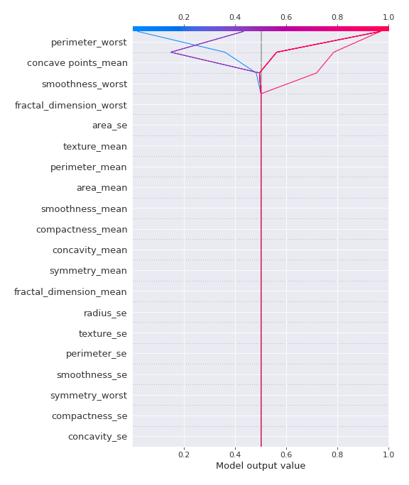

# Summary of 31_DecisionTree

[<< Go back](../README.md)

## Decision Tree
- **n_jobs**: -1
- **criterion**: gini
- **max_depth**: 2
- **explain_level**: 2

## Validation
 - **validation_type**: kfold
 - **k_folds**: 5
 - **shuffle**: True
 - **stratify**: True
 - **random_seed**: 1230

## Optimized metric
logloss

## Training time

27.1 seconds

## Metric details
|           |    score |   threshold |
|:----------|---------:|------------:|
| logloss   | 0.290455 | nan         |
| auc       | 0.938735 | nan         |
| f1        | 0.912844 |   0.370513  |
| accuracy  | 0.910377 |   0.452932  |
| precision | 0.936842 |   0.921875  |
| recall    | 1        |   0.0118421 |
| mcc       | 0.822073 |   0.512062  |

## Confusion matrix (at threshold=0.452932)
|                     |   Predicted as negative |   Predicted as positive |
|:--------------------|------------------------:|------------------------:|
| Labeled as negative |                     194 |                      18 |
| Labeled as positive |                      20 |                     192 |

## Learning curves

## Decision Tree 

### Tree #1

### Rules

if (perimeter_worst <= 106.05) and (concave points_worst <= 0.159) then class: 0 (proba: 95.65%) | based on 161 samples

if (perimeter_worst > 106.05) and (texture_mean > 15.37) then class: 1 (proba: 95.57%) | based on 158 samples

if (perimeter_worst > 106.05) and (texture_mean <= 15.37) then class: 0 (proba: 70.0%) | based on 10 samples

if (perimeter_worst <= 106.05) and (concave points_worst > 0.159) then class: 1 (proba: 80.0%) | based on 10 samples

### Tree #2

### Rules

if (perimeter_worst <= 105.05) and (smoothness_worst <= 0.178) then class: 0 (proba: 95.71%) | based on 163 samples

if (perimeter_worst > 105.05) and (concave points_mean > 0.049) then class: 1 (proba: 97.39%) | based on 153 samples

if (perimeter_worst > 105.05) and (concave points_mean <= 0.049) then class: 0 (proba: 52.94%) | based on 17 samples

if (perimeter_worst <= 105.05) and (smoothness_worst > 0.178) then class: 1 (proba: 83.33%) | based on 6 samples

### Tree #3

### Rules

if (concave points_worst > 0.116) and (area_worst > 710.2) then class: 1 (proba: 96.88%) | based on 160 samples

if (concave points_worst <= 0.116) and (area_mean <= 694.15) then class: 0 (proba: 98.68%) | based on 152 samples

if (concave points_worst <= 0.116) and (area_mean > 694.15) then class: 1 (proba: 64.29%) | based on 14 samples

if (concave points_worst > 0.116) and (area_worst <= 710.2) then class: 0 (proba: 69.23%) | based on 13 samples

### Tree #4

### Rules

if (perimeter_worst > 101.65) and (concave points_mean > 0.05) then class: 1 (proba: 96.77%) | based on 155 samples

if (perimeter_worst <= 101.65) and (smoothness_worst <= 0.182) then class: 0 (proba: 98.0%) | based on 150 samples

if (perimeter_worst > 101.65) and (concave points_mean <= 0.05) then class: 0 (proba: 56.67%) | based on 30 samples

if (perimeter_worst <= 101.65) and (smoothness_worst > 0.182) then class: 1 (proba: 100.0%) | based on 4 samples

### Tree #5

### Rules

if (perimeter_worst <= 105.95) and (concave points_worst <= 0.159) then class: 0 (proba: 96.91%) | based on 162 samples

if (perimeter_worst > 105.95) and (texture_worst > 20.875) then class: 1 (proba: 98.06%) | based on 155 samples

if (perimeter_worst > 105.95) and (texture_worst <= 20.875) then class: 0 (proba: 60.0%) | based on 15 samples

if (perimeter_worst <= 105.95) and (concave points_worst > 0.159) then class: 1 (proba: 87.5%) | based on 8 samples

## Permutation-based Importance

## SHAP Importance

## SHAP Dependence plots

### Dependence (Fold 1)

### Dependence (Fold 2)

### Dependence (Fold 3)

### Dependence (Fold 4)

### Dependence (Fold 5)

## SHAP Decision plots

### Top-10 Worst decisions for class 0 (Fold 1)

### Top-10 Worst decisions for class 0 (Fold 2)

### Top-10 Worst decisions for class 0 (Fold 3)

### Top-10 Worst decisions for class 0 (Fold 4)

### Top-10 Worst decisions for class 0 (Fold 5)

### Top-10 Best decisions for class 0 (Fold 1)

### Top-10 Best decisions for class 0 (Fold 2)

### Top-10 Best decisions for class 0 (Fold 3)

### Top-10 Best decisions for class 0 (Fold 4)

### Top-10 Best decisions for class 0 (Fold 5)

### Top-10 Worst decisions for class 1 (Fold 1)

### Top-10 Worst decisions for class 1 (Fold 2)

### Top-10 Worst decisions for class 1 (Fold 3)

### Top-10 Worst decisions for class 1 (Fold 4)

### Top-10 Worst decisions for class 1 (Fold 5)

### Top-10 Best decisions for class 1 (Fold 1)

### Top-10 Best decisions for class 1 (Fold 2)

### Top-10 Best decisions for class 1 (Fold 3)

### Top-10 Best decisions for class 1 (Fold 4)

### Top-10 Best decisions for class 1 (Fold 5)

[<< Go back](../README.md)
