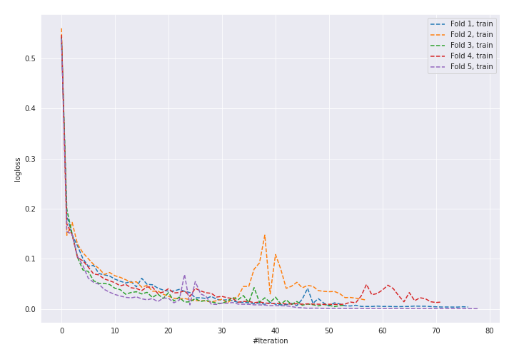
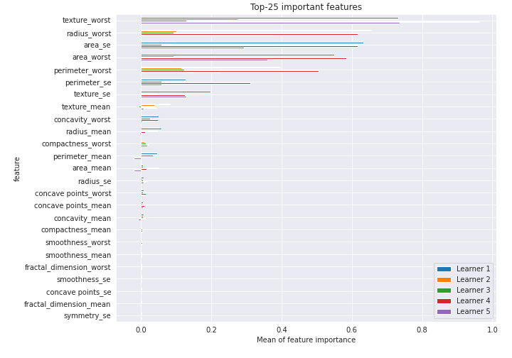

# Summary of 39_NeuralNetwork

[<< Go back](../README.md)

## Neural Network
- **n_jobs**: -1
- **dense_1_size**: 64
- **dense_2_size**: 4
- **learning_rate**: 0.08
- **explain_level**: 2

## Validation
 - **validation_type**: kfold
 - **k_folds**: 5
 - **shuffle**: True
 - **stratify**: True
 - **random_seed**: 1230

## Optimized metric
logloss

## Training time

6.1 seconds

## Metric details
|           |    score |     threshold |
|:----------|---------:|--------------:|
| logloss   | 0.174853 | nan           |
| auc       | 0.987696 | nan           |
| f1        | 0.959811 |   0.445763    |
| accuracy  | 0.959906 |   0.492044    |
| precision | 1        |   1           |
| recall    | 1        |   2.63233e-32 |
| mcc       | 0.919903 |   0.492044    |

## Confusion matrix (at threshold=0.492044)
|                     |   Predicted as negative |   Predicted as positive |
|:--------------------|------------------------:|------------------------:|
| Labeled as negative |                     205 |                       7 |
| Labeled as positive |                      10 |                     202 |

## Learning curves

## Permutation-based Importance

[<< Go back](../README.md)
