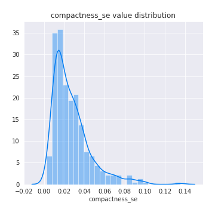

# Exploratory Data Analysis

[<< Go back](../README.md)
## Feature : target
- **Feature type** : discrete
- **Missing** : 0.0%
- **Unique** : 2
- **Count** :424.0
- **Mean** :0.5
- **Std** :0.5005906676601786
- **Min** :0.0
- **25%th Percentile** : 0.0
- **50%th Percentile** : 0.5
- **75%th Percentile** : 1.0
- **Max** :1.0

## Feature : radius_mean
- **Feature type** : continous
- **Missing** : 0.0%
- **Unique** : 361
- **Count** :424.0
- **Mean** :14.836903301886803
- **Std** :3.693212950593127
- **Min** :7.691
- **25%th Percentile** : 12.225
- **50%th Percentile** : 13.92
- **75%th Percentile** : 17.3675
- **Max** :28.11

## Feature : texture_mean
- **Feature type** : continous
- **Missing** : 0.0%
- **Unique** : 375
- **Count** :424.0
- **Mean** :19.76313679245283
- **Std** :4.294969603633674
- **Min** :9.71
- **25%th Percentile** : 16.8375
- **50%th Percentile** : 19.365000000000002
- **75%th Percentile** : 22.1325
- **Max** :39.28

## Feature : perimeter_mean
- **Feature type** : continous
- **Missing** : 0.0%
- **Unique** : 386
- **Count** :424.0
- **Mean** :96.94334905660378
- **Std** :25.476414069952778
- **Min** :47.98
- **25%th Percentile** : 78.4825
- **50%th Percentile** : 91.03999999999999
- **75%th Percentile** : 114.25
- **Max** :188.5

## Feature : area_mean
- **Feature type** : continous
- **Missing** : 0.0%
- **Unique** : 407
- **Count** :424.0
- **Mean** :723.0308962264143
- **Std** :376.84924221756285
- **Min** :170.4
- **25%th Percentile** : 459.82500000000005
- **50%th Percentile** : 598.65
- **75%th Percentile** : 936.7750000000001
- **Max** :2501.0

## Feature : smoothness_mean
- **Feature type** : continous
- **Missing** : 0.0%
- **Unique** : 363
- **Count** :424.0
- **Mean** :0.09753620283018877
- **Std** :0.013865115398990392
- **Min** :0.06251
- **25%th Percentile** : 0.08727750000000001
- **50%th Percentile** : 0.09722
- **75%th Percentile** : 0.10652500000000001
- **Max** :0.1447

## Feature : compactness_mean
- **Feature type** : continous
- **Missing** : 0.0%
- **Unique** : 401
- **Count** :424.0
- **Mean** :0.11300844339622644
- **Std** :0.05548397008240788
- **Min** :0.01938
- **25%th Percentile** : 0.070495
- **50%th Percentile** : 0.10495
- **75%th Percentile** : 0.14435
- **Max** :0.3454

## Feature : concavity_mean
- **Feature type** : continous
- **Missing** : 0.0%
- **Unique** : 404
- **Count** :424.0
- **Mean** :0.10482913207547172
- **Std** :0.08500100111960304
- **Min** :0.0
- **25%th Percentile** : 0.03410250000000001
- **50%th Percentile** : 0.09046
- **75%th Percentile** : 0.154025
- **Max** :0.4268

## Feature : concave points_mean
- **Feature type** : continous
- **Missing** : 0.0%
- **Unique** : 412
- **Count** :424.0
- **Mean** :0.05716858490566033
- **Std** :0.04099741387758479
- **Min** :0.0
- **25%th Percentile** : 0.023185
- **50%th Percentile** : 0.05142
- **75%th Percentile** : 0.08626
- **Max** :0.2012

## Feature : symmetry_mean
- **Feature type** : continous
- **Missing** : 0.0%
- **Unique** : 343
- **Count** :424.0
- **Mean** :0.1835481132075473
- **Std** :0.02906876897573979
- **Min** :0.106
- **25%th Percentile** : 0.16317500000000001
- **50%th Percentile** : 0.1809
- **75%th Percentile** : 0.19895000000000002
- **Max** :0.304

## Feature : fractal_dimension_mean
- **Feature type** : continous
- **Missing** : 0.0%
- **Unique** : 384
- **Count** :424.0
- **Mean** :0.06276216981132077
- **Std** :0.007170117494078974
- **Min** :0.04996
- **25%th Percentile** : 0.057475
- **50%th Percentile** : 0.061520000000000005
- **75%th Percentile** : 0.0663625
- **Max** :0.09744

## Feature : radius_se
- **Feature type** : continous
- **Missing** : 0.0%
- **Unique** : 406
- **Count** :424.0
- **Mean** :0.4477990566037732
- **Std** :0.30310905823010453
- **Min** :0.1115
- **25%th Percentile** : 0.243075
- **50%th Percentile** : 0.357
- **75%th Percentile** : 0.554375
- **Max** :2.873

## Feature : texture_se
- **Feature type** : continous
- **Missing** : 0.0%
- **Unique** : 392
- **Count** :424.0
- **Mean** :1.2127285377358492
- **Std** :0.5210634627014212
- **Min** :0.3621
- **25%th Percentile** : 0.8561
- **50%th Percentile** : 1.127
- **75%th Percentile** : 1.46275
- **Max** :3.896

## Feature : perimeter_se
- **Feature type** : continous
- **Missing** : 0.0%
- **Unique** : 407
- **Count** :424.0
- **Mean** :3.1796474056603765
- **Std** :2.2213992607993225
- **Min** :0.757
- **25%th Percentile** : 1.7692499999999998
- **50%th Percentile** : 2.5505
- **75%th Percentile** : 3.859
- **Max** :21.98

## Feature : area_se
- **Feature type** : continous
- **Missing** : 0.0%
- **Unique** : 410
- **Count** :424.0
- **Mean** :47.005971698113214
- **Std** :50.7571571177437
- **Min** :7.228
- **25%th Percentile** : 19.5025
- **50%th Percentile** : 28.770000000000003
- **75%th Percentile** : 58.417500000000004
- **Max** :542.2

## Feature : smoothness_se
- **Feature type** : continous
- **Missing** : 0.0%
- **Unique** : 415
- **Count** :424.0
- **Mean** :0.0069866674528301885
- **Std** :0.0030051231598614715
- **Min** :0.002667
- **25%th Percentile** : 0.00508675
- **50%th Percentile** : 0.0063025
- **75%th Percentile** : 0.00810375
- **Max** :0.03113

## Feature : compactness_se
- **Feature type** : continous
- **Missing** : 0.0%
- **Unique** : 405
- **Count** :424.0
- **Mean** :0.02707722405660375
- **Std** :0.01871562831294374
- **Min** :0.002252
- **25%th Percentile** : 0.0137675
- **50%th Percentile** : 0.02229
- **75%th Percentile** : 0.034199999999999994
- **Max** :0.1354

## Feature : concavity_se
- **Feature type** : continous
- **Missing** : 0.0%
- **Unique** : 404
- **Count** :424.0
- **Mean** :0.03498934410377356
- **Std** :0.03288436994742726
- **Min** :0.0
- **25%th Percentile** : 0.016752500000000003
- **50%th Percentile** : 0.027985000000000003
- **75%th Percentile** : 0.0454525
- **Max** :0.396

## Feature : concave points_se
- **Feature type** : continous
- **Missing** : 0.0%
- **Unique** : 391
- **Count** :424.0
- **Mean** :0.012627033018867936
- **Std** :0.00645291541997467
- **Min** :0.0
- **25%th Percentile** : 0.008447
- **50%th Percentile** : 0.01164
- **75%th Percentile** : 0.0157375
- **Max** :0.05279

## Feature : symmetry_se
- **Feature type** : continous
- **Missing** : 0.0%
- **Unique** : 383
- **Count** :424.0
- **Mean** :0.020534712264150972
- **Std** :0.008934029222776193
- **Min** :0.007882
- **25%th Percentile** : 0.014815
- **50%th Percentile** : 0.018335
- **75%th Percentile** : 0.0232675
- **Max** :0.07895

## Feature : fractal_dimension_se
- **Feature type** : continous
- **Missing** : 0.0%
- **Unique** : 409
- **Count** :424.0
- **Mean** :0.0038452554245283015
- **Std** :0.002686156150670715
- **Min** :0.0009683
- **25%th Percentile** : 0.002256
- **50%th Percentile** : 0.0032430000000000002
- **75%th Percentile** : 0.00457025
- **Max** :0.02984

## Feature : radius_worst
- **Feature type** : continous
- **Missing** : 0.0%
- **Unique** : 368
- **Count** :424.0
- **Mean** :17.285672169811317
- **Std** :5.101715000531371
- **Min** :8.678
- **25%th Percentile** : 13.3675
- **50%th Percentile** : 16.01
- **75%th Percentile** : 20.585
- **Max** :36.04

## Feature : texture_worst
- **Feature type** : continous
- **Missing** : 0.0%
- **Unique** : 391
- **Count** :424.0
- **Mean** :26.392382075471684
- **Std** :6.22049432372147
- **Min** :12.02
- **25%th Percentile** : 21.9225
- **50%th Percentile** : 25.994999999999997
- **75%th Percentile** : 30.5075
- **Max** :49.54

## Feature : perimeter_worst
- **Feature type** : continous
- **Missing** : 0.0%
- **Unique** : 384
- **Count** :424.0
- **Mean** :114.3727122641509
- **Std** :35.47167567748314
- **Min** :54.49
- **25%th Percentile** : 87.16499999999999
- **50%th Percentile** : 105.95
- **75%th Percentile** : 137.95000000000002
- **Max** :251.2

## Feature : area_worst
- **Feature type** : continous
- **Missing** : 0.0%
- **Unique** : 410
- **Count** :424.0
- **Mean** :993.0054245283013
- **Std** :613.894715289085
- **Min** :223.6
- **25%th Percentile** : 550.4000000000001
- **50%th Percentile** : 784.1500000000001
- **75%th Percentile** : 1302.5
- **Max** :4254.0

## Feature : smoothness_worst
- **Feature type** : continous
- **Missing** : 0.0%
- **Unique** : 334
- **Count** :424.0
- **Mean** :0.13434714622641514
- **Std** :0.02323290901079464
- **Min** :0.08125
- **25%th Percentile** : 0.11775
- **50%th Percentile** : 0.13440000000000002
- **75%th Percentile** : 0.149125
- **Max** :0.2226

## Feature : compactness_worst
- **Feature type** : continous
- **Missing** : 0.0%
- **Unique** : 406
- **Count** :424.0
- **Mean** :0.278075966981132
- **Std** :0.16695576946583185
- **Min** :0.03432
- **25%th Percentile** : 0.15792499999999998
- **50%th Percentile** : 0.24095
- **75%th Percentile** : 0.372425
- **Max** :1.058

## Feature : concavity_worst
- **Feature type** : continous
- **Missing** : 0.0%
- **Unique** : 407
- **Count** :424.0
- **Mean** :0.3099165377358491
- **Std** :0.21770734258917881
- **Min** :0.0
- **25%th Percentile** : 0.1377
- **50%th Percentile** : 0.28535
- **75%th Percentile** : 0.42965
- **Max** :1.252

## Feature : concave points_worst
- **Feature type** : continous
- **Missing** : 0.0%
- **Unique** : 387
- **Count** :424.0
- **Mean** :0.12851712499999998
- **Std** :0.06800333370392382
- **Min** :0.0
- **25%th Percentile** : 0.07375999999999999
- **50%th Percentile** : 0.12215000000000001
- **75%th Percentile** : 0.182
- **Max** :0.291

## Feature : symmetry_worst
- **Feature type** : continous
- **Missing** : 0.0%
- **Unique** : 387
- **Count** :424.0
- **Mean** :0.295873820754717
- **Std** :0.06741561995716518
- **Min** :0.1565
- **25%th Percentile** : 0.25122500000000003
- **50%th Percentile** : 0.28525
- **75%th Percentile** : 0.32242499999999996
- **Max** :0.6638

## Feature : fractal_dimension_worst
- **Feature type** : continous
- **Missing** : 0.0%
- **Unique** : 406
- **Count** :424.0
- **Mean** :0.08503990566037743
- **Std** :0.019092792669119223
- **Min** :0.05504
- **25%th Percentile** : 0.07205999999999999
- **50%th Percentile** : 0.080785
- **75%th Percentile** : 0.09308250000000001
- **Max** :0.2075

[<< Go back](../README.md)
