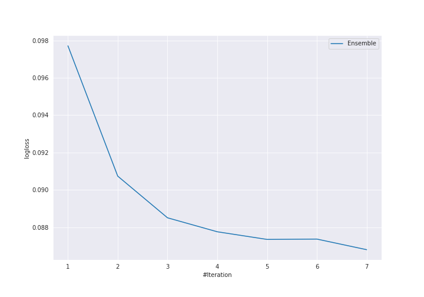

# Summary of Ensemble

[<< Go back](../README.md)

## Ensemble structure
| Model                            |   Weight |
|:---------------------------------|---------:|
| 17_NeuralNetwork                 |        1 |
| 18_NeuralNetwork                 |        1 |
| 25_NeuralNetwork                 |        1 |
| 33_Xgboost_SelectedFeatures      |        2 |
| 4_Default_Xgboost_GoldenFeatures |        1 |
| 9_Xgboost_GoldenFeatures         |        1 |

## Metric details
|           |    score |     threshold |
|:----------|---------:|--------------:|
| logloss   | 0.086801 | nan           |
| auc       | 0.99555  | nan           |
| f1        | 0.973747 |   0.581498    |
| accuracy  | 0.974057 |   0.581498    |
| precision | 1        |   0.861399    |
| recall    | 1        |   0.000465706 |
| mcc       | 0.948377 |   0.581498    |

## Confusion matrix (at threshold=0.581498)
|                     |   Predicted as negative |   Predicted as positive |
|:--------------------|------------------------:|------------------------:|
| Labeled as negative |                     209 |                       3 |
| Labeled as positive |                       8 |                     204 |

## Learning curves

[<< Go back](../README.md)
