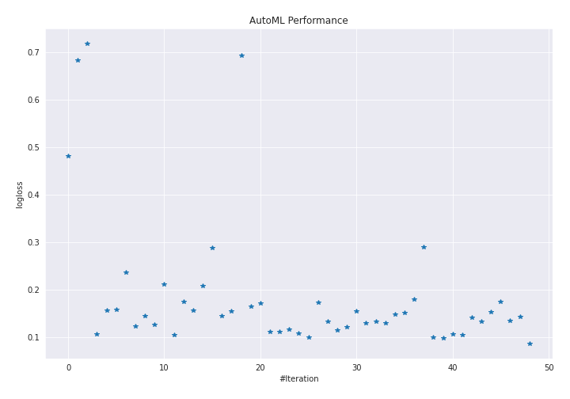
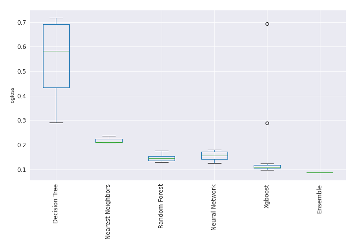

# AutoML Leaderboard

| Best model   | name                                                                             | model_type        | metric_type   |   metric_value |   train_time |   single_prediction_time |
|:-------------|:---------------------------------------------------------------------------------|:------------------|:--------------|---------------:|-------------:|-------------------------:|
|              | [1_DecisionTree](1_DecisionTree/README.md)                                       | Decision Tree     | logloss       |      0.480966  |        62.68 |                   0.0601 |
|              | [2_DecisionTree](2_DecisionTree/README.md)                                       | Decision Tree     | logloss       |      0.683334  |        41.98 |                   0.0574 |
|              | [3_DecisionTree](3_DecisionTree/README.md)                                       | Decision Tree     | logloss       |      0.717798  |        40.44 |                   0.0541 |
|              | [4_Default_Xgboost](4_Default_Xgboost/README.md)                                 | Xgboost           | logloss       |      0.106125  |        39.77 |                   0.0555 |
|              | [5_Default_NeuralNetwork](5_Default_NeuralNetwork/README.md)                     | Neural Network    | logloss       |      0.156436  |         6    |                   0.0777 |
|              | [6_Default_RandomForest](6_Default_RandomForest/README.md)                       | Random Forest     | logloss       |      0.158286  |        72.32 |                   0.572  |
|              | [7_Default_NearestNeighbors](7_Default_NearestNeighbors/README.md)               | Nearest Neighbors | logloss       |      0.237226  |        43.65 |                   0.6053 |
|              | [8_Xgboost](8_Xgboost/README.md)                                                 | Xgboost           | logloss       |      0.122717  |        41.23 |                   0.0626 |
|              | [12_RandomForest](12_RandomForest/README.md)                                     | Random Forest     | logloss       |      0.14468   |        69.29 |                   0.5818 |
|              | [16_NeuralNetwork](16_NeuralNetwork/README.md)                                   | Neural Network    | logloss       |      0.126522  |         5.85 |                   0.0865 |
|              | [20_NearestNeighbors](20_NearestNeighbors/README.md)                             | Nearest Neighbors | logloss       |      0.210939  |        43.64 |                   0.6049 |
|              | [9_Xgboost](9_Xgboost/README.md)                                                 | Xgboost           | logloss       |      0.105629  |        36.97 |                   0.0601 |
|              | [13_RandomForest](13_RandomForest/README.md)                                     | Random Forest     | logloss       |      0.175677  |        70.37 |                   0.5686 |
|              | [17_NeuralNetwork](17_NeuralNetwork/README.md)                                   | Neural Network    | logloss       |      0.155972  |         7.28 |                   0.075  |
|              | [21_NearestNeighbors](21_NearestNeighbors/README.md)                             | Nearest Neighbors | logloss       |      0.208041  |        43.75 |                   0.5941 |
|              | [10_Xgboost](10_Xgboost/README.md)                                               | Xgboost           | logloss       |      0.288182  |        30.61 |                   0.0722 |
|              | [14_RandomForest](14_RandomForest/README.md)                                     | Random Forest     | logloss       |      0.145828  |        72.7  |                   0.5703 |
|              | [18_NeuralNetwork](18_NeuralNetwork/README.md)                                   | Neural Network    | logloss       |      0.154826  |         6.78 |                   0.0863 |
|              | [11_Xgboost](11_Xgboost/README.md)                                               | Xgboost           | logloss       |      0.693092  |        29.92 |                   0.053  |
|              | [15_RandomForest](15_RandomForest/README.md)                                     | Random Forest     | logloss       |      0.165835  |        70.42 |                   0.5661 |
|              | [19_NeuralNetwork](19_NeuralNetwork/README.md)                                   | Neural Network    | logloss       |      0.172527  |         6.24 |                   0.0775 |
|              | [9_Xgboost_GoldenFeatures](9_Xgboost_GoldenFeatures/README.md)                   | Xgboost           | logloss       |      0.111359  |        48.1  |                   0.0943 |
|              | [4_Default_Xgboost_GoldenFeatures](4_Default_Xgboost_GoldenFeatures/README.md)   | Xgboost           | logloss       |      0.112191  |        38.48 |                   0.1019 |
|              | [8_Xgboost_GoldenFeatures](8_Xgboost_GoldenFeatures/README.md)                   | Xgboost           | logloss       |      0.116867  |        37.31 |                   0.1021 |
|              | [9_Xgboost_RandomFeature](9_Xgboost_RandomFeature/README.md)                     | Xgboost           | logloss       |      0.108643  |        15.11 |                   0.0545 |
|              | [9_Xgboost_SelectedFeatures](9_Xgboost_SelectedFeatures/README.md)               | Xgboost           | logloss       |      0.099433  |        22.5  |                   0.0489 |
|              | [16_NeuralNetwork_SelectedFeatures](16_NeuralNetwork_SelectedFeatures/README.md) | Neural Network    | logloss       |      0.173769  |         3.45 |                   0.0655 |
|              | [12_RandomForest_SelectedFeatures](12_RandomForest_SelectedFeatures/README.md)   | Random Forest     | logloss       |      0.133648  |        40.56 |                   0.5633 |
|              | [22_Xgboost_SelectedFeatures](22_Xgboost_SelectedFeatures/README.md)             | Xgboost           | logloss       |      0.11496   |        29.92 |                   0.0442 |
|              | [23_Xgboost](23_Xgboost/README.md)                                               | Xgboost           | logloss       |      0.121996  |        34.97 |                   0.0525 |
|              | [24_NeuralNetwork](24_NeuralNetwork/README.md)                                   | Neural Network    | logloss       |      0.15499   |         5.51 |                   0.077  |
|              | [25_NeuralNetwork](25_NeuralNetwork/README.md)                                   | Neural Network    | logloss       |      0.130163  |         6.64 |                   0.0733 |
|              | [26_RandomForest_SelectedFeatures](26_RandomForest_SelectedFeatures/README.md)   | Random Forest     | logloss       |      0.133291  |        39.52 |                   0.5613 |
|              | [27_RandomForest_SelectedFeatures](27_RandomForest_SelectedFeatures/README.md)   | Random Forest     | logloss       |      0.130593  |        41.28 |                   0.5645 |
|              | [28_RandomForest](28_RandomForest/README.md)                                     | Random Forest     | logloss       |      0.148106  |        68.14 |                   0.5644 |
|              | [29_RandomForest](29_RandomForest/README.md)                                     | Random Forest     | logloss       |      0.152181  |        77.59 |                   0.5667 |
|              | [30_NeuralNetwork](30_NeuralNetwork/README.md)                                   | Neural Network    | logloss       |      0.180761  |         6.14 |                   0.0772 |
|              | [31_DecisionTree](31_DecisionTree/README.md)                                     | Decision Tree     | logloss       |      0.290455  |        28.33 |                   0.0542 |
|              | [32_Xgboost_SelectedFeatures](32_Xgboost_SelectedFeatures/README.md)             | Xgboost           | logloss       |      0.100174  |        25.04 |                   0.0477 |
| **the best** | [33_Xgboost_SelectedFeatures](33_Xgboost_SelectedFeatures/README.md)             | Xgboost           | logloss       |      0.0977111 |        22.6  |                   0.0487 |
|              | [34_Xgboost](34_Xgboost/README.md)                                               | Xgboost           | logloss       |      0.106125  |        37.09 |                   0.0562 |
|              | [35_Xgboost](35_Xgboost/README.md)                                               | Xgboost           | logloss       |      0.105453  |        35.2  |                   0.0531 |
|              | [36_NeuralNetwork](36_NeuralNetwork/README.md)                                   | Neural Network    | logloss       |      0.141504  |         5.89 |                   0.0813 |
|              | [37_NeuralNetwork](37_NeuralNetwork/README.md)                                   | Neural Network    | logloss       |      0.133029  |         6    |                   0.082  |
|              | [38_NeuralNetwork](38_NeuralNetwork/README.md)                                   | Neural Network    | logloss       |      0.154184  |         6.64 |                   0.0775 |
|              | [39_NeuralNetwork](39_NeuralNetwork/README.md)                                   | Neural Network    | logloss       |      0.174853  |         6.99 |                   0.0941 |
|              | [40_RandomForest_SelectedFeatures](40_RandomForest_SelectedFeatures/README.md)   | Random Forest     | logloss       |      0.135388  |        52.39 |                   0.5624 |
|              | [41_RandomForest_SelectedFeatures](41_RandomForest_SelectedFeatures/README.md)   | Random Forest     | logloss       |      0.142801  |        41.67 |                   0.5693 |
|              | [Ensemble](Ensemble/README.md)                                                   | Ensemble          | logloss       |      0.086801  |         1.73 |                   0.5012 |

### AutoML Performance

### AutoML Performance Boxplot
