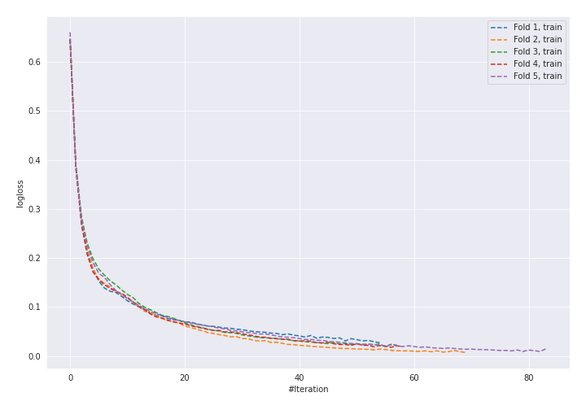
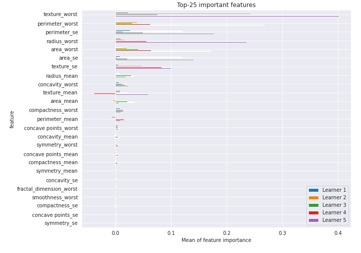

# Summary of 17_NeuralNetwork

[<< Go back](../README.md)

## Neural Network
- **n_jobs**: -1
- **dense_1_size**: 64
- **dense_2_size**: 16
- **learning_rate**: 0.01
- **explain_level**: 2

## Validation
 - **validation_type**: kfold
 - **k_folds**: 5
 - **shuffle**: True
 - **stratify**: True
 - **random_seed**: 1230

## Optimized metric
logloss

## Training time

5.9 seconds

## Metric details
|           |    score |     threshold |
|:----------|---------:|--------------:|
| logloss   | 0.145634 | nan           |
| auc       | 0.987251 | nan           |
| f1        | 0.945626 |   0.504909    |
| accuracy  | 0.945755 |   0.504909    |
| precision | 1        |   0.998866    |
| recall    | 1        |   4.13381e-07 |
| mcc       | 0.891599 |   0.53437     |

## Confusion matrix (at threshold=0.504909)
|                     |   Predicted as negative |   Predicted as positive |
|:--------------------|------------------------:|------------------------:|
| Labeled as negative |                     201 |                      11 |
| Labeled as positive |                      12 |                     200 |

## Learning curves

## Permutation-based Importance

[<< Go back](../README.md)
